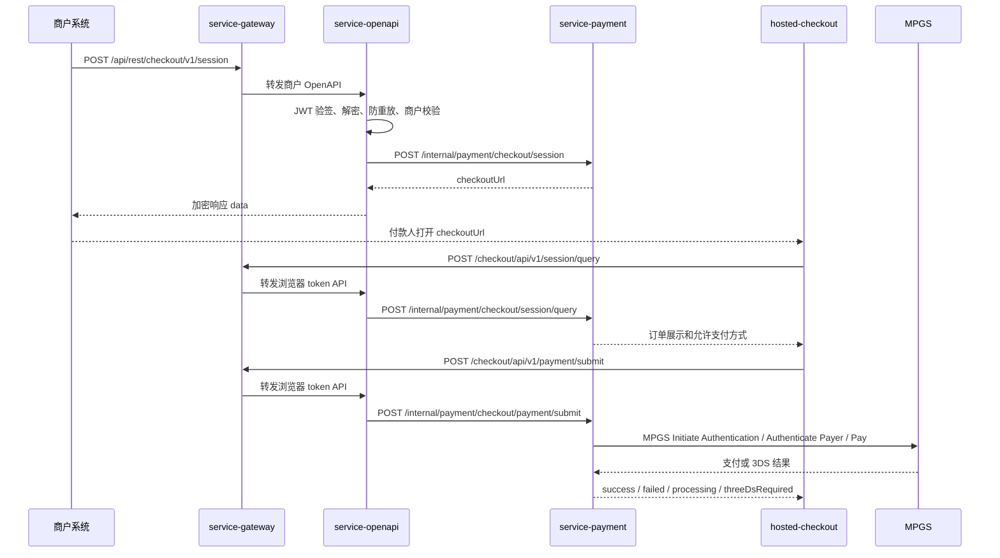

# Hosted Checkout V1 接口契约草案

本文定义自建 Hosted Checkout V1 的商户 OpenAPI、付款人浏览器 API、内部服务 API 和 MPGS 3DS 编排边界。V1 范围固定为 `BANK_CARD + MPGS + 3DS`，不接 Apple Pay、Google Pay、PayPal、SPEI。

本文是接口评审草案，不代表接口已经实现。

## 1. 链路总览



## 2. 公共约定

### 2.1 URL 格式

```text
{platform.checkout.frontend-base-url}/checkout/{opaqueToken}/{cover}
```

| 字段 | 说明 |
|---|---|
| `platform.checkout.frontend-base-url` | 平台系统参数设置表中的收银台前端 Base URL，配置键为 `platform.checkout.frontend-base-url` |
| `opaqueToken` | 高熵随机 token，唯一绑定一笔 `checkout_session_id`，数据库只保存 HMAC-SHA256 摘要 |
| `cover` | 随机遮盖字符串，只提升 URL 不可读性，不参与任何数据查询或交易状态判断 |

说明：收银台入口属于平台资产，商户请求中的 `checkoutInfo.checkoutDomain` 不参与 `checkoutUrl` 拼装。生产、测试、联调环境的收银台前端地址应通过系统参数表维护，不写入 Nacos 的 `openapi.*` 业务配置。

### 2.2 响应外层

沿用当前系统 `CommonResult`：

```json
{
  "code": "T200",
  "message": "Success",
  "data": {}
}
```

商户 OpenAPI 的 `data` 按现有 OpenAPI 安全链路加密。付款人浏览器 API 的 `data` 是普通 JSON，但必须脱敏且只能包含页面需要展示或提交下一步所需字段。

### 2.3 金额格式

1. API 明文 JSON 中金额使用主币种单位 decimal，例如 `49.97`。
2. 数据库金额使用 `DECIMAL(20,6)`。
3. 前端展示时按 `currencyExponent` 做格式化，不由前端猜测所有币种都是 2 位小数。

### 2.4 状态命名

页面只依赖 `pageState` 渲染，不直接解释交易核心状态。

| `pageState` | 页面 |
|---|---|
| `PAYABLE` | 支付表单 |
| `THREE_DS_REQUIRED` | 3DS challenge |
| `PROCESSING` | 处理中 |
| `SUCCEEDED` | 成功页 |
| `FAILED_RETRYABLE` | 失败页，可重新支付 |
| `FAILED_FINAL` | 失败页，不可重试 |
| `EXPIRED` | 过期/拦截页 |
| `CANCELLED` | 已取消 |
| `BLOCKED` | 异常请求拦截 |

## 3. 商户 OpenAPI

商户接口必须走现有安全链路：

1. `POST /api/rest/checkout/{version}/session`。
2. `@VerificationAndProcessing`。
3. JWT HS256 验签、防重放、请求体 `data` 解密、响应 `data` 加密。
4. JWT `merchantId` 必须与明文 `merchantInfo.merchantId` 一致。
5. `merchantRequestId` 幂等，重复请求若业务参数摘要一致，返回同一 `checkoutSessionId` 并重新签发一个新的 `checkoutUrl`。

### 3.1 创建收银台会话

接口名称：创建 Hosted Checkout 会话  
请求方式：`POST`  
请求路径：`/api/rest/checkout/{version}/session`  
版本：`v1`

明文请求示例：

```json
{
  "merchantInfo": {
    "merchantId": "200045",
    "subMerchantInfo": {
      "subId": "SUB001",
      "subCompanyName": "Scott Demo Store",
      "subCountryCode": "USA",
      "merchantCategory": "5311"
    }
  },
  "orderInfo": {
    "orderNo": "M202607270001",
    "orderId": "CHECKOUT202607270001",
    "amount": 49.97,
    "currency": "USD",
    "subject": "Vexra Lifestyle Order",
    "description": "Order summary for hosted checkout",
    "items": [
      {
        "name": "Everyday Carry Kit",
        "quantity": 1,
        "amount": 49.97,
        "currency": "USD"
      }
    ]
  },
  "checkoutInfo": {
    "locale": "en-US",
    "expireMinutes": 30,
    "allowedPaymentMethods": [
      {
        "paymentMethod": "BANK_CARD",
        "channelCode": "MPGS",
        "brands": ["VISA", "MASTERCARD", "AMEX", "JCB"],
        "threeDsMode": "AUTO"
      }
    ],
    "retryAllowed": true,
    "maxAttemptCount": 3,
    "returnUrl": "https://merchant.example.com/payment/result",
    "cancelUrl": "https://merchant.example.com/cart",
    "notifyUrl": "https://merchant.example.com/api/payment/notify"
  },
  "payerInfo": {
    "payerId": "CUST10001",
    "email": "customer@example.com",
    "country": "USA"
  }
}
```

字段说明：

| 字段 | 类型 | 必填 | 说明 |
|---|---|---:|---|
| `merchantInfo.merchantId` | string | M | 平台商户号，必须与 JWT 中 `merchantId` 一致 |
| `orderInfo.orderNo` | string | M | 商户订单号 |
| `orderInfo.orderId` | string | M | 商户本次创建收银台请求唯一标识，即 `merchantRequestId` |
| `orderInfo.amount` | decimal | M | 订单金额，主币种单位 |
| `orderInfo.currency` | string | M | ISO 4217 三位币种 |
| `orderInfo.subject` | string | O | 收银台展示标题 |
| `orderInfo.description` | string | O | 收银台展示描述 |
| `orderInfo.items` | array | O | 收银台展示商品摘要 |
| `checkoutInfo.locale` | string | O | 默认语言，缺省 `en-US` |
| `checkoutInfo.expireMinutes` | integer | O | 有效分钟数，建议 5 到 1440，缺省按商户配置 |
| `checkoutInfo.allowedPaymentMethods` | array | M | 允许支付方式快照，V1 只接受 `BANK_CARD + MPGS` |
| `checkoutInfo.retryAllowed` | boolean | O | 支付失败是否允许重试，缺省 true |
| `checkoutInfo.maxAttemptCount` | integer | O | 最大尝试次数，缺省 3 |
| `checkoutInfo.returnUrl` | string | M | 结果页返回商户地址，必须命中商户白名单 |
| `checkoutInfo.cancelUrl` | string | O | 付款人取消返回地址，必须命中商户白名单 |
| `checkoutInfo.notifyUrl` | string | O | 异步通知地址，必须命中商户白名单或商户配置 |
| `checkoutInfo.checkoutDomain` | string | O | 兼容旧字段；平台生成 `checkoutUrl` 时忽略该字段 |
| `payerInfo.email` | string | O | 付款人邮箱，平台落库时脱敏和哈希 |
| `payerInfo.country` | string | O | 付款人国家/地区 |

明文响应示例：

```json
{
  "merchantInfo": {
    "merchantId": "200045"
  },
  "checkoutInfo": {
    "checkoutSessionId": "2607271118051230000017",
    "checkoutUrl": "https://pay.example.com/checkout/7xB5rLQm9kN2sP6vT3wY8zA1cD4eF0hJ/pY4nQ8sT2v",
    "status": "PAYABLE",
    "expireTime": "2026-07-27T11:48:05+08:00"
  },
  "orderInfo": {
    "orderNo": "M202607270001",
    "orderId": "CHECKOUT202607270001",
    "amount": 49.97,
    "currency": "USD"
  }
}
```

幂等规则：

1. 首次请求创建 session、token 和事件。
2. 相同 `merchantId + orderInfo.orderId` 且 `requestFingerprint` 一致，返回原 `checkoutSessionId`，重新签发新的 token 和 `checkoutUrl`。
3. 相同幂等键但金额、币种、订单号、允许支付方式、回跳地址等核心字段不一致，返回幂等冲突错误。

## 4. 付款人浏览器 API

付款人浏览器 API 由 `hosted-checkout` 调用，经 `service-gateway` 转发至 `service-openapi`。它不是商户 OpenAPI，不使用商户 JWT 和 OpenAPI 请求体加密。

统一安全要求：

1. HTTPS only。
2. 请求体传 `opaqueToken`，后端计算 token hash 后查询，不信任 URL 中的 `{cover}`。
3. 校验 Origin / Referer / CSRF / Rate Limit / User-Agent / IP 风险摘要。
4. 失败时不返回商户名、金额、订单号和支付方式，只返回 `pageState=BLOCKED` 或稳定错误码。
5. 响应不得包含 PAN、CVV、完整 token、JWT、渠道原始报文。

### 4.1 查询收银台会话

接口名称：查询收银台会话  
请求方式：`POST`  
请求路径：`/checkout/api/v1/session/query`

请求示例：

```json
{
  "opaqueToken": "7xB5rLQm9kN2sP6vT3wY8zA1cD4eF0hJ",
  "cover": "pY4nQ8sT2v",
  "clientContext": {
    "timezoneOffset": "+08:00",
    "language": "en-US",
    "screen": "390x844"
  }
}
```

响应示例：

```json
{
  "checkoutSessionId": "2607271118051230000017",
  "pageState": "PAYABLE",
  "merchant": {
    "displayName": "Scott Demo Store",
    "logoUrl": "https://assets.example.com/merchant/200045/logo.png"
  },
  "order": {
    "orderNo": "M202607270001",
    "subject": "Vexra Lifestyle Order",
    "amount": 49.97,
    "currency": "USD",
    "currencyExponent": 2,
    "items": [
      {
        "name": "Everyday Carry Kit",
        "quantity": 1,
        "amount": 49.97,
        "currency": "USD"
      }
    ]
  },
  "paymentMethods": [
    {
      "paymentMethod": "BANK_CARD",
      "channelCode": "MPGS",
      "brands": ["VISA", "MASTERCARD", "AMEX", "JCB"],
      "threeDsMode": "AUTO"
    }
  ],
  "checkout": {
    "expireTime": "2026-07-27T11:48:05+08:00",
    "retryAllowed": true,
    "remainingAttemptCount": 3,
    "pollingIntervalSeconds": 3
  }
}
```

### 4.2 提交银行卡支付

接口名称：提交收银台银行卡支付  
请求方式：`POST`  
请求路径：`/checkout/api/v1/payment/submit`

请求示例：

```json
{
  "opaqueToken": "7xB5rLQm9kN2sP6vT3wY8zA1cD4eF0hJ",
  "checkoutSessionId": "2607271118051230000017",
  "attemptRequestId": "web-2607271119251230000028",
  "paymentMethod": "BANK_CARD",
  "cardInfo": {
    "cardNo": "512345******0008",
    "expirationMonth": "09",
    "expirationYear": "2029",
    "securityCode": "***",
    "cardholderName": "SCOTT DEMO"
  },
  "billingCardHolderInfo": {
    "firstName": "Scott",
    "lastName": "Demo",
    "email": "customer@example.com",
    "phone": "12025550123",
    "country": "USA",
    "state": "NY",
    "city": "New York",
    "street": "100 Main Street",
    "postal": "10001"
  },
  "browserInfo": {
    "acceptHeader": "text/html,application/xhtml+xml",
    "javaEnabled": false,
    "javascriptEnabled": true,
    "language": "en-US",
    "colorDepth": 24,
    "screenHeight": 844,
    "screenWidth": 390,
    "timezoneOffsetMinutes": -480,
    "userAgent": "Mozilla/5.0 ..."
  }
}
```

说明：上面的 `cardNo` 和 `securityCode` 为文档脱敏示例，真实浏览器提交时传付款人输入的完整字段；后端只允许内存透传至渠道，不落库、不写日志。

响应：支付成功

```json
{
  "checkoutSessionId": "2607271118051230000017",
  "checkoutAttemptId": "2607271119251230000039",
  "pageState": "SUCCEEDED",
  "result": {
    "amount": 49.97,
    "currency": "USD",
    "merchantOrderNo": "M202607270001",
    "paymentMethod": "BANK_CARD",
    "cardBrand": "MASTERCARD",
    "cardNumberMasked": "512345******0008",
    "transactionId": "2607271119261230000040",
    "transactionDateTime": "2026-07-27T11:19:26+08:00",
    "authCode": "244682"
  },
  "actions": {
    "returnUrl": "https://merchant.example.com/payment/result"
  }
}
```

响应：需要 3DS challenge

```json
{
  "checkoutSessionId": "2607271118051230000017",
  "checkoutAttemptId": "2607271119251230000039",
  "pageState": "THREE_DS_REQUIRED",
  "threeDsAction": {
    "actionType": "HTML_FRAGMENT",
    "html": "<form id=\"three-ds-challenge\" method=\"POST\" action=\"https://acs.example.com/challenge\">...</form>",
    "returnUrl": "https://pay.example.com/checkout/api/v1/3ds/return",
    "timeoutSeconds": 600
  }
}
```

响应：处理中

```json
{
  "checkoutSessionId": "2607271118051230000017",
  "checkoutAttemptId": "2607271119251230000039",
  "pageState": "PROCESSING",
  "polling": {
    "statusUrl": "/checkout/api/v1/payment/status",
    "intervalSeconds": 3,
    "maxIntervalSeconds": 15
  }
}
```

响应：失败可重试

```json
{
  "checkoutSessionId": "2607271118051230000017",
  "checkoutAttemptId": "2607271119251230000039",
  "pageState": "FAILED_RETRYABLE",
  "failure": {
    "reasonCode": "CARD_DECLINED",
    "message": "The transaction was declined; please contact your card issuer or try again."
  },
  "checkout": {
    "retryAllowed": true,
    "remainingAttemptCount": 2
  }
}
```

提交规则：

1. 只有 `PAYABLE`、`PAYABLE_FAILED_RETRYABLE` 的 session 可以提交。
2. `attemptRequestId` 必须由前端生成并在重试同一次 HTTP 请求时复用。
3. 后端必须二次校验金额、币种、订单号和允许支付方式，禁止相信前端展示数据。
4. PAN/CVV 只允许内存透传至 `service-payment` 和 MPGS 请求，不落库、不写日志、不进 MQ。
5. 提交成功后前端必须禁用按钮，后端仍要靠幂等约束兜底。

### 4.3 查询支付状态

接口名称：查询收银台支付状态  
请求方式：`POST`  
请求路径：`/checkout/api/v1/payment/status`

请求示例：

```json
{
  "opaqueToken": "7xB5rLQm9kN2sP6vT3wY8zA1cD4eF0hJ",
  "checkoutSessionId": "2607271118051230000017",
  "checkoutAttemptId": "2607271119251230000039"
}
```

响应示例：

```json
{
  "checkoutSessionId": "2607271118051230000017",
  "checkoutAttemptId": "2607271119251230000039",
  "pageState": "PROCESSING",
  "polling": {
    "intervalSeconds": 5,
    "maxIntervalSeconds": 15
  }
}
```

状态查询规则：

1. 前端轮询只能作为页面刷新依据，最终资金状态以后端交易核心和渠道回调/查单为准。
2. 对已终态 session，响应必须返回同一个终态，不允许因为旧 attempt 的异步结果覆盖。
3. 轮询频率由后端返回，前端不得固定高频刷新。

### 4.4 3DS 回跳

接口名称：3DS 浏览器回跳  
请求方式：`POST`  
请求路径：`/checkout/api/v1/3ds/return`

请求来源：ACS 或浏览器 challenge 表单回跳。

请求示例：

```json
{
  "threeDsReturnToken": "rtn_8Gz3Nq9...",
  "checkoutSessionId": "2607271118051230000017",
  "checkoutAttemptId": "2607271119251230000039",
  "authenticationData": {
    "pares": "opaque-from-acs",
    "cres": "opaque-from-acs"
  }
}
```

响应示例：

```json
{
  "checkoutSessionId": "2607271118051230000017",
  "checkoutAttemptId": "2607271119251230000039",
  "pageState": "PROCESSING",
  "polling": {
    "statusUrl": "/checkout/api/v1/payment/status",
    "intervalSeconds": 3
  }
}
```

3DS 回跳规则：

1. `threeDsReturnToken` 只能使用一次，数据库只保存 hash。
2. 回跳必须绑定当前 `checkoutSessionId + checkoutAttemptId`。
3. 认证失败只给付款人模糊失败原因，渠道认证原始信息只保存脱敏摘要。
4. 认证通过后，后端继续提交支付或查询认证结果，不由前端判断是否扣款成功。

## 5. 内部服务 API

内部接口只在服务间调用，经网关或内网边界控制，不能公网暴露。

| 接口 | 方法 | 归属 | 说明 |
|---|---|---|---|
| `/internal/payment/checkout/session` | POST | `service-payment` | 创建 checkout session、签发 token |
| `/internal/payment/checkout/session/query` | POST | `service-payment` | 按 token hash 查询页面展示数据 |
| `/internal/payment/checkout/payment/submit` | POST | `service-payment` | 创建 attempt，执行 MPGS 卡支付和 3DS 编排 |
| `/internal/payment/checkout/payment/status` | POST | `service-payment` | 查询 session/attempt 页面状态 |
| `/internal/payment/checkout/3ds/return` | POST | `service-payment` | 校验 3DS return token，继续认证后流程 |
| `/internal/payment/checkout/session/expire-due` | POST | `service-payment` | 过期补偿任务，CAS 推进过期 session |
| `/internal/payment/checkout/channel-match/match-due` | POST | `service-payment` | 处理中补偿查单 |

内部 DTO 必须包含：

1. `traceId`、`requestSource`、`clientIpHash`、`userAgentHash`。
2. `checkoutSessionId`、`checkoutAttemptId`、`tokenHash`。
3. `merchantId` 解析成功后必须带入。
4. 卡敏感字段只出现在 `payment/submit` 内存调用链，不允许写入事件、日志或 MQ。

## 6. 错误码草案

| 错误码 | HTTP | 场景 | 前端处理 |
|---|---:|---|---|
| `C400` | 400 | 请求参数格式错误 | 显示表单错误或拦截页 |
| `C401` | 401 | token 无效、过期、吊销 | `BLOCKED` 或 `EXPIRED` |
| `C403` | 403 | Origin、CSRF、来源风险不通过 | `BLOCKED` |
| `C409` | 409 | 幂等冲突、状态不允许提交 | 查询最新状态后渲染 |
| `C410` | 410 | session 已过期 | `EXPIRED` |
| `C423` | 423 | session 正在处理中，拒绝重复提交 | `PROCESSING` |
| `C429` | 429 | 请求过于频繁 | 降低轮询或拦截 |
| `T202` | 200 | 支付处理中 | `PROCESSING` |
| `F210` | 200 | 支付失败可重试 | `FAILED_RETRYABLE` |
| `F211` | 200 | 支付失败不可重试 | `FAILED_FINAL` |

商户 OpenAPI 仍沿用现有错误码体系；这里的 `Cxxx` 是付款人浏览器 API 草案码，后续实现时应纳入统一 `ApiResultEnum` 或 checkout 专用结果枚举。

## 7. MPGS 3DS 映射边界

| 平台概念 | MPGS 概念 | 处理位置 |
|---|---|---|
| `checkoutAttemptId` | 平台侧 attempt 标识 | `service-payment` |
| `transaction_id` | MPGS `order.id` 建议映射源 | `service-payment` / `channel-library` |
| `channel_transaction_id` | MPGS `transaction.id` 建议映射源 | `service-payment` / `channel-library` |
| `threeDsAction.html` | MPGS challenge HTML excerpt | `channel-library` 解析，`service-payment` 脱敏包装 |
| `authentication.redirectResponseUrl` | `/checkout/api/v1/3ds/return` | `service-payment` 生成一次性 token |
| `eci`、`dsTransactionId`、`threeDsVersion` | 3DS 认证结果摘要 | `payment_checkout_attempt` 和 `transaction_authentication_info` |

原则：

1. 前端只认识平台 `threeDsAction`，不直接依赖 MPGS 原始字段名。
2. MPGS 原始请求/响应保存到交易核心渠道日志时必须脱敏。
3. 3DS 认证结果不是支付终态，最终页面状态必须由交易核心扣款或授权结果决定。

## 8. 测试与验收流程

### 8.1 单元测试

测试模块：`service-payment` checkout session  
测试目标：建会话、token hash、幂等、状态 CAS  
前置条件：使用 H2 或 MySQL test profile 建新表  
测试场景：首次创建、重复创建、幂等冲突、token 过期、终态保护  
预期结果：唯一约束和 CAS 均生效  
风险点：重复 URL 签发和旧 token 生命周期  
是否必须自动化：是

测试模块：`service-openapi` checkout merchant API  
测试目标：JWT、解密、防重放、响应加密  
前置条件：复用现有 OpenAPI 安全测试密钥  
测试场景：合法请求、JWT 过期、merchantId 不一致、重复 jti、响应 data 加密  
预期结果：商户 API 不能绕过安全链路  
风险点：新增 Controller 遗漏 `@VerificationAndProcessing`  
是否必须自动化：是

测试模块：浏览器 token API  
测试目标：非法请求拦截和脱敏响应  
前置条件：准备 active/expired/revoked token  
测试场景：合法查询、非法 token、过期 token、Origin 不通过、轮询限流  
预期结果：非法请求不返回订单细节并写安全事件  
风险点：错误响应泄露金额或商户名  
是否必须自动化：是

### 8.2 集成测试

测试模块：Hosted Checkout 主链路  
测试目标：商户创建 URL 到付款人支付成功闭环  
前置条件：MPGS 测试 MID、测试卡、3DS emulator 或 sandbox  
测试场景：无需 3DS 成功、frictionless 成功、challenge 成功、challenge 失败、渠道处理中、渠道拒绝  
预期结果：页面状态、session 状态、attempt 状态、transaction 状态一致  
风险点：3DS 认证通过但支付提交失败时的页面文案和重试策略  
是否必须自动化：主路径自动化，渠道异常可半自动

测试模块：重复提交和并发  
测试目标：避免重复扣款和终态覆盖  
前置条件：同一 session 并发提交同一/不同 `attemptRequestId`  
测试场景：双击支付、网络超时重试、3DS return 重复回放、渠道回调重复  
预期结果：最多一个成功 attempt，重复请求命中幂等或返回处理中  
风险点：同一 session 创建多个 active attempt  
是否必须自动化：是

### 8.3 前端验收

1. URL 打开后先调用 session query，页面不使用静态金额和商户名。
2. 未支付显示支付表单，成功/失败/处理中/拦截分别展示对应页面。
3. 支付按钮提交后禁用并展示处理中状态。
4. 可重试失败页点击重新支付时创建新 attempt。
5. 3DS challenge 能在当前收银台完成，并在回跳后继续轮询。
6. 移动端卡号、有效期、CVC、账单地址输入不溢出、不遮挡。
7. 浏览器 localStorage/sessionStorage 不保存 PAN、CVV 或 token 明文。

### 8.4 数据库验收 SQL

```sql
SHOW CREATE TABLE payment_checkout_session;
SHOW CREATE TABLE payment_checkout_token;
SHOW CREATE TABLE payment_checkout_attempt;
SHOW CREATE TABLE payment_checkout_event;
SHOW CREATE TABLE payment_checkout_security_event;

SELECT checkout_session_id, COUNT(*)
FROM payment_checkout_session
GROUP BY checkout_session_id
HAVING COUNT(*) > 1;

SELECT merchant_id, merchant_request_id, COUNT(*)
FROM payment_checkout_session
GROUP BY merchant_id, merchant_request_id
HAVING COUNT(*) > 1;

SELECT token_hash, COUNT(*)
FROM payment_checkout_token
GROUP BY token_hash
HAVING COUNT(*) > 1;
```

### 8.5 敏感数据验收

1. 代码扫描禁止将 `cardNo`、`securityCode`、`authorization`、`opaqueToken`、`cavv` 原文写日志。
2. 数据库抽样检查 `event_payload_json`、`result_snapshot`、`evidence_json` 不含完整 PAN、CVV、JWT、CAVV。
3. 前端构建产物不包含测试卡号、测试密钥、MPGS 密钥。
4. 异常堆栈不打印浏览器提交的完整请求体。

## 9. 发布验收顺序

1. DDL 评审通过后手工在 dev 执行。
2. `service-payment` 内部 checkout API 单测通过。
3. `service-openapi` 商户 OpenAPI 和浏览器 API 单测通过。
4. MPGS sandbox 主路径和 3DS emulator 验证通过。
5. `hosted-checkout` Playwright 覆盖移动端和桌面端页面状态。
6. UAT 灰度商户完成真实跳转和回跳验收。
7. 生产先建表，再发布后端，最后发布前端入口；开关默认关闭，按商户白名单放量。
