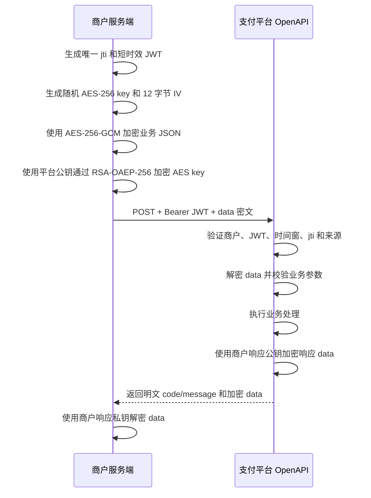

# 商户 OpenAPI 接入指南

| 项目 | 内容 |
| --- | --- |
| 文档版本 | `v2.2.0` |
| API 版本 | `v1` |
| 更新日期 | `2026-08-11` |
| 适用对象 | 商户服务端开发、测试、运维和安全人员 |

本文档说明商户服务端如何接入支付平台 OpenAPI，包括身份认证、请求加密、响应解密、幂等、终态回调和重试规则，以及当前 15 个正式开放接口的请求和响应契约。

除 4.7 节明确列出的 Sandbox 测试卡外，本文档中的商户号、密钥、卡号、账户号和交易号均为格式示例，不能用于真实交易。各环境的商户凭据、平台公钥和商户响应私钥以商户系统或开户邮件提供的材料为准。

## 1. 接入概览

### 1.1 接入步骤

1. 从平台获取环境地址和商户接入材料。
2. 在商户服务端生成 JWT，并通过 `Authorization: Bearer {JWT}` 发送。
3. 使用平台公钥对明文业务 JSON 执行混合加密，将密文放入请求体 `data`。
4. 调用对应的 `POST` 接口，先判断 HTTP 状态和外层响应 `code`。
5. 外层 `data` 非空时，使用商户响应私钥解密，再判断交易业务结果。

### 1.2 平台交付材料

| 材料 | 用途 | 保密要求 |
| --- | --- | --- |
| `Base URL` | 拼接 API 请求地址 | 可公开给商户接入人员，不应由前端用户修改 |
| `merchantId` | 标识商户身份 | 可在商户服务端配置中保存 |
| `merchantKey` | 生成 JWT 的 HS256 签名 | 高敏感，只允许保存在商户服务端 |
| 平台请求加密公钥 | 加密每次请求的 AES 会话密钥 | 公钥材料，仍应校验来源和指纹 |
| 商户响应私钥 | 解密平台响应 `data` | 高敏感，只允许保存在商户服务端 |
| Sandbox 测试数据 | 联调支付、3DS、退款和代付场景 | 只能用于指定的非生产环境 |

生产密钥不得进入浏览器、移动端、代码仓库、构建产物、容器镜像应用层或日志。建议通过 KMS/HSM、只读 Secret Volume 或受控外置文件注入。

商户可以从商户系统自行获取密钥材料，也可以使用开户邮件中提供的密钥材料。首次获取后应立即转存到商户服务端的安全存储，核对所属环境和 `merchantId`，不得转发邮件、粘贴到即时通信工具或提交到代码仓库。

### 1.3 参数标识

| 标识 | 含义 |
| --- | --- |
| M | Mandatory，必填 |
| O | Optional，可选 |
| C | Conditional，满足指定条件时必填 |

### 1.4 接入边界

- 商户只能调用本文列出的 `/api/rest/**` 接口。
- 商户不得调用 `/internal/**`、`/channel/**`、通知重试入口或 Hosted Checkout 浏览器内部接口。
- OpenAPI 凭据只能由商户服务端持有，不能从浏览器或移动端直接调用 OpenAPI。
- API 路径存在不代表所有支付方式或币种默认开通，具体能力以商户配置和平台通知为准。

## 2. 通信规范

### 2.1 请求地址

当前 Sandbox 环境地址如下：

```text
Base URL: http://test-vexra.com/api/rest/
```

该 `Base URL` 已包含 `/api/rest/`。拼接请求地址时，应使用不带开头斜杠的相对路径：

```text
Relative Path: payment/v1/payment
Full URL: http://test-vexra.com/api/rest/payment/v1/payment
```

第 5 章及各接口章节继续使用以 `/api/rest/` 开头的规范 API Path，便于独立识别接口。不要把规范 API Path 直接追加到上述 Sandbox `Base URL`，否则会得到重复的 `/api/rest/api/rest/`。

Sandbox 地址使用 HTTP，仅限测试联调，不得用于真实持卡人数据或生产交易。UAT 和 Production 的 `Base URL` 由平台另行提供，其中 Production 必须使用 HTTPS；不要自行推导其他环境地址。

### 2.2 传输要求

| 项目 | 规则 |
| --- | --- |
| 协议 | Production 必须使用 HTTPS |
| 字符集 | UTF-8 |
| Content-Type | `application/json` |
| HTTP Method | 当前 15 个接口全部使用 `POST` |
| API 版本 | 当前为 `v1`，版本位于 URL 中 |
| 请求体 | 外层 JSON 只传加密后的 `data` |
| 成功响应 | 外层 `code/message` 明文，`data` 加密 |
| 失败响应 | 外层 `code/message` 明文，`data` 通常为空 |

### 2.3 公共请求头

| Header | 必填 | 示例 | 说明 |
| --- | --- | --- | --- |
| `Content-Type` | M | `application/json` | 固定值 |
| `Authorization` | M | `Bearer eyJ...` | `Bearer`、一个空格和 JWT |
| `Origin` | C | `https://merchant.example` | 一步支付、授权、预授权启用来源网址规则时必填 |
| `Referer` | C | `https://merchant.example/pay` | `Origin` 缺失时的兼容来源，可包含路径 |

HTTP Header 名称不区分大小写，本文统一使用标准写法 `Authorization`。

商户不应发送或伪造 `X-Gateway-Client-Ip`。平台使用受信网关确认的客户端出口 IP 执行 IP 白名单和风控校验。商户应提前向平台提供服务器、NAT 网关或固定代理的公网出口 IP。

### 2.4 时间和时区

- JWT 的 `iat` 和 `exp` 使用 Unix epoch 秒。
- 商户服务器必须启用可靠的 NTP 时间同步。
- 响应中的交易时间使用 ISO-8601 offset datetime，例如 `2026-08-01T10:20:30.123+08:00`。
- 商户应按带偏移量时间解析，不要假定平台和商户部署在同一时区。

## 3. 身份认证与报文加密

### 3.1 安全方案

```text
HTTPS + JWT HS256 + RSA-OAEP-256 + AES-256-GCM + jti 防重放
```

JWT 用于身份认证和防篡改，不承载卡号、CVV、账户号或其他敏感业务数据。业务 JSON 必须通过混合加密后放入请求体。

### 3.2 完整调用流程



### 3.3 JWT 生成规则

JWT Header 固定为：

```json
{
  "typ": "JWT",
  "alg": "HS256"
}
```

JWT Payload 示例：

```json
{
  "aud": ["gateway"],
  "iss": "merchant",
  "jti": "550e8400-e29b-41d4-a716-446655440000",
  "iat": 1785549600,
  "exp": 1785549720,
  "merchantId": "200045"
}
```

| 字段 | 类型 | 必填 | 规则 |
| --- | --- | --- | --- |
| `aud` | array/string | M | 必须包含或等于 `gateway`，建议使用数组 `['gateway']` |
| `iss` | string | M | 固定为 `merchant` |
| `jti` | string | M | 每次 HTTP 尝试唯一，不能重复使用 |
| `iat` | integer | M | 当前 Unix epoch 秒；最多允许比平台时间快 60 秒 |
| `exp` | integer | M | 必须晚于 `iat`，且 `exp - iat <= 180` 秒 |
| `merchantId` | string | M | 平台分配的商户号 |

签名算法为标准 HMAC-SHA256：

```text
base64url(jwtHeader) + "." + base64url(jwtPayload)
```

使用 `merchantKey` 对上述字符串计算 HMAC-SHA256，再进行无填充 Base64Url 编码。最终 JWT 为：

```text
base64url(header).base64url(payload).base64url(signature)
```

### 3.4 防重放与业务幂等的区别

`jti` 和业务幂等键不是同一个概念：

| 标识 | 作用 | 重试时规则 |
| --- | --- | --- |
| JWT `jti` | 防止同一 HTTP 报文被重放 | 每次 HTTP 尝试都必须生成新值 |
| `orderInfo.orderId` | 支付业务动作幂等 | 同一业务动作重试保持不变 |
| `merchantOrderNo` | 代付业务订单标识 | 同一代付业务保持不变，不得换号绕过结果不确定状态 |

同一个 `jti` 被再次使用会被拒绝。网络超时后不要只更换 `orderId`、`merchantOrderNo` 或源交易号重新发起资金动作，应先按第 10.3 节的重试决策处理。

### 3.5 请求体加密算法

明文业务 JSON 使用一次性 AES-256-GCM 会话密钥加密；AES 会话密钥再使用平台 RSA 公钥通过 RSA-OAEP-256 加密。

算法参数必须完全符合下表：

| 项目 | 固定规则 |
| --- | --- |
| AES 算法 | `AES/GCM/NoPadding` |
| AES key | 每次请求随机生成 32 字节 |
| IV | 每次请求随机生成 12 字节 |
| GCM Tag | 128 bit，即 16 字节 |
| RSA 算法 | `RSA/ECB/OAEPPadding` |
| OAEP Digest | SHA-256 |
| MGF | MGF1-SHA256 |
| RSA 公钥格式 | X.509 SubjectPublicKeyInfo，PEM 或 Base64 |
| Base64 | Base64Url，无 `=` 填充 |
| 明文编码 | UTF-8 |

特别注意：部分语言或加密库在选择 `OAEPWithSHA-256` 时仍默认使用 MGF1-SHA1。商户必须显式指定 MGF1-SHA256，否则平台无法解密。

### 3.6 五段式密文

请求和响应的 `data` 都使用以下五段式 compact 格式：

```text
base64url(protectedHeader).base64url(encryptedKey).base64url(iv).base64url(cipherText).base64url(tag)
```

受保护头固定表达以下 JSON：

```json
{
  "typ": "PAYMENT-PAYLOAD",
  "alg": "RSA-OAEP-256",
  "enc": "A256GCM"
}
```

| 分段 | 内容 |
| --- | --- |
| `protectedHeader` | 上述 JSON 的 UTF-8 字节经无填充 Base64Url 编码 |
| `encryptedKey` | 使用接收方 RSA 公钥加密的 32 字节 AES key |
| `iv` | 12 字节随机 IV |
| `cipherText` | AES-GCM 加密后的密文，不包含末尾 Tag |
| `tag` | 16 字节 GCM 认证标签 |

第一段 `protectedHeader` 的 Base64Url 文本本身必须作为 AES-GCM AAD，按 US-ASCII 字节传入。JSON 字段顺序可以不同，但加密和解密必须使用密文中完全相同的第一段作为 AAD。

### 3.7 请求加密步骤

1. 将接口明文参数序列化为 UTF-8 JSON，不要把外层 `data` 一起加密。
2. 生成 32 字节密码学安全随机 AES key。
3. 生成 12 字节密码学安全随机 IV。
4. 构建受保护头并生成第一段 Base64Url 文本。
5. 使用 AES-256-GCM 加密明文，第一段文本作为 AAD。
6. 将 AES-GCM 输出拆分为 `cipherText` 和末尾 16 字节 `tag`。
7. 使用平台公钥和 RSA-OAEP-256 加密 AES key。
8. 将五段内容分别进行无填充 Base64Url 编码并以 `.` 拼接。
9. 将最终字符串放入外层请求体 `data`。

外层请求体固定为：

```json
{
  "data": "eyJ0eXAiOiJQQVlNRU5ULVBBWUxPQUQiLCJhbGciOiJSU0EtT0FFUC0yNTYiLCJlbmMiOiJBMjU2R0NNIn0.{encryptedKey}.{iv}.{cipherText}.{tag}"
}
```

以上仅展示结构，花括号内容不是有效密文。

### 3.8 响应解密步骤

1. 解析 HTTP 响应 JSON，读取外层 `code`、`message` 和 `data`。
2. `data` 为空时不要执行解密，直接按外层错误码处理。
3. 将 `data` 按 `.` 拆为五段，并验证受保护头中的 `typ/alg/enc`。
4. 使用商户响应私钥和 RSA-OAEP-256 解密第二段，得到 AES key。
5. 合并 `cipherText` 和 `tag`，使用 AES-256-GCM 解密。
6. AES-GCM 的 AAD 必须使用密文原始第一段文本。
7. 将明文字节按 UTF-8 解析为对应接口的响应对象。

平台不会要求商户把响应私钥上传到 API 请求中。响应私钥一旦泄露，应立即停止使用并联系平台轮换商户响应密钥对。

### 3.9 完整 HTTP 请求和响应结构

```http
POST /api/rest/payment/v1/query HTTP/1.1
Host: {api-host}
Content-Type: application/json
Authorization: Bearer {jwt}

{
  "data": "{five-part-compact-payload}"
}
```

成功返回：

```json
{
  "code": "T200",
  "message": "Success",
  "data": "{five-part-encrypted-response}"
}
```

参数或安全校验失败：

```json
{
  "code": "F402001",
  "message": "Invalid request parameter",
  "data": null
}
```

## 4. 公共业务规则

### 4.1 外层响应和交易结果

所有接口使用统一外层响应：

| 字段 | 类型 | 说明 |
| --- | --- | --- |
| `code` | string | OpenAPI 请求处理结果码 |
| `message` | string | OpenAPI 请求处理结果描述 |
| `data` | string/null | 成功时通常为加密密文；失败时通常为空 |

支付类接口存在两层结果：

1. 外层 `code` 表示 OpenAPI 是否完成鉴权、解密、校验和业务调用。
2. 解密后的 `transactionInfo.code` 表示当前支付动作的资金业务结果。

外层 `code=T200` 不能单独证明支付、授权、请款或退款成功。商户必须解密 `data` 并检查 `transactionInfo.code`。

### 4.2 标识与幂等

| 字段 | 作用 | 商户要求 |
| --- | --- | --- |
| `merchantInfo.merchantId` | 商户身份 | 必须与 JWT `merchantId` 一致 |
| `orderInfo.orderNo` | 商户业务订单号 | 同一业务订单保持稳定 |
| `orderInfo.orderId` | 本次支付动作幂等标识 | 每个支付动作唯一；同一动作重试保持不变 |
| `transactionInfo.transactionId` | 平台当前交易 ID | 商户必须保存；查询时可用于精确过滤 |
| `transactionInfo.sourceTransactionId` | 后续动作关联的原平台交易 ID | 请款、退款、撤销等后续动作使用 |
| `merchantOrderNo` | 商户代付订单号 | 商户侧唯一并长期保存 |

不得通过更换订单号、请求号或源交易号绕过重复请求、状态校验或金额限制。

### 4.3 金额与币种

- 支付类 `orderInfo.amount` 使用主币种单位的十进制金额，例如 USD 10.25 传 `10.25`。
- 支付金额最多 12 位整数和 3 位小数，但实际允许的小数位仍受对应币种精度限制。
- 代付 `amount` 使用最小币种单位整数，不能按固定两位小数换算。
- 商户应调用币种查询接口读取 `defaultFractionDigits`、`minorUnitMultiplier` 和 `minimumAmount`。
- Java 使用 `BigDecimal` 或最小单位整数，其他语言使用十进制定点类型；禁止使用 `float/double` 计算资金金额。
- 币种使用 ISO 4217 三位大写字母代码。
- 国家或地区代码按具体字段使用 ISO 3166-1 alpha-2 或 alpha-3，不得混用。

代付最小单位换算示例：

| 币种 | 主币种金额 | `minorUnitMultiplier` | 代付 `amount` |
| --- | ---: | ---: | ---: |
| USD | 10.25 | 100 | 1025 |
| JPY | 100 | 1 | 100 |
| KWD | 1.234 | 1000 | 1234 |

换算结果必须是整数；如产生非零余数，应拒绝请求，不得静默四舍五入。

### 4.4 可选字段和兼容性

- 响应中的可选字段可能缺失或为 `null`，客户端必须兼容。
- 商户不得依赖 JSON 字段顺序。
- 未在本文声明的响应字段不得作为稳定契约使用。
- `cardInfo`、CVV、完整卡号、渠道原始响应和内部失败原因不会在响应中返回。
- 平台可能新增可选响应字段，商户 JSON 反序列化应忽略未知字段。

### 4.5 通知地址字段

支付请求的 `transactionInfo.callbackUrl` 和 Hosted Checkout 的 `checkoutInfo.notifyUrl` 是可选通知地址。首次支付、授权和预授权进入终态后，平台按第 7.13 节的 JWT、密文、ACK、自动重试和人工重发协议通知该地址。商户必须同时实现回调事件幂等和交易查询兜底，不能仅依赖浏览器跳转或单次通知结果确认最终交易状态。

### 4.6 HTTP 状态和客户端超时

- 商户必须同时处理非 2xx HTTP 状态、连接失败、读取超时和合法 JSON 业务响应。
- 不得假定所有错误都通过 HTTP 200 返回。
- 连接超时或读取超时不能证明平台未受理请求。
- 资金类请求结果不确定时先查询，不得立即生成新的业务幂等标识重复提交。
- 具体连接超时、读取超时、限流和 SLA 参数以平台环境接入材料为准。

### 4.7 Sandbox 测试卡

以下卡号由平台提供，仅用于 Sandbox 联调。

| 卡品牌 | 卡号 | 3DS 注册状态 | 建议测试场景 |
| --- | --- | --- | --- |
| `MASTERCARD` | `5123450000000008` | 已注册 | 3DS 已注册卡支付 |
| `MASTERCARD` | `5111111111111118` | 未注册 | 非 3DS 卡支付 |
| `VISA` | `4508750015741019` | 已注册 | 3DS 已注册卡支付 |
| `VISA` | `4012000033330026` | 未注册 | 非 3DS 卡支付 |
| `JCB` | `3528000000000007` | 已注册 | 3DS 已注册卡支付 |
| `DISCOVER` | `6011003179988686` | 已注册 | 3DS 已注册卡支付 |

只有商户已开通并且 Sandbox 渠道支持的卡组织才能成功受理；未开通的卡组织可能返回 `F410` 或 `F413`。测试卡也必须按第 3 章规则加密后放入请求 `data`，不得出现在日志、数据库、MQ、异常文本或监控标签中。

Sandbox 模拟器可通过有效期触发预期交易结果。本文 API 使用四位年份：

| `expirationMonth` | `expirationYear` | 预期模拟结果 |
| --- | --- | --- |
| `01` | `2039` | `APPROVED` |
| `05` | `2039` | `DECLINED` |
| `04` | `2027` | `EXPIRED_CARD` |
| `08` | `2028` | `TIMED_OUT` |

非 American Express 测试卡可使用以下 `securityCode` 触发 CVV 校验结果：`100` 表示 `MATCH`，`101` 表示 `NOT_PROCESSED`，`102` 表示 `NO_MATCH`。渠道模拟结果会映射为平台统一交易结果，商户应按外层 `code` 和解密后的 `transactionInfo.code` 处理，不应依赖渠道原始响应文本。

> **仅限测试：** 上述卡号和 CVV 只能用于 Sandbox 模拟器，不得用于 UAT、Production、真实持卡人交易或外部网站。测试数据可能调整，发生差异时以平台最新通知为准。

## 5. API 一览

| # | 分类 | 接口 | Method | Path |
| ---: | --- | --- | --- | --- |
| 1 | ISO 字典 | 查询国家地区 | POST | `/api/rest/iso/v1/countries/query` |
| 2 | ISO 字典 | 查询币种 | POST | `/api/rest/iso/v1/currencies/query` |
| 3 | 基础数据 | IP 数据检索 | POST | `/api/rest/ip/v1/query` |
| 4 | 基础数据 | 卡 BIN 数据检索 | POST | `/api/rest/card-bin/v1/query` |
| 5 | 收单支付 | 一步支付 | POST | `/api/rest/payment/v1/payment` |
| 6 | 收单支付 | 授权 | POST | `/api/rest/payment/v1/authorization` |
| 7 | 收单支付 | 预授权 | POST | `/api/rest/payment/v1/pre-authorization` |
| 8 | 收单支付 | 增量授权 | POST | `/api/rest/payment/v1/incremental-authorization` |
| 9 | 收单支付 | 预授权完成 | POST | `/api/rest/payment/v1/pre-auth-completion` |
| 10 | 收单支付 | 请款 | POST | `/api/rest/payment/v1/capture` |
| 11 | 收单支付 | 退款 | POST | `/api/rest/payment/v1/refund` |
| 12 | 收单支付 | 撤销 | POST | `/api/rest/payment/v1/void` |
| 13 | 收单支付 | 交易查询 | POST | `/api/rest/payment/v1/query` |
| 14 | Hosted Checkout | 创建收银台会话 | POST | `/api/rest/checkout/v1/session` |
| 15 | 代付 | 创建代付 | POST | `/api/rest/payout/v1/create` |

## 6. ISO 与基础数据接口

### 6.1 查询国家地区

查询平台支持的 ISO 3166 国家或地区。所有查询条件均可选；不传条件时返回全部可用记录。

**接口**

```http
POST /api/rest/iso/v1/countries/query
```

**明文请求参数**

| 字段 | 类型 | 必填 | 规则 |
| --- | --- | --- | --- |
| `alpha2` | string | O | ISO 3166-1 alpha-2，两位大写字母 |
| `alpha3` | string | O | ISO 3166-1 alpha-3，三位大写字母 |
| `numeric` | string | O | ISO 3166-1 三位数字代码 |
| `englishName` | string | O | 英文名称，最长 128 个字符 |
| `shortEnglishName` | string | O | 英文简称，最长 128 个字符 |
| `chineseName` | string | O | 中文名称，最长 128 个字符 |
| `continentCode` | string | O | `AS/EU/AF/NA/SA/OC/AN` |
| `primaryLanguageCode` | string | O | 语言代码，例如 `en`、`zh-CN` |
| `currencyAlpha3Code` | string | O | ISO 4217 三位大写币种代码 |

**明文请求示例**

```json
{
  "alpha3": "USA",
  "continentCode": "NA"
}
```

商户必须加密上述 JSON，实际 HTTP 请求体仍为：

```json
{
  "data": "{five-part-compact-payload}"
}
```

**解密后的响应字段**

响应 `data` 明文为数组：

| 字段 | 类型 | 说明 |
| --- | --- | --- |
| `alpha2` | string | ISO 3166-1 两位字母代码 |
| `alpha3` | string | ISO 3166-1 三位字母代码 |
| `numeric` | string | ISO 3166-1 三位数字代码 |
| `englishName` | string | 英文全称 |
| `shortEnglishName` | string | 英文简称 |
| `chineseName` | string | 中文名称 |
| `continentCode` | string | 洲代码 |
| `continentName` | string | 洲中文名称 |
| `flagEmoji` | string | 国家或地区图标 |
| `primaryLanguageCode` | string | 主要语言代码 |
| `primaryLanguageEnglish` | string | 主要语言英文名称 |
| `primaryLanguageChinese` | string | 主要语言中文名称 |
| `currencyAlpha3Code` | string | 默认币种代码 |

**解密后的响应示例**

```json
[
  {
    "alpha2": "US",
    "alpha3": "USA",
    "numeric": "840",
    "englishName": "United States of America",
    "shortEnglishName": "United States",
    "chineseName": "美国",
    "continentCode": "NA",
    "continentName": "北美洲",
    "flagEmoji": "🇺🇸",
    "primaryLanguageCode": "en",
    "primaryLanguageEnglish": "English",
    "primaryLanguageChinese": "英语",
    "currencyAlpha3Code": "USD"
  }
]
```

### 6.2 查询币种

查询平台支持的 ISO 4217 币种及其最小单位信息。所有查询条件均可选；不传条件时返回全部可用记录。

**接口**

```http
POST /api/rest/iso/v1/currencies/query
```

**明文请求参数**

| 字段 | 类型 | 必填 | 规则 |
| --- | --- | --- | --- |
| `alphabeticCode` | string | O | ISO 4217 三位大写字母代码 |
| `numericCode` | string | O | ISO 4217 三位数字代码 |
| `englishName` | string | O | 英文名称，最长 128 个字符 |
| `chineseName` | string | O | 中文名称，最长 128 个字符 |
| `currencySymbol` | string | O | 币种符号，最长 16 个字符 |

**明文请求示例**

```json
{
  "alphabeticCode": "USD"
}
```

**解密后的响应字段**

响应 `data` 明文为数组：

| 字段 | 类型 | 说明 |
| --- | --- | --- |
| `alphabeticCode` | string | ISO 4217 三位字母代码 |
| `numericCode` | string | ISO 4217 三位数字代码 |
| `englishName` | string | 币种英文名称 |
| `chineseName` | string | 币种中文名称 |
| `defaultFractionDigits` | integer | 默认辅币位；小于 0 表示没有可靠定义 |
| `minorUnitMultiplier` | integer | 主币种单位转换为最小单位的倍数 |
| `minimumAmount` | decimal | 最小金额单位 |
| `currencySymbol` | string | 币种符号 |

**解密后的响应示例**

```json
[
  {
    "alphabeticCode": "USD",
    "numericCode": "840",
    "englishName": "US Dollar",
    "chineseName": "美元",
    "defaultFractionDigits": 2,
    "minorUnitMultiplier": 100,
    "minimumAmount": 0.01,
    "currencySymbol": "$"
  }
]
```

币种精度和最小单位可能随平台字典更新。商户不得在代码中永久假定所有币种均为两位小数。

### 6.3 IP 数据检索

根据单个 IPv4 或 IPv6 地址查询平台当前 IP 库中的归属信息。只支持精确 IP 字面量，不支持域名、CIDR、IP 范围或批量查询。

**接口**

```http
POST /api/rest/ip/v1/query
```

**明文请求参数**

| 字段 | 类型 | 必填 | 规则 |
| --- | --- | --- | --- |
| `ipAddress` | string | M | 标准 IPv4 或 IPv6 字面量，最长 45 个字符 |

**明文请求示例**

```json
{
  "ipAddress": "8.8.8.8"
}
```

商户必须按第 3 章规则加密上述 JSON。实际 HTTP 请求体仍然只包含密文 `data`：

```json
{
  "data": "{five-part-compact-payload}"
}
```

**解密后的响应字段**

| 字段 | 类型 | 说明 |
| --- | --- | --- |
| `matched` | boolean | 是否命中当前有效 IP 归属区间 |
| `ipAddress` | string | 平台规范化后的 IP 地址 |
| `ipType` | string | `IPV4` 或 `IPV6` |
| `countryAlpha2` | string | 国家或地区 ISO Alpha-2 编码，未命中时为空 |
| `countryAlpha3` | string | 国家或地区 ISO Alpha-3 编码，未命中时为空 |
| `countryNumeric` | string | 国家或地区 ISO Numeric 编码，未命中时为空 |
| `countryName` | string | 国家或地区英文名称，未命中时为空 |
| `stateProvince` | string | 州或省名称，未命中或数据源未提供时为空 |
| `city` | string | 城市名称，未命中或数据源未提供时为空 |

**解密后的响应示例**

```json
{
  "matched": true,
  "ipAddress": "8.8.8.8",
  "ipType": "IPV4",
  "countryAlpha2": "US",
  "countryAlpha3": "USA",
  "countryNumeric": "840",
  "countryName": "United States",
  "stateProvince": "California",
  "city": "Mountain View"
}
```

格式正确但未命中时，接口仍返回 `T200`，解密后的 `data.matched=false`。未命中不是系统异常，商户不应立即高频重试。IP 归属数据属于参考信息，可能随数据版本更新或从库同步存在短暂延迟，不应单独作为付款、开户或风控放行依据。

### 6.4 卡 BIN 数据检索

根据 6 至 11 位纯数字卡 BIN 查询平台当前有效的卡品牌、卡类型和发卡机构归属信息。不得向本接口传入完整卡号、CVV 或其他持卡人数据。

**接口**

```http
POST /api/rest/card-bin/v1/query
```

**明文请求参数**

| 字段 | 类型 | 必填 | 规则 |
| --- | --- | --- | --- |
| `cardBin` | string | M | 6 至 11 位纯数字，不允许传入完整卡号 |

**明文请求示例**

```json
{
  "cardBin": "411111"
}
```

商户必须按第 3 章规则加密上述 JSON，成功响应的 `data` 同样为密文，必须使用商户响应私钥解密。

**解密后的响应字段**

| 字段 | 类型 | 说明 |
| --- | --- | --- |
| `matched` | boolean | 是否命中当前有效卡 BIN 区间 |
| `cardBin` | string | 商户提交的卡 BIN |
| `binLength` | integer | 命中记录精度，范围为 6 至 11，且不会大于请求长度 |
| `cardBrand` | string | 卡品牌代码，未命中时为空 |
| `cardSubBrand` | string | 卡子品牌或产品名称，未命中时为空 |
| `cardType` | string | 卡类型代码，未命中时为空 |
| `cardLevel` | string | 卡等级，未命中时为空 |
| `issuerCountryName` | string | 发卡国家或地区名称，未命中时为空 |
| `issuerCountryAlpha2` | string | 发卡国家或地区 ISO Alpha-2 编码，未命中时为空 |
| `issuerCountryAlpha3` | string | 发卡国家或地区 ISO Alpha-3 编码，未命中时为空 |
| `issuerCountryNumeric` | string | 发卡国家或地区 ISO Numeric 编码，未命中时为空 |
| `issuerBank` | string | 发卡行名称，未命中时为空 |

**解密后的响应示例**

```json
{
  "matched": true,
  "cardBin": "411111",
  "binLength": 6,
  "cardBrand": "VISA",
  "cardSubBrand": "CLASSIC",
  "cardType": "CREDIT",
  "cardLevel": "GOLD",
  "issuerCountryName": "United States",
  "issuerCountryAlpha2": "US",
  "issuerCountryAlpha3": "USA",
  "issuerCountryNumeric": "840",
  "issuerBank": "Example Bank"
}
```

格式正确但未命中时，接口仍返回 `T200`，解密后的 `data.matched=false`。卡 BIN 数据属于参考信息，可能随数据源和从库同步更新，不能替代卡组织、发卡行或实际交易授权结果。

## 7. 收单支付接口

### 7.1 支付请求对象

九个支付接口共用一套请求对象，不同接口通过校验组控制必填字段。

**顶层对象**

| 字段 | 类型 | 适用范围 | 说明 |
| --- | --- | --- | --- |
| `merchantInfo` | object | 全部支付接口 | 商户及可选子商户信息 |
| `orderInfo` | object | 全部支付接口 | 商户订单、动作幂等号、金额和币种 |
| `billingCardHolderInfo` | object | 一步支付、授权、预授权 | 持卡人账单信息 |
| `cardInfo` | object | 一步支付、授权、预授权 | 卡号、有效期和 CVV |
| `threeDSInfo` | object | 首次卡交易可选 | 商户已完成 3DS 时上送的结果 |
| `transactionInfo` | object | 后续动作和查询必填；首次交易可选 | 平台交易关联和扩展信息 |
| `riskContext` | object | 首次卡交易可选 | 本次交易的风控上下文 |

**merchantInfo**

| 字段 | 类型 | 必填 | 规则 |
| --- | --- | --- | --- |
| `merchantInfo.merchantId` | string | M | 6 至 17 位数字，首位 2 至 9；必须与 JWT 一致 |
| `merchantInfo.subMerchantInfo` | object | O | 子商户资料；首次卡交易传入时执行下列条件校验 |
| `subMerchantInfo.subName` | string | C | 与 `subCompanyName` 至少填写一个，1 至 35 个可打印字符 |
| `subMerchantInfo.subCompanyName` | string | C | 与 `subName` 至少填写一个，1 至 35 个可打印字符 |
| `subMerchantInfo.subId` | string | C | 首次卡交易传入子商户对象时必填，1 至 15 个字符 |
| `subMerchantInfo.subStreet` | string | C | 首次卡交易传入子商户对象时必填，最长 128 个字符 |
| `subMerchantInfo.subCity` | string | C | 首次卡交易传入子商户对象时必填，最长 64 个字符 |
| `subMerchantInfo.subState` | string | O | 1 至 3 位字母或数字 |
| `subMerchantInfo.subCountryCode` | string | C | 首次卡交易传入子商户对象时必填，ISO alpha-3 |
| `subMerchantInfo.subEmail` | string | O | 有效邮箱，最长 64 个字符 |
| `subMerchantInfo.subPhone` | string | O | 最长 32 个字符 |
| `subMerchantInfo.subPostal` | string | O | 最长 32 个字符 |
| `subMerchantInfo.subTaxId` | string | O | 最长 32 个非中文字符 |
| `subMerchantInfo.merchantCategory` | string | C | 首次卡交易传入子商户对象时必填，4 位 MCC |
| `subMerchantInfo.intesCode` | string | O | 3 至 4 位字母或数字 |
| `subMerchantInfo.chargeType` | string | O | 3 位字母或数字 |

**orderInfo**

| 字段 | 类型 | 必填规则 | 说明 |
| --- | --- | --- | --- |
| `orderInfo.amount` | decimal | 首次交易、增量授权、预授权完成、请款、退款 M | 大于 0，最多 12 位整数和 3 位小数 |
| `orderInfo.currency` | string | 首次交易、增量授权、预授权完成、请款 M；退款 O | ISO 4217 三位大写代码；后续动作必须与源交易一致 |
| `orderInfo.orderNo` | string | 除退款外 M；退款 O | 1 至 64 位字母或数字；传入时必须与源交易一致 |
| `orderInfo.orderId` | string | M | 本次动作幂等标识，1 至 64 个可打印字符 |

**billingCardHolderInfo**

| 字段 | 类型 | 必填 | 规则 |
| --- | --- | --- | --- |
| `firstName` | string | M | 1 至 32 个字符 |
| `lastName` | string | M | 1 至 32 个字符；与 `firstName` 合计不超过 64 个字符 |
| `phone` | string | M | 1 至 32 个字符 |
| `email` | string | M | 有效邮箱，最长 64 个字符 |
| `country` | string | M | ISO 3166-1 alpha-3 |
| `state` | string | O | 2 至 3 个字符 |
| `city` | string | M | 1 至 64 个字符 |
| `street` | string | M | 1 至 128 个字符 |
| `postal` | string | M | 1 至 32 个字符 |

**cardInfo**

| 字段 | 类型 | 必填 | 规则 |
| --- | --- | --- | --- |
| `cardNo` | string | M | 11 至 19 位数字 PAN |
| `expirationMonth` | string | M | `01` 至 `12` |
| `expirationYear` | string | M | 四位年份 |
| `securityCode` | string | M | 3 至 4 位 CVV/CVC |

完整 PAN 和 CVV 只能存在于商户受控的支付采集流程、内存中的明文对象和加密后的 `data` 中。严禁写入日志、数据库、MQ、异常文本或监控标签。

**threeDSInfo**

| 字段 | 类型 | 必填 | 规则 |
| --- | --- | --- | --- |
| `eci` | string | O | 3 位数字 |
| `cavv` | string | O | 28 个字符 |
| `dsTransactionId` | string | O | 36 个字符 |
| `threeDsVersion` | string | O | `2.1.x` 或更高 2.x 版本，例如 `2.2.0` |

**riskContext**

| 字段 | 类型 | 必填 | 规则 |
| --- | --- | --- | --- |
| `customerId` | string | O | 商户体系内稳定客户 ID，1 至 64 个 ASCII 非空白字符 |
| `deviceFingerprint` | string | O | 稳定设备指纹，1 至 128 个 ASCII 非空白字符 |
| `shippingAddress` | string | O | 收货地址，1 至 256 个 ASCII 可打印字符 |
| `shippingPostalCode` | string | O | 2 至 20 位字母、数字、空格或短横线 |
| `shippingCountry` | string | O | ISO 3166-1 alpha-3 |

`customerId` 和 `deviceFingerprint` 不得使用姓名、邮箱、卡号或完整原始设备采集报文。

**transactionInfo**

| 字段 | 类型 | 必填规则 | 说明 |
| --- | --- | --- | --- |
| `sourceTransactionId` | string | 增量授权、预授权完成、请款、退款、撤销 M | 源交易返回的 `transactionId` |
| `transactionId` | string | 查询 O | 查询时用于精确过滤，其他请求不应上送 |
| `description` | string | O | 本次动作描述，最长 128 个字符 |
| `callbackUrl` | string | O | HTTP/HTTPS 通知地址，最长 256 个字符；使用边界见 4.5 节 |
| `merchantWebsite` | string | 一步支付、授权、预授权 O | 商户发起交易的网站原始 HTTP/HTTPS URL，最长 512 个字符；必须包含合法主机名且不得包含用户信息 |

`cardBrand` 由平台根据卡 BIN 识别，只在响应中返回，商户请求不应上送。`merchantWebsite` 会作为交易生命周期属性保存并原样回显；商户启用来源网址限定后，该字段缺失或主机名不匹配将被风控拒绝。

### 7.2 支付操作字段矩阵

| 接口 | amount | currency | orderNo | orderId | card/holder | merchantWebsite | sourceTransactionId | transactionId |
| --- | --- | --- | --- | --- | --- | --- | --- | --- |
| 一步支付 | M | M | M | M | M | O | - | - |
| 授权 | M | M | M | M | M | O | - | - |
| 预授权 | M | M | M | M | M | O | - | - |
| 增量授权 | M | M | M | M | - | - | M | - |
| 预授权完成 | M | M | M | M | - | - | M | - |
| 请款 | M | M | M | M | - | - | M | - |
| 退款 | M | O | O | M | - | - | M | - |
| 撤销 | - | - | M | M | - | - | M | - |
| 查询 | - | - | M | M | - | - | - | O |

`-` 表示该接口不需要该字段。不要为了“字段完整”向撤销或查询请求附加无意义金额。

### 7.3 支付响应对象

除查询接口外，九个支付接口中的八个资金动作解密后使用相同响应结构：

| 字段 | 类型 | 说明 |
| --- | --- | --- |
| `merchantInfo` | object | 商户及允许回显的子商户摘要 |
| `orderInfo` | object | 订单、本次金额和累计金额 |
| `billingCardHolderInfo` | object | 首次交易的持卡人账单摘要，不包含卡号和 CVV |
| `transactionInfo` | object | 当前支付动作结果 |
| `billingInfo` | object | 标签金额、交易金额、汇率和结算摘要 |

**orderInfo 响应字段**

| 字段 | 类型 | 说明 |
| --- | --- | --- |
| `orderNo` | string | 商户订单号 |
| `orderId` | string | 本次动作幂等标识 |
| `amount` | decimal | 本次动作金额 |
| `currency` | string | 本次动作币种 |
| `totalAuthorizedAmount` | decimal | 生命周期累计授权成功金额 |
| `totalCapturedAmount` | decimal | 生命周期累计请款成功金额 |
| `totalRefundAmount` | decimal | 生命周期累计退款成功金额 |
| `totalAuthorizedCancelAmount` | decimal | 生命周期累计授权释放/取消金额 |
| `totalRefuseAmount` | decimal | 生命周期累计拒付成立金额 |

**transactionInfo 响应字段**

| 字段 | 类型 | 说明 |
| --- | --- | --- |
| `transactionId` | string | 平台当前交易唯一标识，商户必须保存 |
| `sourceTransactionId` | string | 后续动作关联的源交易标识 |
| `code` | string | 当前动作商户响应码 |
| `message` | string | 当前动作商户响应描述 |
| `transactionType` | string | 当前动作类型 |
| `transactionDateTime` | string | ISO-8601 offset datetime |
| `paymentMethod` | string | 支付方式，例如 `BANK_CARD` |
| `cardBrand` | string | 卡品牌，例如 `VISA`、`MASTERCARD`、`AMEX` 或 `JCB` |
| `cardBin` | string | 脱敏卡摘要，例如前六位 + `****` + 后四位 |
| `authCode` | string | 授权码，渠道返回时存在 |
| `arn` | string | ARN/收单参考号，渠道返回时存在 |
| `description` | string | 商户上送的动作描述 |
| `callbackUrl` | string | 商户上送或配置的通知地址 |
| `merchantWebsite` | string | 首次支付、授权或预授权保存的商户网站原始 URL |
| `pendingReasonCode` | string | 待确认原因，适用时存在 |

**billingInfo 响应字段**

| 字段 | 类型 | 说明 |
| --- | --- | --- |
| `labelAmount` | decimal | 商户上送或页面展示金额 |
| `labelCurrency` | string | 商户上送或页面展示币种 |
| `transactionAmount` | decimal | 平台发送渠道的交易金额 |
| `transactionCurrency` | string | 平台交易币种 |
| `transactionRate` | decimal | 标签金额转换为交易金额的汇率；未换汇时通常为 `1.00000000` |
| `rateSource` | string | 汇率来源编码 |
| `rateTime` | string | 汇率生效或报价时间 |
| `settlementAmount` | decimal | 预计或最终结算金额，适用时存在 |
| `settlementCurrency` | string | 预计或最终结算币种，适用时存在 |

商户应使用 `transactionInfo.code/message` 判断当前动作结果，不应使用未公开的内部状态字段。

### 7.4 一步支付

一步支付通常由渠道一次完成授权和请款。

**接口**

```http
POST /api/rest/payment/v1/payment
```

**幂等维度**

```text
merchantId + orderInfo.orderId + PAYMENT
```

**明文请求示例**

```json
{
  "merchantInfo": {
    "merchantId": "200045"
  },
  "orderInfo": {
    "amount": 10.25,
    "currency": "USD",
    "orderNo": "M202608010001",
    "orderId": "PAY202608010001"
  },
  "billingCardHolderInfo": {
    "firstName": "Jane",
    "lastName": "Doe",
    "phone": "+12025550123",
    "email": "jane.doe@merchant.example",
    "country": "USA",
    "state": "NY",
    "city": "New York",
    "street": "100 Main Street",
    "postal": "10001"
  },
  "cardInfo": {
    "cardNo": "{sandbox-card-number}",
    "expirationMonth": "12",
    "expirationYear": "2030",
    "securityCode": "{sandbox-cvv}"
  },
  "riskContext": {
    "customerId": "CUSTOMER-10001",
    "deviceFingerprint": "DEVICE-FP-7F97A8B2C1",
    "shippingPostalCode": "10001",
    "shippingCountry": "USA"
  },
  "transactionInfo": {
    "description": "Order M202608010001",
    "merchantWebsite": "https://shop.merchant.example/checkout"
  }
}
```

**解密后的成功响应示例**

```json
{
  "merchantInfo": {
    "merchantId": "200045"
  },
  "orderInfo": {
    "orderNo": "M202608010001",
    "orderId": "PAY202608010001",
    "amount": 10.25,
    "currency": "USD",
    "totalAuthorizedAmount": 10.25,
    "totalCapturedAmount": 10.25,
    "totalRefundAmount": 0
  },
  "transactionInfo": {
    "transactionId": "202608011020301230001",
    "code": "T200",
    "message": "Success",
    "transactionType": "PAYMENT",
    "transactionDateTime": "2026-08-01T10:20:30.123+08:00",
    "paymentMethod": "BANK_CARD",
    "cardBrand": "VISA",
    "cardBin": "411111****1111",
    "authCode": "123456",
    "description": "Order M202608010001",
    "merchantWebsite": "https://shop.merchant.example/checkout"
  },
  "billingInfo": {
    "labelAmount": 10.25,
    "labelCurrency": "USD",
    "transactionAmount": 10.25,
    "transactionCurrency": "USD",
    "transactionRate": 1.00000000
  }
}
```

保存返回的 `transactionId`。后续退款或允许的撤销操作使用该值作为 `sourceTransactionId`。

### 7.5 授权

授权用于冻结或确认持卡人额度，成功后可按状态和可用金额执行请款、增量授权或撤销。

**接口**

```http
POST /api/rest/payment/v1/authorization
```

**幂等维度**

```text
merchantId + orderInfo.orderId + AUTHORIZATION
```

**明文请求示例**

```json
{
  "merchantInfo": {
    "merchantId": "200045"
  },
  "orderInfo": {
    "amount": 100.00,
    "currency": "USD",
    "orderNo": "M202608010002",
    "orderId": "AUTH202608010001"
  },
  "billingCardHolderInfo": {
    "firstName": "Jane",
    "lastName": "Doe",
    "phone": "+12025550123",
    "email": "jane.doe@merchant.example",
    "country": "USA",
    "state": "NY",
    "city": "New York",
    "street": "100 Main Street",
    "postal": "10001"
  },
  "cardInfo": {
    "cardNo": "{sandbox-card-number}",
    "expirationMonth": "12",
    "expirationYear": "2030",
    "securityCode": "{sandbox-cvv}"
  },
  "transactionInfo": {
    "description": "Authorize order M202608010002",
    "merchantWebsite": "https://shop.merchant.example/checkout"
  }
}
```

**解密后的成功响应示例**

```json
{
  "merchantInfo": {"merchantId": "200045"},
  "orderInfo": {
    "orderNo": "M202608010002",
    "orderId": "AUTH202608010001",
    "amount": 100.00,
    "currency": "USD",
    "totalAuthorizedAmount": 100.00,
    "totalCapturedAmount": 0
  },
  "transactionInfo": {
    "transactionId": "202608011030001230002",
    "code": "T200",
    "message": "Success",
    "transactionType": "AUTHORIZATION",
    "transactionDateTime": "2026-08-01T10:30:00.123+08:00",
    "paymentMethod": "BANK_CARD",
    "cardBrand": "VISA",
    "cardBin": "411111****1111",
    "authCode": "654321",
    "merchantWebsite": "https://shop.merchant.example/checkout"
  }
}
```

### 7.6 预授权

预授权用于暂时冻结额度，后续可执行预授权完成、请款、增量授权或撤销，具体动作受源交易状态和剩余金额限制。

**接口**

```http
POST /api/rest/payment/v1/pre-authorization
```

**幂等维度**

```text
merchantId + orderInfo.orderId + PRE_AUTHORIZATION
```

**明文请求示例**

```json
{
  "merchantInfo": {
    "merchantId": "200045"
  },
  "orderInfo": {
    "amount": 200.00,
    "currency": "USD",
    "orderNo": "M202608010003",
    "orderId": "PREAUTH202608010001"
  },
  "billingCardHolderInfo": {
    "firstName": "Jane",
    "lastName": "Doe",
    "phone": "+12025550123",
    "email": "jane.doe@merchant.example",
    "country": "USA",
    "state": "NY",
    "city": "New York",
    "street": "100 Main Street",
    "postal": "10001"
  },
  "cardInfo": {
    "cardNo": "{sandbox-card-number}",
    "expirationMonth": "12",
    "expirationYear": "2030",
    "securityCode": "{sandbox-cvv}"
  },
  "transactionInfo": {
    "description": "Pre-authorize order M202608010003",
    "merchantWebsite": "https://shop.merchant.example/checkout"
  }
}
```

**解密后的成功响应示例**

```json
{
  "merchantInfo": {"merchantId": "200045"},
  "orderInfo": {
    "orderNo": "M202608010003",
    "orderId": "PREAUTH202608010001",
    "amount": 200.00,
    "currency": "USD",
    "totalAuthorizedAmount": 200.00,
    "totalCapturedAmount": 0
  },
  "transactionInfo": {
    "transactionId": "202608011040001230003",
    "code": "T200",
    "message": "Success",
    "transactionType": "PRE_AUTHORIZATION",
    "transactionDateTime": "2026-08-01T10:40:00.123+08:00",
    "paymentMethod": "BANK_CARD",
    "cardBrand": "VISA",
    "cardBin": "411111****1111",
    "authCode": "789012",
    "merchantWebsite": "https://shop.merchant.example/checkout"
  }
}
```

### 7.7 增量授权

对一笔成功的授权或预授权追加授权额度。源交易必须处于允许增量授权的状态。

**接口**

```http
POST /api/rest/payment/v1/incremental-authorization
```

**幂等维度**

```text
merchantId + orderInfo.orderId + INCREMENTAL_AUTHORIZATION
```

**明文请求示例**

```json
{
  "merchantInfo": {
    "merchantId": "200045"
  },
  "orderInfo": {
    "orderNo": "M202608010002",
    "orderId": "INCR202608010001",
    "amount": 20.00,
    "currency": "USD"
  },
  "transactionInfo": {
    "sourceTransactionId": "202608011030001230002",
    "description": "Increase authorization amount"
  }
}
```

**业务约束**

- `sourceTransactionId` 必须属于当前商户。
- 源交易类型必须为成功的 `AUTHORIZATION` 或 `PRE_AUTHORIZATION`。
- 币种必须与源交易一致。
- `amount` 表示本次追加金额，不是追加后的总金额。

**解密后的成功响应示例**

```json
{
  "merchantInfo": {"merchantId": "200045"},
  "orderInfo": {
    "orderNo": "M202608010002",
    "orderId": "INCR202608010001",
    "amount": 20.00,
    "currency": "USD",
    "totalAuthorizedAmount": 120.00,
    "totalCapturedAmount": 0
  },
  "transactionInfo": {
    "transactionId": "202608011100001230004",
    "sourceTransactionId": "202608011030001230002",
    "code": "T200",
    "message": "Success",
    "transactionType": "INCREMENTAL_AUTHORIZATION",
    "transactionDateTime": "2026-08-01T11:00:00.123+08:00"
  }
}
```

### 7.8 预授权完成

对一笔允许完成的预授权交易确认本次扣款金额。

**接口**

```http
POST /api/rest/payment/v1/pre-auth-completion
```

**幂等维度**

```text
merchantId + orderInfo.orderId + PRE_AUTH_COMPLETION
```

**明文请求示例**

```json
{
  "merchantInfo": {
    "merchantId": "200045"
  },
  "orderInfo": {
    "orderNo": "M202608010003",
    "orderId": "PAC202608010001",
    "amount": 180.00,
    "currency": "USD"
  },
  "transactionInfo": {
    "sourceTransactionId": "202608011040001230003",
    "description": "Complete pre-authorization"
  }
}
```

**业务约束**

- 源交易必须成功且允许预授权完成。
- 币种必须与源交易一致。
- 本次金额必须大于 0，且不能超过源交易剩余可完成金额。

**解密后的成功响应示例**

```json
{
  "merchantInfo": {"merchantId": "200045"},
  "orderInfo": {
    "orderNo": "M202608010003",
    "orderId": "PAC202608010001",
    "amount": 180.00,
    "currency": "USD",
    "totalAuthorizedAmount": 200.00,
    "totalCapturedAmount": 180.00
  },
  "transactionInfo": {
    "transactionId": "202608011110001230005",
    "sourceTransactionId": "202608011040001230003",
    "code": "T200",
    "message": "Success",
    "transactionType": "PRE_AUTH_COMPLETION",
    "transactionDateTime": "2026-08-01T11:10:00.123+08:00"
  }
}
```

### 7.9 请款

对成功且可请款的授权生命周期发起资金捕获。

**接口**

```http
POST /api/rest/payment/v1/capture
```

**幂等维度**

```text
merchantId + orderInfo.orderId + CAPTURE
```

**明文请求示例**

```json
{
  "merchantInfo": {
    "merchantId": "200045"
  },
  "orderInfo": {
    "orderNo": "M202608010002",
    "orderId": "CAPTURE202608010001",
    "amount": 80.00,
    "currency": "USD"
  },
  "transactionInfo": {
    "sourceTransactionId": "202608011030001230002",
    "description": "Capture authorized amount"
  }
}
```

**业务约束**

- 源交易必须成功且处于允许请款的状态。
- 币种必须与源交易一致。
- 本次请款金额不能超过剩余可请款金额。
- 部分请款后如需再次请款，每次必须使用新的 `orderId`，并继续引用平台允许的源交易。

**解密后的成功响应示例**

```json
{
  "merchantInfo": {"merchantId": "200045"},
  "orderInfo": {
    "orderNo": "M202608010002",
    "orderId": "CAPTURE202608010001",
    "amount": 80.00,
    "currency": "USD",
    "totalAuthorizedAmount": 120.00,
    "totalCapturedAmount": 80.00
  },
  "transactionInfo": {
    "transactionId": "202608011120001230006",
    "sourceTransactionId": "202608011030001230002",
    "code": "T200",
    "message": "Success",
    "transactionType": "CAPTURE",
    "transactionDateTime": "2026-08-01T11:20:00.123+08:00",
    "arn": "12345678901234567890123"
  }
}
```

### 7.10 退款

对存在可退金额的成功支付或请款生命周期发起全部或部分退款。

**接口**

```http
POST /api/rest/payment/v1/refund
```

**幂等维度**

```text
merchantId + orderInfo.orderId + REFUND
```

**最小明文请求示例**

```json
{
  "merchantInfo": {
    "merchantId": "200045"
  },
  "orderInfo": {
    "orderId": "REFUND202608010001",
    "amount": 2.50
  },
  "transactionInfo": {
    "sourceTransactionId": "202608011020301230001",
    "description": "Partial refund"
  }
}
```

也可以传入 `orderInfo.orderNo` 和 `orderInfo.currency`；传入时必须与源交易一致。

**业务约束**

- `sourceTransactionId` 必须属于当前商户，并关联存在可退金额的成功交易。
- `amount` 必须大于 0，且不能超过剩余可退金额。
- 多次部分退款必须为每次退款使用不同的 `orderId`。
- 网络结果不确定时不得换一个退款 `orderId` 再次扣减可退金额，应先查询原订单。

**解密后的成功响应示例**

```json
{
  "merchantInfo": {"merchantId": "200045"},
  "orderInfo": {
    "orderNo": "M202608010001",
    "orderId": "REFUND202608010001",
    "amount": 2.50,
    "currency": "USD",
    "totalAuthorizedAmount": 10.25,
    "totalCapturedAmount": 10.25,
    "totalRefundAmount": 2.50
  },
  "transactionInfo": {
    "transactionId": "202608011130001230007",
    "sourceTransactionId": "202608011020301230001",
    "code": "T200",
    "message": "Success",
    "transactionType": "REFUND",
    "transactionDateTime": "2026-08-01T11:30:00.123+08:00"
  }
}
```

示例中的累计金额仅用于说明字段口径，真实返回以源交易生命周期数据为准。

### 7.11 撤销

撤销尚未完成不可逆资金处理的授权、预授权或支付动作。是否允许撤销由源交易类型、状态和剩余可撤销金额共同决定。

**接口**

```http
POST /api/rest/payment/v1/void
```

**幂等维度**

```text
merchantId + orderInfo.orderId + VOID
```

**明文请求示例**

```json
{
  "merchantInfo": {
    "merchantId": "200045"
  },
  "orderInfo": {
    "orderNo": "M202608010002",
    "orderId": "VOID202608010001"
  },
  "transactionInfo": {
    "sourceTransactionId": "202608011030001230002",
    "description": "Void authorization"
  }
}
```

撤销请求不需要金额和币种，不要自行传入源交易金额。

**解密后的成功响应示例**

```json
{
  "merchantInfo": {"merchantId": "200045"},
  "orderInfo": {
    "orderNo": "M202608010002",
    "orderId": "VOID202608010001",
    "totalAuthorizedAmount": 120.00,
    "totalAuthorizedCancelAmount": 40.00
  },
  "transactionInfo": {
    "transactionId": "202608011140001230008",
    "sourceTransactionId": "202608011030001230002",
    "code": "T200",
    "message": "Success",
    "transactionType": "VOID",
    "transactionDateTime": "2026-08-01T11:40:00.123+08:00"
  }
}
```

### 7.12 交易查询

按商户订单号查询同一订单下的交易动作列表；可选传入平台 `transactionId` 精确过滤。

**接口**

```http
POST /api/rest/payment/v1/query
```

**明文请求参数**

| 字段 | 类型 | 必填 | 说明 |
| --- | --- | --- | --- |
| `merchantInfo.merchantId` | string | M | 必须与 JWT 一致 |
| `orderInfo.orderNo` | string | M | 待查询的商户业务订单号 |
| `orderInfo.orderId` | string | M | 本次查询请求唯一标识；每次查询使用新值 |
| `transactionInfo` | object | M | 查询条件对象，可为空对象 |
| `transactionInfo.transactionId` | string | O | 平台交易 ID；传入时精确过滤 |

**查询订单全部动作**

```json
{
  "merchantInfo": {
    "merchantId": "200045"
  },
  "orderInfo": {
    "orderNo": "M202608010002",
    "orderId": "QUERY202608010001"
  },
  "transactionInfo": {}
}
```

**精确查询单个动作**

```json
{
  "merchantInfo": {
    "merchantId": "200045"
  },
  "orderInfo": {
    "orderNo": "M202608010002",
    "orderId": "QUERY202608010002"
  },
  "transactionInfo": {
    "transactionId": "202608011120001230006"
  }
}
```

**解密后的响应字段**

查询响应中的 `transactionInfo` 是数组，不是对象：

| 字段 | 类型 | 说明 |
| --- | --- | --- |
| `merchantInfo` | object | 查询商户摘要 |
| `orderInfo` | object | 商户订单和累计金额摘要 |
| `transactionInfo` | array | 关联交易动作列表 |
| `billingInfo` | object | 账单和换汇摘要，适用时存在 |

数组元素包含：`transactionId`、`sourceTransactionId`、`code`、`message`、`transactionType`、`transactionDateTime`、`paymentMethod`、`cardBrand`、`cardBin`、`authCode`、`arn`、`description`、`callbackUrl` 和 `merchantWebsite`。同一生命周期内，每个数组元素的 `merchantWebsite` 都返回首次交易主单保存的原值；历史交易未保存该值时不返回该字段。

**解密后的响应示例**

```json
{
  "merchantInfo": {
    "merchantId": "200045"
  },
  "orderInfo": {
    "orderNo": "M202608010002",
    "orderId": "QUERY202608010001",
    "totalAuthorizedAmount": 120.00,
    "totalCapturedAmount": 80.00,
    "totalRefundAmount": 0,
    "totalAuthorizedCancelAmount": 0
  },
  "transactionInfo": [
    {
      "transactionId": "202608011030001230002",
      "code": "T200",
      "message": "Success",
      "transactionType": "AUTHORIZATION",
      "transactionDateTime": "2026-08-01T10:30:00.123+08:00",
      "paymentMethod": "BANK_CARD",
      "cardBrand": "VISA",
      "cardBin": "411111****1111",
      "authCode": "654321",
      "merchantWebsite": "https://shop.merchant.example/checkout"
    },
    {
      "transactionId": "202608011100001230004",
      "sourceTransactionId": "202608011030001230002",
      "code": "T200",
      "message": "Success",
      "transactionType": "INCREMENTAL_AUTHORIZATION",
      "transactionDateTime": "2026-08-01T11:00:00.123+08:00",
      "merchantWebsite": "https://shop.merchant.example/checkout"
    },
    {
      "transactionId": "202608011120001230006",
      "sourceTransactionId": "202608011030001230002",
      "code": "T200",
      "message": "Success",
      "transactionType": "CAPTURE",
      "transactionDateTime": "2026-08-01T11:20:00.123+08:00",
      "arn": "12345678901234567890123",
      "merchantWebsite": "https://shop.merchant.example/checkout"
    }
  ]
}
```

每次轮询查询都必须生成新的 JWT `jti` 和新的查询 `orderInfo.orderId`。轮询间隔和最大频率以平台环境接入材料为准。

### 7.13 商户交易终态回调

商户在首次支付、授权或预授权请求的 `transactionInfo.callbackUrl` 中提供 HTTPS 服务端地址。平台只在交易进入 `SUCCESS` 或 `FAILED` 终态后激活通知任务；`PROCESSING`、`PENDING` 等非终态不会作为最终结果通知。

#### 7.13.1 HTTP 协议

平台使用 `POST` 请求，Header 如下：

| Header | 必填 | 规则 |
| --- | --- | --- |
| `Authorization` | M | `Bearer {JWT}`，平台使用该商户的 `merchantKey` 按 HS256 签发 |
| `Content-Type` | M | 固定为 `application/json; charset=UTF-8` |
| `X-Callback-Version` | M | 当前固定为 `v1` |
| `X-Callback-Times` | M | 当前通知任务的第几次投递，从 `1` 开始 |
| `X-Callback-Event-Id` | M | 本次回调事件 ID，必须与 JWT `eventId`、`jti` 一致 |
| `X-OPGS-Notify-Id` | M | 通知任务 ID；自动重试和人工重发仍对应同一通知任务 |
| `X-OPGS-Transaction-Id` | M | 平台交易 ID，必须与 JWT `transactionId` 一致 |

回调 JWT 必须满足：

| Claim | 规则 |
| --- | --- |
| `alg` / `typ` | `HS256` / `JWT` |
| `iss` | `platform` |
| `aud` | 包含 `merchant-callback` |
| `merchantId` | 必须等于商户自己的配置商户号 |
| `eventId` / `jti` | 二者相等，并与 `X-Callback-Event-Id` 一致 |
| `notifyId` | 与 `X-OPGS-Notify-Id` 一致 |
| `transactionId` | 与 `X-OPGS-Transaction-Id` 一致 |
| `payloadSha256` | RequestBody `data` 密文的 SHA-256 小写十六进制摘要，用于阻止 JWT 与密文正文被互换 |
| `callbackTimes` | 与 `X-Callback-Times` 一致 |
| `iat` / `exp` | 有效短时窗口；商户必须校验签名、过期时间和服务器时钟 |

RequestBody 仍使用平台响应加密方案，外层只有 `data`：

```json
{
  "data": "<RSA-OAEP-256 + AES-256-GCM compact ciphertext>"
}
```

商户使用自己的响应私钥解密 `data`。明文结构与支付 API 的 `PaymentCreateResponse` 基本一致，至少包含商户号、商户订单标识、平台交易 ID、交易类型和终态：

```json
{
  "merchantInfo": {
    "merchantId": "<merchant-id>"
  },
  "orderInfo": {
    "orderNo": "ORDER-20260804-001",
    "orderId": "REQUEST-20260804-001",
    "amount": 10.00,
    "currency": "USD"
  },
  "transactionInfo": {
    "code": "T200",
    "message": "success",
    "transactionId": "<platform-transaction-id>",
    "transactionType": "PAYMENT",
    "transactionStatus": "SUCCESS",
    "transactionDateTime": "2026-08-04T14:30:00.123+08:00"
  },
  "billingInfo": {
    "labelAmount": 10.00,
    "labelCurrency": "USD",
    "transactionAmount": 10.00,
    "transactionCurrency": "USD"
  }
}
```

#### 7.13.2 成功确认和重试

商户只有在本地业务事务已经成功提交后，才返回：

```text
HTTP/1.1 200 OK
Content-Type: text/plain; charset=UTF-8

succeed
```

平台同时要求 HTTP 状态码精确为 `200`，响应正文去除首尾空白后精确等于小写 `succeed`。其他 2xx、3xx、4xx、5xx、超时、网络异常或其他正文均视为失败并进入重试。

平台自动重试同一个通知任务时，`X-Callback-Event-Id` 固定为该任务的 `notifyId`；RocketMQ 重投同一人工重发消息时也保持原事件 ID。管理系统每次重新点击“重发回调”会生成新的事件 ID，但 `notifyId` 不变。商户必须按 `eventId` 持久化幂等，并用 `notifyId` 关联同一通知任务的多次投递和人工操作审计，不能只使用进程内缓存。已处理事件再次到达时，不重复更新订单，直接返回 `200 + succeed`；同一事件仍在处理中时返回非 2xx，使平台稍后重试。

平台在创建通知任务时冻结正式回调载荷，并在交易进入终态时以事务内状态同步更新该快照。审计字段 `payloadJsonMasked` 只用于管理端展示和日志脱敏，绝不会作为商户回调密文的明文来源。

推荐事件表至少包含：

```sql
CREATE TABLE merchant_callback_event (
    id BIGINT NOT NULL AUTO_INCREMENT,
    event_id VARCHAR(96) NOT NULL,
    notify_id VARCHAR(64) NOT NULL,
    transaction_id VARCHAR(64) NOT NULL,
    merchant_id VARCHAR(32) NOT NULL,
    callback_times INT NOT NULL,
    process_status VARCHAR(16) NOT NULL,
    processed_at DATETIME(3) NULL,
    create_time DATETIME(3) NOT NULL DEFAULT CURRENT_TIMESTAMP(3),
    update_time DATETIME(3) NOT NULL DEFAULT CURRENT_TIMESTAMP(3) ON UPDATE CURRENT_TIMESTAMP(3),
    PRIMARY KEY (id),
    UNIQUE KEY uk_merchant_callback_event_id (event_id),
    KEY idx_merchant_callback_transaction (merchant_id, transaction_id)
) ENGINE=InnoDB;
```

该 SQL 是商户侧示例，商户应按自己的数据库规范评审后执行。业务处理建议在一个本地事务中完成“占用 eventId、校验交易号和商户订单号、按允许状态推进商户订单、标记 PROCESSED”；业务失败时不得返回 `succeed`。

#### 7.13.3 Java SDK 接收方式

Java SDK 提供 `MerchantCallbackProcessor`，负责 Header/JWT 一致性校验、密文解密和事件幂等编排。Controller 必须使用 `POST`，并且只在处理器返回后响应 `200 + succeed`：

```java
@PostMapping(
        value = "/openapi/payment/callback",
        consumes = MediaType.APPLICATION_JSON_VALUE,
        produces = MediaType.TEXT_PLAIN_VALUE)
public ResponseEntity<String> callback(
        @RequestHeader HttpHeaders headers,
        @RequestBody String encryptedBody) {
    String acknowledgement = callbackApplicationService.handle(
            headers.toSingleValueMap(), encryptedBody);
    return ResponseEntity.ok()
            .contentType(new MediaType("text", "plain", StandardCharsets.UTF_8))
            .body(acknowledgement);
}
```

ApplicationService 必须使用商户本地数据库事务包裹整个处理器调用：

```java
@Service
public class CallbackApplicationService {
    private final MerchantCallbackProcessor callbackProcessor;
    private final PaymentCallbackService paymentCallbackService;

    @Transactional(rollbackFor = Exception.class)
    public String handle(Map<String, String> headers, String encryptedBody) {
        return callbackProcessor.process(
                headers,
                encryptedBody,
                PaymentCreateResponse.class,
                (context, payload) -> paymentCallbackService.handle(context, payload));
    }
}
```

`MerchantCallbackEventStore` 的生产实现必须依赖数据库 `event_id` 唯一键，并与商户订单仓储使用同一个事务管理器和默认事务传播：`acquire` 插入或 CAS 占用事件，`markProcessed` 在业务成功后标记完成，`release` 在业务事务失败后释放本次占用。Controller 不应自行解析 JWT、记录密文/明文或在返回 `succeed` 后再异步处理业务。

#### 7.13.4 商户订单重试规则

平台当前首次交易规则如下：

- 请求幂等键为 `merchantId + orderInfo.orderId + transactionType`；网络重试必须复用同一 `orderId`，平台返回原交易。
- 支付流守卫键为 `merchantId + orderInfo.orderNo`，`PAYMENT`、`AUTHORIZATION`、`PRE_AUTHORIZATION` 共用。
- 同一支付流处于 `PROCESSING` 或已经 `SUCCESS` 时，新的 `orderId` 会被拒绝，避免同一商户订单成功多笔。
- 上一笔明确进入 `FAILED` 后，付款人可继续支付；商户或 Hosted Checkout 使用新的 `orderId` 发起新尝试，原失败交易仍完整保留用于审计。
- 渠道结果未知、超时或仍为 `PROCESSING` 不等于失败，不能换 `orderId` 重发资金请求，应使用原交易 ID 查询。

因此，同一个 `merchantId + orderNo` 可以保留多笔失败尝试，但最多只能有一笔活跃或成功的首次交易，商户不需要为每次付款失败创建新的业务订单号。

## 8. Hosted Checkout

### 8.1 创建收银台会话

创建平台托管收银台会话。商户服务端调用本接口后，将返回的 `checkoutUrl` 交给付款人浏览器打开；付款人卡信息由平台收银台采集。

Hosted Checkout 的支付提交由平台内部可信链路发起，因此不使用商户 OpenAPI 的 `transactionInfo.merchantWebsite`，也不执行商户来源网址限定。该豁免只针对来源网址限定；商户 IP 白名单、黑白名单、AML、金额、频率、3DS 等其他风险规则仍正常执行。

**接口**

```http
POST /api/rest/checkout/v1/session
```

**幂等维度**

```text
merchantInfo.merchantId + orderInfo.orderId
```

同一幂等键和相同核心请求应返回同一会话业务结果；同一幂等键对应不同金额、币种、订单号或跳转配置时应视为冲突。

**明文请求参数**

| 字段 | 类型 | 必填 | 说明 |
| --- | --- | --- | --- |
| `merchantInfo.merchantId` | string | M | 必须与 JWT 一致 |
| `merchantInfo.subMerchantInfo` | object | O | 子商户展示和风控快照 |
| `orderInfo.orderNo` | string | M | 1 至 64 位字母或数字 |
| `orderInfo.orderId` | string | M | 创建会话幂等标识，最长 64 个可打印字符 |
| `orderInfo.amount` | decimal | M | 主币种单位金额，必须大于 0 |
| `orderInfo.currency` | string | M | ISO 4217 三位大写代码 |
| `orderInfo.subject` | string | O | 收银台展示的订单主题 |
| `orderInfo.description` | string | O | 收银台展示的订单说明 |
| `orderInfo.items` | array | O | 商品明细快照 |
| `items[].name` | string | O | 商品名称 |
| `items[].quantity` | integer | O | 商品数量 |
| `items[].amount` | decimal | O | 商品行金额，主币种单位 |
| `items[].currency` | string | O | 商品行币种，应与订单币种一致 |
| `checkoutInfo.locale` | string | O | 语言地区，例如 `en-US` |
| `checkoutInfo.expireMinutes` | integer | O | 会话有效分钟数，受平台上下限约束 |
| `checkoutInfo.allowedPaymentMethods` | array | M | 允许支付方式，至少一个元素 |
| `allowedPaymentMethods[].paymentMethod` | string | M | 例如 `BANK_CARD` |
| `allowedPaymentMethods[].channelCode` | string | O | 仅在平台明确提供可用渠道编码时传入；通常省略 |
| `allowedPaymentMethods[].brands` | array | O | 允许卡品牌，例如 `VISA/MASTERCARD/AMEX/JCB` |
| `allowedPaymentMethods[].threeDsMode` | string | O | 使用平台批准的 3DS 模式，例如 `AUTO` |
| `checkoutInfo.retryAllowed` | boolean | O | 会话内支付失败后是否允许重试 |
| `checkoutInfo.maxAttemptCount` | integer | O | 最大支付尝试次数，受平台上限约束 |
| `checkoutInfo.returnUrl` | string | M | 支付结果页返回商户页面的 HTTP/HTTPS URL，最长 256 字符 |
| `checkoutInfo.cancelUrl` | string | O | 付款人取消后的返回地址 |
| `checkoutInfo.notifyUrl` | string | O | 通知地址，使用边界见 4.5 节 |
| `checkoutInfo.checkoutDomain` | string | O | 兼容字段，平台生成 `checkoutUrl` 时不使用；新接入不要传 |
| `payerInfo.payerId` | string | O | 商户侧付款人标识 |
| `payerInfo.email` | string | O | 付款人邮箱 |
| `payerInfo.country` | string | O | 付款人国家或地区代码 |

**明文请求示例**

```json
{
  "merchantInfo": {
    "merchantId": "200045"
  },
  "orderInfo": {
    "orderNo": "M202608010010",
    "orderId": "CHECKOUT202608010001",
    "amount": 49.97,
    "currency": "USD",
    "subject": "Online order",
    "description": "Order M202608010010",
    "items": [
      {
        "name": "Product A",
        "quantity": 1,
        "amount": 49.97,
        "currency": "USD"
      }
    ]
  },
  "checkoutInfo": {
    "locale": "en-US",
    "expireMinutes": 30,
    "allowedPaymentMethods": [
      {
        "paymentMethod": "BANK_CARD",
        "brands": ["VISA", "MASTERCARD"],
        "threeDsMode": "AUTO"
      }
    ],
    "retryAllowed": true,
    "maxAttemptCount": 3,
    "returnUrl": "https://merchant.example/payment/result",
    "cancelUrl": "https://merchant.example/cart"
  },
  "payerInfo": {
    "payerId": "CUSTOMER-10001",
    "email": "payer@merchant.example",
    "country": "USA"
  }
}
```

**解密后的响应字段**

| 字段 | 类型 | 说明 |
| --- | --- | --- |
| `merchantInfo.merchantId` | string | 会话所属商户号 |
| `checkoutInfo.checkoutSessionId` | string | 平台收银台会话号 |
| `checkoutInfo.checkoutUrl` | string | 付款人访问地址，可能包含一次性不透明令牌 |
| `checkoutInfo.status` | string | 会话状态，例如 `PAYABLE` |
| `checkoutInfo.expireTime` | string | ISO-8601 offset datetime 过期时间 |
| `checkoutInfo.idempotentHit` | boolean | 是否命中已有幂等结果 |
| `orderInfo.orderNo` | string | 商户订单号 |
| `orderInfo.orderId` | string | 创建会话幂等标识 |
| `orderInfo.amount` | decimal | 订单金额 |
| `orderInfo.currency` | string | 订单币种 |

**解密后的响应示例**

```json
{
  "merchantInfo": {
    "merchantId": "200045"
  },
  "checkoutInfo": {
    "checkoutSessionId": "2608011200001230000017",
    "checkoutUrl": "https://{checkout-host}/checkout/{opaque-token}/{cover}",
    "status": "PAYABLE",
    "expireTime": "2026-08-01T12:30:00.123+08:00",
    "idempotentHit": false
  },
  "orderInfo": {
    "orderNo": "M202608010010",
    "orderId": "CHECKOUT202608010001",
    "amount": 49.97,
    "currency": "USD"
  }
}
```

商户应直接跳转到 `checkoutUrl`，不要解析、缓存到日志、修改或拼接其中的 token。浏览器返回 `returnUrl` 只表示页面跳转，不是资金结果证明；最终结果应通过交易查询或单独开通的商户通知确认。

## 9. 代付接口

### 9.1 创建代付

创建一笔代付请求，成功响应返回平台代付单号。

**接口**

```http
POST /api/rest/payout/v1/create
```

**业务标识**

```text
merchantId + merchantOrderNo
```

**明文请求参数**

| 字段 | 类型 | 必填 | 说明 |
| --- | --- | --- | --- |
| `merchantOrderNo` | string | M | 商户代付订单号，商户侧唯一并保持稳定 |
| `currency` | string | M | ISO 4217 三位大写币种代码 |
| `amount` | integer | M | 对应币种最小单位正整数 |
| `receiverAccountNo` | string | M | 收款账户号；只允许出现在加密前内存和加密后的 `data` 中 |

**明文请求示例**

```json
{
  "merchantOrderNo": "PO-M-202608010001",
  "currency": "USD",
  "amount": 1025,
  "receiverAccountNo": "{sandbox-receiver-account}"
}
```

示例表示 USD 10.25。商户必须先根据币种查询结果换算最小单位，不能固定乘以 100。

**实际外层成功响应**

```json
{
  "code": "T200",
  "message": "Success",
  "data": "{five-part-encrypted-response}"
}
```

**解密后的响应示例**

```json
"PO202608011230001230001"
```

解密结果是平台代付单号字符串，不是对象。商户必须同时保存 `merchantOrderNo` 和平台代付单号。

创建代付当前没有对应的商户查询接口。发生连接失败、读取超时或结果不确定时，不得更换 `merchantOrderNo` 自动重复提交，应保留原请求标识并联系平台查询处理结果。

## 10. 附录

### 10.1 响应码

客户端应以 `code` 作为稳定判断依据，`message` 用于展示和排查。参数错误等场景的 `message` 可能附带字段详情，不应对完整文案做字符串等值判断。

**成功、受理和交易结果码**

| code | 标准 message | 说明 | 商户处理 |
| --- | --- | --- | --- |
| `T200` | `Success` | 请求或当前交易动作成功 | 解密 `data`；支付接口继续检查内层结果 |
| `T201` | `Accepted` | 已受理，最终结果未确定 | 保存标识并查询 |
| `T202` | `Processing` | 正在处理 | 不重复提交，按建议间隔查询 |
| `T203` | `Pending` | 结果待确认 | 不重复提交，查询或等待已开通的通知 |
| `T206` | `Partially accepted` | 部分受理 | 按返回明细分别处理 |
| `F207` | `Issuer or acquirer rejected the transaction` | 发卡行、收单行或上游拒绝 | 不自动重复扣款，向付款人展示合适提示 |
| `F210` | 平台商户可见拒绝文案 | 平台、风控或渠道拒绝 | 不披露内部规则；按业务决定是否允许付款人更换方式 |

**鉴权错误码**

| code | 标准 message | 场景 |
| --- | --- | --- |
| `F401` | `Unauthorized` | 通用未授权 |
| `F401001` | `Authorization required` | 缺少或错误提供 `Authorization` Header |
| `F401002` | `Authorization JWT is invalid, HS256 is required` | JWT 格式、类型或算法非法 |
| `F401003` | `Authorization JWT exp is invalid or expired` | `exp` 非法或已过期 |
| `F401004` | `Authorization JWT iat is invalid` | `iat` 非法或时钟偏差过大 |
| `F401005` | `Authorization JWT iss is invalid` | `iss` 不是 `merchant` |
| `F401006` | `Authorization JWT aud is invalid` | `aud` 不包含 `gateway` |
| `F401007` | `Authorization JWT signature verification failed` | HS256 签名失败 |
| `F401008` | `Merchant signing key is not configured` | 商户签名密钥未配置 |
| `F401009` | `Merchant is invalid or unavailable` | 商户不存在、不可用或请求身份不匹配 |

**请求、权限和协议错误码**

| code | 标准 message | 场景 |
| --- | --- | --- |
| `F400` | `Bad request` | 请求不符合协议 |
| `F402001` | `Invalid request parameter` | 参数值或格式非法 |
| `F402002` | `Required request parameter is missing` | 必填参数缺失 |
| `F402003` | `Encrypted request data is invalid` | `data` 缺失、五段格式错误、密钥错误或 GCM 校验失败 |
| `F403` | `Forbidden` | 已认证商户无权访问资源或来源不允许 |
| `F404` | `Not found` | API 路径不存在 |
| `F405` | `Method Not Allowed` | HTTP Method 不支持 |
| `F429` | `Too many requests` | 请求超过频率限制 |

**商户配置和交易业务错误码**

| code | 标准 message | 场景 |
| --- | --- | --- |
| `F409` | `Merchant config not found` | 商户配置或密钥材料不可用 |
| `F410` | `Card not support` | 卡类型不支持 |
| `F411` | `Transaction currency is not supported` | 交易币种不支持 |
| `F412` | `Transaction type is not supported` | 交易类型不支持 |
| `F413` | `Unsupported card brands` | 卡品牌不支持 |
| `F414` | `Original transaction rejected.` | 原交易渠道或 MID 已不可用，关联动作被拒绝 |
| `F510` | `Order already exist` | 商户订单已存在或发生幂等冲突 |
| `F511` | `Order does not exist` | 订单不存在 |
| `F512` | `The search result set is invalid/does not exist` | 查询无结果 |
| `F515` | `transactionId repeat` | 交易标识重复 |

**系统和报文错误码**

| code | 标准 message | 场景 |
| --- | --- | --- |
| `F500` | `The system is busy; please try again later.` | 平台内部异常 |
| `F502` | `Bad gateway` | 上游服务不可用或响应异常 |
| `F503` | `The network is busy, please try again later` | 服务繁忙 |
| `Z605` | `Request parse error` | 请求报文解析失败 |
| `Z606` | `Response parse error` | 响应报文解析失败 |

### 10.2 支付结果处理顺序

商户收到支付类响应后按以下顺序处理：

1. HTTP 非 2xx、连接失败或超时：进入 10.3 节的结果不确定流程。
2. 响应不是合法 JSON：记录脱敏摘要和请求标识，进入结果不确定流程。
3. 外层 `code` 不是 `T200`：不要解密空 `data`，按外层错误码处理。
4. 外层 `code=T200` 且 `data` 非空：使用商户响应私钥解密。
5. 读取解密后 `transactionInfo.code`。
6. `T200`：当前动作成功。
7. `T201/T202/T203`：保存全部交易标识并查询，不要重复提交资金动作。
8. `F` 或 `Z` 开头：当前动作失败；是否允许付款人重新支付由商户业务决定，但不能复用已失败动作的请求标识构造不同请求。

示意流程：

```text
HTTP/网络结果
  ├─ 失败或超时 -> 查询原订单 / 人工核查
  └─ 收到 JSON
       ├─ 外层 code != T200 -> 按 OpenAPI 错误处理
       └─ 外层 code == T200
            └─ 解密 data
                 ├─ transactionInfo.code == T200 -> 当前动作成功
                 ├─ T201/T202/T203 -> 查询最终结果
                 └─ F*/Z* -> 当前动作失败
```

### 10.3 幂等与重试决策

| 场景 | 是否可直接重发 | 正确处理 |
| --- | --- | --- |
| JWT 或参数校验明确失败 | 修正后可发 | 生成新 `jti`；业务幂等标识按原业务语义保持 |
| `F402003` 加密失败 | 否 | 修复算法、密钥或报文格式后再发送 |
| `F429` 限流 | 不应立即重发 | 按平台退避要求等待，使用新 `jti`，保持原业务幂等标识 |
| `F500/F502/F503` | 否 | 支付先查询；确认不存在后才按平台指引重试 |
| 连接失败或读取超时 | 否 | 结果未知；支付先查询，不得换 `orderId` 重复扣款 |
| 内层 `T201/T202/T203` | 否 | 保存 `transactionId`，按间隔查询 |
| 内层 `F207/F210` | 否 | 当前动作已失败，不自动重复提交同一扣款 |
| `F510/F515` | 否 | 查询既有订单或核对幂等参数，不得换号绕过 |
| 查询无结果 | 可再次查询 | 每次查询使用新的查询 `orderId` 和 JWT `jti` |
| IP 或卡 BIN 未命中 | 不应立即重发 | 按 `T200 + matched=false` 处理；需要再次查询时使用新的 JWT `jti` |
| 代付结果不确定 | 否 | 保留 `merchantOrderNo`，联系平台核查；不得换号自动重提 |

重试同一个支付业务动作时，请求业务内容和 `orderInfo.orderId` 必须保持一致，但 JWT `jti` 必须重新生成。相同业务幂等标识对应不同金额、币种、源交易号或收款方，应视为幂等冲突。

### 10.4 常见问题排查

#### 10.4.1 JWT 签名失败

按以下顺序检查：

1. `Authorization` 是否为 `Bearer`、一个空格和完整 JWT。
2. Header 是否为 `typ=JWT`、`alg=HS256`。
3. `merchantKey` 是否属于当前环境和当前 `merchantId`。
4. 平台将 `merchantKey` 文本按 UTF-8 字节作为 HMAC-SHA256 secret；不要擅自进行 Base64 解码。
5. Header 和 Payload 是否分别使用无填充 Base64Url，而不是普通 Base64。
6. 签名原文是否严格为 `headerSegment.payloadSegment`。

#### 10.4.2 JWT 过期或时间非法

- `iat/exp` 必须是秒，不是毫秒。
- `exp` 必须大于 `iat`，有效期不能超过 180 秒。
- 检查商户服务器 NTP 和容器时间。
- 不要预生成并长时间缓存 JWT。

#### 10.4.3 请求被判定为重放

- 每次 HTTP 尝试生成新的随机 `jti`。
- 不要在多个并发请求中共享 JWT。
- `orderId` 可以在同一业务重试中保持不变，但 `jti` 不能复用。

#### 10.4.4 `F402003` 无法解密请求

重点检查：

1. `data` 是否恰好为五段，段之间使用英文句点。
2. 每段是否使用无填充 Base64Url。
3. AES key 是否正好 32 字节，IV 是否 12 字节，Tag 是否 16 字节。
4. 是否错误地把 Tag 留在 `cipherText` 中又单独追加一次。
5. AES-GCM AAD 是否为第一段 Base64Url 文本的 US-ASCII 字节。
6. RSA OAEP Digest 和 MGF1 是否都使用 SHA-256。
7. 是否使用当前商户、当前环境的平台公钥。
8. 明文是否是合法 UTF-8 JSON。

#### 10.4.5 响应无法解密

- 确认使用的是商户响应私钥，不是平台私钥或请求加密公钥。
- 私钥必须为 PKCS#8 格式。
- 确认响应来自与私钥匹配的环境和商户。
- 不要重新序列化第一段受保护头；直接使用密文第一段作为 AAD。
- 检查密文是否在日志、数据库或消息传递过程中被截断或转义。

#### 10.4.6 IP 或来源网址被拒绝

- 核对实际公网出口 IP，而不是容器或内网 IP。
- 多出口、NAT、代理和容灾节点都需要提前登记。
- 不要自行设置 `X-Gateway-Client-Ip`。
- 启用来源网址规则时，固定设置商户服务端的 `Origin`；不要接受终端用户输入覆盖。

#### 10.4.7 金额或币种被拒绝

- 币种必须为三位大写代码。
- 支付金额使用主币种单位，代付金额使用最小单位整数。
- 查询币种字典确认小数位和 `minorUnitMultiplier`。
- 后续动作币种必须与源交易一致。
- 请款、退款和预授权完成金额不能超过对应剩余可用金额。

#### 10.4.8 HTTP 200 但交易没有成功

HTTP 200 和外层 `T200` 只表示 OpenAPI 已返回业务数据。解密 `data` 后继续检查 `transactionInfo.code`。`T202/T203` 需要查询，`F207/F210` 表示当前交易动作失败。

#### 10.4.9 Hosted Checkout 页面跳转后状态不一致

`returnUrl` 只负责浏览器跳转。付款人关闭页面、重复刷新或网络中断都可能导致页面状态与资金处理不同步。商户服务端必须通过交易查询或已单独开通的商户通知确认最终结果。

### 10.5 Java SDK 与加解密参考

Java 商户建议优先参考 [acquiring-openapi-java-sdk](https://github.com/wikerx/acquiring-openapi-java-sdk.git) 完成接入。使用 SDK 前应确认版本与本文的 `v1` 接口、JWT、RSA-OAEP-256 和 AES-256-GCM 规则兼容，并通过依赖锁定或校验和固定经过验证的版本。

以下代码用于解释协议算法和协助排查，不替代 SDK。生产代码还应补充密钥版本管理、超时、异常分类、内存敏感数据清理和安全日志策略。

```java
import javax.crypto.Cipher;
import javax.crypto.Mac;
import javax.crypto.spec.GCMParameterSpec;
import javax.crypto.spec.OAEPParameterSpec;
import javax.crypto.spec.PSource;
import javax.crypto.spec.SecretKeySpec;
import java.nio.charset.StandardCharsets;
import java.security.GeneralSecurityException;
import java.security.KeyFactory;
import java.security.PrivateKey;
import java.security.PublicKey;
import java.security.SecureRandom;
import java.security.spec.MGF1ParameterSpec;
import java.security.spec.PKCS8EncodedKeySpec;
import java.security.spec.X509EncodedKeySpec;
import java.util.Arrays;
import java.util.Base64;

public final class OpenApiCrypto {

    private static final Base64.Encoder BASE64_URL =
            Base64.getUrlEncoder().withoutPadding();
    private static final Base64.Decoder BASE64_URL_DECODER =
            Base64.getUrlDecoder();
    private static final SecureRandom RANDOM = new SecureRandom();
    private static final String PAYLOAD_HEADER =
            "{\"typ\":\"PAYMENT-PAYLOAD\",\"alg\":\"RSA-OAEP-256\",\"enc\":\"A256GCM\"}";

    private OpenApiCrypto() {
    }

    public static String createJwt(String merchantId,
                                   String merchantKey,
                                   String jti,
                                   long issuedAtSeconds)
            throws GeneralSecurityException {
        String header = "{\"typ\":\"JWT\",\"alg\":\"HS256\"}";
        String payload = "{\"aud\":[\"gateway\"],\"iss\":\"merchant\","
                + "\"jti\":" + quote(jti) + ","
                + "\"iat\":" + issuedAtSeconds + ","
                + "\"exp\":" + (issuedAtSeconds + 120) + ","
                + "\"merchantId\":" + quote(merchantId) + "}";
        String signingInput = base64Url(header.getBytes(StandardCharsets.UTF_8))
                + "." + base64Url(payload.getBytes(StandardCharsets.UTF_8));
        Mac mac = Mac.getInstance("HmacSHA256");
        mac.init(new SecretKeySpec(
                merchantKey.getBytes(StandardCharsets.UTF_8), "HmacSHA256"));
        return signingInput + "."
                + base64Url(mac.doFinal(signingInput.getBytes(StandardCharsets.US_ASCII)));
    }

    public static String encryptRequest(String plainJson, PublicKey platformPublicKey)
            throws GeneralSecurityException {
        byte[] aesKey = randomBytes(32);
        byte[] iv = randomBytes(12);
        String protectedHeader = base64Url(
                PAYLOAD_HEADER.getBytes(StandardCharsets.UTF_8));

        Cipher aes = Cipher.getInstance("AES/GCM/NoPadding");
        aes.init(Cipher.ENCRYPT_MODE,
                new SecretKeySpec(aesKey, "AES"),
                new GCMParameterSpec(128, iv));
        aes.updateAAD(protectedHeader.getBytes(StandardCharsets.US_ASCII));
        byte[] cipherWithTag = aes.doFinal(
                plainJson.getBytes(StandardCharsets.UTF_8));
        byte[] cipherText = Arrays.copyOf(
                cipherWithTag, cipherWithTag.length - 16);
        byte[] tag = Arrays.copyOfRange(
                cipherWithTag, cipherWithTag.length - 16, cipherWithTag.length);

        Cipher rsa = rsaOaepCipher(Cipher.ENCRYPT_MODE, platformPublicKey);
        byte[] encryptedKey = rsa.doFinal(aesKey);
        return String.join(".",
                protectedHeader,
                base64Url(encryptedKey),
                base64Url(iv),
                base64Url(cipherText),
                base64Url(tag));
    }

    public static String decryptResponse(String compact, PrivateKey responsePrivateKey)
            throws GeneralSecurityException {
        String[] parts = compact.split("\\.", -1);
        if (parts.length != 5) {
            throw new IllegalArgumentException("encrypted data must contain five parts");
        }
        String decodedHeader = new String(
                BASE64_URL_DECODER.decode(parts[0]), StandardCharsets.UTF_8);
        if (!PAYLOAD_HEADER.equals(decodedHeader)) {
            throw new IllegalArgumentException("unsupported protected header");
        }

        Cipher rsa = rsaOaepCipher(Cipher.DECRYPT_MODE, responsePrivateKey);
        byte[] aesKey = rsa.doFinal(BASE64_URL_DECODER.decode(parts[1]));
        byte[] iv = BASE64_URL_DECODER.decode(parts[2]);
        byte[] cipherText = BASE64_URL_DECODER.decode(parts[3]);
        byte[] tag = BASE64_URL_DECODER.decode(parts[4]);
        byte[] cipherWithTag = Arrays.copyOf(
                cipherText, cipherText.length + tag.length);
        System.arraycopy(tag, 0, cipherWithTag,
                cipherText.length, tag.length);

        Cipher aes = Cipher.getInstance("AES/GCM/NoPadding");
        aes.init(Cipher.DECRYPT_MODE,
                new SecretKeySpec(aesKey, "AES"),
                new GCMParameterSpec(128, iv));
        aes.updateAAD(parts[0].getBytes(StandardCharsets.US_ASCII));
        return new String(aes.doFinal(cipherWithTag), StandardCharsets.UTF_8);
    }

    public static PublicKey readPlatformPublicKey(String pem)
            throws GeneralSecurityException {
        byte[] der = Base64.getDecoder().decode(normalizePem(pem));
        return KeyFactory.getInstance("RSA")
                .generatePublic(new X509EncodedKeySpec(der));
    }

    public static PrivateKey readResponsePrivateKey(String pem)
            throws GeneralSecurityException {
        byte[] der = Base64.getDecoder().decode(normalizePem(pem));
        return KeyFactory.getInstance("RSA")
                .generatePrivate(new PKCS8EncodedKeySpec(der));
    }

    private static Cipher rsaOaepCipher(int mode, java.security.Key key)
            throws GeneralSecurityException {
        Cipher cipher = Cipher.getInstance("RSA/ECB/OAEPPadding");
        OAEPParameterSpec spec = new OAEPParameterSpec(
                "SHA-256",
                "MGF1",
                MGF1ParameterSpec.SHA256,
                PSource.PSpecified.DEFAULT);
        cipher.init(mode, key, spec);
        return cipher;
    }

    private static byte[] randomBytes(int length) {
        byte[] bytes = new byte[length];
        RANDOM.nextBytes(bytes);
        return bytes;
    }

    private static String base64Url(byte[] bytes) {
        return BASE64_URL.encodeToString(bytes);
    }

    private static String normalizePem(String pem) {
        return pem.replaceAll("-----BEGIN [A-Z0-9 ]+-----", "")
                .replaceAll("-----END [A-Z0-9 ]+-----", "")
                .replaceAll("\\s", "");
    }

    private static String quote(String value) {
        return "\"" + value.replace("\\", "\\\\")
                .replace("\"", "\\\"") + "\"";
    }
}
```

调用示例：

```java
long now = System.currentTimeMillis() / 1000L;
String jwt = OpenApiCrypto.createJwt(
        merchantId, merchantKey, java.util.UUID.randomUUID().toString(), now);
PublicKey platformPublicKey = OpenApiCrypto.readPlatformPublicKey(platformPublicKeyPem);
String encryptedData = OpenApiCrypto.encryptRequest(plainBusinessJson, platformPublicKey);

// HTTP body: {"data":"..."}
// Authorization: Bearer {jwt}

PrivateKey responsePrivateKey = OpenApiCrypto.readResponsePrivateKey(responsePrivateKeyPem);
String responsePlainJson = OpenApiCrypto.decryptResponse(
        encryptedResponseData, responsePrivateKey);
```

参考代码中的 `decryptResponse` 按平台当前固定 Header 文本校验。其他语言实现可以解析 Header JSON 后校验三个字段，但仍必须使用原始第一段文本作为 AAD。

### 10.6 上线检查清单

**安全**

- [ ] Production 使用 HTTPS，证书主机名和信任链校验已开启。
- [ ] `merchantKey`、商户响应私钥只存在于服务端安全存储。
- [ ] 平台公钥来源和指纹已通过受控渠道核对。
- [ ] JWT 有效期不超过 180 秒，服务器已启用 NTP。
- [ ] 每次 HTTP 尝试生成新的 `jti`。
- [ ] AES key 和 IV 每次请求随机生成且不复用。
- [ ] RSA OAEP Digest 和 MGF1 均明确使用 SHA-256。
- [ ] 日志不包含 JWT、密钥、完整卡号、CVV、账户号、完整请求明文或完整密文。
- [ ] 商户出口 IP 和容灾出口 IP 已登记。

**业务**

- [ ] 商户保存 `orderNo`、`orderId`、`transactionId` 和 `sourceTransactionId` 的对应关系。
- [ ] 网络结果不确定时先查询，不通过换号重复发起资金动作。
- [ ] 支付结果同时判断外层 `code` 和内层 `transactionInfo.code`。
- [ ] `T202/T203` 已接入查询轮询和人工兜底。
- [ ] 金额使用十进制或最小单位整数，不使用浮点数。
- [ ] 代付金额按币种字典换算，不固定乘以 100。
- [ ] 请款、退款、撤销和增量授权已按源交易状态及剩余金额控制。
- [ ] Hosted Checkout 的 `returnUrl` 不作为资金成功依据。
- [ ] 回调 Controller 只接受 POST，并校验 JWT、全部必填 Header、密文和 `eventId` 唯一键。
- [ ] 本地业务事务提交成功后才返回精确的 `HTTP 200 + succeed`。
- [ ] 同一 `eventId` 重复投递不会重复更新商户订单，不同人工重发事件可独立审计。

**联调**

- [ ] 正确 JWT、过期 JWT、错误签名和重复 `jti` 均已验证。
- [ ] 正确密文、错误公钥、篡改密文、错误 AAD 和错误 Tag 均已验证。
- [ ] 成功响应可使用商户响应私钥解密。
- [ ] 参数缺失、金额边界、币种精度和幂等冲突均已验证。
- [ ] 支付成功、拒绝、处理中、超时后查询、部分退款和重复请求均已验证。
- [ ] Sandbox 测试数据未进入 Production 配置。

### 10.7 文档版本记录

| 版本 | 日期 | 说明 |
| --- | --- | --- |
| `v2.2.0` | 2026-08-11 | 增加 IP 与卡 BIN 基础数据检索接口，明确请求加密、响应解密、未命中语义和数据同步延迟 |
| `v2.1.0` | 2026-08-04 | 增加商户终态回调协议、JWT/Header/密文、SDK 接收、事件幂等、人工重发和商户订单失败重试规则 |
| `v2.0.1` | 2026-08-01 | 增加 Sandbox 地址、密钥材料获取方式、测试卡数据和 Java SDK 参考 |
| `v2.0.0` | 2026-08-01 | 重构为商户交付版；统一安全协议、公共规则、13 个逐接口契约、错误码、重试和排查附录 |
