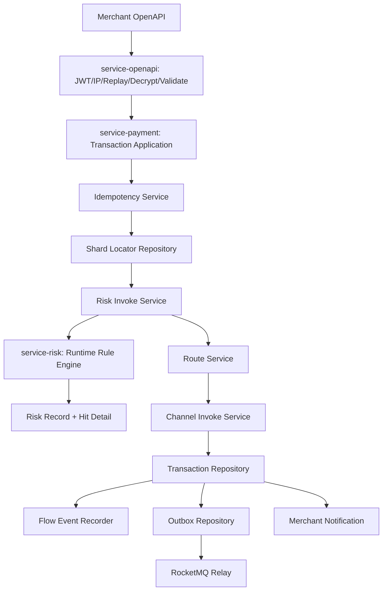
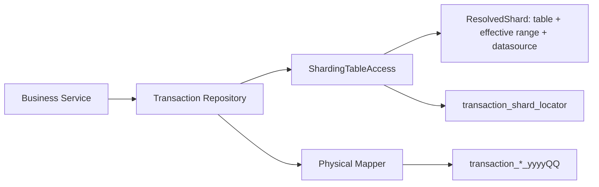
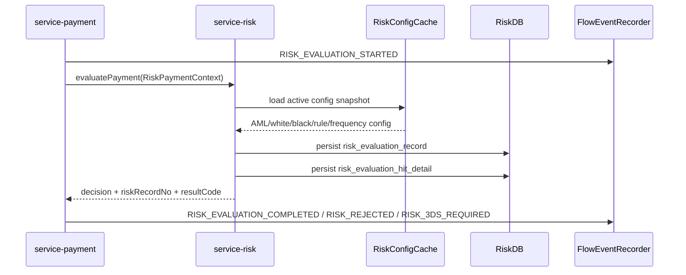
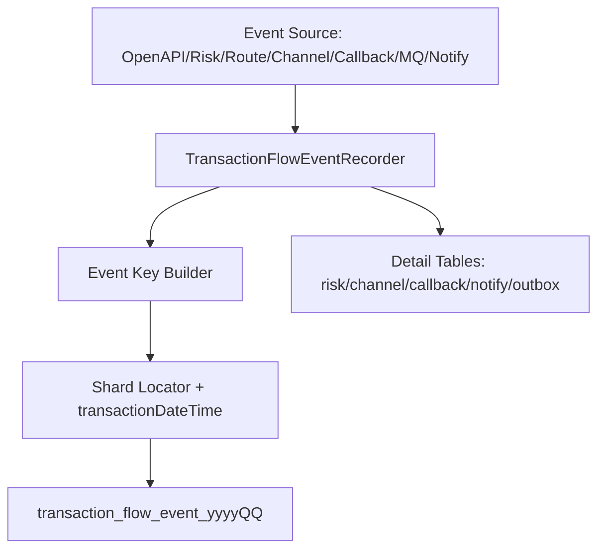

# ARCH-REVIEW-001 目标架构设计

> 已废止（2026-08-02）：本文的“保留自研分表”和 locator 方案未被采用，禁止据此恢复旧路由、双写或交易号解析。
> 当前目标固定为第一版 ShardingSphere-JDBC 单写，详情与支付热链路由调用方传递真实分片时间。

## 1. 目标原则

1. 短期保留当前自研季度分表，先收口访问边界和定位能力；不在本轮直接切换 ShardingSphere。
2. 所有交易事实、风险记录、流程事件必须共享同一套交易时间和定位坐标。
3. 管理端风控配置必须进入 `service-risk` 运行时决策，且每次决策可追溯规则版本、命中明细和耗时。
4. 流程事件只记录真实执行节点，不能在交易结束后用单个 `now` 批量补写。
5. 幂等表负责短期请求幂等，永久定位表负责长期交易定位，两者职责拆分。

## 2. 目标交易链路

目标顺序：

1. OpenAPI 安全链路：JWT、请求解密、商户 OpenAPI IP 白名单、防重放。
2. 请求字段标准化：付款人 IP、Origin、Referer、Source URL、卡摘要、邮箱、手机号、地址、设备等。
3. 交易幂等：短期请求幂等和重复请求返回原结果。
4. 分片定位：首次交易写 locator；后续交易先用 source transaction 查询 locator。
5. 风控：按交易场景执行 AML、白名单、黑名单、限额、频率、3DS 等。
6. 路由和渠道：只在风险允许继续时执行。
7. 持久化：主单、动作单、状态历史、风险记录引用、事件、Outbox 同步落库。
8. 异步：MQ 投递、回调、商户通知以专表保存明细，流程事件保存摘要节点。

## 3. 目标分表架构

### 3.1 Repository 和 Mapper 边界

| 边界 | 目标职责 | 禁止事项 |
|---|---|---|
| `TransactionRepository` | 业务服务唯一交易事实访问入口，接收交易时间或 locator key | 业务 Service 直接传物理表名给 Mapper |
| `ShardingTableAccess` | 返回单表、范围表、裁剪后 begin/end、表存在状态 | 只返回字符串表名 |
| `PhysicalMapper` | 只执行物理表 SQL，不暴露给普通业务服务 | 继承可直接调用的 `BaseMapper` 默认方法 |
| `ShardLocatorRepository` | 持久保存 transaction/operation/merchant/channel 到季度表的定位 | 承担请求幂等 |

### 3.2 永久分片定位

定位表核心字段：

| 字段 | 说明 |
|---|---|
| `transaction_id` | 平台当前交易号，唯一 |
| `operation_id` | 生命周期操作号，可索引 |
| `merchant_id`、`merchant_order_no`、`merchant_operation_no` | 商户维度定位 |
| `transaction_type` | 当前交易类型 |
| `source_transaction_id`、`source_operation_id` | 后续交易关联 |
| `transaction_date_time`、`operation_date_time` | 分表时间 |
| `order_table`、`operation_table`、`flow_event_table` | 可选冗余物理表名或季度 |
| `channel_order_no`、`channel_transaction_id` | 渠道回调和主动查询定位 |
| `status`、`created_at`、`updated_at` | 生命周期状态和审计 |

查询优先级：

1. 精确 transactionId 查 locator。
2. 精确 operationId 查 locator。
3. 渠道回调用 channelOrderNo/channelTransactionId 查 locator。
4. 商户订单按 merchantId + merchantOrderNo + transactionType 查 locator，必须有查询跨度。
5. 只有受控后台任务允许跨季度扫描物理表补建 locator。

## 4. 自研分表与 ShardingSphere 取舍

| 方案 | 优点 | 成本/风险 | 推荐 |
|---|---|---|---|
| 保留自研应用层分表 | 与当前代码最匹配；改造范围可控；能优先解决 BaseMapper、locator、查询裁剪 | 需要严格 Repository 边界和架构测试；复杂 SQL 仍需手工治理 | 短期推荐 |
| 切换 ShardingSphere | SQL 路由集中化；减少业务手工传表名 | 需要验证 MyBatis Plus、动态 SQL、跨表分页、现有物理表、配置中心、事务和性能；迁移风险高 | 中长期单独 PoC，不与本次修复混做 |

## 5. 目标风控架构

### 5.1 运行时规则顺序

| 顺序 | 规则 | 原则 |
|---:|---|---|
| 1 | OpenAPI 安全、商户 OpenAPI IP 白名单、防重放 | 不是风控白名单，不允许被交易白名单绕过 |
| 2 | 来源和请求字段可信度校验 | Origin/Referer/sourceUrl、payerIp、设备、卡摘要标准化 |
| 3 | AML 强制检查 | 合规强制拦截，不允许被白名单/VIP 绕过，除非有单独人工复核审批 |
| 4 | 商户/卡/邮箱/IP 白名单 | 只豁免明确声明的规则范围，不豁免 AML 和黑名单 |
| 5 | 黑名单 | 默认 REJECT；VIP 不得绕过黑名单，除非规则明确配置并审批 |
| 6 | 商户限额、交易频率、来源规则 | 可输出 REJECT/REVIEW/REQUIRE_3DS |
| 7 | 3DS 规则 | 可返回 REQUIRE_3DS，带规则 ID |
| 8 | 外部风险或渠道前置校验 | 可扩展，不能覆盖更高优先级拒绝 |

### 5.2 决策优先级

| 决策 | 优先级 | 交易处理建议 |
|---|---:|---|
| `ERROR` | 最高 | 按用户确认策略 fail-closed、fail-pending 或 REVIEW |
| `REJECT` | 高 | 不进渠道，记录失败/拒绝状态和风险记录 |
| `REVIEW` | 高 | 不自动进渠道，进入人工复核或处理中 |
| `REQUIRE_3DS` | 中 | 返回 3DS 要求或进入认证流程 |
| `PASS` | 低 | 继续路由和渠道 |
| `SKIP` | 最低 | 仅允许明确白名单或低风险场景，必须带 skipReason |

### 5.3 风控记录和命中明细

| 模型 | 目标 |
|---|---|
| `risk_evaluation_record` | 每次风控评估一行，保存 `riskRecordNo`、交易/操作/商户、场景、决策、耗时、配置版本、输入快照摘要 |
| `risk_evaluation_hit_detail` | 每条命中一行，保存 module/function/rule/list id、命中字段、脱敏值、HMAC 值、动作、优先级 |
| 配置快照 | 保存规则版本或 snapshot hash，历史审计不受后续配置变更影响 |
| Redis 频率 | `risk:freq:{merchant}:{dimension}:{window}`，使用 Lua 或原子计数，结果写 hit detail |

### 5.4 敏感字段标准化

| 字段类型 | 目标处理 |
|---|---|
| 卡号 | 内存内读取；生成 cardBin、last4、cardHmac、cardFingerprint；不落完整 PAN |
| 邮箱 | lower-case、trim、拆分 username/domain，保存 HMAC 和脱敏展示 |
| 手机号 | E.164 标准化，HMAC 匹配，脱敏展示 |
| IP | 标准化 IPv4/IPv6，范围转数值，必要时 HMAC 精确值 |
| 姓名/地址/企业 | Unicode 规范化、大小写/空格收敛，HMAC 匹配，密文仅授权回显 |
| 设备/Customer ID | HMAC 匹配，按商户范围隔离 |

## 6. 目标流程事件架构

### 6.1 事件分类

| 阶段 | 事件 |
|---|---|
| API/安全 | `API_REQUEST_RECEIVED`、`API_SECURITY_VERIFIED`、`API_IP_WHITELIST_PASSED`、`API_REQUEST_DECRYPTED`、`REQUEST_VALIDATED` |
| 幂等 | `IDEMPOTENCY_ACQUIRED`、`IDEMPOTENCY_HIT`、`TRANSACTION_INITIALIZED` |
| 风控 | `RISK_EVALUATION_STARTED`、`RISK_EVALUATION_COMPLETED`、`RISK_AML_HIT`、`RISK_BLACKLIST_HIT`、`RISK_RULE_HIT`、`RISK_REJECTED`、`RISK_3DS_REQUIRED`、`RISK_SKIPPED`、`RISK_FAILED` |
| 路由 | `ROUTE_STARTED`、`ROUTE_SELECTED`、`ROUTE_FAILED` |
| 渠道 | `CHANNEL_REQUEST_PREPARED`、`CHANNEL_REQUEST_SENT`、`CHANNEL_RESPONSE_RECEIVED`、`CHANNEL_REQUEST_TIMEOUT`、`CHANNEL_BUSINESS_REJECTED`、`CHANNEL_RESULT_MAPPED` |
| 状态/数据 | `TRANSACTION_STATUS_CHANGED`、`TRANSACTION_PERSISTED`、`AMOUNT_TOTAL_UPDATED` |
| 回调/查询 | `CHANNEL_CALLBACK_RECEIVED`、`CHANNEL_CALLBACK_VERIFIED`、`CHANNEL_CALLBACK_PARSED`、`CHANNEL_CALLBACK_APPLIED`、`CHANNEL_CALLBACK_IGNORED`、`CHANNEL_QUERY_STARTED`、`CHANNEL_QUERY_COMPLETED` |
| MQ/通知 | `MQ_EVENT_CREATED`、`MQ_EVENT_SENT`、`MQ_EVENT_FAILED`、`MERCHANT_NOTIFICATION_CREATED`、`MERCHANT_NOTIFICATION_SENT`、`MERCHANT_NOTIFICATION_FAILED` |

### 6.2 事件字段

| 字段 | 目标用途 |
|---|---|
| `event_key` | 业务幂等键，防重试重复写 |
| `event_sequence` | 同一 operation 内展示顺序 |
| `trace_id`、`request_id` | 跨服务链路查询 |
| `result_code`、`result_message` | 稳定结果码和业务说明 |
| `duration_millis` | 节点耗时 |
| `attempt_no` | 回调、MQ、通知重试次数 |
| `detail_json` | 小型摘要；大明细放专表 |
| `risk_record_no` | 风控记录关联 |

### 6.3 事务边界

| 事件类型 | 事务策略 |
|---|---|
| 交易状态和金额变更 | 与主业务事务同事务，保证状态历史和事件一致 |
| 外部调用开始/结束 | 可 `REQUIRES_NEW` 或 Outbox，避免主事务回滚丢失外部调用事实 |
| 风控命中明细 | service-risk 本地事务；payment 事件引用 `riskRecordNo` |
| 回调收到/验签失败 | 独立事务或回调安全表，交易不存在时也能留痕 |
| MQ/商户通知尝试 | 专表记录明细，流程事件使用 event key 去重保存摘要 |
| 非关键展示事件失败 | 不影响交易，但需告警和补偿 |
| 关键审计事件失败 | 阻断或进入待处理，取决于阶段和用户决策 |

## 7. 统一状态机设计

| 场景 | 目标状态 | 事件要求 |
|---|---|---|
| 风控拒绝 | `FAILED` 或专门 `REJECTED`，需用户确认字典 | `RISK_REJECTED` + `TRANSACTION_STATUS_CHANGED` |
| 人工复核 | `PROCESSING/REVIEW_PENDING`，需用户确认 | `RISK_REVIEW_REQUIRED` |
| 要求 3DS | `PROCESSING/WAITING_3DS` | `RISK_3DS_REQUIRED` |
| 渠道处理中 | `PROCESSING/CHANNEL_PROCESSING` | `CHANNEL_RESPONSE_RECEIVED` + 映射事件 |
| 回调终态 | 终态不可逆，重复回调 `IGNORED` | `CHANNEL_CALLBACK_APPLIED` 或 `CHANNEL_CALLBACK_IGNORED` |
| 通知失败重试 | 不改变交易终态 | `MERCHANT_NOTIFICATION_FAILED` 带 attemptNo |
