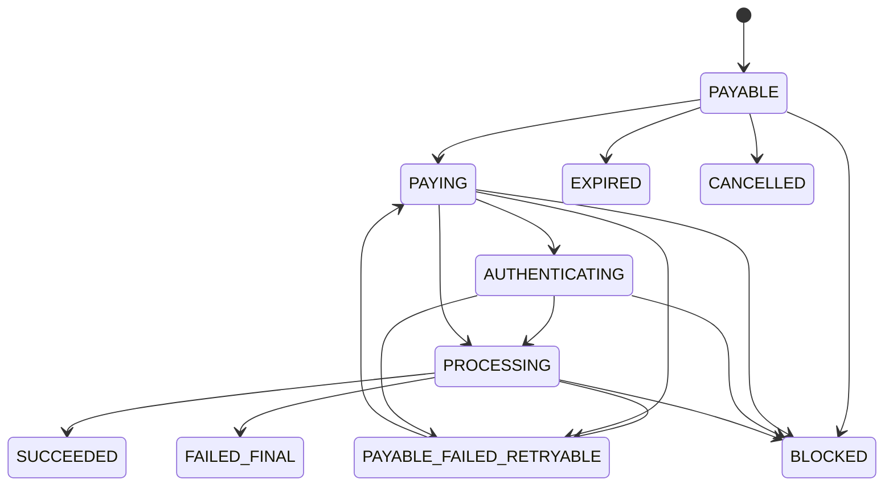

# Hosted Checkout V1 数据库与状态机设计草案

本文基于当前确认的 V1 范围：平台自建 `hosted-checkout` 收银台采集银行卡信息，通过 `service-gateway -> service-openapi -> service-payment` 完成 MPGS 卡支付和 3DS。V1 不使用 MPGS Hosted Checkout / Hosted Session，也不把 `service-checkout` 放入主支付链路。

dev/test 建表脚本见 `docs/sql/checkout-session-ddl-dev.sql`。本文和 DDL 均不能由自动化直接在生产执行。

## 1. 核心结论

1. 收银台交易流程由 `service-payment` 承载持久化和状态机，`service-openapi` 承载商户 OpenAPI 安全入口和浏览器 token API 编排。
2. `service-checkout` V1 不参与主链路，暂时保留作为后续独立收银台域服务或国家配置服务，不建议现在删除。
3. 收银台表只记录会话体验状态、URL 令牌、支付尝试、页面事件和安全事件，不复制交易金额累计、结算、对账、渠道日志等交易事实。
4. 支付提交成功进入交易核心后，使用 `checkout_session_id` 反向关联 `transaction_additional_info.checkout_session_id`，并在收银台表冗余 `operation_id`、`latest_transaction_id`、`transaction_date_time` 作为查询路由锚点。
5. opaqueToken 只在响应中出现，数据库只保存 HMAC-SHA256 摘要；URL 的 `{cover}` 只是视觉遮盖字段，不参与查询、验签或状态变更。

## 2. 服务边界

| 模块 | V1 职责 | 不承担 |
|---|---|---|
| `hosted-checkout` | 展示订单、收集付款人信息和卡信息、渲染 3DS challenge、轮询结果页 | 不决定金额、币种、支付方式、交易终态 |
| `service-gateway` | 统一入口、路由、限流、基础安全头、CORS 白名单 | 不承载交易状态机 |
| `service-openapi` | 商户创建收银台 OpenAPI、浏览器 token API、参数校验、安全审计、调用 `service-payment` | 不直接落交易核心事实，不保存卡敏感信息 |
| `service-payment` | 收银台会话、token、attempt、事件落库；交易创建；MPGS 请求；3DS 编排；状态 CAS 推进 | 不暴露公网接口，不保存 PAN/CVV 明文 |
| `channel-library` | MPGS 请求/响应映射、渠道状态归一、3DS 字段适配 | 不写平台状态机、不访问平台表 |

## 3. 表设计

| 表名 | 职责 | 是否建议分表 |
|---|---|---:|
| `payment_checkout_session` | 收银台会话主表，保存订单展示快照、状态、允许支付方式、商户返回地址和交易关联 | 否，P0 先单表；高量后按 `create_time` 月/季度分表评估 |
| `payment_checkout_token` | URL token 摘要、状态、过期、使用审计；支持重复创建请求重新签发 URL | 否 |
| `payment_checkout_attempt` | 每次付款人提交银行卡支付的一次尝试，记录 MPGS 和 3DS 编排摘要 | 否，P0 先单表；后续可按 `create_time` 分表 |
| `payment_checkout_event` | 会话打开、提交、3DS 回跳、轮询、结果渲染等业务事件 | 否，量大后优先归档或按月分表 |
| `payment_checkout_security_event` | 非法 token、过期、来源异常、CSRF、限流、安全拦截事件 | 否，量大后优先归档或按月分表 |

### 3.1 与交易核心表的关系

| 关系 | 说明 |
|---|---|
| `payment_checkout_session.checkout_session_id -> transaction_additional_info.checkout_session_id` | 支付提交后写入交易附属信息，支持从交易详情回看收银台来源 |
| `payment_checkout_session.latest_transaction_id -> transaction_operation.transaction_id` | 最近一次尝试对应的交易动作 |
| `payment_checkout_attempt.transaction_id -> transaction_operation.transaction_id` | 单次支付尝试对应的交易动作 |
| `payment_checkout_attempt.operation_id -> transaction_order.operation_id` | 原始交易生命周期聚合 |
| `payment_checkout_attempt.channel_request_id -> transaction_channel_request.request_id` | 最近一次渠道请求 |
| `payment_checkout_attempt.three_ds_transaction_id -> transaction_authentication_info.three_ds_transaction_id` | 3DS 认证详情 |

注意：`transaction_*` 多数是季度分表，收银台表保存 `transaction_date_time` 是为了路由查询，不作为跨分表全局索引替代品。

## 4. 字段新增处理原则

1. P0 不修改既有核心交易表结构。现有 `transaction_additional_info.checkout_session_id` 已满足 V1 关联。
2. 新增表名使用 `payment_checkout_` 前缀，避免和交易事实表 `transaction_` 混淆。
3. 新增 Java DO、Mapper、DTO 时必须逐字段对齐 DDL，不允许出现文档有字段但 DO/Mapper 缺字段的情况。
4. 枚举值必须集中定义，不允许在 Controller、Mapper XML 或前端散落字符串。
5. 所有资金状态更新 SQL 必须带当前状态条件和 `version` 条件，禁止无条件覆盖。
6. 上线前需要补充回滚脚本，回滚只允许 drop 新表或删除新索引，不允许改写交易事实数据。

## 5. 状态机设计

### 5.1 会话状态

| 状态 | 含义 | 是否终态 | 前端页面 |
|---|---|---:|---|
| `PAYABLE` | 已创建、未支付，可打开收银台 | 否 | 支付表单 |
| `PAYING` | 已提交卡信息，后端处理中 | 否 | 防重复提交或等待 |
| `AUTHENTICATING` | 需要或正在完成 3DS | 否 | 3DS 页面 |
| `PROCESSING` | 渠道结果处理中或等待回调/查单 | 否 | 处理中 |
| `PAYABLE_FAILED_RETRYABLE` | 上一次支付失败，但可重新支付 | 否 | 失败页带重新支付 |
| `SUCCEEDED` | 支付成功 | 是 | 成功页 |
| `FAILED_FINAL` | 支付失败且不可重试 | 是 | 失败页不允许重新支付 |
| `EXPIRED` | 会话过期 | 是 | 拦截或过期页 |
| `CANCELLED` | 付款人或商户取消 | 是 | 取消页 |
| `BLOCKED` | 安全策略拦截 | 是 | 异常请求拦截页 |

建议流转：



终态 `SUCCEEDED`、`FAILED_FINAL`、`EXPIRED`、`CANCELLED`、`BLOCKED` 不允许被普通页面轮询、重复回调或重复提交覆盖。若渠道后续出现与终态冲突的结果，只能记录异常事件并进入人工核查。

### 5.2 支付尝试状态

| 状态 | 含义 |
|---|---|
| `INIT` | 创建尝试记录 |
| `CARD_SUBMITTED` | 付款人已提交卡信息并通过基础校验 |
| `THREE_DS_INITIATED` | 已向 MPGS 发起 3DS 初始化 |
| `THREE_DS_REQUIRED` | MPGS 要求付款人完成 challenge |
| `THREE_DS_RETURNED` | 浏览器已从 3DS 返回 |
| `THREE_DS_PASSED` | 3DS 认证通过或 frictionless 完成 |
| `THREE_DS_FAILED` | 3DS 认证失败、取消或不可用且策略拒绝 |
| `CHANNEL_SUBMITTED` | 已向 MPGS 提交支付/授权 |
| `SUCCEEDED` | 本次尝试成功 |
| `FAILED` | 本次尝试失败 |
| `PROCESSING` | 本次尝试结果处理中 |
| `ABANDONED` | 新尝试创建后，旧未完成尝试被废弃 |

建议规则：

1. 同一会话最多允许一个未终态 attempt；重新支付前应将旧 attempt 推进为 `FAILED`、`PROCESSING` 或 `ABANDONED`。
2. `attempt_no` 从 1 递增，唯一键 `checkout_session_id + attempt_no` 防止并发创建重复序号。
3. 前端每次提交必须传 `attemptRequestId`，唯一键 `checkout_session_id + attempt_request_id` 兜底浏览器重复点击和网络重试。
4. attempt 成功后用 CAS 推进 session 到 `SUCCEEDED`，并写 `success_attempt_id`。

## 6. 幂等与并发

| 场景 | 幂等维度 | 数据库约束 |
|---|---|---|
| 商户创建收银台 | `merchant_id + merchant_request_id` | `payment_checkout_session.uk_merchant_request` |
| URL token 查询 | `token_hash` | `payment_checkout_token.uk_token_hash` |
| 支付提交 | `checkout_session_id + attempt_request_id` | `payment_checkout_attempt.uk_session_attempt_request` |
| 会话尝试序号 | `checkout_session_id + attempt_no` | `payment_checkout_attempt.uk_session_attempt_no` |
| 3DS 回跳 | `three_ds_return_token_hash` | `payment_checkout_attempt.uk_three_ds_return_token_hash` |
| 页面/安全事件 | 独立事件 ID | `payment_checkout_event.uk_checkout_event_id`、`payment_checkout_security_event.uk_security_event_id` |

状态更新必须使用 CAS：

```sql
UPDATE payment_checkout_session
SET checkout_status = ?,
    process_stage = ?,
    last_status_time = ?,
    version = version + 1
WHERE checkout_session_id = ?
  AND checkout_status IN (...)
  AND version = ?;
```

支付成功推进必须同时满足：

```sql
WHERE checkout_session_id = ?
  AND checkout_status IN ('PAYING', 'AUTHENTICATING', 'PROCESSING')
  AND success_attempt_id IS NULL
  AND version = ?;
```

## 7. Token 与 URL

URL 格式：

```text
https://domain.com/checkout/{opaqueToken}/{cover}
```

规则：

1. `{opaqueToken}` 必须是高熵随机值，建议至少 128 bit 熵，前端不可解析。
2. `{cover}` 是随机遮盖字符串，只用于隐藏真实 token 位置感，不参与查询、验签或幂等。
3. 数据库保存 `HMAC_SHA256(opaqueToken, platformPepper)` 的十六进制摘要，不保存 token 明文。
4. token 过期时间不得晚于 session 过期时间。
5. 商户重复创建命中幂等时，不返回旧 token 明文，而是签发新 token 并组装新的 `checkoutUrl`。
6. token 被过期、吊销或命中风控后，只展示异常请求拦截页，不返回订单细节。

## 8. 3DS 与 MPGS 编排

V1 以 MPGS 卡支付为例。根据 Mastercard 官方 MPGS 文档，Direct Payment/Payer Authentication 模式需要先执行 `Initiate Authentication`，当响应表示可认证时再执行 `Authenticate Payer`；挑战流会返回需要在页面中呈现的 HTML，并通过请求中指定的 `authentication.redirectResponseUrl` 回到收银台。

平台内部建议映射：

1. 前端提交卡信息和浏览器信息到 `service-openapi`。
2. `service-payment` 创建 checkout attempt，卡敏感信息只在内存中透传至渠道请求。
3. `channel-library` 构造 MPGS `Initiate Authentication` 请求。
4. 如果可 frictionless，继续 `Authenticate Payer` 并保存认证摘要到 attempt 和 `transaction_authentication_info`。
5. 如果需要 challenge，attempt 状态为 `THREE_DS_REQUIRED`，前端只渲染后端返回的 `threeDsAction`，不自行拼 MPGS 字段。
6. 浏览器从 `authentication.redirectResponseUrl` 回到 `/checkout/api/v1/3ds/return` 后，后端校验一次性 return token，再继续完成支付提交或查询认证结果。
7. 拿到渠道支付结果后，以交易核心状态为准渲染成功、失败或处理中页。

## 9. 数据安全

1. `hosted-checkout` 不得持久化 PAN、CVV、PIN、3DS CAVV、JWT 或渠道认证原文。
2. 后端日志、事件 JSON、result snapshot 只保存脱敏摘要。
3. `card_bin`、`card_last4`、`card_number_masked` 可以保存；`payment_account_hash` 必须不可反推。
4. 浏览器 token API 不使用商户 JWT，使用 opaqueToken + CSRF/Origin/RateLimit/设备摘要校验。
5. 商户 OpenAPI 仍必须走 `@VerificationAndProcessing`、JWT、防重放、请求体解密和响应 `data` 加密。
6. 内部 `/internal/**` 接口只能被服务间调用，不允许公网直接访问。

## 10. 数据库上线流程

| 阶段 | 动作 | 验收点 |
|---|---|---|
| 设计评审 | 评审 DDL、索引、唯一键、状态枚举、字段敏感性 | 无 PAN/CVV/JWT 明文列；幂等唯一键完整 |
| dev 建表 | 手工在 dev 执行评审后的 DDL | 表、索引、字符集、注释符合草案 |
| DO/Mapper 对齐 | 新增 DO、Mapper、XML 或注解 SQL | 字段名、类型、nullable、索引查询路径一致 |
| 单元测试 | token hash、幂等、状态 CAS、字段脱敏 | 重复请求、重复提交、终态保护通过 |
| 集成测试 | OpenAPI 创建 URL、前端查询、支付提交、3DS 回跳、结果轮询 | 主链路可闭环 |
| UAT 灰度 | 小商户/测试 MID 灰度 | 渠道响应、3DS challenge、处理中补偿正常 |
| 生产发布 | 先建表，再发布后端，再发布前端 | 可回滚到不生成 checkout URL |

## 11. 验收清单

P0 验收：

1. 商户创建收银台接口重复请求不会创建重复 session。
2. 重复创建命中幂等时不会泄露旧 token 明文，可重新签发新 URL。
3. 打开非法、过期、吊销 token 时不返回订单金额、商户信息或支付方式。
4. 未支付订单渲染收银台时，金额、币种、订单号、商户名、允许支付方式全部来自后端。
5. 支付成功后 session 和交易核心终态一致，重复轮询不覆盖终态。
6. 支付失败可重试时创建新 attempt，不复用旧 attempt 的渠道流水。
7. 支付处理中时前端轮询后端状态，不自行推导成功或失败。
8. 3DS challenge 和 return token 只允许当前 session/attempt 使用一次。
9. 数据库、日志、事件、快照中没有 PAN、CVV、JWT、私钥、完整 opaqueToken、CAVV 明文。
10. 所有状态推进 SQL 具备当前状态条件和 `version` 条件。

P1 验收：

1. 支付结果页返回商户 URL 必须命中白名单。
2. 同一 session 的最大尝试次数生效。
3. `next_channel_match_time` 可被补偿任务查询处理中会话。
4. 后台可通过 `checkout_session_id` 从交易详情回看收银台来源。
5. 安全事件表能记录 token 异常、来源异常、限流、CSRF 失败。

## 12. 后续落地任务拆分

| 优先级 | 任务 | 主要文件范围 |
|---|---|---|
| P0 | 新增收银台表 DO、Mapper、枚举、DDL dev 脚本 | `service-payment`、`docs/sql` |
| P0 | 新增内部 checkout session 创建、查询、提交、3DS return 接口 | `service-payment` |
| P0 | 新增商户 OpenAPI 创建收银台接口 | `service-openapi` |
| P0 | 新增浏览器 token API 转发和安全控制 | `service-openapi`、`service-gateway` |
| P0 | `hosted-checkout` 接入真实 session 查询、支付提交、状态轮询、3DS 渲染 | `acquiring-frontend/apps/hosted-checkout` |
| P1 | MPGS 3DS 完整渠道适配和 emulator 测试用例 | `channel-library`、`service-payment` |
| P1 | 后台交易详情补充收银台来源展示 | `service-payment`、管理前端 |
| P2 | `service-checkout` 是否转为独立收银台域服务的二阶段评估 | 架构文档、服务边界 |
