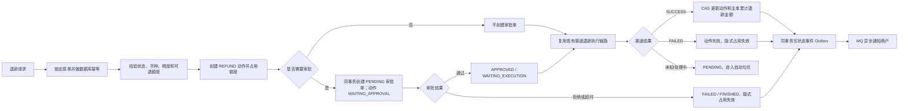
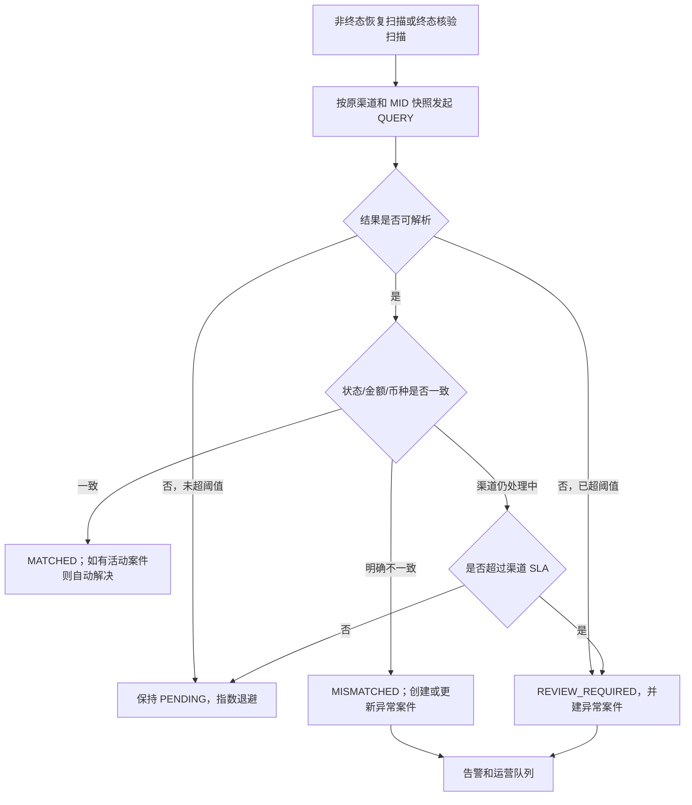

# 退款管理与勾兑异常交易设计方案

## 2026-08-06 方案设计

> 决策更新：勾兑异常交易只在管理系统开放，商户系统不提供菜单、页面、接口、权限或导出能力。
>
> 决策更新：退款审批使用独立普通单表 `transaction_refund_approval`，不把审批字段继续堆叠到 `transaction_operation`，也不加入固定 23 张季度分片 Binding 表集合。

## 1. 文档结论

本方案建议在管理系统和商户系统的“交易管理”目录下新增“退款管理”；“勾兑异常交易”只在管理系统新增，不向商户系统开放。两个功能都不能实现成现有交易查询页的简单筛选副本。

- “退款管理”以 `transaction_operation` 中的 `REFUND`、`VOID` 动作为交易事实，补充退款来源和申请人快照；需要人工审批的 `REFUND` 另写普通单表 `transaction_refund_approval`，审批轨迹复用 `transaction_flow_event`，不新增第 24 张季度分片交易逻辑表。
- “勾兑异常交易”激活已经纳入 23 张季度分片表的 `transaction_abnormal_event`，将其作为异常案件台账；自动勾兑快照仍保存在交易动作单中。
- 管理端可查询退款、审批、重新勾兑和受控处置；商户端只开放本商户退款查询和退款发起，不提供勾兑异常菜单、页面或接口。
- 第一阶段不启用退款审批和人工修改交易终态，只先补齐数据模型、查询页面和自动异常建案。退款审批满足本文门禁后可单独灰度；人工终态修正还缺少独立双人复核动作单，不属于当前方案可直接实施的能力。
- 商户回调继续复用现有“交易状态变更 Outbox -> MQ -> Data 通知任务”链路。回调 Header、加密 Body 结构和业务字段不因本功能发生变化。

## 2. 范围与业务口径

### 2.1 本期范围

| 范围 | 管理系统 | 商户系统 |
|---|---|---|
| 退款/撤销查询 | 全平台、按权限数据范围 | 当前登录商户 |
| 人工发起退款 | 复用现有交易查询入口 | 复用现有交易查询入口，也可从退款管理跳转 |
| 退款审批 | 仅 `REFUND` 支持，默认开关关闭 | 不执行审批，只能查看本商户统一处理状态 |
| 退款导出 | 支持 | 支持本商户数据 |
| 勾兑异常查询 | 全平台 | 不开放 |
| 重新勾兑 | 支持单笔和批量 | 不开放 |
| 交易状态修正 | 本期不开放；需另立双人复核方案 | 不开放 |
| 异常关闭/忽略 | 支持 | 不开放 |

### 2.2 退款管理口径

菜单名称保持“退款管理”，数据范围包括：

- `REFUND`：全额退款和部分退款；
- `VOID`：授权撤销、预授权撤销；
- 来源包括 `OPENAPI`、`ADMIN_PORTAL`、`MERCHANT_PORTAL`、`SYSTEM`；
- 成功、失败、处理中、待审批、已拒绝等记录都必须保留，不能只查询成功退款。

`REFUND` 和 `VOID` 在列表上统一管理，但详情、可执行动作和金额规则分别判断。`VOID` 不是部分退款，不允许输入任意撤销金额。

### 2.3 勾兑异常口径

本菜单中的“勾兑”专指平台交易状态与渠道主动查询/渠道回调结果的实时一致性确认，对应现有 `channel_match_status`。它不等同于清分结算中的文件对账，后者仍使用 `reconciliation_status`，未来应单独建设“对账差错”功能。

符合以下任一条件才进入异常案件：

- 平台终态和渠道终态明确冲突；
- 平台金额/币种和渠道可确认金额/币种不一致；
- 渠道明确返回交易不存在，且已经满足确认次数和时间阈值；
- 缺少渠道查询身份，自动重试超过阈值；
- 渠道长期 `PENDING/PROCESSING`，超过渠道 SLA；
- 渠道回调与主动查询给出互相冲突的终态；
- 查询持续超时、解析失败或状态不可映射，超过自动恢复阈值。

一次网络超时、一次解析异常、渠道暂时处理中，只保持 `PENDING` 并自动重试，不立即认定为资金异常。

## 3. 当前系统基线与缺口

| 当前能力 | 代码/数据事实 | 结论 |
|---|---|---|
| 交易动作单 | `transaction_operation` 已保存 `REFUND`、`VOID`、金额、渠道、ARN、勾兑快照和分片时间 | 继续作为退款/撤销真实交易单 |
| 退款执行 | 已有 OpenAPI、Admin、Merchant 退款入口；原单锁定、数据库幂等、非终态退款汇总、成功金额 CAS 已实现 | 不重写核心金额逻辑，只拆分“申请/审批/执行”阶段 |
| 退款来源 | Admin 使用 `ADMRF`、Merchant 使用 `MCHRF` 前缀，但没有正式来源字段 | 前缀只能辅助排查，不能继续作为业务判断条件 |
| 审批 | 无申请人、审批人、审批状态、审批说明和执行模式 | 新增普通单表 `transaction_refund_approval`；交易状态仍只表达交易结果 |
| 自动勾兑 | `ChannelTransactionMatchJob` 调用渠道查询，当前主要在 `PENDING/MATCHED` 间推进 | 需要补 `MISMATCHED/REVIEW_REQUIRED` 语义和异常建案 |
| 异常表 | `transaction_abnormal_event` 已是第 23 张正式分片表，但没有生产 Java CRUD | 优先激活，避免增加第 24 张逻辑表和整套分片配置变更 |
| 事件审计 | `transaction_flow_event`、`transaction_status_history`、`sys_oper_log` 已存在 | 审批和人工处置必须同时写业务轨迹与后台操作日志 |
| 商户通知 | 交易状态变更通过事务 Outbox、MQ 和 Data 服务投递 | 状态修正后继续复用，不新增另一套回调协议 |
| 前端 | Admin/Merchant 均有动态菜单、权限、交易查询、详情、导出、`StandardTable` 和时区组件 | 新页面沿用现有交互与组件，不做独立视觉体系 |

当前统一渠道响应 `ChannelPaymentResponse` 没有标准金额和币种字段，因此现阶段只能可靠比较状态，不能可靠识别金额差异。要支持 `AMOUNT_MISMATCH`，渠道统一响应和各渠道 `QUERY/RETRIEVE` 适配必须补充 `channelAmount`、`channelCurrency`，不能从 `rawResponse` 猜字段。

## 4. 原型取舍

### 4.1 退款管理原型

| 原型能力 | 处理结论 | 当前系统落地方式 |
|---|---|---|
| 渠道、用户/商户、商户订单号、交易 ID、渠道流水号、ARN | 采纳 | Admin 全部支持；Merchant 去掉商户和渠道筛选 |
| 店铺筛选 | 暂不采纳 | 当前交易主单和动作单没有 `store_id`，不能伪造筛选；以后交易主流程正式引入店铺快照后再增加 |
| 退款状态 | 调整 | 页面同时展示派生的 `approvalStatus` 和 `transactionStatus`，避免“待审批”和“渠道处理中”混为一个状态；`VOID` 显示“不适用” |
| 支付类型、支付方式、退款时间 | 采纳 | 类型固定为 `REFUND/VOID`；支付方式关联原交易支付工具快照；申请时间作为分片查询范围 |
| 标签金额/交易金额 | 采纳 | 同时展示金额和币种；汇总必须按币种分组 |
| 详情、审批、导出 | 采纳 | 审批仅 Admin；Merchant 详情不展示内部渠道错误、审批人真实姓名等内部信息 |
| 允许退款并向渠道发起 | 采纳 | 审批成功后写执行 Outbox，由幂等执行器按原交易渠道/MID 快照发起渠道退款 |
| 拒绝退款 | 采纳 | 审批置为 `REJECTED`，退款动作置为失败终态；隐式占用随非终态动作终结而释放，不回加主单金额 |
| 仅标记退款成功 | 不作为普通能力上线 | 只能作为受控人工确认能力，要求独立权限、双人复核、渠道证据、CAS、资金汇总更新和完整审计 |

### 4.2 勾兑异常原型

| 原型能力 | 处理结论 | 当前系统落地方式 |
|---|---|---|
| 默认勾兑失败 | 调整 | 默认查询案件状态 `OPEN/PROCESSING`，异常类型不限；短暂查询失败不等于已确认不一致 |
| 系统状态、渠道状态、金额差异 | 采纳 | 保存“发现时快照”，详情同时展示当前状态，避免历史证据被后续状态覆盖 |
| 同步渠道状态并回调商户 | 条件采纳 | 本期仅允许非终态按正常状态机推进；终态修正待独立双人复核方案完成后再评审 |
| 仅同步渠道状态 | 本期不采纳 | 交易终态变化却不通知商户会制造平台与商户认知不一致；后续只有明确合规场景和独立受控动作单时再评审 |
| 仅标记勾兑成功 | 不采纳原语义 | 改为“确认无需修改并关闭案件”，不修改交易事实，不伪造 `MATCHED` |
| 批量处理 | 限制范围 | 只允许批量重新勾兑、批量分派；不允许批量修改资金交易终态 |
| 商户端处理 | 不采纳 | 商户系统完全不开放勾兑异常功能 |

## 5. 菜单、路由和权限设计

### 5.1 管理系统

| 菜单 | 路由 | 组件 | 排序建议 |
|---|---|---|---|
| 退款管理 | `/transaction/refund` | `transaction/refund` | 交易查询之后 |
| 勾兑异常交易 | `/transaction/channel-match-abnormal` | `transaction/channel-match-abnormal` | 渠道回调记录之前 |

建议权限：

| 权限码 | 用途 | 默认角色 |
|---|---|---|
| `transaction:refund:list` | 退款列表和统计 | `ADMIN_OPERATOR`、`ADMIN` |
| `transaction:refund:detail` | 退款详情 | `ADMIN_OPERATOR`、`ADMIN` |
| `transaction:refund:export` | 导出 | 按现有导出角色授权 |
| `transaction:refund:approve` | 通过退款审批 | 专门退款审批角色、`ADMIN` |
| `transaction:refund:reject` | 拒绝退款审批 | 专门退款审批角色、`ADMIN` |
| `transaction:refund:manual-confirm` | 人工确认退款成功 | 当前不创建；待独立双人复核方案完成后再评审 |
| `transaction:match-abnormal:list` | 异常列表和统计 | 交易运营、`ADMIN` |
| `transaction:match-abnormal:detail` | 异常详情 | 交易运营、`ADMIN` |
| `transaction:match-abnormal:export` | 异常导出 | 按需授权 |
| `transaction:match-abnormal:requery` | 单笔/批量重新勾兑 | 交易运营、`ADMIN` |
| `transaction:match-abnormal:assign` | 领取/分派案件 | 交易运营主管、`ADMIN` |
| `transaction:match-abnormal:resolve` | 关闭或忽略案件 | 交易运营主管、`ADMIN` |
| `transaction:match-abnormal:repair` | 修改交易状态 | 当前不创建；待独立双人复核方案完成后再评审 |
| `transaction:match-abnormal:repair-without-notify` | 修正但不通知商户 | 不纳入当前方案，不能仅靠功能开关隐藏风险 |

审批人、人工状态修正人不能与申请人为同一账号。自审校验按 `applicant_type + applicant_id` 比较稳定主体，仅当申请主体属于 Admin 身份域时才和审批账号比较，不能比较显示名，也不能因为 API 客户端 ID 与 Admin ID 文本相同而误判。权限校验必须在后端完成，前端隐藏按钮只用于体验，不能作为安全边界。

### 5.2 商户系统

| 菜单 | 路由 | 组件 | 权限码 |
|---|---|---|---|
| 退款管理 | `/transaction/refund` | `transaction/refund` | `merchant:transaction:refund:list` |

按钮权限：

- `merchant:transaction:refund:detail`
- `merchant:transaction:refund:export`
- `merchant:transaction:refund:create`，可继续映射现有退款接口权限；

所有 Merchant 退款查询必须由认证上下文强制写入 `merchantId`，忽略请求体中的商户号。详情查询不到或不属于当前商户时统一返回不存在，避免泄露其他商户交易是否存在。商户菜单授权脚本不得写入任何勾兑异常菜单或权限。

## 6. 退款管理页面设计

### 6.1 管理端查询条件

| 条件 | 是否默认显示 | 说明 |
|---|---|---|
| 商户 | 是 | 复用 `MerchantRemoteSelect`，支持商户号/名称检索 |
| 退款交易 ID | 是 | 当前 `REFUND/VOID` 动作的 `transaction_id`，精确查询 |
| 原交易 ID | 是 | `source_transaction_id`，精确查询 |
| 商户订单号 | 是 | 原生命周期 `merchant_order_no` |
| 商户退款请求号 | 是 | `merchant_operation_no`，不能再依赖前缀识别来源 |
| 退款/撤销类型 | 是 | `REFUND`、`VOID`，默认全部 |
| 退款范围 | 高级 | `FULL/PARTIAL/VOID`，按申请受理时快照查询 |
| 审批状态 | 是 | `NOT_APPLICABLE/NOT_REQUIRED/PENDING/APPROVED/REJECTED/EXPIRED`；前两项为查询层派生值 |
| 交易状态 | 是 | 复用 `SUCCESS/FAILED/PENDING/PROCESSING` |
| 申请来源 | 是 | `OPENAPI/ADMIN_PORTAL/MERCHANT_PORTAL/SYSTEM/LEGACY_UNKNOWN` |
| 渠道 | 是 | 渠道编码/名称；Merchant 不展示该条件 |
| 渠道订单号 | 高级 | 精确查询 |
| ARN | 高级 | `acquirer_reference_no` |
| 支付方式/品牌 | 高级 | 关联 `transaction_payment_method_info` |
| 标签币种/交易币种 | 高级 | ISO 4217，下拉来自现有字典 |
| 交易金额区间 | 高级 | `BigDecimal` 主币种金额，同一查询只能指定一个交易币种 |
| 申请人 | 高级 | Admin 账号、Merchant 账号或 API 客户端标识 |
| 申请时间 | 固定底部 | 默认今日，支持今日/本周/本月/自定义和时区；用于 `transaction_date_time` 分片路由 |
| 完成时间 | 高级 | 可选二次过滤，但申请时间范围仍必须存在 |

后端时间查询统一转为左闭右开区间 `[beginTime, endTimeExclusive)`。前端展示复用 `BaseDateTime`，数据库保持 `DATETIME(3)`，页面不展示毫秒。

默认“全部退款”视图仍可使用今日申请时间，但必须增加“待审批”工作队列。进入待审批队列时以普通表 `transaction_refund_approval` 的 `PENDING` 状态驱动分页，不强制今日范围，默认按申请时间升序展示最老任务，避免跨日待审批退款被默认筛选隐藏。队列再按审批表保存的真实分片时间批量读取退款动作，不接受前端补造路由时间。

### 6.2 管理端统计区

统计必须基于完整查询条件而不是当前页，至少展示：

- 总笔数；
- 待审批笔数；
- 处理中笔数；
- 成功笔数；
- 失败/拒绝笔数；
- 成功退款金额，按交易币种分组；
- 待处理占用金额，按交易币种分组。

不同币种不得相加。币种种类过多时显示前 N 项，并提供展开查看，不显示伪造的“总金额”。

### 6.3 管理端列表字段

固定列：

| 列 | 说明 |
|---|---|
| 退款交易 ID | 固定左侧、可复制 |
| 商户 | 商户号和名称；可进入商户详情 |
| 原交易 ID | 可复制，可进入原交易详情 |
| 商户订单号 | 原交易商户订单号 |
| 类型 | 部分退款、全额退款、撤销；其中部分/全额使用申请受理时保存的 `refund_scope` 快照 |
| 来源 | OpenAPI、管理端、商户端、系统、历史未知 |
| 标签金额 | 标签币种和金额 |
| 交易金额 | 交易币种和金额，资金校验主口径 |
| 审批状态 | 独立标签 |
| 交易状态 | 独立标签 |
| 渠道 | 渠道编码 |
| 申请时间 | `transaction_date_time` |
| 完成时间 | 终态时间 |
| 操作 | 详情、审批/拒绝；固定右侧 |

可编辑列：商户退款请求号、支付方式/品牌、渠道订单号、ARN、申请人、审批人、退款原因、失败原因、商户通知状态。表格使用 `StandardTable`，`table-key` 建议为 `transaction-refund`。

### 6.4 管理端操作规则

| 操作 | 可用条件 | 行为 |
|---|---|---|
| 详情 | 有详情权限 | 打开详情抽屉，不改变状态 |
| 审批通过 | `approvalStatus=PENDING` 且非本人申请 | CAS 更新审批状态，写流程事件和执行 Outbox |
| 审批拒绝 | `approvalStatus=PENDING` 且非本人申请 | 必填原因；退款动作进入失败终态，隐式占用不再参与求和，不回加主单金额 |
| 恢复执行 | 已审批但仍在 `WAITING_EXECUTION/CHANNEL_REQUESTING`，且执行租约已超时 | 先检查渠道请求事实和渠道结果；只有确认请求未发出或渠道支持稳定幂等键时才允许重投，未知结果转主动查询 |
| 人工确认成功 | 当前不开放 | 需要独立双人复核动作单和交易类型修正矩阵，不能由退款审批表代替 |
| 导出 | 有导出权限 | 按查询条件分页流式导出，并受现有并发预算限制 |

未来独立方案中的“人工确认成功”至少要求渠道、渠道订单号、渠道交易 ID 或 ARN、渠道成功时间、证据说明、影响金额、是否通知商户。执行前展示原状态、目标状态和资金汇总变化，二次确认不能只写“确定”；当前页面不渲染该弹窗或按钮。

### 6.5 退款详情

详情抽屉分为以下区块：

1. 退款摘要：退款交易 ID、类型、来源、两个状态、申请/完成时间；
2. 原交易：原交易 ID、商户订单号、支付方式、原交易金额、累计成功退款、处理中占用、当前可退款金额；
3. 退款金额：标签、交易、渠道请求、批准和结算金额/币种，显示币种精度和汇率；
4. 申请信息：申请人类型、申请人、请求号和原因；
5. 审批信息：审批人、审批时间、意见、执行模式；
6. 渠道信息：Admin 可见渠道编码、订单号、交易 ID、响应码、ARN 和脱敏响应摘要；
7. 商户通知：通知状态、尝试次数、最后时间，可跳转现有回调记录页；
8. 时间线：申请、额度占用、审批、渠道调用、回调/勾兑、资金汇总变化和通知结果。

### 6.6 商户端差异

商户端查询去掉商户、渠道、申请人筛选，默认当前商户和今日。列表保留退款交易 ID、原交易 ID、商户订单号、类型、来源、两类金额、审批状态、交易状态、申请时间、完成时间和操作。

商户端详情不展示：

- 渠道 MID、渠道终端号；
- 渠道原始错误和内部堆栈；
- 内部风控信息；
- Admin 操作人真实信息；
- 审批策略内部表达式；
- `raw_reference_json` 和内部审计内容。

商户端可展示统一商户可见原因，例如“退款申请待平台处理”“渠道结果确认中”“退款已拒绝，请联系平台”，不得透传渠道风控或收单规则。

“发起退款”继续调用现有商户退款接口。退款管理页可以通过按钮跳转到交易查询并带入原交易 ID，不需要再创建第二套退款执行 API。

## 7. 退款状态机与金额控制

### 7.1 状态维度

审批表状态 `approval_status`：

| 状态 | 含义 |
|---|---|
| `PENDING` | 已受理并占用额度，等待审批 |
| `APPROVED` | 已批准，可进入渠道执行 |
| `REJECTED` | 人工拒绝，终止执行 |
| `EXPIRED` | 超过审批有效期，终止执行 |

只有命中人工审批策略的 `REFUND` 才创建审批表记录。查询层将没有审批记录的 `REFUND` 映射为 `NOT_REQUIRED`，将 `VOID` 映射为 `NOT_APPLICABLE`；这两个值不写入审批表。交易状态继续使用现有 `transaction_status`，不新增 `APPROVING` 之类混合状态。等待审批时为 `PENDING`，并使用 `process_stage=WAITING_APPROVAL`。

等待审批期间尚未发生渠道请求，`channel_match_status` 必须为 `NOT_REQUIRED`、`next_channel_match_time` 必须为空，避免现有自动勾兑 Job 提前扫描。只有审批通过且渠道请求已经发生并返回未知/处理中结果后，才将勾兑状态设为 `PENDING`。审批拒绝或过期后保持 `NOT_REQUIRED`。

新增内部阶段：

- `WAITING_APPROVAL`
- `WAITING_EXECUTION`
- `CHANNEL_REQUESTING`
- `CHANNEL_PROCESSING`
- `FINISHED`

`refund_scope` 在申请受理时确定：`VOID` 动作为 `VOID`；只有本次退款金额等于原交易可退款本金，且不存在任何历史成功或未终态退款时，才记为 `FULL`；其他退款均记为 `PARTIAL`。如果本次金额只是用完当前剩余可退额度，应另派生 `isFinalRefund=true`，不能误标为全额退款。后续退款不得回写历史范围。

### 7.2 正常流程



### 7.3 可退额度公式

以交易币种为唯一资金校验口径：

```text
本次可发起退款金额
= transaction_order.available_refund_amount
- 同一 operation_id 下所有未终止退款动作的 transaction_amount
```

未终止退款只以 `transaction_operation.transaction_status in (PENDING, PROCESSING)` 判断，包括待审批、已批准待执行、渠道请求中和渠道结果待确认。审批表不是金额事实源，额度计算不得依赖跨表审批状态。`REJECTED` 或 `EXPIRED` 必须在同一事务把退款动作推进到 `FAILED`，动作终结后自然不再参与求和；由于申请时没有扣减 `available_refund_amount`，拒绝、过期和渠道失败都不得执行金额加回。成功金额已经体现在 `available_refund_amount` 中，也不得再次作为占用重复扣减。

原单必须在同一事务中 `FOR UPDATE`，并继续保留数据库唯一幂等约束。不能使用 Redis 作为退款额度最终事实。币种精度来自 ISO 字典，不允许默认两位小数或使用 `double/float`。

### 7.4 审批与执行幂等

- 申请幂等：沿用 `merchantId + sourceTransactionId + REFUND + merchantOperationNo` 唯一约束；
- 审批幂等：审批表使用 `approval_id`、`refund_transaction_id` 双唯一约束，决策请求使用 `decision_request_id` 唯一约束；`WHERE approval_status='PENDING' AND version=?` 只允许一个决策获胜，同方向重试返回既有结果，反方向重试返回冲突；
- 审批事务：通过时同时更新审批表、退款动作 `WAITING_APPROVAL -> WAITING_EXECUTION`、流程事件和稳定 `event_id` 的执行 Outbox；拒绝/过期时同时更新审批表、退款动作 `-> FAILED`、流程事件和终态通知 Outbox；
- 执行幂等：消费者使用 `WHERE process_stage='WAITING_EXECUTION' AND version=?` 抢占，渠道请求使用退款交易 ID 派生稳定请求号；已有请求事实但结果未知时只做渠道查询，不盲目再次退款；
- 渠道固定：审批等待期间不得重新路由，执行必须使用申请受理时保存的原渠道和 MID 快照；如果该 MID 已停用或凭证无法恢复，动作保持非终态并建案/告警，不得切换另一渠道重复退款；
- MQ 消费幂等：消息 ID/消费者组记录加动作状态 CAS，不能假设 RocketMQ exactly-once；
- 终态保护：`SUCCESS/FAILED` 不允许被普通审批、重复 MQ、重复回调或重复勾兑覆盖；
- 审批通过和执行 Outbox 必须同一本地事务提交，禁止先发 MQ 后提交事务。若渠道明确支持幂等键，重试必须复用同一键；不支持时，只有能证明请求从未发出的 `WAITING_EXECUTION` 才能重发。

### 7.5 审批策略

第一阶段策略固定为 `NONE`，所有新退款都不创建审批单，查询层派生 `approvalStatus=NOT_REQUIRED`，因此现有 OpenAPI、Admin 和 Merchant 的同步行为不变。

预留策略值：

- `NONE`：无需审批；
- `PARTIAL_ONLY`：仅部分退款审批；
- `ALL`：全部退款审批。

暂不建议直接做“金额大于 X 审批”，因为多币种阈值必须按币种分别配置，不能用一个金额跨币种比较。若后续需要阈值策略，应新增正式商户级策略表并保存策略快照，不能只依赖可变的 `sys_config`。

## 8. 勾兑异常页面设计

### 8.1 异常类型与级别

| 异常类型 | 触发条件 | 建议级别 |
|---|---|---|
| `STATUS_MISMATCH` | 平台与渠道终态冲突 | P0/P1，按交易类型和金额确定 |
| `AMOUNT_MISMATCH` | 渠道金额或币种和平台不一致 | P0 |
| `CHANNEL_TRANSACTION_NOT_FOUND` | 渠道明确不存在且超过确认阈值 | P1 |
| `QUERY_IDENTITY_MISSING` | 缺少渠道订单号/交易 ID，无法主动查询 | P1 |
| `CHANNEL_PENDING_TIMEOUT` | 渠道处理中超过 SLA | P1/P2 |
| `QUERY_RETRY_EXHAUSTED` | 网络、解析、不可映射状态超过重试阈值 | P2 |
| `CALLBACK_QUERY_CONFLICT` | 回调与查询终态冲突 | P0 |
| `TERMINAL_UPDATE_CONFLICT` | 渠道结果已明确但平台 CAS 推进失败 | P0/P1 |

严重级别由规则服务计算并保存快照，不能由前端根据颜色临时推断。

### 8.2 案件状态

| 状态 | 含义 | 允许后续状态 |
|---|---|---|
| `OPEN` | 已建案，未领取 | `PROCESSING/RESOLVED/IGNORED` |
| `PROCESSING` | 已领取或处置中 | `RESOLVED/IGNORED/OPEN` |
| `RESOLVED` | 已修正或确认一致 | 终态；再次发生时同一案件可受控重开并增加次数 |
| `IGNORED` | 有证据确认无需处理 | 终态；再次发生时可受控重开 |

重新勾兑不是案件状态。它是一条处理动作，结果可能保持 `OPEN`、自动 `RESOLVED`，或升级异常级别。

交易动作的渠道勾兑状态使用以下口径：

| `channel_match_status` | 含义 |
|---|---|
| `NOT_REQUIRED` | 当前动作不需要主动勾兑 |
| `PENDING` | 等待自动查询或渠道仍在处理中 |
| `MATCHED` | 平台和渠道结果已确认一致 |
| `MISMATCHED` | 已取得明确证据，平台与渠道结果不一致 |
| `REVIEW_REQUIRED` | 自动流程超过阈值仍无法确定，需要人工核实 |

现有字典中的 `FAILED` 仅作为历史兼容值，不再用于新写入。查询调用失败本身不代表交易勾兑失败，未超阈值时仍写 `PENDING`，超过阈值后写 `REVIEW_REQUIRED`。

### 8.3 管理端查询条件

| 条件 | 默认 | 说明 |
|---|---|---|
| 案件状态 | `OPEN,PROCESSING` | 支持多选 |
| 严重级别 | 全部 | P0-P3 |
| 异常类型 | 全部 | 使用正式字典 |
| 商户 | 全部 | 远程选择 |
| 交易 ID | 空 | 精确查询 |
| 原交易 ID | 空 | 精确查询 |
| 商户订单号 | 空 | 精确查询 |
| 交易类型/状态 | 全部 | 平台发现时状态 |
| 渠道/渠道订单号 | 全部/空 | Admin 可见 |
| 勾兑状态 | `MISMATCHED,REVIEW_REQUIRED` | 与案件状态是不同维度 |
| 处理人 | 全部 | 未分派/本人/指定账号 |
| 首次发现时间 | 活动队列默认不限 | 查历史和导出时必填，用于限制结果规模 |
| 交易时间 | 页面可选 | 指定后精确裁剪分片；未指定时后端仍补全已发布拓扑范围 |

默认首页是 `OPEN/PROCESSING` 活动队列，后端将交易时间补为“最早已发布季度起点到当前时刻”的半开范围，基于异常状态索引跨全部已发布分片查询，既满足每条交易逻辑表 SQL 携带分片范围的约束，也避免漏掉今天才发现的历史交易异常。该表只保存异常，数据量远低于交易动作表；查询仍受超时、最大结果数和分页预算保护。查询 `RESOLVED/IGNORED` 历史或执行导出时必须由用户提供首次发现时间或交易时间范围。

精确输入案件号或交易 ID 时，前端仍应从列表上下文携带 `transactionDateTime`。没有分片时间时只允许受查询预算保护的跨节点检索，不允许从交易号解析时间作为在线详情常规方案。若后续异常量增长到跨分片活动队列无法满足 SLA，再建设非资金事实的全局案件索引，不能为当前低量场景提前引入双写。

### 8.4 管理端列表字段

固定列：案件号、严重级别、异常类型、案件状态、商户、交易 ID、平台状态、渠道状态、金额差异、渠道、首次发现时间、处理人和操作。

可选列：原交易 ID、商户订单号、交易类型、平台金额、渠道金额、勾兑次数、最后勾兑时间、最后失败原因、发生次数、更新时间、商户通知状态（关联现有通知表派生）。

金额差异必须显示币种；平台币种和渠道币种不同时直接标记“币种不一致”，不计算一个没有意义的差值。表格 `table-key` 建议为 `transaction-channel-match-abnormal`。

顶部统计：未处理、处理中、P0/P1、今日新增、超 SLA、今日解决；金额影响按币种和异常类型分组，不跨币种合计。

### 8.5 管理端操作

| 操作 | 风险 | 规则 |
|---|---|---|
| 查看详情 | 低 | 只读 |
| 领取/转派 | 低 | CAS 更新案件版本并写操作日志 |
| 重新勾兑 | 中 | 写 Outbox/MQ，由现有渠道查询服务执行；命令幂等键使用案件号、案件版本和动作类型，重复点击复用同一案件，不创建重复交易 |
| 批量重新勾兑 | 中 | 最多 100 笔，只允许 `OPEN/PROCESSING`，逐笔返回结果 |
| 采纳渠道结果并通知商户 | 高 | 本期只允许把非终态按正常状态机推进到渠道已确认终态；终态修正需另立双人复核方案 |
| 采纳渠道结果但不通知 | 极高 | 本期不提供；不能仅依靠独立权限和功能开关控制 |
| 确认无需修改并关闭 | 中 | 只关闭案件，保留平台状态；必须填写证据和说明 |
| 忽略 | 中 | 仅适用于已确认的非资金异常，不允许用于 P0 金额/状态冲突 |

不提供“批量同步状态”“批量标记成功”。批量能力只能用于重新查询和案件分派。

### 8.6 异常详情

1. 案件摘要：案件号、类型、级别、状态、发现来源、首次/最后发现时间、发生次数；
2. 交易快照：平台发现时状态、当前状态、交易类型、金额、币种；
3. 渠道快照：渠道状态、金额、币种、渠道订单号、渠道交易 ID、响应码、ARN；
4. 差异对比：状态、金额、币种、响应时间逐项对比；
5. 自动勾兑记录：每次查询时间、请求引用、映射结果、失败原因和下一次计划时间；
6. 渠道回调记录：跳转到现有渠道回调详情，不直接展示未脱敏原文；
7. 处理记录：领取、转派、重新勾兑、修正、关闭、忽略；
8. 商户通知：是否要求通知、通知任务号、投递状态和尝试次数；
9. 操作区：根据案件状态、交易状态和权限动态显示可执行动作。

### 8.7 商户端不开放

商户系统不新增勾兑异常菜单、路由、页面、API、权限、导出或消息中心入口。商户不能查询案件是否存在，也不能获取异常类型、内部级别、渠道状态、处理人或处置记录。

后台处置导致交易终态发生有效变化时，系统仍按现有交易结果通知协议回调商户；这是交易结果通知，不是向商户开放勾兑异常管理能力。退款管理和普通交易查询只展示最终交易状态及现有商户可见失败信息，不增加“勾兑异常”字段。

## 9. 自动勾兑与异常建案流程



建案和更新规则：

- `deduplication_key = SHA-256(transactionId + "|" + abnormalType)`，并在入库前限制两个组成字段不得包含分隔符，避免无分隔拼接歧义；
- 相同交易和异常类型重复发生时更新 `last_seen_time`、`occurrence_count` 和最新快照，不重复插入活动案件；
- 已解决案件再次发生时，CAS 重开并记录 `ABNORMAL_CASE_REOPENED` 流程事件；
- 自动勾兑恢复一致时可将案件置为 `RESOLVED`，`resolution_type=AUTO_RECOVERED`；
- 异常案件是运营处置投影，不能因为建案失败回滚已经由渠道证据正确推进的交易状态。交易状态、金额变化、状态历史和 `ABNORMAL_CASE_UPSERT` Outbox 在同一资金事务提交；消费者按 `deduplication_key` 幂等创建/更新案件。纯查询发现的不一致没有资金状态变更时，可以在 Payment 本地事务直接建案。案件短暂延迟必须有 Outbox 积压告警和补偿扫描。

自动重试建议采用按异常类别配置的指数退避，并设置最大间隔。阈值必须结合渠道 SLA，不应对所有渠道硬编码同一个次数。

现有 `ChannelTransactionMatchJob` 只扫描 `channel_match_status=PENDING`、交易状态非终态的数据，并且默认只看当前和上一季度，因此只能承担“非终态恢复”，不能直接宣称覆盖终态勾兑异常。本功能必须补充第二类“终态核验”策略：按渠道、交易类型、金额或风险级别选择需要复核的终态交易，允许只更新 `channel_match_status` 和异常案件，不直接覆盖交易终态。所有暂态必须在离开 Job 回看季度之前完成恢复或升级为 `REVIEW_REQUIRED`；历史案件的人工重查使用案件保存的真实分片时间精确执行。

终态核验需要新增独立 Mapper CAS，不能复用当前带有 `transaction_status NOT IN ('SUCCESS','FAILED')` 条件的非终态更新 SQL。若某个渠道尚未实现可靠 QUERY/RETRIEVE，页面必须明确显示“不支持自动核验”，不能把网络失败当作状态不一致。

## 10. 人工状态修正原则

人工处理不是直接执行 `UPDATE transaction_operation SET transaction_status=...`。允许动作必须先经过以下矩阵：

| 当前平台状态 | 渠道证据 | 当前方案允许动作 |
|---|---|---|
| `PENDING/PROCESSING` | 渠道明确 `SUCCESS/FAILED` | 复用正常交易类型状态机推进终态，写金额事件和通知 Outbox |
| `FAILED` | 渠道明确 `SUCCESS` | 本期不开放；需要独立受控修正动作单、双人复核和一次性金额 CAS |
| `SUCCESS` | 渠道明确 `FAILED` | 禁止直接改为失败；按交易类型发起 `VOID/REVERSAL/REFUND` 或财务补偿流程 |
| 任一终态 | 与当前状态相同 | 幂等关闭案件，不重复更新金额或通知 |

正常状态机推进或未来受控修正服务都必须按交易类型调用对应领域逻辑：

- 支付/授权成功：更新动作和主单，处理可请款金额、风险预留和通知；
- 请款成功：更新累计请款和可退款金额；
- 退款成功：更新累计退款和可退款金额，防止重复扣减；
- 撤销成功：释放可请款金额；
- 失败终态：释放对应处理中占用；
- 任何终态修正：写 `transaction_status_history`、`transaction_amount_change_log`、`transaction_flow_event` 和状态变更 Outbox。

未来修正命令必须携带：受控动作单号、案件号、交易 ID、分片时间、预期当前状态、动作类型、案件版本、申请人、复核人、渠道证据引用、原因和通知策略。后端根据动作类型和渠道证据推导目标状态，不接受任意目标状态字符串。

若目标状态和当前状态已经一致，返回幂等成功；若当前状态已被回调或其他处理推进到不同终态，返回冲突并要求重新查看，不允许覆盖。

当前数据模型没有能够持久化“修正申请人、复核人、两次决策、动作状态和执行结果”的独立受控动作单，`sys_oper_log` 和 `transaction_abnormal_event` 都不能替代。因此本文只保留 P6 的边界和状态矩阵，不把终态修正列为当前可实施能力；后续应单独设计 `transaction_controlled_action` 或接入正式通用审批工作流后再评审。

## 11. 数据库设计

### 11.1 推荐选择

新增普通单表 `transaction_refund_approval` 保存退款审批任务，审批历史继续写 `transaction_flow_event`。退款动作仍在申请受理时写入 `transaction_operation`，并通过非终态动作求和形成隐式额度占用。该选择的原因：

- 审批任务和交易事实职责分离，不让授权、请款、撤销等其他动作承受大量无关审批列；
- `transaction_refund_approval` 只保存需要人工审批的 `REFUND`，待审批队列可直接从普通表分页，不会遗漏跨季度任务；
- 当前 ShardingSphere `SingleRule` 已接管交易数据源普通表，仓库中的 MySQL 8.4 POC 已验证分片表与普通表可以在同一本地事务提交和回滚；
- 新表不加入季度分片、Binding 表组和固定 23 表治理集合，因此不需要把 23 张正式交易逻辑表改为 24 张；
- 审批表保存退款动作、源动作和根主单的真实分片时间，审批接口不依赖前端传入或从交易号猜测路由时间。

该普通表是审批工作队列，不是金额事实源。资金校验、交易状态、渠道结果和累计退款金额仍以交易分片表为准。若未来所有退款都进入复杂多级会签且数据量达到普通表容量上限，再单独评估分片审批表，不能提前把它塞入 23 表 Binding 家族。

### 11.2 `transaction_operation` 新增字段

| 字段 | 类型 | 默认/可空 | 说明 |
|---|---|---|---|
| `request_source` | `varchar(32)` | `LEGACY_UNKNOWN` | `OPENAPI/ADMIN_PORTAL/MERCHANT_PORTAL/SYSTEM/LEGACY_UNKNOWN` |
| `refund_scope` | `varchar(32)` | NULL | `FULL/PARTIAL/VOID`，只对退款和撤销动作有值 |
| `request_reason` | `varchar(512)` | NULL | 商户或运营填写的退款原因 |
| `applicant_type` | `varchar(32)` | NULL | `API_CLIENT/MERCHANT/ADMIN/SYSTEM` |
| `applicant_id` | `varchar(128)` | NULL | 稳定账号/客户端标识 |
| `applicant_name` | `varchar(128)` | NULL | 申请时显示名快照 |
| `execution_mode` | `varchar(32)` | NULL | 当前退款显式写 `CHANNEL`；`MANUAL_CONFIRMED/NONE` 仅为未来受控动作预留，不作为本期入口 |

新增索引建议：

```sql
KEY idx_refund_type_time
    (transaction_type, transaction_date_time, id),
KEY idx_refund_merchant_time
    (merchant_id, transaction_type, transaction_date_time, id)
```

现有退款额度检查还需要核对是否已有等价索引；若没有，再评估 `(merchant_id, operation_id, transaction_type, transaction_status, transaction_date_time, id)`。上线前必须使用实际数据量和目标 SQL 执行 `EXPLAIN ANALYZE`，不得重复创建等价索引。若 `request_source` 过滤频率低，不为它单独增加索引，避免支付动作单索引膨胀。

### 11.3 新增普通单表 `transaction_refund_approval`

该表不分片，不加入 Binding 表组，仅由 `service-payment` 写入。Admin 可以通过交易只读数据源查询，任何审批状态修改必须调用 Payment 内部服务。

| 字段 | 类型 | 默认/可空 | 说明 |
|---|---|---|---|
| `id` | `bigint` | 自增主键 | 物理主键 |
| `approval_id` | `varchar(64)` | NOT NULL | 对外审批单号，全局唯一 |
| `refund_transaction_id` | `varchar(64)` | NOT NULL | 对应 `REFUND` 动作交易号，一笔退款最多一个审批单 |
| `refund_transaction_date_time` | `datetime(3)` | NOT NULL | 定位退款动作分片 |
| `source_transaction_id` | `varchar(64)` | NOT NULL | 被退款的源交易 ID |
| `source_transaction_date_time` | `datetime(3)` | NOT NULL | 定位源交易动作分片 |
| `root_transaction_date_time` | `datetime(3)` | NOT NULL | 定位生命周期主单分片 |
| `merchant_id` | `varchar(64)` | NOT NULL | 商户隔离与审批队列筛选 |
| `approval_status` | `varchar(32)` | `PENDING` | `PENDING/APPROVED/REJECTED/EXPIRED` |
| `approval_policy_code` | `varchar(64)` | NOT NULL | 命中的稳定策略编码 |
| `approval_policy_snapshot` | `json` | NOT NULL | 非敏感、版本化的规则快照 |
| `current_approval_level` | `tinyint` | `1` | 当前审批层级；一期固定为 1 |
| `total_approval_levels` | `tinyint` | `1` | 总层级；一期固定为 1 |
| `applicant_type` | `varchar(32)` | NOT NULL | `API_CLIENT/MERCHANT/ADMIN/SYSTEM` |
| `applicant_id` | `varchar(128)` | NOT NULL | 申请主体稳定 ID |
| `applicant_name` | `varchar(128)` | NULL | 申请时显示名快照 |
| `approval_operator_id` | `varchar(128)` | NULL | 最终审批账号 ID |
| `approval_operator_name` | `varchar(128)` | NULL | 审批时显示名快照 |
| `approval_time` | `datetime(3)` | NULL | 通过、拒绝或过期时间 |
| `approval_reason` | `varchar(512)` | NULL | 审批意见或拒绝原因 |
| `expire_time` | `datetime(3)` | NOT NULL | 审批超时时间 |
| `decision_request_id` | `varchar(64)` | NULL | 审批命令幂等号 |
| `execution_event_id` | `varchar(64)` | NULL | 审批通过后稳定执行 Outbox 事件号 |
| `version` | `int` | `0` | 审批 CAS 版本 |
| `create_time` | `datetime(3)` | CURRENT_TIMESTAMP(3) | 创建时间 |
| `update_time` | `datetime(3)` | CURRENT_TIMESTAMP(3) | 更新时间 |

索引建议：

```sql
UNIQUE KEY uk_refund_approval_id (approval_id),
UNIQUE KEY uk_refund_transaction (refund_transaction_id),
UNIQUE KEY uk_refund_decision_request (decision_request_id),
KEY idx_refund_approval_queue (approval_status, create_time, id),
KEY idx_refund_approval_expire (approval_status, expire_time, id),
KEY idx_refund_approval_merchant (merchant_id, approval_status, create_time, id)
```

`decision_request_id` 允许为空，MySQL 唯一索引允许多行 NULL。审批表不使用软删除；审批事实只能归档，不能通过 `deleted` 绕过唯一约束。只有命中审批策略时才插入记录，没有记录的 `REFUND` 在查询层映射为 `NOT_REQUIRED`。申请退款时，幂等记录、退款动作、审批单和申请流程事件必须在同一 `transaction` 数据源本地事务提交；任一写入失败全部回滚。

普通退款列表按申请时间路由季度动作表，并 `LEFT JOIN transaction_refund_approval` 派生审批状态；Merchant SQL 的主查询和 Join 条件都必须包含认证商户号。筛选 `NOT_REQUIRED` 使用 `REFUND + approval.id IS NULL`，筛选 `NOT_APPLICABLE` 使用 `VOID`。待审批工作队列则以审批普通表为驱动，按 `refund_transaction_date_time` 分组批量读取动作，禁止逐行 N+1 查询。跨季度分片表与普通表 Join、Count、排序、分页必须补真实 MySQL 8.4 ShardingSphere POC；若目标数据证明 Join 性能不达标，再做只读查询投影，不能把审批状态复制回交易事实表形成双事实源。

审批命令必须在 `transaction` 数据源主库事务中读取和 CAS 审批单，不能以可能延迟的从库结果决定审批。Admin 页面提交成功后以 Payment 响应刷新当前行，不能立即依赖从库读取实现读己之写。

一期只支持单级单人审批。若以后支持会签、或签、动态加签或多级逐人意见，应新增 `transaction_refund_approval_step` 或接入正式工作流引擎，不能只依靠 `current_approval_level` 覆盖历史；无论采用哪种方式，业务时间线仍写 `transaction_flow_event`。

### 11.4 `transaction_abnormal_event` 扩展字段

保留现有主键、案件号、交易关联、异常类型、级别、状态、来源记录、描述、引用摘要、发现/解决时间和分片时间字段，新增：

| 字段 | 类型 | 默认/可空 | 说明 |
|---|---|---|---|
| `deduplication_key` | `varchar(128)` | NOT NULL | 同一交易同一异常类型的确定性去重键 |
| `merchant_id` | `varchar(64)` | NOT NULL | 商户数据隔离和查询快照 |
| `merchant_order_no` | `varchar(128)` | NULL | 商户订单号快照 |
| `source_transaction_id` | `varchar(64)` | NULL | 原交易 ID |
| `source_transaction_date_time` | `datetime(3)` | NULL | 定位原交易动作分片 |
| `root_transaction_date_time` | `datetime(3)` | NOT NULL | 定位生命周期主单分片 |
| `transaction_type` | `varchar(32)` | NOT NULL | 发现时交易类型 |
| `platform_status` | `varchar(32)` | NULL | 发现时平台状态 |
| `channel_code` | `varchar(32)` | NULL | 渠道编码 |
| `channel_order_no` | `varchar(128)` | NULL | 渠道订单号 |
| `channel_transaction_id` | `varchar(128)` | NULL | 渠道交易 ID |
| `channel_status` | `varchar(64)` | NULL | 发现时渠道标准/原始状态摘要 |
| `channel_match_result` | `varchar(64)` | NULL | 勾兑结果摘要 |
| `detect_source` | `varchar(32)` | NOT NULL | `AUTO_QUERY/CALLBACK/STATUS_TRANSITION/MANUAL` |
| `platform_currency` | `char(3)` | NULL | 平台交易币种 |
| `platform_amount` | `decimal(20,6)` | NULL | 平台金额 |
| `channel_currency` | `char(3)` | NULL | 渠道确认币种 |
| `channel_amount` | `decimal(20,6)` | NULL | 渠道确认金额 |
| `amount_difference` | `decimal(20,6)` | NULL | 同币种时 `channel-platform` |
| `currency_exponent` | `tinyint` | NULL | 平台币种精度 |
| `last_seen_time` | `datetime(3)` | NOT NULL | 最近一次发现时间 |
| `occurrence_count` | `int` | `1` | 重复发现次数 |
| `assigned_to_id` | `varchar(128)` | NULL | 当前处理账号 |
| `assigned_to_name` | `varchar(128)` | NULL | 分派时显示名快照 |
| `assigned_time` | `datetime(3)` | NULL | 领取/分派时间 |
| `resolution_type` | `varchar(64)` | NULL | `AUTO_RECOVERED/STATUS_REPAIRED/NO_CHANGE_REQUIRED/IGNORED` 等 |
| `resolution_reference_id` | `varchar(64)` | NULL | 修正命令、Outbox 或通知任务引用 |
| `merchant_notify_required` | `tinyint` | `0` | 本次处置是否要求通知商户 |
| `version` | `int` | `0` | 案件 CAS 版本 |
| `deleted` | `tinyint` | `0` | 软删除标识，业务案件正常不删除 |

索引建议：

```sql
UNIQUE KEY uk_abnormal_deduplication (deduplication_key),
KEY idx_abnormal_status_time
    (event_status, first_seen_time, id),
KEY idx_abnormal_merchant_status_time
    (merchant_id, event_status, first_seen_time, id),
KEY idx_abnormal_channel_type_time
    (channel_code, abnormal_type, transaction_date_time, id),
KEY idx_abnormal_transaction_time
    (transaction_id, transaction_date_time)
```

`raw_reference_json` 只能保存脱敏后的请求 ID、响应摘要、状态映射证据和 Hash，不保存完整卡号、CVV、密钥、JWT、完整回调原文或未脱敏渠道报文。

`merchant_notify_status` 不复制到异常案件表。列表和详情需要时，根据 `resolution_reference_id` 或交易 ID、分片时间关联现有通知表读取，避免通知重试后案件快照长期过期。

### 11.5 数据一致性约束

- 所有新增具体时间字段使用 `DATETIME(3)`；
- 所有交易逻辑表的 Insert/Update/Select 必须携带 `transaction_date_time`；
- 普通审批表不参与季度路由，但必须保存退款动作、源动作和主单的真实分片时间，后端审批命令只使用表内值；
- 异常案件必须保存当前动作的 `transaction_date_time`、源动作时间和根主单时间；详情、重新勾兑和未来处置不得从交易号在线猜测季度；
- 不建立跨分片外键，通过全局 ID、分片时间和业务唯一约束关联；
- 金额字段继续使用 `decimal(20,6)`，Java 使用 `BigDecimal`；
- 汇率继续使用现有 `decimal(24,12)`，不在异常案件中重新计算交易汇率；
- 所有状态更新带当前状态和 `version` 条件；
- 变更模板表后同步变更已发布季度物理表，并通过 23 表 schema 检查后才能上线应用；`transaction_refund_approval` 另做普通表存在性、索引和同事务回滚门禁。

## 12. 接口设计

### 12.1 管理端退款接口

| 方法 | 路径 | 权限 | 说明 |
|---|---|---|---|
| POST | `/admin/transactions/refunds/search` | `transaction:refund:list` | 分页和统计 |
| GET | `/admin/transactions/refunds/{transactionId}` | `transaction:refund:detail` | 参数携带 `transactionDateTime`、`rootTransactionDateTime` |
| POST | `/admin/transactions/refunds/export` | `transaction:refund:export` | 流式导出 |
| POST | `/admin/transactions/refund-approvals/{approvalId}/approve` | `transaction:refund:approve` | 审批并触发执行 Outbox |
| POST | `/admin/transactions/refund-approvals/{approvalId}/reject` | `transaction:refund:reject` | 拒绝并终结退款动作 |

审批请求示例字段：

```json
{
  "decisionRequestId": "RFD-DECISION-20260806-000001",
  "expectedVersion": 3,
  "approvalReason": "申请材料和渠道退款条件已核对"
}
```

审批接口只接收审批单号、命令幂等号、预期版本和意见。Payment 根据普通审批表读取退款动作、源动作和主单的真实分片时间，不能信任浏览器传入路由时间。重复提交相同方向的决策返回当前审批结果；已被相反决策、过期任务或其他操作推进时返回状态冲突。

### 12.2 商户端退款接口

| 方法 | 路径 | 权限 | 说明 |
|---|---|---|---|
| POST | `/merchant/transactions/refunds/search` | `merchant:transaction:refund:list` | 后端强制当前商户 |
| GET | `/merchant/transactions/refunds/{transactionId}` | `merchant:transaction:refund:detail` | 返回脱敏详情 |
| POST | `/merchant/transactions/refunds/export` | `merchant:transaction:refund:export` | 只导出本商户 |

发起退款继续使用现有 `/merchant/transactions/orders/{transactionId}/refund`，避免新旧页面产生两个执行契约。

### 12.3 管理端勾兑异常接口

| 方法 | 路径 | 权限 | 说明 |
|---|---|---|---|
| POST | `/admin/transactions/channel-match-abnormalities/search` | `transaction:match-abnormal:list` | 分页和统计 |
| GET | `/admin/transactions/channel-match-abnormalities/{eventId}` | `transaction:match-abnormal:detail` | 案件聚合详情 |
| POST | `/admin/transactions/channel-match-abnormalities/export` | `transaction:match-abnormal:export` | 导出 |
| POST | `/admin/transactions/channel-match-abnormalities/{eventId}/claim` | `transaction:match-abnormal:assign` | 领取/转派 |
| POST | `/admin/transactions/channel-match-abnormalities/{eventId}/requery` | `transaction:match-abnormal:requery` | 异步重新勾兑 |
| POST | `/admin/transactions/channel-match-abnormalities/batch-requery` | `transaction:match-abnormal:requery` | 最多 100 笔 |
| POST | `/admin/transactions/channel-match-abnormalities/{eventId}/resolve` | `transaction:match-abnormal:resolve` | 确认无需修改或关闭 |
| POST | `/admin/transactions/channel-match-abnormalities/{eventId}/repair` | `transaction:match-abnormal:repair` | 预留路径；当前不注册路由 |

修正请求必须显式表达动作，不接受任意目标状态字符串：

```json
{
  "transactionDateTime": "2026-08-06T10:20:30.123",
  "expectedCaseVersion": 5,
  "expectedTransactionStatus": "PENDING",
  "action": "ADOPT_CHANNEL_RESULT_AND_NOTIFY",
  "evidenceReference": "channel-query-request-id",
  "reason": "渠道查询与结算侧凭证均确认交易成功"
}
```

后端根据渠道结果和交易类型计算目标状态，不接受前端直接传 `targetStatus=SUCCESS`。在独立双人复核动作单落地前，该接口只作为未来契约草案，Controller、权限和菜单按钮均不得注册。

### 12.4 商户端接口边界

不新增 `/merchant/transactions/channel-match-abnormalities/**` 接口，也不在现有 Merchant 交易接口中返回异常案件字段。任何对该路径的访问都不应形成可调用路由。

### 12.5 Payment 内部接口

Admin 只负责权限、请求编排和展示，退款审批执行与异常修正必须进入 `service-payment`：

| 方法 | 路径 | 说明 |
|---|---|---|
| POST | `/internal/payment/refund-approvals/{approvalId}/approve` | 审批 CAS、动作阶段推进和执行 Outbox |
| POST | `/internal/payment/refund-approvals/{approvalId}/reject` | 拒绝、退款动作终结和通知 Outbox |
| POST | `/internal/payment/channel-match/{transactionId}/requery` | 单笔重新勾兑 |
| POST | `/internal/payment/channel-match/abnormalities/{eventId}/repair` | 未来受控修正草案，当前不实现 |

内部接口继续使用现有内部调用 Header/网络边界，不能因为路径是 `/internal` 就跳过鉴权。

### 12.6 建议错误码

| 枚举名称 | 建议编码 | 场景 |
|---|---|---|
| `REFUND_AMOUNT_EXCEEDS_AVAILABLE` | `F516` | 本次金额超过可用额度 |
| `REFUND_APPROVAL_STATE_CONFLICT` | `F517` | 已审批、已拒绝或版本冲突 |
| `REFUND_ACTION_NOT_ALLOWED` | `F518` | 原交易状态或类型不允许退款/撤销 |
| `ABNORMAL_CASE_NOT_FOUND` | `F519` | 管理端查询的案件不存在 |
| `ABNORMAL_CASE_STATE_CONFLICT` | `F520` | 案件已被处理或版本冲突 |
| `MANUAL_REPAIR_EVIDENCE_REQUIRED` | `F521` | 缺少渠道证据 |
| `MANUAL_REPAIR_NOT_ALLOWED` | `F522` | 当前交易类型/状态禁止人工修正 |

编码在实施前还需检查全局错误码登记，若已占用则只调整编码，不改变枚举语义。Merchant 退款接口返回统一商户可见信息，Admin 日志保留内部原因摘要。

## 13. 商户回调兼容性

本方案不修改现有回调协议：

- Header 继续使用 `Authorization: Bearer ...`、`Content-Type: application/json;charset=UTF-8`、`X-Callback-Version`、`X-Callback-Times`、`X-Callback-Event-Id`、`X-OPGS-Notify-Id`、`X-OPGS-Transaction-Id`；
- Body 继续是 `{"data":"<encrypted compact payload>"}`；
- 解密后的业务字段继续复用现有 `orderInfo`、`transactionInfo`、`billingInfo` 等结构；
- 自动重试复用原通知任务号，人工重发按现有稳定事件号规则处理；
- 勾兑异常建案、重新查询、领取、关闭本身不通知商户；只有交易终态发生有效变更且处理动作要求通知时，才写状态变更 Outbox。

未来启用退款审批后，OpenAPI 同步响应可能出现现有合法状态 `PENDING` 和阶段 `WAITING_APPROVAL`，但异步回调仍只在交易进入终态时发送。第一阶段审批开关关闭，因此现有商户 API 行为也不变化。

## 14. 模块影响范围

| 模块 | 影响 | 风险 |
|---|---|---|
| `service-payment` | 动作单字段、来源上下文、退款阶段拆分、独立审批服务、异常 DO/Mapper/Service、勾兑建案 | 高，资金和状态核心 |
| `service-job` | 勾兑任务阈值、异常建案补偿、审批过期和待执行恢复任务 | 中高 |
| `channel-library` | 统一查询响应补渠道金额/币种，各渠道适配 | 高，渠道协议差异 |
| `service-admin` | 新查询服务、Controller、DTO、Payment 客户端、权限和导出 | 中 |
| `service-merchant` | 仅新增退款查询、详情、导出和菜单权限；不实现勾兑异常能力 | 中 |
| `service-openapi` | 仅向内部命令补 `requestSource=OPENAPI` 和申请人上下文，不改外部 DTO | 中低 |
| `service-data` | 复用现有通知链路，补审批拒绝/过期及非终态勾兑完成通知回归测试 | 中，不改协议 |
| `component-core` | 新枚举、阶段、错误码和字典契约 | 中 |
| `component-db` | 23 表 schema 校验、模板和物理表一致性测试；普通审批表与分片表同事务 POC | 高，数据库发布门禁 |
| Admin 前端 | 两个页面、API、i18n、字典、权限按钮、详情抽屉 | 中 |
| Merchant 前端 | 仅新增退款页面、API、i18n 和本商户数据隔离展示 | 中 |
| 数据库 | 新增普通表 `transaction_refund_approval`；修改 `transaction_operation`、`transaction_abnormal_event` 模板及所有已发布季度物理表 | 高 |

不需要新增第 24 张季度分片逻辑表，因此 `TransactionShardingProperties` 的固定 23 表集合、Binding 表清单和 Nacos 逻辑表数量不变。`transaction_refund_approval` 通过现有 Single Rule 接管，但必须新增普通表 DDL、健康检查和分片表加普通表的事务回滚测试；交易模板表、每个已发布物理季度和预建任务仍必须同步验证。

## 15. 上线、迁移与回滚

### 15.1 实施阶段

| 阶段 | 内容 | 上线门禁 |
|---|---|---|
| P0 | 枚举、普通审批表、交易表字段/索引、DO/Mapper、菜单权限草案 | 普通表事务 POC、模板与全部物理表 schema 一致，现有链路无行为变化 |
| P1 | Admin/Merchant 退款只读查询、详情、导出；历史来源显示 | 商户隔离、金额/时间/导出验证通过 |
| P2 | 新退款来源写入、申请上下文、审批状态骨架，审批开关仍关闭 | OpenAPI/Admin/Merchant 现有退款回归通过 |
| P3 | 自动勾兑分类、异常建案和 Admin 异常查询页面 | 重复建案幂等、暂态不误判、告警完成 |
| P4 | 重新勾兑、案件分派和关闭 | MQ 重复消费、CAS 冲突、批量限流通过 |
| P5 | 退款审批灰度 | 待审批隐式占用、拒绝/过期动作终结、审批执行恢复通过 |
| P6 | 另立人工状态修正方案 | 独立受控动作单、双人复核、交易类型矩阵、资金汇总、通知、审计和演练全部通过后才可排期 |

### 15.2 历史数据

- 历史 `REFUND/VOID` 不补造审批单；查询层将历史 `REFUND` 映射为 `NOT_REQUIRED`、`VOID` 映射为 `NOT_APPLICABLE`；
- `request_source` 只有在商户 API 交互日志或操作日志能够提供可靠证据时才回填；
- 仅凭 `ADMRF/MCHRF` 前缀只能作为迁移辅助，不作为唯一证据；无法确认的记录写 `LEGACY_UNKNOWN`；
- 历史数据不补造申请人和审批人；页面显示“历史数据”；
- 不为历史 `channel_match_status=PENDING` 直接批量生成异常，先按阈值做一次只读扫描和样本复核，再灰度建案。

### 15.3 功能开关

建议至少提供：

- `payment.refund.management.enabled`
- `payment.refund.approval.enabled=false`
- `payment.channel-match.abnormal-case.enabled=false`
- `payment.channel-match.manual-repair.enabled=false`，在独立方案完成前即使配置为 true 也不得注册写接口

开关只能控制新入口和新处理，不允许绕过已产生交易的恢复和通知任务。

### 15.4 回滚

- 应用回滚：关闭菜单和功能开关，回滚服务制品；新增普通审批表、交易列和异常表数据保留，不执行 Drop；
- 退款审批回滚：停止接收新待审批请求，已有待审批必须由原版本处理完或执行受控拒绝，不能遗留金额占用；
- 异常建案回滚：停止新建案，已有案件保留只读；自动勾兑恢复原 `PENDING/MATCHED` 行为；
- 人工修正不能通过 SQL“回滚状态”，只能创建经过审批的补偿动作；
- 数据库 DDL 和 Nacos/分片规则发布必须独立审批，本方案不授权直接执行生产变更。

## 16. 监控与审计

关键指标：

- 退款申请数、各来源占比、成功率、平均完成时长；
- 待审批数量、最老待审批时长、审批拒绝率；
- 已批准未执行、渠道处理中和勾兑待处理数量；
- 异常新建、重开、解决、忽略数量；
- P0/P1 未处理数量和最老案件时长；
- 各渠道查询失败率、状态不可映射率、金额差异率；
- P6 独立方案启用后再增加人工状态修正次数、无通知修正次数；
- P6 独立方案启用后再增加状态修正后商户通知成功率和重试次数。

告警建议：

- 任一 `AMOUNT_MISMATCH`、`CALLBACK_QUERY_CONFLICT` 立即 P0/P1 告警；
- P0 案件超过 15 分钟未领取；
- 待审批或待执行退款超过配置 SLA；
- 同一渠道异常率短时间显著升高；
- P6 独立方案启用后，人工修正资金汇总 CAS 失败立即告警；
- P6 独立方案启用后，任何“修正但不通知商户”操作立即审计告警。

所有审批、修正、关闭和忽略动作写 `sys_oper_log`；资金相关业务轨迹同时写交易分片表中的流程、状态和金额事件，二者不能互相替代。

## 17. 回归测试重点

### 17.1 退款

- OpenAPI、Admin、Merchant 三种来源正确落库，外部请求和响应字段不变；
- 历史未知来源不会错误显示为某个入口；
- 全额退款、部分退款、撤销的可执行条件正确；
- 已有部分退款后退完剩余金额仍标记 `PARTIAL`，只额外派生 `isFinalRefund=true`；
- JPY、USD、KWD 等不同币种精度，非法小数位被拒绝；
- 两个并发部分退款不会超过可退金额；
- 待审批和已批准未执行退款仅通过动作非终态参与隐式占用；拒绝、过期、失败不修改主单可退金额，只终结动作；
- 分片退款动作、普通审批表、流程事件和 Outbox 在 MySQL 8.4 同一事务提交/回滚；任一写入失败均无孤立审批单或孤立退款动作；
- 无审批记录的 `REFUND` 映射为 `NOT_REQUIRED`，`VOID` 映射为 `NOT_APPLICABLE`；
- 待审批退款的 `channel_match_status=NOT_REQUIRED` 且无下次勾兑时间，不会被现有自动勾兑 Job 提前扫描；
- 重复申请、重复审批、重复 MQ、重复渠道回调、重复勾兑不重复退款或重复累计金额；
- 审批通过后宕机、渠道超时和结果丢失时先查询渠道，不盲目重发退款；支持渠道幂等键时始终复用同一稳定键；
- 终态不可逆，CAS 冲突返回明确结果；
- 审批人不能审批自己的申请；
- Merchant 列表、详情、导出不能越权或泄露内部字段；
- 退款成功/失败通知的 Header、加密 Body 和解密后字段与现有协议一致。

### 17.2 勾兑异常

- 状态一致自动 `MATCHED`，不建异常；
- 一次网络超时保持 `PENDING`，不误报资金异常；
- 非终态恢复扫描与终态核验扫描分别覆盖对应状态，终态核验只更新勾兑状态和案件，不直接覆盖交易终态；
- 暂态交易在离开自动任务回看季度前已恢复或升级为 `REVIEW_REQUIRED`；
- 状态冲突、金额冲突、币种冲突按规则建案；
- 相同异常重复扫描只更新次数，不产生重复活动案件；
- 渠道回调先到、查询先到、两者并发时状态机和案件一致；
- 已解决案件再次发生可重开且历史完整；
- 批量重新勾兑限制数量、逐笔幂等、失败不影响其他记录；
- P6 独立方案必须另测按交易类型更新累计金额、可用金额，以及修正和 Outbox 同事务；这些不是当前上线门禁；
- 商户系统不存在勾兑异常菜单、路由、权限和 API；
- 跨季度、季度边界毫秒、历史未解决案件查询正确；
- 案件详情、重新勾兑使用案件保存的当前动作、源动作和根主单时间精确路由，不从交易号猜测；
- 新增列和索引在模板表及全部物理表一致，23 表预建和 schema 校验通过。

### 17.3 前端

- Admin 退款和勾兑异常、Merchant 退款的动态菜单、路由和按钮权限正确；
- 两端主列表使用 `StandardTable`，列配置和存储命名空间互不污染；
- 退款默认今日、异常默认未解决队列，快捷范围和自定义时区查询正确；
- 金额展示按 `currencyExponent`，长交易号可复制且不挤压布局；
- 审批和异常关闭/忽略弹窗有二次确认、必填原因、并发冲突刷新提示；当前不渲染终态修正弹窗；
- 空状态、加载、后端错误、权限不足、导出并发限制均有明确反馈；
- Admin 和 Merchant 的 typecheck、build 及真实浏览器桌面/移动视口验收通过。

## 18. 待确认决策

建议按以下默认结论进入后续实施评审：

1. “退款管理”统一覆盖 `REFUND` 和 `VOID`，页面通过类型区分；
2. 第一阶段审批开关关闭，但普通审批表和状态机一次预留完整；
3. “勾兑异常交易”不向商户系统开放，不新增 Merchant 菜单、页面、接口或权限；
4. 不采纳普通“仅标记成功”按钮，高风险人工确认放到 P6；
5. 退款审批新增普通单表 `transaction_refund_approval`，不加入固定 23 张季度分片 Binding 表；
6. 勾兑异常复用并扩展 `transaction_abnormal_event`；
7. 批量操作仅支持重新勾兑和分派，不支持批量修正交易状态；
8. 当前交易模型没有店铺字段，本期不支持店铺查询；
9. 回调 Header、加密 Body 和解密后业务结构保持不变；
10. 人工修改交易终态不属于当前可实施范围，必须先建设独立受控动作单和双人复核流程。

方案确认后，再按 `P0 -> P1 -> P2 -> P3` 小步实施；退款审批在 P5 单独评审和灰度，人工状态修正另立方案，不与本次页面建设一起上线。

## 19. 方案自审结论

### 19.1 可行性结论

在不启用人工终态修正的前提下，退款管理、独立退款审批、自动勾兑异常建案和管理端异常处置方案可行，能够复用当前单库季度分表、普通单表、MySQL 本地事务、交易 Outbox、MQ、商户通知和动态权限体系。当前代码已经具备原单行锁、非终态退款求和、退款成功金额 CAS、终态保护和渠道查询恢复基础，不需要重写交易主流程。

该结论是设计和代码静态可行性结论，不等于已经实现或通过生产验收。实施前仍需完成真实 DDL、MySQL 8.4 混合表事务 POC、目标 SQL `EXPLAIN ANALYZE`、渠道 QUERY 能力核验和全链路回归。

### 19.2 已识别并修正的问题

| 级别 | 原问题 | 修正结论 |
|---|---|---|
| 阻断 | 审批字段放在 `transaction_operation`，与已确认的领域边界冲突 | 改为普通单表 `transaction_refund_approval`，不加入 23 张分片表 |
| 阻断 | 拒绝/过期“释放额度”容易被实现为主单金额加回 | 明确当前占用是非终态动作求和，终结动作即可，不修改 `available_refund_amount` |
| 阻断 | 审批后渠道结果未知时允许简单重新执行，可能重复退款 | 改为稳定渠道请求号、渠道幂等键和先查询后恢复，禁止盲目重发 |
| 阻断 | 现有 Job 只扫非终态最近两个季度，却宣称覆盖终态状态冲突 | 拆分非终态恢复与终态核验，增加终态专用只改勾兑字段的 CAS |
| 阻断 | 人工终态修正只有权限和日志，没有双人复核业务动作单 | 移出当前实施范围，另立受控动作方案 |
| 建议 | 用完剩余可退额度被误判为全额退款 | `FULL` 改为相对原始可退款本金判断，另派生 `isFinalRefund` |
| 建议 | 默认今日可能隐藏跨日待审批退款 | 增加由普通审批表驱动、默认最老优先的待审批工作队列 |
| 建议 | 审批接口信任前端传入分片时间 | 改为按 `approvalId` 读取审批表保存的三类真实路由时间 |
| 建议 | 异常案件复制商户通知状态会随重试漂移 | 删除复制字段，按引用关联现有通知事实 |

### 19.3 实施阻断门禁

以下任一项未满足时，对应能力不得开启：

1. `transaction_refund_approval` 与季度分片动作表在真实 MySQL 8.4、ShardingSphere、读写分离配置下的提交、回滚、行锁和重复审批 POC 未通过；
2. 待审批、退款列表、统计和导出 SQL 未使用目标数据执行 `EXPLAIN ANALYZE`，或出现不可接受的跨季度扫描；
3. 渠道退款请求没有稳定请求标识，且结果未知后既不能 QUERY 也不能由渠道保证幂等；
4. 渠道统一响应及具体渠道 QUERY 适配没有可靠金额和币种时，不得启用 `AMOUNT_MISMATCH`；
5. 自动勾兑阈值不能保证暂态交易在离开 Job 回看季度前恢复或建案；
6. 商户隔离、审批人不得审批本人申请、终态通知兼容和 MQ 重复消费测试未通过；
7. 独立受控动作单和双人复核流程未落地时，不得注册人工终态修正、人工确认成功或修正但不通知接口。

### 19.4 本次评审验证证据

2026-08-06 使用 Java 17 执行以下定向测试：

```bash
mvn -pl component-library/component-db \
  -Dtest=ShardingSphereJdbcCompatibilityPocTest,ShardingSphereMysql84CompatibilityPocTest \
  test
```

结果为 10 项测试、0 失败、0 错误、0 跳过，`BUILD SUCCESS`。测试覆盖 ShardingSphere 普通表访问、季度分片路由、Binding Join、读写分离、主库事务、`FOR UPDATE`、CAS，以及真实 MySQL 8.4 下分片表和普通表同事务回滚。这为新增普通审批表提供了基础可行性证据，但没有覆盖尚未实现的 `transaction_refund_approval` 实际 DDL、审批并发、退款列表 Join/分页和渠道执行恢复，因此这些仍保留为实施门禁。

---
