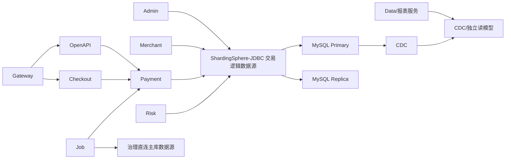

# ShardingSphere 交易季度分表全量升级方案

> 方案基线日期：2026-08-01
>
> 当前后端分支：`feature_scott_payment`
>
> 当前前端仓库：`acquiring-frontend`
>
> 当前数据库：MySQL 8.4.9，交易服务器统一使用中国 `+08:00`
>
> 方案状态：架构设计阶段；其他功能分支合并后必须执行差异复扫，才能进入正式实施

## 1. 方案目标

本方案用于把当前基于 `ShardingDataTemplate`、`${physicalTableName}` 和手工跨表归并的季度分表实现，整体升级为由 Apache ShardingSphere 负责路由、SQL 改写、执行和结果归并的标准逻辑表访问方案。

升级目标包括：

1. 23 张正式交易逻辑表全部接入 ShardingSphere；
2. 支持交易表的新增、查询、更新、软删除、批量处理、聚合、排序、分页和关联查询；
3. 支持 Payment、Admin、Merchant、Risk、Job 及外部 Data 服务的分表访问场景；
4. Gateway、OpenAPI、Checkout 等非直接访问交易库的服务保持模块边界，不无意义引入分片依赖；
5. 保持现有物理表名称和数据，不执行无必要的数据搬迁；
6. 保持 `transaction_date_time` 作为季度分片键；
7. 保持交易相关表对不同国家商户交易时区的表达能力；
8. 保留并升级物理表预建、结构检查、ID 号段检查和管理系统治理能力；
9. 消除业务 Mapper 中的动态物理表名参数；
10. 建立可灰度、可观测、可回滚的迁移流程。

本方案不把“接入 ShardingSphere”理解为给所有服务安装同一个依赖。只有直接访问交易逻辑表的数据访问方需要接入分片数据源，其他服务通过内部接口、MQ 事件或独立读模型参与交易链路。

## 2. 非目标

本轮升级不同时实施以下变更：

1. 不把季度分表改为月度、按商户或按哈希分表；
2. 不同时实施分库，第一阶段仍为单库多表；
3. 不同时更换交易号、操作号和业务幂等键；
4. 不同时把 MySQL 季度自增号段改成 Snowflake；
5. 不重构支付状态机、金额模型或 OpenAPI 契约；
6. 不通过应用启动自动 `ALTER` 已存在交易表；
7. 不把 Risk、Data 或报表逻辑继续堆入 `service-payment`；
8. 不通过双写两套交易表验证迁移；
9. 不删除现有路由代码和旧配置，直到灰度及回滚窗口结束；
10. 不把 ShardingSphere 当作通知、幂等、归档或灾备的替代品。

## 3. 当前基线

### 3.1 技术基线

| 项目 | 当前版本或状态 |
|---|---|
| Java | 17 |
| Spring Boot | 3.5.14 |
| Spring Cloud | 2025.0.2 |
| Spring Cloud Alibaba | 2025.0.0.0 |
| MyBatis-Plus | 3.5.16 |
| dynamic-datasource | 4.5.0 |
| MySQL | 8.4.9 |
| ShardingSphere | 尚未引入 |
| 分表策略 | 自研季度分表 |
| 分表键 | `transaction_date_time` |
| 数据库业务时区 | `Asia/Shanghai` |
| 正式交易逻辑表 | 23 张 |
| Nacos 启用规则 | 27 条，含 4 条 `test_*` |

正式实施前必须选择与 Java 17、Spring Boot 3.5、MyBatis-Plus 3.5.16 和 MySQL 8.4 兼容的 ShardingSphere 5.x 版本。不能仅根据 Maven 能解析依赖判断兼容，必须完成 SQL、事务、生成主键和 Spring Bean 生命周期 POC。

### 3.2 当前代码耦合

扫描当前分支发现：

| 项目 | 数量 |
|---|---:|
| 使用 `${physicalTableName}` 或关联物理表参数的生产 Mapper | 15 个文件 |
| 生产代码中直接依赖 `ShardingDataTemplate` 或 `ShardingTableRangeResolver` | 13 个文件 |
| 直接读取交易分表的服务 | Payment、Admin、Merchant、Risk |
| 负责物理表治理的服务 | Job、Admin |

主要耦合位置：

- `component-library/component-db/.../sharding/`；
- `service-payment/.../mapper/Transaction*Mapper.java`；
- `service-payment/.../DefaultTransactionRecordService.java`；
- `service-payment/.../DefaultTransactionQueryService.java`；
- `service-admin/.../JdbcAdminTransactionQueryService.java`；
- `service-merchant/.../JdbcMerchantTransactionQueryService.java`；
- `service-risk/.../RiskRuntimeMapper.java`；
- `service-risk/.../DefaultRiskPaymentTransactionStatusRepository.java`；
- `service-risk/.../DefaultRiskListRuntimeRepository.java`；
- `service-job/.../ShardingTablePreCreateServiceImpl.java`。

### 3.3 当前数据状态

dev 数据库已确认：

- 23 张正式模板表；
- 完整 `2026-Q3` 和 `2026-Q4` 物理表，共 46 张；
- 当前物理表字段和索引与模板一致；
- 已扫描数据没有发现跨季度错表；
- 部分 `transaction_merchant_api_interaction_log` 物理表季度 ID 号段未生效；
- 当前正式交易规则运行范围为 `2026-Q3` 至 `2035-Q4`；
- 交易和分表治理 SQL 缺少权威恢复仓库。

### 3.4 多分支约束

本方案基于当前 `feature_scott_payment`。用户正在其他分支继续修改代码，因此：

1. 当前文档可以作为目标架构；
2. 当前文件清单不能直接作为最终改造清单；
3. 正式编码前必须在最终集成分支重新扫描 Mapper、表、数据源和任务；
4. 其他分支新增的交易表、SQL、接口和状态流转必须纳入最终差异清单；
5. 在最终分支完成基线构建前，不进入全量迁移。

## 4. 关键架构决策

### 4.1 第一阶段选择 ShardingSphere-JDBC

第一阶段推荐 ShardingSphere-JDBC，不推荐直接把 ShardingSphere-Proxy 放进支付主链路。

| 维度 | ShardingSphere-JDBC | ShardingSphere-Proxy |
|---|---|---|
| 支付链路延迟 | 无额外 Proxy 网络跳转 | 增加网络和代理处理 |
| Spring 事务集成 | 与本地 DataSource 直接集成 | 依赖 Proxy 连接和协议行为 |
| 规则集中度 | 每个直接访问服务加载同一规则 | Proxy 集中管理 |
| 服务升级成本 | Payment/Admin/Merchant/Risk 分别升级 | 应用改造相对少 |
| 运维复杂度 | 依赖应用配置一致性 | 新增 Proxy 集群、高可用和容量治理 |
| 当前推荐 | 是 | 作为后续可选演进 |

选择 JDBC 的前提是：

- 所有直接访问服务使用同一个分片规则版本；
- Nacos 中的配置具备版本号和校验和；
- 规则变更通过滚动发布，不在第一阶段依赖运行时热更新；
- 监控能够识别每个服务的规则版本不一致。

### 4.2 保持单库分表

第一阶段只接管表分片，不引入分库。原因：

1. 当前所有季度表位于同一个 MySQL schema；
2. 当前支付事务依赖本地事务；
3. 分库会同时引入 XA/BASE 事务、跨库聚合和全局序列问题；
4. 当前主要痛点是手工路由和跨表查询，不是单库容量已证实不足；
5. 先完成标准化表分片，后续才能基于容量证据决定是否分库。

### 4.3 不双写交易事实

迁移过程不允许把同一交易同时写入“旧物理表路径”和“ShardingSphere路径”。两条路径最终仍指向同一批物理表，双写会造成唯一键冲突或重复资金事实。

正确验证方式：

- 路由结果影子比对；
- 只读查询双路径比对；
- 写入路径单开关切换；
- 切换后使用数据库事实、Outbox 和状态历史核对；
- 保留旧代码用于快速回退，但同一时刻只能启用一条写路径。

### 4.4 现有物理表原地接管

现有表名符合继续使用条件：

```text
transaction_order_202603
transaction_order_202604
```

因此不执行全量数据搬迁。迁移前只需要：

1. 对齐模板和物理表结构；
2. 修复 ID 号段检查；
3. 把所有正式物理表登记为 ShardingSphere 可用节点；
4. 用逻辑表 SQL 验证路由到现有物理表；
5. 保证回退后旧路由仍能访问同一份数据。

## 5. 目标系统架构



### 5.1 数据源分层

目标数据源分为三类：

| 数据源 | 使用方 | 职责 |
|---|---|---|
| `transactionShardingDataSource` | Payment、Admin、Merchant、Risk | 逻辑交易表 CRUD、路由和归并 |
| `transactionGovernanceDataSource` | Job、Admin 治理模块 | DDL、`SHOW CREATE TABLE`、`information_schema`、号段和结构检查 |
| 非交易业务数据源 | 各服务自身 | 账号、配置、风控规则、任务、Checkout、Payout 等非交易分表数据 |

治理数据源必须直连主库，不经过 ShardingSphere SQL 改写，并使用独立最小权限账号：

- Job 治理账号仅具备批准范围内的建表和结构检查权限；
- Admin 监控账号只读；
- 普通业务服务无 DDL 权限。

### 5.2 dynamic-datasource 边界

不能让 `dynamic-datasource` 和 ShardingSphere 同时决定交易主从路由。

目标规则：

1. ShardingSphere 管理交易逻辑数据源内部的主从读写；
2. 现有 `@DS(MASTER)`、`@DS(SLAVE)` 从交易查询和写入方法中退出；
3. 如果服务还访问其他业务库，`dynamic-datasource` 只能在“交易逻辑数据源”和“其他业务数据源”之间选择；
4. 不把 ShardingSphere 的底层 primary/replica 再注册为可被 `@DS` 直接选择的普通数据源；
5. 强一致读通过 ShardingSphere 事务路由、读写分离 Hint 或独立受控策略实现；
6. 迁移期间禁止一部分 SQL 走旧 `SLAVE`、另一部分 SQL 走 ShardingSphere replica 而没有监控标识。

## 6. 系统接入矩阵

### 6.1 后端服务

| 模块 | 当前访问 | 目标方案 | 是否直接接入 ShardingSphere |
|---|---|---|---|
| `component-db` | 提供自研路由和动态数据源 | 提供通用 ShardingSphere 集成、算法和数据源装配 | 是，基础设施层 |
| `service-payment` | 直接读写 23 张交易表 | 使用逻辑表完成交易 CRUD | 是，读写 |
| `service-admin` | 直接跨季度查询，另有治理功能 | 逻辑表只读查询；治理使用直连数据源 | 是，只读 + 治理直连 |
| `service-merchant` | 直接跨季度商户查询 | 逻辑表只读查询并强制商户隔离 | 是，只读 |
| `service-risk` | 直接查询交易订单和操作状态 | 第一阶段使用逻辑表查询；后续建设风险本地读模型 | 是，只读 |
| `service-job` | 预建表、任务扫描、调用 Payment | 业务补偿通过 Payment；表治理走治理数据源 | 不直接承担交易 CRUD |
| `service-openapi` | 调用 Payment | 保持入口边界，不直接访问交易表 | 否 |
| `service-gateway` | 路由请求 | 不访问交易库 | 否 |
| `service-checkout` | 调用支付能力，维护 Checkout 自有表 | 不直接访问交易分表 | 否 |
| `service-payout` | 独立代付域 | 本轮不纳入收单交易 23 表 | 否，后续单独评估 |
| 外部 Data 服务 | 当前仓库中不存在 | 优先 CDC/独立读模型；确需直查时使用只读逻辑数据源 | 待仓库扫描 |

### 6.2 前端系统

| 前端 | 目标变化 |
|---|---|
| Admin | 保持交易查询 API；治理页展示 ShardingSphere规则版本、表状态、结构状态和 ID 号段状态 |
| Merchant | 保持商户隔离查询；不展示物理表和分片规则 |
| Hosted Checkout | 无直接分片依赖；继续通过支付接口提交和查询 |

前端不得接收或拼接物理表名。18 位 ID、AUTO_INCREMENT 起始值和最大值必须以字符串传输。

## 7. 分表规则设计

### 7.1 逻辑表清单

以下 23 张正式交易表全部使用 `transaction_date_time` 按季度路由：

| 分类 | 逻辑表 |
|---|---|
| 主交易 | `transaction_order`、`transaction_operation` |
| 交易快照 | `transaction_merchant_snapshot`、`transaction_payment_method_info`、`transaction_payer_info`、`transaction_billing_info`、`transaction_additional_info`、`transaction_authentication_info`、`transaction_product_item` |
| 渠道链路 | `transaction_channel_request`、`transaction_channel_interaction_log`、`transaction_channel_callback`、`transaction_channel_callback_log` |
| 状态与金额 | `transaction_flow_event`、`transaction_status_history`、`transaction_amount_change_log`、`transaction_finance_state`、`transaction_currency_conversion` |
| 商户通知 | `transaction_merchant_notification`、`transaction_merchant_notification_log`、`transaction_merchant_api_interaction_log` |
| 事件与异常 | `transaction_event_outbox`、`transaction_abnormal_event` |

### 7.2 季度算法

推荐使用 `CLASS_BASED` 标准分片算法，实现项目自己的 `QuarterTableShardingAlgorithm`。不依赖内置格式能否精确生成 `yyyyQQ`，避免版本差异。

算法输入和输出：

```text
输入逻辑表：transaction_order
输入时间：2026-08-01 10:00:00
数据库业务时区：Asia/Shanghai
季度：2026-Q3
物理表：transaction_order_202603
```

算法必须实现：

1. 精确值路由；
2. 闭区间、开区间和半开区间范围路由；
3. null 分片键拒绝；
4. 配置范围外拒绝；
5. 物理节点不在可用集合中时拒绝；
6. 不接受任意外部物理表名；
7. 统一使用 `Asia/Shanghai` 解释数据库业务时间；
8. 支持季度边界毫秒精度测试；
9. 输出可观测的逻辑表、季度、节点数和规则版本，不输出敏感 SQL 参数。

### 7.3 Binding Tables

所有参与绑定的表必须满足：

- 相同分片键；
- 相同季度算法；
- 相同可用季度集合；
- 对应季度物理表全部存在；
- JOIN 条件能够保证同季度关联。

第一阶段建议：

1. 对 23 张表进行拓扑对齐检查；
2. 全部对齐后可建立一个交易表族 Binding Group；
3. 如果存在表生命周期不一致，则按真实 JOIN 图建立互不重叠的 Binding Group；
4. 未绑定表之间的 JOIN 必须通过 SQL 路由审计，禁止产生季度笛卡尔路由。

重点验证组合：

- `transaction_order` + `transaction_operation`；
- `transaction_operation` + `transaction_payment_method_info`；
- `transaction_operation` + 渠道请求和交互日志；
- `transaction_channel_callback` + callback log；
- `transaction_merchant_notification` + notification log。

### 7.4 非分表表

`transaction_idempotency` 等当前未分表的全局约束表保持单表，通过默认数据源规则访问。不得因为接入 ShardingSphere而自动把所有 `transaction_*` 表都纳入分片。

非分表表必须逐张登记：

- 是否为全局唯一约束；
- 是否需要主库强一致；
- 是否会与分表事务同事务提交；
- 是否允许未来拆分；
- 是否需要广播表能力。

## 8. ID 策略

### 8.1 第一阶段保持现有策略

第一阶段保持 MySQL 自增和季度号段：

```text
yyyyQQ + 12 位序号
2026-Q3 起始值：202603000000000001
```

原因：

1. 避免在路由迁移时同时改变主键语义；
2. 现有表和部分关联已经使用 BIGINT；
3. 当前问题是号段没有正确应用，不是必须更换算法；
4. ShardingSphere Snowflake 不能自动解决未知时间路由。

### 8.2 必须补齐的检查

1. 建表后校验 `AUTO_INCREMENT` 起始值；
2. 校验 `MIN(id)` 和 `MAX(id)` 属于目标季度；
3. 独立记录 `id_range_check_status`；
4. 监控号段剩余比例；
5. MyBatis 插入后返回自增 ID 的行为必须完成 POC；
6. 前端使用字符串承载 18 位数值；
7. 修复现有小 ID 数据需要独立迁移，不与 ShardingSphere切换同批执行。

### 8.3 后续演进

如果未来改为 Snowflake、号段服务或独立全局 ID，必须单独评审：

- ID 是否编码路由时间；
- 时钟回拨；
- 多节点 worker 分配；
- 前端和外部接口兼容；
- 历史 ID 与新 ID 并存；
- 未知时间查询策略。

## 9. CRUD 改造规范

### 9.1 Insert

所有分表 Insert 必须显式包含 `transaction_date_time`：

```sql
INSERT INTO transaction_order (
    operation_id,
    transaction_id,
    transaction_date_time,
    ...
) VALUES (
    #{operationId},
    #{transactionId},
    #{transactionDateTime},
    ...
)
```

禁止：

- 依赖数据库默认时间决定分片；
- 先 Insert 再补分片键；
- 通过调用方随意提供历史或未来交易时间；
- 在同一批 Insert 中混入多个季度而没有明确分组和事务设计。

批量 Insert 应先按季度分组，每批只写一个季度，便于事务、错误定位和重试。

### 9.2 Select

精确查询必须优先携带分片键：

```sql
SELECT *
FROM transaction_operation
WHERE transaction_id = #{transactionId}
  AND transaction_date_time = #{transactionDateTime}
LIMIT 1
```

如果 `transaction_id` 能解析交易时间，由应用层使用受控解析器得到时间，再执行逻辑表 SQL。不能只按 `transaction_id` 查询并让 ShardingSphere全路由。

时间范围查询必须包含明确边界：

```sql
WHERE transaction_date_time >= #{beginTime}
  AND transaction_date_time < #{endTimeExclusive}
```

建议内部统一使用半开区间，页面结束时间转换由应用层完成，避免季度边界重复或漏查。

### 9.3 Update

迁移最高风险是当前物理表 Update 改为逻辑表后缺少分片键。

错误示例：

```sql
UPDATE transaction_order
SET transaction_status = #{targetStatus}
WHERE operation_id = #{operationId}
```

目标写法：

```sql
UPDATE transaction_order
SET transaction_status = #{targetStatus},
    version = version + 1
WHERE operation_id = #{operationId}
  AND transaction_date_time = #{transactionDateTime}
  AND transaction_status IN (...)
  AND version = #{version}
```

所有更新必须同时检查：

- 分片键；
- 业务主键；
- 当前允许状态；
- 乐观锁版本或等价 CAS；
- `deleted` 条件；
- 更新行数必须为 1。

### 9.4 Delete

交易事实原则上不做物理删除。确有清理需求时：

1. 使用版本化 DBA 脚本；
2. 明确物理季度；
3. 先归档和核对；
4. 禁止无分片键 Delete；
5. 禁止通过 ShardingSphere广播删除历史交易。

业务软删除同样必须携带分片键和当前状态条件。

### 9.5 SELECT FOR UPDATE

`SELECT ... FOR UPDATE` 必须只路由到一个物理季度。当前 `TransactionOrderMapper` 的锁查询迁移时必须把 `transaction_date_time` 加入 SQL 条件。

验收要求：

- 路由单节点；
- 使用主库连接；
- 与后续状态更新处于同一 Spring 事务；
- 锁定行数唯一；
- SQL 解析与 MySQL 8.4 行为一致；
- 不允许范围路由后对多个季度加锁。

### 9.6 Hint 使用边界

只有以下场景允许使用 ShardingSphere Hint：

- 已从受控平台交易号解析出唯一季度；
- 历史兼容 SQL 暂时无法添加分片键；
- 数据修复工具经过审批并明确目标季度。

Hint 必须由基础设施封装，不允许 Controller、前端参数或任意业务字符串直接指定物理分片。Hint 使用后必须在 `finally` 中清理上下文，防止线程复用污染后续请求。

## 10. Mapper 迁移方案

### 10.1 迁移前后

当前：

```java
mapper.insertPhysical(physicalTableName, entity);
```

```sql
INSERT INTO ${physicalTableName} (...)
```

目标：

```java
mapper.insert(entity);
```

```sql
INSERT INTO transaction_order (...)
```

### 10.2 重点文件

需要逐条 SQL 审查的 15 个动态物理表 Mapper：

1. `TransactionOrderMapper`；
2. `TransactionOperationMapper`；
3. `TransactionPaymentMethodInfoMapper`；
4. `TransactionStatusHistoryMapper`；
5. `TransactionFlowEventMapper`；
6. `TransactionAmountChangeLogMapper`；
7. `TransactionChannelRequestMapper`；
8. `TransactionChannelInteractionLogMapper`；
9. `TransactionChannelCallbackMapper`；
10. `TransactionChannelCallbackLogMapper`；
11. `TransactionMerchantNotificationMapper`；
12. `TransactionMerchantNotificationLogMapper`；
13. `TransactionMerchantApiInteractionLogMapper`；
14. `TransactionEventOutboxMapper`；
15. `RiskRuntimeMapper`。

最终分支复扫时，必须重新生成清单，不以这 15 个文件为上限。

### 10.3 SQL 兼容矩阵

每条 Mapper SQL 标记以下属性：

| 属性 | 取值示例 |
|---|---|
| 操作类型 | Insert、Select、Update、Delete、Aggregate |
| 分片键 | 有、可补充、只能 Hint、缺失 |
| 路由目标 | 单季度、范围季度、全路由 |
| 主从要求 | 主库、从库、事务内主库 |
| 锁 | 无、`FOR UPDATE` |
| 关联 | 单表、Binding JOIN、子查询 |
| 分页 | 无、浅分页、深分页、游标 |
| 状态保护 | CAS、当前状态条件、无保护 |
| ShardingSphere POC | 通过、失败、待处理 |

没有完成矩阵的 SQL 不得进入生产切换。

## 11. 事务与一致性

### 11.1 本地事务

当前为单库分表，目标继续使用 Spring 本地事务。只要同一交易生命周期准确路由到同一数据库实例，本地事务可以覆盖：

- 交易主单；
- 交易操作单；
- 状态历史；
- 金额变化；
- 渠道请求；
- 通知任务；
- Outbox；
- 全局幂等表。

必须验证 ShardingSphere DataSource 成为正确的事务管理器目标，不能让同一事务中的部分 Mapper 走旧 DataSource。

### 11.2 幂等和终态

ShardingSphere不改变以下规则：

1. 资金类幂等必须有数据库唯一约束；
2. 交易状态必须 CAS 更新；
3. 终态不可被旧回调覆盖；
4. MQ 消费必须幂等；
5. 通知任务和 Outbox 必须与交易终态在一致事务边界内；
6. 渠道主动查询推进终态时必须同步幂等快照；
7. `expire_time` 不能自动解除资金类唯一约束。

### 11.3 强一致读取

以下场景必须读取主库或使用事务内一致性：

- 创建交易后的内部确认；
- `FOR UPDATE`；
- 状态推进前读取当前状态；
- 幂等冲突后的结果恢复；
- 渠道回调推进；
- 退款、撤销、请款前校验；
- 通知抢占和 Outbox 状态更新。

Admin、Merchant 普通列表可以走从库，但必须定义延迟 SLA。支付成功后立即查询是否回源主库，需要在实施前冻结为明确接口契约。

## 12. 查询、分页、统计和导出

### 12.1 查询原则

ShardingSphere可以自动路由并归并，但不能消除大跨度查询成本。用户已确认不限制最多六季度，因此采用技术资源预算，而不是固定业务跨度限制。

资源预算包括：

- 同步请求最大执行时间；
- 单请求最大路由节点数；
- 最大扫描行数；
- 最大返回行数；
- 每商户和每运营用户并发数；
- 导出最大行数和文件大小；
- 从库连接池占用比例。

### 12.2 分页

| 场景 | 目标方案 |
|---|---|
| 第一页 | `ORDER BY transaction_date_time DESC, id DESC LIMIT n` |
| 下一页 | 使用上一页最后一条 `(transaction_date_time, id)` 游标 |
| 指定页码 | 仅支持受控浅分页 |
| 深分页 | 转游标或异步任务 |
| 跨季度边界 | 游标同时包含时间和 ID |

不能假设 ShardingSphere自动分页一定比当前实现快。它可能在多个分片读取 `offset + limit` 后归并，深 offset 成本仍然很高。

### 12.3 统计

统计必须：

- 按币种分组，禁止跨币种直接求和；
- 区分交易状态、操作类型和支付方式；
- 避免列表分页和统计重复扫描全部季度；
- 高频统计使用季度汇总表、缓存或独立读模型；
- 明确从库延迟对统计结果的影响；
- 对部分分区不可用返回明确状态，不能静默少算。

### 12.4 导出

大导出改为异步任务：


导出任务记录条件快照、查询时区、创建人、数据权限、进度、文件摘要、过期时间和失败原因。禁止在单个 HTTP 请求中把全部记录累积到内存。

### 12.5 未知时间查询

暂不建设全局索引时：

- 平台交易号可解析时间后精确路由；
- 商户订单号必须携带商户 ID 和时间范围；
- 渠道流水查询必须携带渠道编码和时间范围；
- 无时间范围的运营检索转异步任务；
- 回调必须携带或恢复平台交易定位信息；
- 不能承诺未知时间条件下的低延迟全局精确查询。

## 13. Risk 和 Data 服务

### 13.1 Risk 当前方案

当前 `service-risk` 直接使用 `ShardingDataTemplate` 读取 `transaction_order` 和 `transaction_operation`。第一阶段为了保持行为，可改为 ShardingSphere逻辑表查询。

但长期建议建立 Risk 本地读模型：

1. Payment 通过 Outbox 发布交易状态事件；
2. Risk 幂等消费并维护风控所需最小交易视图；
3. 在线风控优先查询本地风险视图；
4. 只有核查或补偿场景回查交易逻辑表；
5. Risk 不直接修改交易事实。

这样可以减少支付分表从库被实时风控聚合查询占用。

### 13.2 Data 服务

当前仓库没有 `service-data`，因此本方案只能定义接入契约，不能声称已完成代码清单。

推荐优先级：

1. MySQL Binlog/CDC 同步物理季度表；
2. 在 Data 平台统一映射为逻辑交易明细；
3. 统计、报表和长期历史查询在独立读模型执行；
4. 禁止 Data 服务对 OLTP 主库执行无边界跨季度查询；
5. 如果必须实时直查，使用独立只读账号、独立连接池和 ShardingSphere只读配置；
6. 获得 Data 服务仓库后重新扫描 SQL、调度和导出。

## 14. 物理表治理

### 14.1 定时任务保留

`SHARDING_TABLE_PRE_CREATE` 不能因接入 ShardingSphere而删除。ShardingSphere负责路由，不负责按季度自动创建下一批物理表。

任务升级后负责：

1. 计算当前和下一季度；
2. 校验 23 张正式逻辑表配置；
3. 校验模板表；
4. 创建缺失物理表；
5. 设置并验证 ID 起始值；
6. 检查字段、索引、字符集和注释；
7. 记录 ShardingSphere规则版本；
8. 刷新或提示发布新物理节点配置；
9. 发现失败立即告警；
10. 支持 Dry Run 和人工审批执行。

### 14.2 配置和建表顺序

推荐顺序：

```text
1. 生成下季度建表计划
2. Dry Run
3. DBA/授权任务创建物理表
4. 校验结构和 ID 号段
5. 发布包含新节点的 ShardingSphere规则
6. 滚动重启或受控刷新直接访问服务
7. 验证所有服务规则版本一致
8. 开放新季度路由
```

不能先发布指向不存在物理表的规则，也不能只建表而不让 ShardingSphere识别新节点。

### 14.3 不自动 ALTER

第一阶段仍保持 `allow-alter-existing-table=false`：

- 自动任务只检测和告警；
- 模板升级生成版本化 SQL；
- DBA 审批后逐季度执行；
- 每张表记录迁移版本和结果；
- 失败时停止后续季度，不继续扩大不一致。

### 14.4 管理系统治理状态

Admin 页面分别展示：

| 维度 | 状态 |
|---|---|
| 表存在 | `MISSING/EXISTS/CREATE_FAILED` |
| 结构 | `NOT_CHECKED/MATCHED/MISMATCHED` |
| ID 号段 | `NOT_CHECKED/MATCHED/MISMATCHED/EXHAUSTING` |
| ShardingSphere节点 | `REGISTERED/NOT_REGISTERED` |
| 规则版本 | 当前服务版本与目标版本 |
| 综合状态 | `HEALTHY/WARNING/UNAVAILABLE` |

批次存在失败表时，前端必须显示 `PARTIAL_SUCCESS` 或 `FAILED`，不能统一提示成功。

## 15. `test_*` 规则退役

4 条测试规则不纳入 ShardingSphere正式规则：

- `test_transaction`；
- `test_transaction_info`；
- `test_transaction_merge_info`；
- `test_transaction_status_info`。

退役步骤：

1. 删除 Nacos 中 4 条测试规则；
2. 删除 `PaymentOrderShardingAlgorithm` 的 4 条生产默认规则；
3. 删除仓库 Nacos 样例中的测试规则；
4. 将文档示例改为正式交易表；
5. 单元测试可继续使用虚拟表名作为测试夹具；
6. 查询治理记录和真实数据库对象；
7. 生成审批 SQL 清理测试治理记录；
8. 确认无数据、无外键、无引用并备份后，才允许 Drop 测试模板或物理表；
9. 验证正式规则数为 23，当前和下一季度计划表数为 46。

## 16. Nacos 配置治理

### 16.1 配置拆分

目标配置分为：

| 配置 | 内容 |
|---|---|
| 交易 ShardingSphere规则 | 逻辑表、节点、分片算法、Binding Tables、读写分离 |
| 物理表治理配置 | 模板、季度范围、预建、结构检查、ID 号段 |
| 查询治理配置 | 同步预算、导出限制、强一致读窗口 |
| 补偿任务配置 | 活跃季度、批次大小、重试和超时 |

### 16.2 单一事实来源

迁移期允许旧规则和新规则并存，但必须有明确命名和开关：

```text
legacy-quarter-sharding.enabled
shardingsphere-transaction.enabled
```

正式切换后：

- ShardingSphere规则是路由事实来源；
- 治理配置只描述物理表生命周期，不再自行决定业务 SQL 路由；
- 旧 `global-payment.sharding` 在回滚窗口结束后退役；
- 禁止两套配置都声称是正式路由规则。

### 16.3 发布要求

1. 配置必须带版本号和校验和；
2. 所有直接访问服务启动时记录规则版本；
3. 服务版本不一致时告警；
4. 第一阶段不对 ShardingSphere DataSource 做无控制热刷新；
5. 节点变化通过受控滚动重启；
6. 配置中不允许数据库真实密码默认值；
7. dev、uat、prod 使用独立 namespace/Data ID；
8. Git 保存脱敏配置基线，Nacos 保存运行配置。

## 17. 依赖与组件改造

### 17.1 Maven

正式实施时：

1. 根 `pom.xml` 统一管理 ShardingSphere版本；
2. `component-db` 引入经过 POC 的 ShardingSphere-JDBC 核心依赖；
3. 不在各服务分别写不同版本；
4. 不同时升级 Spring Boot、Spring Cloud、MyBatis-Plus 或 MySQL Driver；
5. 检查 JSQLParser 和 ShardingSphere SQL parser 的共存；
6. 执行依赖树检查，排除 SLF4J、Guava、SnakeYAML 等冲突；
7. 记录许可证和依赖安全扫描结果。

### 17.2 component-db

保留或新增的通用职责：

- ShardingSphere DataSource 装配；
- `QuarterTableShardingAlgorithm`；
- 规则版本和路由指标；
- 强一致读封装；
- Hint 安全封装；
- 治理直连数据源基础配置；
- 物理表名安全校验，用于治理 DDL。

不应放入：

- 支付状态机；
- 商户查询规则；
- 风控业务逻辑；
- 通知重试规则；
- 特定页面逻辑。

### 17.3 旧组件退役条件

以下组件不能在第一批代码中直接删除：

- `ShardingDataTemplate`；
- `ShardingTableRangeResolver`；
- 旧 Mapper 物理表方法；
- 旧 Nacos 路由配置；
- 旧查询实现。

只有满足以下条件后退役：

1. 所有直接访问服务已切换；
2. 只读影子比对完成；
3. 写入灰度稳定；
4. 至少跨越一次季度边界演练；
5. 回滚窗口结束；
6. 没有仍调用旧方法的代码；
7. Git、Nacos 和运行实例均确认无旧规则使用。

## 18. POC 方案

### 18.1 POC 表范围

首轮选择：

1. `transaction_order`；
2. `transaction_operation`；
3. `transaction_payment_method_info`。

这三张表覆盖：

- 自增 ID；
- 单表 Insert/Select/Update；
- 状态 CAS；
- `FOR UPDATE`；
- Binding JOIN；
- 时间范围查询；
- 排序、分页、Count 和统计；
- 主从路由；
- 同一事务写多张分表。

### 18.2 POC 验证项

| 验证项 | 通过标准 |
|---|---|
| Spring Boot 启动 | DataSource、MyBatis、事务 Bean 无冲突 |
| 精确路由 | Q3/Q4 各只命中一个物理表 |
| 范围路由 | 只命中范围涉及季度 |
| Insert 返回 ID | MyBatis 正确回填 BIGINT ID |
| Update | 携带分片键且只更新一行 |
| `FOR UPDATE` | 单分片、主库、事务内锁定 |
| Binding JOIN | 无季度笛卡尔路由 |
| 分页 | 结果不重不漏，排序一致 |
| 主从 | 写入主库，普通读从库，强一致读主库 |
| 异常 | 缺表、规则外时间、null 分片键明确失败 |
| 性能 | 与旧实现对比路由数、SQL 数、P95/P99 |
| 回退 | 关闭开关后旧路径可读取同一数据 |

POC 失败时停止全量迁移，不通过局部绕过把不兼容 SQL直接带入 23 张表。

## 19. 实施阶段

### 19.1 阶段 0：分支和基线冻结

1. 用户完成其他功能分支；
2. 合并到明确的集成分支；
3. 修复当前已知编译阻塞；
4. 执行基线编译和测试；
5. 恢复权威交易 SQL；
6. 标记基线 commit/tag；
7. 冻结交易表、Mapper 和数据源配置；
8. 创建专用 ShardingSphere迁移分支；
9. 重新执行全仓差异扫描。

### 19.2 阶段 1：清理和基础设施

1. 退役 `test_*` 正式配置；
2. 引入 ShardingSphere依赖和逻辑数据源；
3. 实现季度算法和配置版本校验；
4. 建立治理直连数据源；
5. 完成三表 POC；
6. 保持默认开关走旧路径。

### 19.3 阶段 2：只读服务迁移

顺序建议：

1. Admin 查询；
2. Merchant 查询；
3. Risk 交易状态查询；
4. Payment 查询服务。

先做只读影子比对：同一查询分别通过旧实现和 ShardingSphere执行，比较总数、排序键、主键集合、金额和状态。不把影子结果返回用户。

### 19.4 阶段 3：Payment 写入迁移

按业务风险从低到高迁移：

1. 审计和交互日志；
2. 状态历史和流程事件；
3. 渠道请求/响应记录；
4. 商户通知和 Outbox；
5. 交易附属快照；
6. `transaction_operation`；
7. `transaction_order`；
8. 授权、请款、退款、撤销、冲正全链路。

主单和操作单最后切换，且必须在一个受控发布窗口完成，避免同一事务混用两种 DataSource。

### 19.5 阶段 4：治理和任务迁移

1. 预建任务读取新节点配置；
2. Admin 展示规则版本和节点状态；
3. 商户通知补偿扫描活跃季度；
4. 渠道主动查询覆盖跨季度积压；
5. 建立缺表、结构、号段和节点告警；
6. 完成下一季度预建演练。

### 19.6 阶段 5：全量切换和观察

1. 所有实例加载同一规则版本；
2. 逐服务开启新路径；
3. 观察错误率、路由节点数、主从延迟和数据库负载；
4. 核对交易事实、幂等、Outbox、通知和状态历史；
5. 保留旧路径但禁止双写；
6. 完成季度边界演练；
7. 观察窗口结束后再进入旧代码退役。

### 19.7 阶段 6：旧实现退役

1. 删除 Mapper 的物理表参数；
2. 删除业务服务中的手工物理表循环；
3. 删除旧 `@DS(MASTER/SLAVE)` 交易路由；
4. 删除旧路由配置；
5. 删除不再使用的 `ShardingDataTemplate` 等组件；
6. 保留治理所需的安全物理表解析能力；
7. 更新架构、部署和运维文档。

## 20. 灰度和回滚

### 20.1 功能开关

每个直接访问服务具备独立开关：

```text
payment.transaction-datasource-mode=LEGACY|SHARDINGSPHERE
admin.transaction-query-mode=LEGACY|SHARDINGSPHERE|COMPARE
merchant.transaction-query-mode=LEGACY|SHARDINGSPHERE|COMPARE
risk.transaction-query-mode=LEGACY|SHARDINGSPHERE|COMPARE
```

生产环境不允许通过任意请求参数切换模式。

### 20.2 回滚原则

1. 不搬迁数据，因此应用回滚不需要反向搬数据；
2. 旧代码和旧配置在回滚窗口内保留；
3. 写路径只允许单路启用；
4. 回滚前停止新流量并等待在途事务结束；
5. 回滚后核对最后一个成功交易时间和交易 ID；
6. 新增物理表属于兼容对象，不因应用回滚删除；
7. 不回滚已经成功提交的交易状态；
8. 配置回滚与应用回滚使用同一变更单。

### 20.3 自动停止条件

出现以下任一情况停止灰度并回退：

- 路由到错误季度；
- SQL 广播更新；
- `FOR UPDATE` 多分片；
- 交易主单和操作单不一致；
- 幂等冲突显著增加；
- Outbox 或通知异常积压；
- 主库 QPS、锁等待或复制延迟超过阈值；
- 查询结果对比不一致；
- ShardingSphere解析异常或节点配置不一致。

## 21. 测试方案

### 21.1 单元测试

| 模块 | 场景 |
|---|---|
| 季度算法 | Q1-Q4、年切换、毫秒边界、范围开闭区间 |
| Hint | 设置、清理、线程复用、非法季度 |
| 配置 | 缺表、重复节点、规则版本不一致 |
| Mapper | 每条写 SQL包含分片键和状态条件 |
| ID | 起始值、最大值、前端字符串 |

### 21.2 集成测试

准备至少三个季度物理表：上一季度、当前季度、下一季度。

覆盖：

- 单季度 Insert/Select/Update；
- 跨季度范围查询；
- Binding JOIN；
- `FOR UPDATE` 并发；
- 本地事务回滚；
- 主从路由；
- 缺物理表；
- 规则外时间；
- 批量写入跨季度分组；
- 分页跨季度边界；
- 多币种统计；
- MyBatis-Plus 插件共存。

### 21.3 支付回归

每个操作覆盖正常、重复、超时、渠道异常和非法状态：

- Payment；
- Authorization；
- Pre-Authorization；
- Incremental Authorization；
- Capture；
- Void；
- Reversal；
- Refund；
- 渠道回调；
- 渠道主动查询；
- MQ 重复消费；
- 商户通知重试；
- Outbox 重投。

### 21.4 系统回归

| 系统 | 验证重点 |
|---|---|
| Admin | 列表、统计、详情、导出、治理权限和部分失败展示 |
| Merchant | 商户隔离、订单查询、分页、统计、立即查询语义 |
| Risk | 交易状态读取、名单统计、从库延迟和决策超时 |
| Job | 预建表、跨季度补偿、任务幂等和失败续跑 |
| OpenAPI | 创建、查询、防重放、响应加密不受数据源迁移影响 |
| Gateway | 路由和认证链路无回归 |
| Checkout | 支付提交和结果查询无回归 |
| Data | CDC 完整性、去重、季度新增表发现和报表一致性 |

### 21.5 性能测试

至少覆盖：

- 1、2、4、8、20、40 个季度范围；
- 10、50、100 行页大小；
- 第一页和深分页；
- Admin 无商户过滤；
- Merchant 带商户过滤；
- 精确交易号；
- 商户订单号；
- 渠道流水号；
- 聚合统计；
- 异步导出；
- 并发写和从库延迟。

记录旧实现和 ShardingSphere的 SQL 数、路由节点数、扫描行数、P50/P95/P99、连接池占用、CPU、内存、锁等待和复制延迟。

### 21.6 故障演练

- 主库短暂不可用；
- 从库延迟和断开；
- 某季度缺表；
- 配置漏一个节点；
- 服务加载不同规则版本；
- Nacos不可用但本地缓存存在；
- 预建任务部分失败；
- MQ关闭；
- 通知节点在 `PROCESSING` 时宕机；
- 灰度中途回滚。

## 22. 监控和告警

### 22.1 ShardingSphere指标

- 逻辑 SQL数量；
- 实际 SQL数量；
- 单请求路由节点数；
- 全路由次数；
- SQL解析失败次数；
- 规则版本；
- Hint 使用次数；
- 主从路由次数；
- 事务回滚次数。

生产默认关闭完整 SQL 和参数日志，避免卡号、个人信息、密文或交易报文进入日志。

### 22.2 数据治理指标

- 缺表数量；
- 结构不一致数量；
- ID 号段不一致数量；
- 未注册节点数量；
- 下季度预建完成率；
- 配置到期剩余时间；
- 跨季度错误数据数量；
- 每表容量和增长率。

### 22.3 业务一致性指标

- 交易终态与幂等状态不一致；
- 主单和操作单状态不一致；
- Outbox积压；
- 商户通知积压；
- 渠道待匹配积压；
- 回调重复处理拦截；
- 从库查询不到但主库存在的次数。

## 23. 安全要求

1. ShardingSphere配置不包含默认数据库密码；
2. Nacos不同环境隔离并限制访问；
3. 业务账号不具备 DDL 权限；
4. 治理账号限制来源 IP 和 schema；
5. Admin 建表接口必须有内部权限和操作审计；
6. Hint 不能接受前端物理节点；
7. SQL日志不输出敏感参数；
8. Data 服务使用只读账号；
9. 临时高权限数据库账号及时撤销；
10. 配置变更记录操作人、审批人、版本和回滚版本。

## 24. 实施文件范围

最终范围以合并后复扫为准，当前预计包括：

| 模块 | 预计文件范围 |
|---|---|
| 根工程 | `pom.xml` 依赖管理 |
| component-db | `pom.xml`、DataSource 配置、分片算法、Hint、路由指标、旧 sharding 包 |
| Payment | 交易 Mapper、记录服务、查询服务、回调、通知、Outbox、事务服务及测试 |
| Admin | 交易 JDBC 查询、应用服务、治理服务、DTO、接口和测试 |
| Merchant | 交易 JDBC 查询、商户隔离查询和测试 |
| Risk | `RiskRuntimeMapper`、交易状态 Repository、名单运行时 Repository 和测试 |
| Job | 预建表、渠道勾兑、通知补偿、任务配置和测试 |
| Nacos文档 | 交易分片、主从、治理、查询预算配置基线 |
| Admin前端 | 分表 API 大整数类型、物理表和任务结果页面 |
| 文档 | 架构、部署、SQL、回滚和运维手册 |

正式编码必须按模块分批提交，禁止一次提交全仓迁移。

## 25. 准入门禁

### 25.1 编码前

- 所有相关功能分支已合并；
- 最终集成分支明确；
- 基线 Maven 构建结果已记录；
- 前端基线构建结果已记录；
- 交易 SQL 基线已恢复；
- dev 数据库备份和结构快照已完成；
- ShardingSphere版本 POC 通过；
- Data 服务仓库已提供或明确不在本期；
- 交易表、Mapper、Nacos 分片配置进入冻结窗口。

### 25.2 上线前

- 23 张表 SQL兼容矩阵全部完成；
- 所有 Update/锁 SQL精确路由；
- 只读影子比对无差异；
- 全链路回归通过；
- 性能不低于准入阈值；
- 当前和下一季度全部表健康；
- 主从延迟 SLA 已确认；
- 回滚开关和旧配置可用；
- 监控、告警和应急负责人已就位；
- 配置和应用版本一致。

### 25.3 旧实现删除前

- 全量切换稳定；
- 至少完成一次季度边界演练；
- 没有旧路由调用；
- 没有旧配置实例；
- 回滚窗口结束；
- 交易、幂等、Outbox、通知和报表核对通过；
- DBA、支付、风控、运维和测试共同确认。

## 26. 当前推荐结论

1. 现在完成架构和迁移方案是合适的；
2. 正式改代码必须等待其他分支合并；
3. 第一阶段采用 ShardingSphere-JDBC、单库分表、原地接管现有物理表；
4. 不同时更换 ID、分片键、数据库拓扑和支付状态机；
5. Payment、Admin、Merchant、Risk 是当前直接接入方；
6. Job 保留物理表预建和治理能力，但不承担交易业务 SQL；
7. Gateway、OpenAPI、Checkout 不直接接入 ShardingSphere；
8. Data 服务优先通过 CDC 和独立读模型接入；
9. `test_*` 规则退役，但预建任务和治理配置不能删除；
10. 全量迁移必须经过三表 POC、只读影子比对、单路写灰度和季度边界演练。

## 27. 后续执行入口

用户完成其他分支后，需要提供：

1. 最终集成分支名称；
2. 所有相关仓库或工作区路径；
3. Data 服务仓库和分支；
4. 计划冻结的交易表和配置窗口；
5. dev/uat 环境可用性；
6. 从库延迟和支付成功后立即可查要求。

随后按以下顺序执行：

```text
最终分支差异复扫
-> 文件级实施计划确认
-> 三表 POC
-> POC 结果确认
-> 分模块迁移
-> 基础验证确认
-> 完整回归确认
-> 灰度发布和回滚演练
```

任何阶段发现路由错误、广播更新、事务跨数据源或交易事实不一致，立即停止后续迁移。
