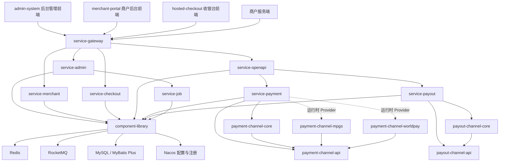
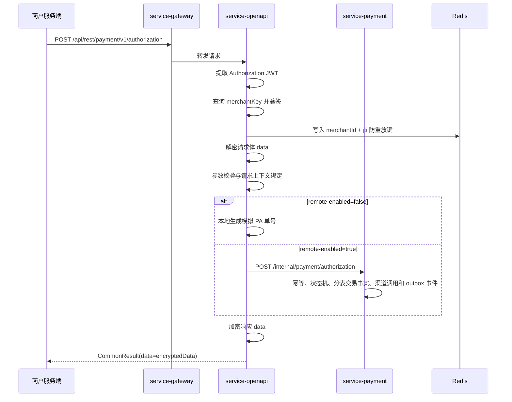
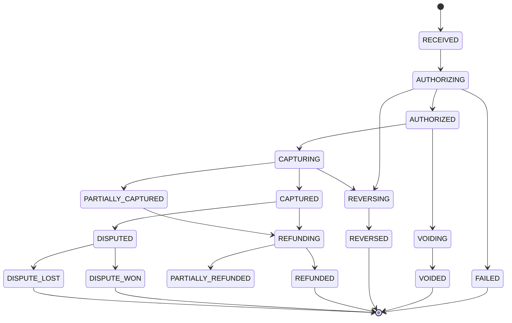
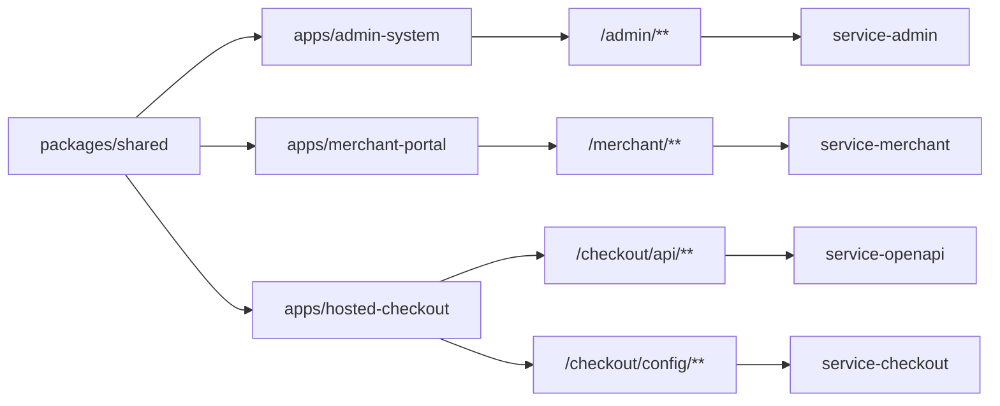

# 支付收单平台系统架构说明

## 1. 文档定位

本文描述 `acquiring-orchestration` 后端仓库与 `acquiring-frontend` 前端仓库组成的完整支付收单平台当前架构。

本文只记录当前代码扫描得到的架构事实、模块边界和后续收敛方向，不代表生产运行环境已经具备完整交易核心能力。Nacos 外部配置、线上数据库实际表结构、网关真实路由和渠道侧配置需要在部署环境中单独核验。

## 2. 当前仓库边界

后端仓库：

```text
/Users/scott/Documents/code/ideaCodex/acquiring-orchestration
```

职责：

1. Spring Cloud 多模块后端服务。
2. 商户 OpenAPI 安全入口。
3. 管理后台与商户后台后端接口。
4. 支付、代付、渠道、任务、公共组件的服务骨架。
5. 数据库、Redis、RocketMQ、Nacos、分表治理相关后端能力。

前端仓库：

```text
/Users/scott/Documents/code/ideaCodex/acquiring-frontend
```

职责：

1. `apps/admin-system`：后台管理系统。
2. `apps/merchant-portal`：商户后台。
3. `apps/hosted-checkout`：Hosted Checkout 收银台。
4. `packages/shared`：品牌、支付图标、通用 HTTP、通用类型和前端基础工具。

约束：

1. 后端仓库不再放前端实现代码。
2. 前端仓库不生成 Java 后端代码。
3. 两个仓库作为一个支付收单平台整体设计，但代码修改必须遵守各自仓库边界。

## 3. 系统整体架构图



## 4. 服务职责划分

### 4.1 `service-gateway`

`service-gateway` 是统一入口，负责网关层转发、基础 CORS、Header 清理、下游连接超时和响应超时控制。

当前仓库内只保留基础启动配置，具体路由规则依赖 Nacos 环境配置。审计公网暴露面时必须同步检查 Nacos 中的 `service-gateway-{env}.yaml`。

### 4.2 `service-openapi`

`service-openapi` 是商户 OpenAPI 接入层，负责：

1. 商户 JWT 鉴权。
2. JWT `jti` Redis 防重放。
3. 请求 `data` 解密。
4. DTO 参数校验。
5. 商户基础安全材料查询。
6. 成功响应 `data` 加密。
7. 调用 `service-payment`、`service-payout` 内部接口。

禁止把支付核心状态机、渠道扣款、退款入账、清结算逻辑放入 `service-openapi`。

### 4.3 `service-payment`

`service-payment` 是收单支付核心服务的目标归属模块。当前代码已开始按交易动作拆分内部入口：

```text
POST /internal/payment/payment
POST /internal/payment/authorization
POST /internal/payment/pre-authorization
POST /internal/payment/incremental-authorization
POST /internal/payment/capture
POST /internal/payment/refund
POST /internal/payment/void
POST /internal/payment/query
```

当前实现已具备交易幂等表写入、交易生命周期主单、交易动作单、状态历史、outbox 事件和后续动作状态机校验骨架。后续动作商户只需要传原平台交易 ID，即 `transactionInfo.sourceTransactionId`；系统先用该 `transaction_id` 定位原动作分表，再通过动作单的内部 `operation_id` 读取生命周期主单，并校验类型、状态、币种和可用金额。

仍未完成的生产闭环包括渠道请求/响应持久化、渠道回调处理、商户通知、真实路由策略、清结算、对账、拒付和完整异常补偿。

### 4.4 `service-payout`

`service-payout` 是代付核心服务的目标归属模块。当前代码只实现了内部代付创建骨架：

```text
POST /internal/payout/create
```

当前实现会生成平台代付单号并返回 `RECEIVED` 状态，但未落代付申请、审核、状态机、渠道路由、退汇、幂等和账务状态。

### 4.5 `service-admin`

`service-admin` 是后台管理服务，当前已覆盖：

1. 管理员认证。
2. 系统账号、角色、菜单、权限。
3. 商户资料与商户 OpenAPI 安全材料。
4. 字典、ISO 国家币种基础数据。
5. 操作日志、登录日志、在线会话。
6. 任务调度与分表治理监控。

后台菜单中已有支付订单、退款、代付、结算、通道管理相关入口种子，但交易核心后端能力尚未完备，不能把菜单存在等同于资金链路已完成。

### 4.6 `service-merchant`

`service-merchant` 是商户后台服务，当前主要覆盖：

1. 商户后台登录。
2. 商户部门、岗位、账号、角色。
3. 商户菜单与权限授权。

交易查询、订单查询、退款申请、结算查询等菜单已有规划，但当前未形成完整交易业务闭环。

### 4.7 `service-checkout`

`service-checkout` 是 Hosted Checkout 后端服务。当前主要提供健康检查和国家配置查询。

后续真实收银台链路应在本模块补齐 checkout session、订单金额锁定、支付方式配置、支付提交、3DS、支付结果查询和收银台安全控制。

### 4.8 `service-job`

`service-job` 是轻量级任务调度和分表治理服务。当前由 `service-admin` 通过内部接口调用，已接入内部登录态与权限拦截器。

后续对账、清分、结算、通知补偿、渠道查单补偿等任务可以在明确业务归属后通过本服务调度执行，但资金状态变更仍应回到对应核心服务完成。

### 4.9 `component-library`

`component-library` 是跨服务基础能力集合，包含统一返回、异常、认证上下文、Web 配置、Redis、MQ、DB、ISO 字典、安全加密、任务基础模型等。

禁止在 `component-library` 中放具体支付交易规则、渠道私有规则、商户页面规则或后台页面私有逻辑。

### 4.10 `channel-library`

`channel-library` 当前包含收单和代付渠道适配接口与通用模型。

渠道库只允许承载渠道适配抽象、渠道请求响应模型、渠道 SDK 封装和渠道报文转换。平台交易状态机、商户业务规则和清结算规则不得放入渠道库。

## 5. 核心调用关系

### 5.1 OpenAPI 授权链路



### 5.2 退款链路目标形态

当前未实现正式退款链路。目标链路应为：

```text
商户或后台发起退款
-> OpenAPI 或 Admin 接入层做鉴权、解密、参数校验
-> service-payment 校验原交易、可退金额、币种、状态
-> 写入退款操作单和幂等记录
-> 调用渠道退款
-> 记录渠道请求与响应
-> 状态机推进
-> 发布退款事件
-> 商户通知与对账清分使用统一结果
```

### 5.3 授权与请款目标形态

```text
AUTH:
商户请求 -> OpenAPI 安全链路 -> service-payment 创建授权操作单 -> 渠道授权 -> AUTHORIZED / FAILED / PROCESSING

CAPTURE:
商户或后台请求 -> 使用 sourceTransactionId 定位原交易动作分表 -> 读取内部 operation_id 和生命周期主单 -> 校验可请款金额和币种 -> 创建请款交易动作 -> 渠道请款 -> SUCCESS / FAILED / PROCESSING / PENDING

Incremental Authorization:
商户请求 -> 定位原授权或预授权主单 -> 校验状态、币种和正金额 -> 创建增量授权动作单 -> 渠道增量授权 -> 更新累计授权金额与可请款金额。
```

### 5.4 回调链路目标形态

当前 `service-openapi` 已有渠道回调入口，但只是 ACK 骨架。目标链路应为：

```text
渠道回调
-> 独立渠道签名校验
-> 渠道 IP 白名单
-> 保存回调原文
-> 以 channelCode + channelOrderNo + callbackType 做幂等
-> 映射渠道状态为平台状态
-> service-payment / service-payout 状态机 CAS 推进
-> 记录状态流转
-> 发布交易事件
-> 触发商户通知
```

## 6. 交易状态机目标

当前代码已落地第一版后续动作状态机，`transaction_status` 使用 `SUCCESS`、`FAILED`、`PENDING`、`PROCESSING` 表达交易结果状态，风控、路由、渠道请求、等待回调等过程节点使用 `process_stage`。完整生产状态机仍需继续扩展渠道回调、拒付、对账、结算和异常补偿。

目标支付状态机至少应覆盖：



状态机落地约束：

1. 禁止业务代码散落手写状态字符串。
2. 状态更新必须带当前状态条件。
3. 终态不可逆。
4. 平台状态与渠道原始状态必须分层保存。
5. 授权金额、请款金额、退款金额、拒付金额必须分开记录。

## 7. 当前数据模型状态

已落地较完整的模型：

1. 后台 RBAC：`sys_app`、`sys_account`、`sys_role`、`sys_menu`、`sys_permission` 等。
2. 商户后台 RBAC：商户账号、角色、菜单授权关系。
3. 登录与验证码：`sys_login_session`、`sys_login_log`、`sys_verify_code`。
4. 操作日志：`sys_oper_log`。
5. 商户 OpenAPI 安全材料：`base_merchant_info`、`base_merchant_jwt_key`、平台 payload key、商户 response key。
6. ISO 国家和币种基础能力。

已经开始落地的资金核心模型：

1. `transaction_idempotency`：资金类幂等兜底。
2. `transaction_order`：同一原始交易生命周期主单。
3. `transaction_operation`：授权、请款、退款、撤销等动作单。
4. `transaction_status_history`：交易状态流转记录。
5. `transaction_event_outbox`：交易侧本地事务消息。

尚未落地或需要继续补齐的资金核心模型：

1. 渠道请求记录。
2. 渠道响应和交互日志。
3. 渠道回调原文记录和回调业务处理单。
4. 商户通知任务与通知日志。
5. 代付单。
6. 对账、清分、结算、拒付模型。

## 8. 前端应用关系



前端当前状态：

1. `admin-system` 已使用后端菜单动态生成路由，并通过权限码控制路由和按钮。
2. `merchant-portal` 已使用共享 HTTP 客户端和动态菜单，但业务页面仍以商户系统管理为主。
3. `hosted-checkout` 当前是独立收银台体验，收银台交易 API 走 `service-openapi`，国家配置读取可继续走 `service-checkout`。
4. `packages/shared` 是品牌、支付图标、HTTP、通用类型的共享来源。

## 9. 当前主要架构风险

1. `service-payment` 已有核心骨架但仍不能承载完整生产资金链路。
2. `service-payout` 仍是模拟交易核心。
3. 渠道请求/响应日志和渠道回调状态推进尚未落地。
4. 渠道回调缺少签名、IP 白名单、原文保存、幂等和状态推进。
5. `/internal/payment/**`、`/internal/payout/**` 需要补充内部调用鉴权边界。
6. 清结算、对账、拒付模型缺失。
7. 前端菜单已有部分交易管理入口，但后端交易能力未完全支撑。

## 10. 后续架构收敛顺序

不建议拆微服务、不建议更换技术栈、不建议大规模重构。推荐按以下顺序小步收敛：

1. 补齐支付核心最小数据模型。
2. 建立资金幂等表和唯一约束。
3. 建立平台交易状态枚举与状态机 CAS 更新。
4. 补齐渠道回调安全与原文记录。
5. 补齐退款、撤销、冲正、请款、拒付操作单。
6. 将 MQ 发布调整为本地事件表或事务提交后发布。
7. 收银台补齐 checkout session 与支付提交链路。
8. 后台和商户前端只开放已被后端真实能力支撑的资金动作。
