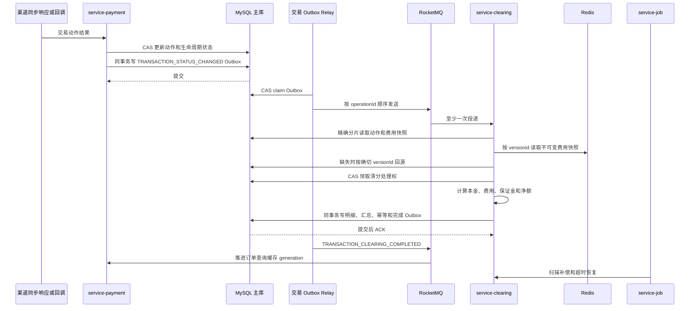
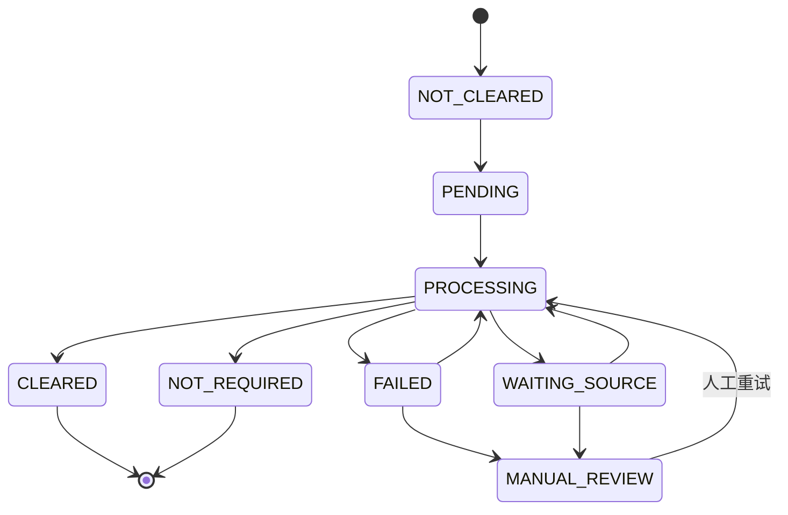

# 收单交易清分落地设计

## 1. 文档定位

本文定义 `acquiring-orchestration` 收单交易清分一期的可实施方案，覆盖交易终态事件、费用配置快照、
费用与保证金计算、清分汇总和明细、Redis 与 RocketMQ 联动、幂等、补偿、人工重算、监控、自动运行和验收。

配套数据库迁移草案见：

- [20260825_01_transaction_clearing_schema_draft.sql](../sql/20260825_01_transaction_clearing_schema_draft.sql)
- [20260826_01_settlement_phase_a_schema_draft.sql](../sql/20260826_01_settlement_phase_a_schema_draft.sql)
- [20260826_02_settlement_phase_a_precheck_draft.sql](../sql/20260826_02_settlement_phase_a_precheck_draft.sql)
- [20260826_03_settlement_phase_a_postcheck_draft.sql](../sql/20260826_03_settlement_phase_a_postcheck_draft.sql)
- [20260826_07_settlement_posting_precheck.sql](../sql/20260826_07_settlement_posting_precheck.sql)
- [20260826_08_settlement_posting_migration.sql](../sql/20260826_08_settlement_posting_migration.sql)
- [20260826_09_settlement_posting_postcheck.sql](../sql/20260826_09_settlement_posting_postcheck.sql)

本文以当前代码和架构为基线：

1. 交易事实表由 ShardingSphere-JDBC 逻辑表访问，按 `transaction_date_time` 和
   `Asia/Shanghai` 路由到 `yyyy0Q` 季度物理表。
2. 当前正式交易拓扑包含 25 张逻辑表；启用交易清分明细、保证金清分明细和保证金清分状态后增加为 28 张。
3. `service-payment` 已在交易终态 CAS 事务中写入 `TRANSACTION_STATUS_CHANGED` Outbox，事件使用
   `operation_id` 作为 RocketMQ 顺序分组键。
4. `service-payment` 已实现首次交易和后续动作的费用版本冻结，写入结构化版本字段及
   `fee_config_snapshot_json`；本地 `payment_acquiring` 已执行对应兼容字段和唯一索引迁移。
5. `service-clearing` 已形成本地事务清分写入、异常补偿和受控管理链路，本地开发库已完成 28 表拓扑迁移；
   Nacos、Broker 和真实交易环境验收仍须按发布门禁执行。
6. `model-settlement`、`core-settlement` 和 `service-settlement` 已实现候选自动激活、批次汇率、结果聚合、
   单批净额入账、保证金资金化、交易投影、可靠 Outbox、取消和独立冲正；本地开发库已完成配套 SQL 迁移。
7. 商户交易查询缓存已经采用 3 天基础 TTL 加 0 至 24 小时随机秒，并使用 generation 失效模型。
8. `fee_plan`、`fee_plan_version`、`fee_rule`、`fee_rule_tier`、费用试算、资金账户和保证金基础表已经存在。

本地实现和开发库迁移不等于生产放行。只有完成 MQ、Nacos、分片规则、监控、真实交易和完整回归门禁后，
才能在 UAT 或生产开启真实清分与结算。

## 2. 一期目标与边界

### 2.1 一期目标

1. 每一条达到收费触发条件的 `transaction_operation` 形成一份唯一、可审计、可重放的清分结果。
2. 交易终态到正常清分完成的延迟目标为 P95 小于 2 秒、P99 小于 10 秒；异常补偿不超过 5 分钟发现。
3. MQ 重复投递、渠道重复回调、消费者重启和任务重复执行均不能产生重复费用、重复保证金或重复清分明细。
4. 清分使用交易动作受理时冻结的费用版本，费率后来变更不得影响历史动作。
5. 清分结果和候选表直接为后续结算提供按商户、目标结算币种、可结算日期筛选的数据源。
6. 商户在交易后高频查询订单时继续优先命中 Redis；清分完成后可靠推进 generation，避免长期返回旧财务状态。

### 2.2 清分服务明确不做

1. 不修改 `merchant_fund_account.available_balance`。
2. 不写 `merchant_fund_ledger` 真实资金流水。
3. 不把预计保证金直接写成 `merchant_reserve_item.HELD`。
4. 不执行商户出款，不生成真实结算批次。
5. 不确认未知渠道成本，不实现文件对账。
6. 不向商户 OpenAPI 新增费用明细字段；若后续开放，必须单独做接口版本和安全评审。
7. 不新增交易状态 `CLOSED`，也不把结算完成混入清分状态。

### 2.3 二期衔接

二期结算只能认领一期已经 `CLEARED`、当前修订仍有效且候选状态为 `READY` 的清分结果。结算成功后：

- `clearing_status` 仍保持 `CLEARED`；
- `settlement_candidate` 变更为 `POSTED`，交易 `settlement_status` 仅作为异步查询投影更新为 `SETTLED`；
- 预计保证金在实际扣留后才生成 `merchant_reserve_item.HELD`；
- 已结算清分禁止覆盖重算，差异通过新的调整明细处理。

## 3. 核心术语和不变量

| 术语 | 定义 |
|---|---|
| 生命周期 | 一笔根交易及其授权、请款、退款、撤销、拒付等后续动作，共享 `operation_id` |
| 交易动作 | `transaction_operation` 中的一条记录，由动作级 `transaction_id` 唯一标识 |
| 清分 | 基于交易事实和费用版本，分别形成按实际组件币种保存的交易清分事实、标签币种保证金事实和动作级财务汇总；不选结算汇率 |
| 结算 | 锁定已清分数据和批次汇率矩阵，统一完成换汇、跨币种费用限额、资金入账、保证金留存及出款 |
| 费用快照 | 交易动作受理时冻结的商户生效费用版本、候选规则、保证金及结算配置 |
| 清分修订号 | 同一动作清分结果的审计版本，从 1 递增 |

系统必须保持以下不变量：

1. 一个动作级 `transaction_id` 只有一个当前有效清分汇总。
2. `operation_id` 只用于生命周期聚合和消息保序，不能作为动作清分唯一键。
3. 所有明细金额为非负值，商户资金方向由 `CREDIT` 或 `DEBIT` 表达。
4. 当前有效明细的有符号金额之和必须等于清分汇总净额。
5. `CLEARED` 和 `NOT_REQUIRED` 是清分终态，普通重试不能覆盖。
6. 已结算修订不能被修改或标记为无效，只能追加调整动作或调整明细。
7. Redis 不是费用版本、阶梯累计、清分状态或资金余额的事实源。
8. RocketMQ 按至少一次投递设计，任何消费者都不能假设 exactly-once。
9. 百分比费用只以动作 `label_amount + label_currency` 为基数；固定费、最低费和最高费严格沿用现有商户费用配置的 USD 口径。标签币种非 USD 时分别保留标签币种百分比组件和 USD 固定费用事实，禁止清分时为凑成单币种而提前换汇。
10. 交易清分明细与保证金清分明细使用独立事实表，任何一方不得通过 `item_type` 混存到另一方。
11. 保证金扣留、返还、释放和调整只追加新明细；原扣留明细永不覆盖，退款返还使用原支付固化费率。
12. 清分表和保证金表不保存结算汇率、结算币种等值或汇率报价；所有换汇证据只属于不可变结算批次。
13. 同一结算批次的同一 `source_currency -> target_currency + rate_type` 只能有一条不可变汇率。
14. 一个清分修订只能被一个活动或已入账批次持有；Redis 锁、JVM 计数器和消息顺序都不能替代数据库唯一键与 CAS。
15. 清分费用必须来自当前动作 `merchant_id` 在动作受理时生效的 `MERCHANT` 费用方案版本；无配置、未生效、商户不匹配或 hash 不一致均进入人工复核，禁止使用平台默认费率或模板当前版本兜底。

## 4. 模块和所有权

### 4.1 推荐模块

| 模块 | 所有权 |
|---|---|
| `service-payment` | 交易事实、终态 CAS、交易快照、终态 Outbox、交易查询缓存 |
| `service-clearing` | 清分消费、费用选择、计算编排、清分汇总和明细、重试及内部接口 |
| `service-settlement` | 候选激活与认领、批次号、汇率矩阵、统一费用限额、结算结果、单批净额入账、保证金资金化及异步投影 |
| `finance-library` | 聚合财务领域共享模型和纯计算内核；父模块不包含 Java 业务代码 |
| `model-money` | 费用、保证金和后续结算共用的有符号金额、币种和 exponent 值对象 |
| `model-fee` / `core-fee` | 费用规则、阶梯、退款返费、费用预览契约及纯计算内核 |
| `model-reserve` / `core-reserve` | 标签币种保证金扣留、返还契约及纯计算内核，接口不允许出现汇率 |
| `model-settlement` / `core-settlement` | 批次汇率、换汇和跨币种费用组契约及纯计算内核，不访问数据库或余额 |
| `service-admin` | 费用方案配置审批、清分查询、人工复核和人工重算发起 |
| `service-job` | 注册清分补偿 Handler，调用 `service-clearing` 内部接口，不直接写交易表 |
| `component-mq` | 共享 Topic、Tag 和消息 DTO，不包含清分业务规则 |
| `component-db` | 28 张交易逻辑表的 ShardingSphere 拓扑和季度算法 |

`finance-library` 的依赖只能单向流动：`model-money` 位于最底层，`model-fee`、`model-reserve` 只能依赖
`model-money`，`core-fee` 只能依赖费用和金额模型，`core-reserve` 只能依赖保证金和金额模型，
`core-settlement` 只能依赖结算和金额模型。任何服务都不能
通过该库反向访问数据库、Redis、RocketMQ 或其他服务。

七个财务子模块统一使用根工程 `finance-library.version`，当前为 `1.0.0-SNAPSHOT`。开发阶段采用统一
`SNAPSHOT`，生产发布使用固定 SemVer 和 Git Tag；公开模型或计算语义的不兼容变更提升主版本，向后兼容能力
提升次版本，不改变契约的缺陷修复提升修订版本。禁止单独发布某一个 `model-*` 或 `core-*` 版本。

`service-data` 不承载清分。该服务继续负责商户通知、安全审计等异步数据处理，避免资金计算与通用 MQ
消费边界混杂。

### 4.2 `service-clearing` 包结构

```text
service-clearing
├── api/internal
├── application
├── config
├── domain
│   ├── model
│   ├── state
│   └── service
├── dto
├── entity
├── mapper
├── mq
├── service
└── service/impl
```

建议的关键类型：

```text
ClearingApplication
ClearingEventConsumer
ClearingCommandService
ClearingCalculationService
ClearingPersistenceService
ClearingFailureService
ClearingCompensationService
FeeConfigurationSnapshotService
ClearingExchangeRateService
TierAccumulatorService
ClearingStateEnum
ClearingFailureCodeEnum
TransactionClearingDetailDO
TransactionReserveClearingDetailDO
TransactionReserveClearingStateDO
TransactionFinanceStateMapper
TransactionClearingDetailMapper
TransactionReserveClearingDetailMapper
TransactionReserveClearingStateMapper
FeeTierAccumulatorMapper
```

`Mapper` 只负责数据访问；状态判断、费率选择、方向和公式必须留在领域或应用层。

## 5. 整体处理流程



主触发不再新增一条语义重复的 `TRANSACTION_CLEARING_REQUESTED`。`service-clearing` 直接消费当前已经可靠
存在的 `TRANSACTION_STATUS_CHANGED`，减少一次 Outbox 写入和一次 MQ 投递。业务等待、人工重试和补偿使用
Delay Topic 的 `TRANSACTION_CLEARING_RETRY_DUE`，清分完成使用 `TRANSACTION_CLEARING_COMPLETED`。

## 6. 清分触发矩阵

### 6.1 终态动作

| 交易动作 | 终态 | 本金方向 | 可收费 | 预计保证金 | 源清分依赖 |
|---|---|---|---|---|---|
| `PAYMENT` | `SUCCESS` | `CREDIT` | 交易费、风险费 | 是 | 无 |
| `PAYMENT` | `FAILED` | 无 | 仅 `SUCCESS_OR_FAILURE`、`ON_CALL` | 否 | 无 |
| `AUTHORIZATION` | `SUCCESS/FAILED` | 无 | 授权或风险调用费 | 否 | 无 |
| `PRE_AUTHORIZATION` | `SUCCESS/FAILED` | 无 | 预授权或风险调用费 | 否 | 无 |
| `INCREMENTAL_AUTHORIZATION` | `SUCCESS/FAILED` | 无 | 按配置 | 否 | 原授权，仅审计 |
| `CAPTURE` | `SUCCESS` | `CREDIT` | 交易费、请款费、风险费 | 是 | 原授权 |
| `PRE_AUTH_COMPLETION` | `SUCCESS` | `CREDIT` | 交易费、完成费 | 是 | 原预授权 |
| `REFUND` | `SUCCESS` | `DEBIT` | 退款费 | 否 | 原支付或请款 |
| `VOID` | `SUCCESS` | 通常无 | 撤销费 | 否 | 原授权或未结算动作 |
| `REVERSAL` | `SUCCESS` | 原明细反向 | 不用当前费率重算原费用 | 反向调整 | 必须 |
| `CHARGEBACK` | `SUCCESS` | `DEBIT` | 拒付费 | 否 | 原支付或请款 |
| `REPRESENTMENT` | `SUCCESS` | `CREDIT` | 二次请款费 | 按合同 | 原拒付 |
| `RETRIEVAL_REQUEST` | 完成 | 无 | 调单费 | 否 | 原支付或请款 |

### 6.2 触发规则

1. `TRANSACTION_STATUS_CHANGED` 的数据库状态必须再次从主库读取，消息状态只用于路由和审计。
2. `SUCCESS` 动作按动作类型决定是否生成本金。
3. `FAILED` 动作只有命中 `SUCCESS_OR_FAILURE` 或存在可验证的 `ON_CALL` 事实时才生成费用。
4. 没有本金、费用、保证金和调整项时，清分结果为 `NOT_REQUIRED`，不能伪造零金额明细。
5. 非终态消息不清分；若未来需要独立风险调用收费，应新增风险费用事实事件，不复用交易终态。
6. 重复渠道回调未推进交易状态时不得新增终态 Outbox，因此不会重复触发正常清分。

## 7. 费用配置冻结和读取

### 7.1 动作受理时冻结

每个交易动作都必须写一条自身的 `transaction_merchant_snapshot`，不能只依赖生命周期首笔交易。新增结构化字段：

```text
fee_plan_id
fee_plan_version_id
fee_plan_version_no
fee_snapshot_hash
fee_snapshot_time
```

`fee_config_snapshot_json` 只保存本动作所属商户在受理时生效版本的不可变内容。商户绑定是快照的一部分，
清分加载时必须同时校验 `snapshot.merchantId == transaction.merchantId == transaction_merchant_snapshot.merchant_id`：

```json
{
  "schemaVersion": 3,
  "merchantId": "M00010001",
  "feePlanId": 1001,
  "feePlanVersionId": 1008,
  "feePlanVersionNo": 8,
  "pricingLockTime": "2026-08-25T10:00:00.123",
  "settlementCurrency": "USD",
  "percentageBasis": "LABEL_AMOUNT",
  "feeCurrencyPolicy": "LABEL_PERCENTAGE_USD_FIXED_LIMITS",
  "roundingMode": "HALF_UP",
  "reserve": {
    "rate": "10.00000000",
    "basis": "LABEL_AMOUNT",
    "delayUnit": "D",
    "delayDays": 180,
    "refundPolicy": "PROPORTIONAL_RETURN"
  },
  "refundFeeReturnPolicy": "NONE",
  "rules": [
    {
      "ruleId": 2001,
      "percentageRate": "2.30000000",
      "fixedFeeUsd": "0.30000000",
      "minimumFeeUsd": "0.50000000",
      "maximumFeeUsd": "5.00000000"
    }
  ],
  "snapshotHash": "sha256 hex"
}
```

快照不得包含 PAN、CVV、有效期、JWT、密钥、账单地址或持卡人资料。费用计算如果需要 MCC、支付方式、
卡品牌、交易国家等维度，应只保存对应非敏感枚举值。

### 7.2 读取优先级

| 优先级 | 数据源 | 说明 |
|---|---|---|
| 1 | 当前动作 `fee_config_snapshot_json` | 完整且 hash 校验通过时直接使用 |
| 2 | Redis `fee:version:{versionId}` | 只读取快照明确引用的不可变版本 |
| 3 | Slave 按 `fee_plan_version_id` 查询 | 只允许查不可变的 `ACTIVE/SUPERSEDED` 版本 |
| 4 | Master 按相同 `fee_plan_version_id` 查询 | Slave 未同步或数据不完整时强一致回源 |
| 禁止 | 按商户查询消费时最新费率 | 会污染历史交易 |

如果快照不存在或 hash 不一致，不得静默使用当前费率或按零费用通过，必须进入失败和补偿流程。

### 7.3 Redis Key

| Key | Value | TTL/失效 |
|---|---|---|
| `merchant:activeFee:{merchantId}` | 当前生效版本指针及摘要 | 沿用常驻缓存和审批 Outbox 失效 |
| `fee:version:{versionId}` | 不可变完整版本 | 30 天加随机秒，可按访问续期 |
| `fee:version:miss:{versionId}` | 不存在短标记 | 30 至 60 秒 |
| `fee:tier:{merchantId}:{ruleId}:{yyyyMM}` | COUNT 笔数或按现有配置口径归一到 USD 的月累计只读镜像 | 月末后保留 7 天 |

活动费用缓存用于交易动作受理时生成快照；清分阶段不以活动版本指针作为历史事实。

## 8. RocketMQ 契约

### 8.1 Topic 和 Tag

交易生命周期统一使用 RocketMQ 5.x FIFO Topic `acquiring_payment_transaction_fifo_topic`；
`payment-event` 只保留商户通知等不要求交易级顺序的兼容消息。业务等待重试使用独立的 RocketMQ 5.x
Delay Topic。定时消息不能伪装成 FIFO 消息，顺序和延时也不能依赖同一种 Topic 类型：

| Topic | Tag | 生产者 | 消费者 | 消息类型 |
|---|---|---|---|---|
| `acquiring_payment_transaction_fifo_topic` | `TRANSACTION_STATUS_CHANGED` | `service-payment` | `service-clearing`、`service-risk` 等 | 顺序消息 |
| `acquiring_payment_transaction_fifo_topic` | `TRANSACTION_CLEARING_COMPLETED` | `service-clearing` | `service-payment` 查询缓存等 | 顺序消息 |
| `acquiring_payment_clearing_delay_topic` | `TRANSACTION_CLEARING_RETRY_DUE` | `service-clearing` | `service-clearing` | 定时/延时消息 |

人工复核以 `transaction_abnormal_event` 和指标告警为事实，不为了“使用普通消息”额外制造无消费者的 MQ。
未来确有工单或通知消费者时，再在普通事件 Topic 增加 `TRANSACTION_CLEARING_MANUAL_REVIEW`。

主消息分组键沿用 `operation_id`，保证同一生命周期内的支付、请款、退款等动作尽量按序消费。不同商户和
不同生命周期可以并行，不能使用 `merchant_id` 做顺序键，否则大商户会形成热点。

顺序消息不是源依赖的唯一保证。跨季度 Outbox 并行扫描、Delay Topic 重试或补偿可能造成后续动作先到，
消费者仍必须检查源清分状态；源清分未完成时进入 `WAITING_SOURCE` 并发送定时重试。

### 8.2 主触发消息

沿用当前 `PaymentTransactionEventMessage`：

```json
{
  "messageId": "EV20260825...",
  "createdAt": "2026-08-25T10:00:01.123",
  "traceId": "...",
  "retryCount": 0,
  "transactionId": "动作级平台交易号",
  "operationId": "生命周期关联号",
  "merchantId": "商户号",
  "merchantOrderNo": "商户订单号",
  "transactionType": "PAYMENT",
  "transactionStatus": "SUCCESS",
  "eventType": "TRANSACTION_STATUS_CHANGED",
  "transactionDateTime": "2026-08-25T10:00:00.123"
}
```

消息不得携带完整订单对象或费用计算结果。`transactionDateTime` 是强制分片键，消费者缺失时直接拒绝。

### 8.3 完成消息

`TRANSACTION_CLEARING_COMPLETED` 继续使用现有 `PaymentTransactionEventMessage` 字段，只把
`eventType` 改为完成 Tag，不新增 `TransactionClearingEventMessage`：

```json
{
  "messageId": "CEV20260825...",
  "transactionId": "动作级平台交易号",
  "operationId": "生命周期关联号",
  "merchantId": "商户号",
  "merchantOrderNo": "商户订单号",
  "transactionType": "PAYMENT",
  "transactionStatus": "SUCCESS",
  "eventType": "TRANSACTION_CLEARING_COMPLETED",
  "transactionDateTime": "2026-08-25T10:00:00.123"
}
```

这样可以直接兼容当前查询缓存消费者和 `TransactionEventMessage` 反序列化路径。MQ 不传播清分状态、修订号
或金额，避免消息成为第二份财务事实；下游需要这些数据时按交易号和分片时间查询数据库。

### 8.4 重试到期消息

Delay Topic 使用 `ClearingRetryDueMessage`，在基础交易身份之外只携带控制字段：

```json
{
  "messageId": "CRV20260825...",
  "transactionId": "动作级平台交易号",
  "operationId": "生命周期关联号",
  "merchantId": "商户号",
  "merchantOrderNo": "商户订单号",
  "transactionType": "REFUND",
  "transactionStatus": "SUCCESS",
  "eventType": "TRANSACTION_CLEARING_RETRY_DUE",
  "transactionDateTime": "2026-08-25T10:00:00.123",
  "sourceEventNo": "EV20260825...",
  "expectedClearingRevision": 0,
  "clearingRetryCount": 3,
  "retryReasonCode": "SOURCE_CLEARING_PENDING",
  "deliverAt": "2026-08-25T10:15:00.123Z"
}
```

`deliverAt` 和 Outbox `deliver_at` 都按 UTC 毫秒解释并必须一致；不一致时 Relay 拒绝投递。消费者只把这些
字段用于身份、CAS 预期和审计，交易终态、源清分状态、费用版本和金额仍从数据库读取。

### 8.5 Transaction Outbox 兼容改造

当前 `DefaultTransactionEventOutboxRelayService` 会先把未知交易事件解析成基础 DTO。为同时支持冻结 JSON、
顺序投递和 RocketMQ 定时投递，启用清分前必须完成以下兼容改造：

1. `transaction_event_outbox` 增加 `delivery_mode=AUTO/NORMAL/ORDERLY/SCHEDULED` 和 `deliver_at`。
2. `MqProducer` 增加 `sendSerializedOrderly(...)` 和 `sendSerializedAt(...)`，Relay 直接发送数据库冻结的 JSON，
   不再通过基础 DTO 重建后丢失扩展字段。
3. 所有新生命周期 Outbox 必须使用 FIFO Topic、`ORDERLY` 和非空 `message_group=operation_id`；持久化入口对
   非 FIFO Topic、普通或延时投递直接拒绝，不能再产生新的旧 Topic 生命周期记录。
4. 历史 `AUTO` 记录仍由 Relay 兼容：有 `message_group` 时按序发送，否则普通发送。这个分支只用于迁移前已存在的
   旧 Topic 在途记录，不能作为新生产逻辑的降级路径。
5. 清分完成 Outbox 使用 `ORDERLY + operation_id`；清分重试 Outbox 使用 `SCHEDULED + deliver_at`，且 Topic
   固定为 Delay Topic，不同时设置顺序发送。
6. 只有一个 Transaction Outbox Relay 扫描同一批事件；若将 Relay 抽到公共模块，`service-payment` 和
   `service-clearing` 不能各自无过滤地重复扫描。

### 8.6 FIFO/Delay 部署顺序

1. 先在 Broker 创建并核验 FIFO Topic、Delay Topic 及对应消费者组，确认类型、权限、重试和 DLQ 配置正确。
2. 暂停产生新的交易生命周期消息，保留数据库写入和只读查询能力。
3. 排空旧 `payment-event` 中的生命周期 Outbox、Broker backlog、原生重试队列和 DLQ 待处置消息，并保存核对证据。
4. 在同一维护窗口切换生产者、Outbox Relay 和所有生命周期消费者到 FIFO Topic，禁止只切一端。
5. 验证同一 `operation_id` 顺序、重复投递幂等、Delay 重试和查询缓存 generation 后再恢复交易入口。
6. 若生产环境不能提供维护窗口，必须先实现并验证双消费去重或桥接迁移方案；当前代码不支持直接无停机切换，
   不得在旧、新 Topic 同时存在未知 backlog 时直接放量。

### 8.7 投递策略

1. 短暂网络、Redis 或数据库异常：抛出异常，使用 RocketMQ 原生消费重试。
2. 源清分等待、Slave 不可见等清分业务延时：落库失败状态和下一次时间，写 `SCHEDULED` Outbox，ACK 当前消息。
3. 延时阶梯建议为 `1m、5m、15m、1h、6h`。
4. 超过最大次数或确定不可恢复：进入 `MANUAL_REVIEW`，不继续无限投递。
5. 数据库补偿扫描始终保留，不能只依赖 Broker 延时消息和 DLQ。

## 9. 清分状态机

### 9.1 权威状态

`transaction_finance_state.clearing_status` 是动作级清分权威状态：



### 9.2 状态含义

| 状态 | 含义 | 是否终态 |
|---|---|---:|
| `NOT_CLEARED` | 尚未触发或历史数据未处理 | 否 |
| `PENDING` | 已接收清分请求 | 否 |
| `PROCESSING` | 某实例已领取处理租约 | 否 |
| `WAITING_SOURCE` | 退款、冲正等依赖的源清分尚未完成 | 否 |
| `FAILED` | 可重试失败，必须有失败码和 `next_retry_time` | 否 |
| `MANUAL_REVIEW` | 配置不明确、重试耗尽或资金风险需人工复核 | 人工终态 |
| `CLEARED` | 已形成有效清分汇总和明细 | 是 |
| `NOT_REQUIRED` | 经规则判断不产生任何财务项 | 是 |

对需要保证金的动作，只有交易清分明细、保证金清分明细和保证金状态在同一事务全部成功后才能进入
`CLEARED`；任何一部分失败都必须整体回滚，不能出现“交易费用已清分、保证金未清分”的半完成状态。

`transaction_operation.clearing_status` 是查询投影，不暴露短暂 `PROCESSING`；`PROCESSING` 映射为
`PENDING`。`transaction_order.clearing_status` 是生命周期聚合投影：

```text
NOT_CLEARED / PENDING / PARTIALLY_CLEARED / CLEARED / FAILED / NOT_REQUIRED
```

动作投影映射固定为：`NOT_CLEARED -> NOT_CLEARED`，`PENDING/PROCESSING/WAITING_SOURCE -> PENDING`，
`FAILED/MANUAL_REVIEW -> FAILED`，终态保持 `CLEARED/NOT_REQUIRED`。生命周期主单只聚合已经存在的终态动作：

1. 存在 `FAILED` 动作时为 `FAILED`。
2. 已完成和待处理动作并存时为 `PARTIALLY_CLEARED`。
3. 全部待处理且尚无完成动作时为 `PENDING`。
4. 全部为 `NOT_REQUIRED` 时为 `NOT_REQUIRED`。
5. 全部已完成且至少一个为 `CLEARED` 时为 `CLEARED`。
6. 尚无清分触发记录时为 `NOT_CLEARED`。

### 9.3 CAS 规则

任何状态更新必须包含：

```sql
WHERE transaction_id = ?
  AND transaction_date_time = ?
  AND clearing_status IN (...)
  AND version = ?
```

禁止无条件更新、按 `operation_id` 广播更新或用 Redis 锁代替数据库 CAS。

## 10. 数据模型

### 10.1 清分汇总

不新增重复的清分主表，增强现有 `transaction_finance_state` 作为动作级清分汇总和后续财务状态表。

关键调整：

1. 动作唯一键从 `operation_id` 改为 `transaction_id`。当前 `operation_id` 是生命周期关联号，后续请款、
   退款会复用，不能承担动作清分唯一性。
2. 增加 `merchant_id`、源动作、清分状态、修订号、费用版本、处理租约、失败原因和可结算日期。
3. 组件金额字段使用 `DECIMAL(24,8)`；清分汇总不新增汇率字段。
4. `fee_items_json` 仅保留查询摘要，不作为结算和审计事实。
5. 现有 `settlement_rate`、`settlement_amount`、`settlement_fee_amount` 等列属于历史兼容列，清分必须保持空；
   结算结果进入批次表和资金流水，不能回填成清分时事实。

金额字段语义：

| 字段 | 语义 |
|---|---|
| `label_currency` | 本动作本金、百分比费用基数和保证金负债币种 |
| `gross_label_amount` | 本动作标签币种下的有符号本金 |
| `platform_fee_amount` | 仅汇总币种等于 `label_currency` 的费用组件；存在异币种组件时不是最终费用 |
| `fee_reversal_amount` | 仅汇总币种等于 `label_currency` 的费用返还组件 |
| `fee_component_currency_count` | 当前有效费用组件涉及的币种数量 |
| `fee_evaluation_status` | `FINAL_AT_CLEARING` 或 `PENDING_SETTLEMENT_RATE` |
| `merchant_receivable_amount` | 仅在全部组件均为标签币种且限额已求值时可用，否则为空 |
| `reserve_amount` | 标签币种当前动作新增保证金扣留正数合计 |
| `reserve_reversal_amount` | 标签币种当前动作新增保证金返还或释放正数合计 |
| `net_settlement_amount` | 历史兼容列；存在异币种费用时保持空，不能作为结算输入 |
| `settlement_amount` | 历史兼容列；清分阶段始终为空 |
| `channel_fee_amount` | 已确认渠道成本，一期保持空 |

因此 `transaction_finance_state` 是状态和单币种查询投影，不是跨币种费用的权威汇总。结算必须读取当前修订的
清分明细，不能读取 `fee_items_json` 或把上述兼容汇总列当作最终应结金额。

### 10.2 清分明细

新增第 26 张季度逻辑表 `transaction_clearing_detail`，使用与当前动作相同的 `transaction_date_time` 路由。
该表只保存交易本金、平台费用、费用返还和交易调整，禁止保存任何保证金项目。

明细类型：

| `item_type` | 说明 | 常见方向 |
|---|---|---|
| `PRINCIPAL` | 支付、请款、退款、拒付等本金 | 支付 `CREDIT`，退款 `DEBIT` |
| `PLATFORM_FEE` | 交易费、风险费、退款费、拒付费 | `DEBIT` |
| `FEE_REVERSAL` | 原费用返还 | `CREDIT` |
| `ADJUSTMENT` | 交易本金或费用的人工差错调整 | 按业务方向 |

明细永不物理删除。重算前未结算数据时，旧修订明细改为 `SUPERSEDED`；冲正使用新反向明细并引用
`source_clearing_detail_no`，不能修改原金额或把原明细排除出历史事实。`record_status` 只使用
`ACTIVE/SUPERSEDED`；冲正关系由反向明细表达，不增加会改变净额口径的 `REVERSED` 状态。

每个费用规则先生成稳定 `fee_group_no`，再按原币种拆成原子组件。明细核心字段如下：

| 字段 | 说明 |
|---|---|
| `fee_group_no` | 同一规则一次收费的逻辑组号，百分比、固定费和限额事实共享 |
| `component_type` | `PRINCIPAL`、`PERCENTAGE`、`FIXED`、`LIMIT_ADJUSTMENT`、`REVERSAL`、`ADJUSTMENT` |
| `amount + currency + currency_exponent` | 当前原子事实的非负原币种金额；清分表唯一权威金额 |
| `basis_amount + basis_currency` | 百分比基数；`PERCENTAGE` 必须等于动作标签金额和标签币种 |
| `percentage_rate` | 百分比快照，例如 `2.3` 表示 `2.3%` |
| `minimum_amount_usd/maximum_amount_usd` | 商户规则的 USD 最低/最高费用事实；不是本行应收金额 |
| `limit_evaluation_status` | `NOT_REQUIRED`、`FINAL_AT_CLEARING`、`PENDING_SETTLEMENT_RATE` |
| `rule_snapshot_hash/formula_snapshot` | 费用版本、规则和公式审计证据 |

例如 100 EUR 交易配置“`2.3% + 0.30 USD，最低 0.50 USD，最高 5 USD`”，清分至少生成同一
`fee_group_no` 下的 `PERCENTAGE 2.30 EUR` 和 `FIXED 0.30 USD` 两条组件；USD 上下限作为组级规则事实保存，
`limit_evaluation_status=PENDING_SETTLEMENT_RATE`。清分不得生成 EUR/USD 汇率，也不得伪造一条已换算的最终费用。

如果百分比组件、固定组件和上下限从一开始就是同一币种，可以在清分阶段完成限额并写
`FINAL_AT_CLEARING`；跨币种组必须等待结算批次锁汇率。结算产生的 `LIMIT_ADJUSTMENT` 属于结算结果项，
不得反向插入或覆盖清分事实。

阶梯费用明细额外保存 `tier_period_key`、`tier_metric`、累计笔数及 USD 归一累计金额的 before、delta、after
值。阶梯语义沿用现有商户配置：包含本笔后的累计值决定本笔整笔适用档位，不增加新的阶梯计价模式。

### 10.3 保证金清分明细

新增第 27 张季度逻辑表 `transaction_reserve_clearing_detail`，使用产生该明细的当前动作
`transaction_date_time` 路由。该表只保存保证金事实，不保存本金和费用。

| `reserve_action_type` | 说明 | 商户视角方向 |
|---|---|---|
| `HOLD` | 支付、请款成功后预计扣留保证金 | `DEBIT` |
| `RETURN` | 退款后按原支付比例返还保证金 | `CREDIT` |
| `RELEASE` | 保证金到期后的释放事实，二期使用 | `CREDIT` |
| `ADJUSTMENT` | 经复核的保证金差错调整 | 按业务方向 |

每条 `RETURN` 必须保存 `original_transaction_id`、`original_transaction_date_time` 和
`source_reserve_detail_no`，精确引用原支付 `HOLD` 明细。原 `HOLD` 明细保持不变；支付 100 USD、保证金率
10% 后写 `HOLD 10 USD`，再退款 20 USD 时新增 `RETURN 2 USD`，两条事实同时存在，净扣留为 8 USD。

保证金明细只保存原支付费用版本、保证金快照 hash、标签币种基数、原保证金费率、计算公式以及
`reserve_currency + amount`。`reserve_currency` 固定等于原支付 `label_currency`，不保存结算币种、汇率、
报价 ID、估值时间或结算币种等值。

`RETURN` 复用原 `HOLD` 的保证金比例和币种，最后一笔返还以 `remaining_amount` 兜底，防止多次舍入导致
返还超过原扣留。保证金不是费用，不参与费用阶梯、费用上下限或费用合计。支付结算时的扣留和未来释放分别
使用各自结算批次的统一汇率，持有期间汇率波动由商户承担，不回写保证金清分表。

### 10.4 保证金清分状态

新增第 28 张季度逻辑表 `transaction_reserve_clearing_state`，统一使用 `transaction_date_time` 分片列；
该列在本表保存原支付动作业务时间，因此仍按原支付所在季度路由。每笔可计提保证金的原支付动作一行：

```text
reserveCurrency = originalLabelCurrency
retainedAmount
returnedAmount
releasedAmount
debitAdjustmentAmount
creditAdjustmentAmount
retainedAmount + debitAdjustmentAmount
    = returnedAmount + releasedAmount + creditAdjustmentAmount + remainingAmount
```

退款清分阶段必须通过原交易 locator 取得原支付分片时间，并在同一数据库事务中
`SELECT ... FOR UPDATE` 锁定该状态行。状态表是并发控制和当前余额投影，不替代不可变保证金明细。
人工差额调整只能追加 `ADJUSTMENT` 明细：`DEBIT` 增加标签币种保证金负债并累计到
`debit_adjustment_amount`，`CREDIT` 减少负债并累计到 `credit_adjustment_amount`。申请与复核人必须不同；
调整不得修改原 `HOLD/RETURN/RELEASE` 明细，也不得读取汇率或直接写商户余额。

### 10.5 月累计阶梯

新增非分表单表 `fee_tier_accumulator`，注册到 `transaction` 复合数据源的单表规则中，使它与季度清分
明细在同一个物理 MySQL 主库本地事务内更新。

唯一维度：

```text
merchant_id + fee_plan_version_id + fee_rule_id + period_key
```

`COUNT` 累计笔数；`AMOUNT` 沿用现有费用配置的 USD 归一累计口径。归一事实由清分编排层从已冻结的交易
计价事实取得，纯计算内核不查询汇率。Redis 中的月累计仅是只读镜像，生产计费必须在事务中
`SELECT ... FOR UPDATE` 锁定累计行，计算后更新。

### 10.6 现有表复用

| 表 | 清分用途 |
|---|---|
| `transaction_operation` | 当前动作金额、状态、类型、支付和渠道摘要 |
| `transaction_order` | 生命周期聚合投影和商户查询 |
| `transaction_locator` | 源交易缺少时间时恢复真实分片时间 |
| `transaction_merchant_snapshot` | 动作费用和结算配置快照 |
| `transaction_currency_conversion` | 保留交易阶段渠道换汇事实；不得保存结算批次汇率或被清分用于提前换汇 |
| `transaction_event_outbox` | 终态、重试、完成和人工复核事件 |
| `transaction_idempotency` | `MQ_CONSUME_CLEARING` 消费成功唯一兜底 |
| `transaction_abnormal_event` | 清分异常案件、去重和人工处理审计 |

## 11. 金额、费用和汇率算法

### 11.1 基本要求

1. Java 使用 `BigDecimal` 和 `MathContext.DECIMAL128`，禁止 `double`、`float`。
2. 交易金额和清分持久化精度至少 8 位小数；结算批次汇率至少 12 位小数。
3. 计算中间过程不舍入，费用明细最终落账时按目标币种 exponent 和版本快照的舍入模式舍入。
4. 汇总必须使用已经舍入的有效明细求和，不能先汇总后统一舍入。
5. JPY、KRW 等零位币种和 BHD、KWD 等三位币种必须使用 ISO 配置，不能默认两位。
6. 百分比组件按标签币种舍入，固定组件按 USD 舍入；标签币种非 USD 时，组件和 USD 上下限在清分阶段禁止相加比较。
7. 不同币种的费用组件禁止直接相加，清分汇总键必须包含组件 `currency`；AMOUNT 阶梯只使用既有 USD 归一累计事实。

### 11.2 金额基数和方向规则

本金和费用不能混用同一个金额字段：

1. 成功资金动作的本金优先使用渠道最终 `approved_amount + approved_currency`。
2. 渠道未返回批准金额时，只有在终态成功且系统已确认金额未变化的情况下，才回退
   `transaction_amount + transaction_currency`；否则进入 `AMOUNT_INVALID`。
3. 失败动作、纯授权动作和无资金动作不生成本金。
4. 所有百分比费用使用动作自身 `label_amount + label_currency` 作为基数；固定费、最低费和最高费直接读取
   商户生效规则现有的 `_usd` 字段，币种恒为 USD。禁止新增任意原币种配置或改写成标签币种。
5. 退款、请款等后续动作使用自身 label/批准金额，不复用源交易全额。

所有明细金额保存绝对值：

```text
signedAmount(CREDIT, amount) = +amount
signedAmount(DEBIT, amount)  = -amount
```

```text
grossLabelAmount      = current action signed label principal
feeAmount[currency]     = sum(PLATFORM_FEE DEBIT component amount by currency)
feeReversal[currency]   = sum(FEE_REVERSAL CREDIT component amount by currency)
reserveAmount[label]    = sum(HOLD DEBIT reserve amount)
reserveReversal[label]  = sum(RETURN/RELEASE CREDIT reserve amount)
provisionalNet[label]   = grossLabelAmount - feeAmount[label]
                          + feeReversal[label] - reserveAmount[label] + reserveReversal[label]
```

`provisionalNet` 只用于同标签币种查询投影。只要存在异币种费用组件或待结算限额，它就不是最终应结金额，
必须标记 `PENDING_SETTLEMENT_RATE`。最终净额只在结算批次使用统一汇率矩阵计算并落结算结果。

### 11.3 百分比和固定费用

配置中的费率值 `2.3` 表示 `2.3%`：

```text
percentageComponent = round(labelAmount × percentageRate / 100,
                            labelCurrencyExponent, roundingMode)
fixedComponent      = round(configuredFixedAmount,
                            usdExponent, roundingMode)
```

所有费用类别，包括交易手续费、内风控费、外风控费、3DS 手续费、退款手续费、拒付费和结算货币兑换费，
都使用上述组件模型。百分比部分为标签币种；固定费、最低费和最高费固定为 USD。

收费触发字段保持现有 Admin 配置语义：`NOT_APPLICABLE` 表示该费用不需要额外触发事实，终态成功时正常收费；
`NO_CHARGE` 才表示不收费；`SUCCESS`、`SUCCESS_OR_FAILURE` 和 `ON_CALL` 分别表示成功收费、成功或失败收费、
实际调用对应风险服务时收费。清分不得把合法的 `NOT_APPLICABLE` 非风控规则解释为零费用。

`SETTLEMENT_FX_FEE` 只在动作成功、会形成结算本金或冲减且标签币种不同于冻结结算币种时适用。
`PAYMENT/CAPTURE/PRE_AUTH_COMPLETION/REFUND/CHARGEBACK/REPRESENTMENT` 可以命中；授权、预授权和增量授权
不形成结算本金，因此不收该费用；标签币种等于结算币种时也不收。

每条清分明细保存：`fee_group_no`、组件类型、费率版本、规则 ID、阶梯 ID、基数、原币种金额、币种
exponent、USD 上下限原值、求值状态、公式和 hash。清分明细禁止出现汇率或结算等值金额。

### 11.4 清分阶段的汇率边界

清分不读取结算汇率，不因汇率缺失失败，也不向 `transaction_currency_conversion` 写 `CLEARING` 场景。
跨币种费用组仅保存 `PENDING_SETTLEMENT_RATE`。汇率方向、来源、报价、生效时间、锁定时间和操作者全部由
第 19 节的 `settlement_batch_rate` 保存。同币种在结算计算器中使用恒等换算 1，可选择保存
`SYSTEM_IDENTITY` 证据，但不能在清分表增加占位汇率字段。

### 11.5 授权和请款

- 授权、预授权和增量授权不形成可结算本金。
- 一步支付成功形成本金。
- 独立请款和预授权完成按本次成功金额形成本金。
- 部分请款按每次动作单独清分、单独计提保证金。
- 授权类动作仍可根据 `charge_trigger` 生成授权费或风险调用费。

### 11.6 退款、撤销、冲正和拒付

1. 退款本金为 `DEBIT`，退款费仍为 `DEBIT`。
2. 原交易费返还策略固定来自原动作费用快照：`NONE`、`FULL`、`PROPORTIONAL`。
3. 比例返费比例为本次退款标签金额除以原成功标签本金，但返还基数必须是原来实际收取的费用，而不是当前费率。
4. 原费用组在清分已 `FINAL_AT_CLEARING` 时，按每个原币种组件比例生成返还组件并分别受原组件累计返还上限约束；
   最后一笔全额退款使用各组件剩余可返金额兜底。
5. 原费用组为 `PENDING_SETTLEMENT_RATE` 时，必须等待原批次形成 `FEE_GROUP_FINAL`；返费按该实际收费目标币种
   金额计算，返还组件币种固定为原结果目标币种，并保存 `source_settlement_result_item_no`。原批次未完成时
   当前动作进入 `WAITING_SOURCE`，不能按原始
   组件猜测或突破原实际收费上限。默认 `refundFeeReturnPolicy=NONE` 不受此等待影响。
6. 冲正不得使用当前费率重算，必须逐条引用原有效清分明细或已入账结算结果生成反向事实。
7. 拒付本金为 `DEBIT`，拒付费单独 `DEBIT`；保证金冻结和实际扣减留到资金阶段。
8. 二次请款成功恢复本金时使用 `CREDIT`，并关联原拒付动作。

## 12. 保证金方案

### 12.1 一期计算

默认保证金基数：

```text
reserveBasisLabel = max(positive labelAmount, 0)
holdAmountLabel = round(reserveBasisLabel × originalReserveRate / 100,
                        labelCurrencyExponent, roundingMode)
```

默认规则：

1. PAYMENT、CAPTURE、PRE_AUTH_COMPLETION 成功计提预计保证金。
2. 授权、失败交易、退款费、风险费不计提保证金。
3. 退款默认按原支付标签金额和原支付保证金率比例返还，禁止读取退款时的新费率。
4. 累计返还不得超过原扣留金额；最后一笔全额退款用剩余可返还金额兜底舍入尾差。
5. 预计释放日按原支付费用版本中的 T/D+N 规则和结算日历计算。

退款返还公式：

```text
calculatedReturn = round(refundLabelAmount × originalReserveRate / 100,
                         labelCurrencyExponent, originalRoundingMode)
returnAmount = min(calculatedReturn, remainingHeldAmount)
```

支付 100 USD、原保证金率 10% 时写一条 `HOLD 10 USD`；退款 20 USD 时新增一条 `RETURN 2 USD`，原
`HOLD 10 USD` 保持不变，状态表更新为累计已返还 2 USD、剩余可返还 8 USD。

一期只写独立保证金清分明细、保证金状态和 finance state 汇总。`merchant_reserve_item` 当前默认 `HELD`，
在没有真实资金扣留前不能写入。

### 12.2 支付和退款完整示例

假设一步支付成功 100 USD，标签币种和结算币种均为 USD，保证金率 10%。交易清分表至少形成以下事实；
未命中配置的可选费用不生成零金额占位行：

| 表 | 当前动作 | 明细类型 | 费用类别/风险类型 | 方向 | 金额口径 |
|---|---|---|---|---|---|
| 交易清分明细 | 支付 | `PRINCIPAL` | - | `CREDIT` | 100 USD |
| 交易清分明细 | 支付 | `PLATFORM_FEE` | `TRANSACTION_FEE` | `DEBIT` | 标签币种规则计算值 |
| 交易清分明细 | 支付 | `PLATFORM_FEE` | `RISK_FEE/INTERNAL` | `DEBIT` | 如有 |
| 交易清分明细 | 支付 | `PLATFORM_FEE` | `RISK_FEE/EXTERNAL` | `DEBIT` | 如有 |
| 交易清分明细 | 支付 | `PLATFORM_FEE` | `RISK_FEE/THREE_DS` | `DEBIT` | 如有 |
| 交易清分明细 | 支付 | `PLATFORM_FEE` | `SETTLEMENT_FX_FEE` | `DEBIT` | 如有，仍以 USD 标签币种计费 |
| 保证金清分明细 | 支付 | `HOLD` | - | `DEBIT` | 10 USD |

之后退款成功 20 USD，当前退款动作新增：

| 表 | 当前动作 | 明细类型 | 费用类别 | 方向 | 金额口径 |
|---|---|---|---|---|---|
| 交易清分明细 | 退款 | `PRINCIPAL` | - | `DEBIT` | 20 USD |
| 交易清分明细 | 退款 | `PLATFORM_FEE` | `REFUND_FEE` | `DEBIT` | 标签币种规则计算值 |
| 交易清分明细 | 退款 | `PLATFORM_FEE` | `SETTLEMENT_FX_FEE` | `DEBIT` | 如有，仍以 USD 标签币种计费 |
| 交易清分明细 | 退款 | `FEE_REVERSAL` | 原费用返还 | `CREDIT` | 仅原支付快照配置返费时生成 |
| 保证金清分明细 | 退款 | `RETURN` | - | `CREDIT` | 2 USD，引用原 `HOLD` 明细 |

退款后保证金事实总计两条：原支付 `HOLD 10 USD` 和退款 `RETURN 2 USD`；本次退款只新增后一条，原明细不变。
保证金状态为 `retained_amount=10`、`returned_amount=2`、`released_amount=0`、`remaining_amount=8`。

### 12.3 二期资金化

结算批次成功扣留保证金后：

1. 以 `merchantId + reserveClearingDetailNo` 作为保证金来源业务唯一键；
2. 创建 `merchant_reserve_item.HELD`；
3. 创建对应不可变资金流水；
4. 保证金释放使用独立批次和唯一幂等键；
5. 已释放后发生拒付，不回改历史保证金，使用新的扣减或负余额流水。

## 13. 阶梯费率并发方案

### 13.1 现有配置口径

不修改 `fee_rule` 或 `fee_rule_tier` 的字段和含义。`fee_mode=TIER` 时继续使用现有整笔适用语义：

- `COUNT`：`countAfter=countBefore+1`，按包含本笔后的累计笔数选择本笔档位。
- `AMOUNT`：`amountUsdAfter=amountUsdBefore+currentAmountUsd`，按既有 USD 归一累计口径选择本笔档位。
- 选中的档位作用于本笔完整标签金额；不追溯重算此前交易，也不新增 `VOLUME/GRADUATED` 配置。

百分比仍按本笔标签金额和标签币种计算，选中档位的固定费、最低费和最高费仍固定为 USD。清分计算器只接收
调用方提供的 `amountUsdBefore/currentAmountUsd` 事实，不在费用内核中查询或推导汇率。

### 13.2 事务步骤

1. 使用与金额计算相同的适用性判断筛出真正命中的阶梯规则，按 `fee_rule_id` 排序；未命中规则不得占用累计锁。
2. 对本动作全部适用规则一次批量 `INSERT ... ON DUPLICATE KEY` 初始化累计行。
3. 以商户、费用版本、月份和规则 ID 集合执行一次 `IN (...) ORDER BY fee_rule_id FOR UPDATE`，按稳定顺序批量锁定；
   返回行缺失、重复或身份不一致时整笔失败。
4. 校验本动作尚未形成有效清分明细，读取每条规则的 `countBefore/amountUsdBefore`，并取得当前动作已冻结的
   `currentAmountUsd` 计价事实。
5. 按规则的 `COUNT` 或 `AMOUNT` 指标选择当前动作整笔适用档位并批量插入清分明细。
6. 一次批量 CASE/CAS 更新所有累计行，每行使用各自旧 `version`；受影响行数必须等于适用规则数，否则整体回滚。
7. 更新 finance state 为 `CLEARED` 并在同一事务提交。

不能先 `Redis INCR` 再写数据库。事务失败时累计和清分必须一起回滚。相同
`transaction_id + clearing_revision + fee_rule_id` 只能贡献一次累计增量。

历史迟到动作按“清分入账顺序”进入累计。若合同要求严格按交易发生时间重排，应在月结前做月度 true-up；
已结算数据只能产生差额调整，不能覆盖。
### 13.3 阶梯交易重算

阶梯累计会影响后续动作，不能把普通单笔重算规则直接套用：

1. 当前动作之后尚无同累计维度交易时，可锁定累计行，回退本动作 delta 后生成新修订。
2. 已有后续动作时，禁止单笔改费率并直接改累计；必须按商户、版本、规则、月份进入“期间重放”。
3. 期间重放申请以 `request_key` 唯一，提交人和复核人必须来自可信 Admin 登录上下文且不能相同；触发规则必须
   属于指定不可变费用版本的完整阶梯规则闭包。
4. 批准事务先把申请从 `PENDING_REVIEW` CAS 到 `PREPARING`，再按规则 ID 锁定全部数据库累计行；按
   `clearing_complete_time + transaction_id` 冻结整月动作，单次批量统计保证金事实，禁止逐动作 N+1 查询。
5. 期间存在已结算动作、任一 ACTIVE 保证金事实、缺失/已认领候选或身份不一致时，整个申请进入
   `MANUAL_REVIEW`，不覆盖历史修订、不自动改保证金；后续只能走经审批的差额调整。
6. 可重放候选必须为无批次归属的 `READY`，准备事务统一切换为 `REPLAY_HOLD`。该状态不允许结算认领；每个
   动作完成时在同一短事务将旧修订置为 `SUPERSEDED`、追加新修订并把旧 `REPLAY_HOLD` 候选替换为新 `READY`。
7. 重放控制表按稳定 `sequence_no` 严格逐项推进，每项独立短事务；失败按到期时间重试，第 8 次失败或确定性
   资金门禁错误转 `MANUAL_REVIEW`，不得跳项或无限重试。
8. `TierPeriodReplayScheduler` 随服务自动启动，每 5 秒有界扫描一次，不依赖 yml/Nacos 开关。服务重启后从
   数据库控制表、重放项和游标恢复；Redis 月累计只读镜像在数据库权威累计重建后再失效/刷新。

## 14. 消费幂等和事务边界

### 14.1 幂等维度

| 层次 | 幂等键/条件 |
|---|---|
| MQ 技术消费 | `MQ_CONSUME_CLEARING + consumerGroup:messageId` |
| 动作清分汇总 | `transaction_finance_state.transaction_id` 唯一 |
| 当前修订明细 | `finance_state_id + clearing_revision + line_no` 唯一 |
| 业务费用项 | `transaction_id + clearing_revision + item_code` 唯一 |
| 保证金扣留 | `original_transaction_id + clearing_revision + HOLD` 唯一 |
| 保证金退款返还 | `refund_transaction_id + clearing_revision + source_reserve_detail_no + RETURN` 唯一 |
| 原支付保证金状态 | `original_transaction_id` 唯一，并以原支付时间精确路由 |
| 保证金资金化 | `merchant_id + reserve_clearing_detail_no` |
| 清分异常 | `CLEARING:{transactionId}:{failureCode}` 去重 |

`transaction_idempotency` 成功记录在阶段 B 与清分明细、汇总和完成 Outbox 同一事务插入：

```text
idempotency_scope = MQ_CONSUME_CLEARING
idempotency_key = service-clearing-transaction-status:{messageId}
transaction_status = SUCCESS
result_snapshot = {financeStateId, clearingStatus, clearingRevision}
```

相同 `messageId` 重投命中该记录后直接 ACK；不同消息号指向同一动作时，以 finance state 的
`transaction_id` 唯一键和 `CLEARED/NOT_REQUIRED` 终态返回成功。阶段 A 不写“成功”幂等记录，避免领取后
崩溃导致永久跳过。`result_snapshot` 不保存金额或费用配置正文。

### 14.2 两段短事务

禁止持有数据库事务等待 Redis、Slave 或任何远程服务。清分流程不调用结算汇率服务。

阶段 A，领取处理权：

1. 主库精确读取交易动作，确认终态。
2. 插入或取得 finance state。
3. CAS `PENDING/FAILED/WAITING_SOURCE/MANUAL_REVIEW -> PROCESSING`。
4. 写 `processing_owner` 和 `processing_deadline`，提交短事务。

事务外准备：

1. 读取并校验费用快照；
2. 加载不可变费用版本；
3. 读取源动作定位信息、源交易清分结果、原保证金扣留明细和保证金状态；
4. 按商户生效规则构建标签币种百分比和 USD 固定费/上下限计算上下文，并标识跨币种限额待结算求值。

生命周期和源动作定位必须执行以下固定步骤：

1. 先按当前 `transaction_id` 读取 locator，校验 `merchant_id`、`operation_id`，取得
   `root_transaction_id + root_transaction_date_time`，供更新生命周期 `transaction_order` 投影。
2. 从当前 `transaction_operation.source_transaction_id` 取得源动作号；没有源动作的首笔交易跳过源查询。
3. 在主库通过非分表 `transaction_locator.transaction_id` 精确查询源动作 `transaction_date_time`。
4. 校验源 locator 的 `merchant_id` 和 `operation_id` 与当前生命周期一致；不一致直接进入人工复核。
5. 使用源 `transaction_id + transaction_date_time` 精确读取源 operation、finance state、有效交易清分明细、
   原 `HOLD` 明细和保证金状态。
6. locator 缺失时先补偿定位记录；禁止把解析交易号时间作为唯一生产路由依据，也禁止跨季度广播查询。

阶段 B，完成清分：

1. 校验处理 owner、deadline、状态和 version；
2. 有阶梯规则时按商户、费用版本、规则和月份锁定 USD 归一累计行并完成最终计算；
3. 退款需要返还保证金时，按原支付分片时间锁定 `transaction_reserve_clearing_state`，计算返还上限；
4. 分别批量写入交易清分明细和保证金清分明细，禁止跨表混存；
5. 更新原支付保证金状态、finance state 汇总和 `CLEARED/NOT_REQUIRED`；
6. 按当前动作时间 CAS 更新 operation，并按 locator 的根交易时间 CAS 更新 order 清分投影；
7. 写成功的 `transaction_idempotency`；
8. 写 `TRANSACTION_CLEARING_COMPLETED` Outbox；
9. 同一事务提交后 ACK MQ。

若阶段 B 提交后、MQ ACK 前进程退出，重复消息会命中 finance state 终态和数据库唯一键，直接成功返回。

阶段 A、阶段 B 的所有 Mapper 均必须运行在 `@DS(DataSourceName.TRANSACTION)` 下。当前复合数据源的
`SingleRuleConfiguration(transaction_rw.*)` 会把 `transaction_idempotency` 和 `fee_tier_accumulator`
识别为同库单表，因此它们可以和季度明细使用一个本地事务；事务内禁止调用固定路由到 `master` 的 Service，
否则会脱离同一事务管理器。

### 14.3 伪代码

```java
public void onMessage(TransactionEventMessage message) {
    validateIdentityAndShardTime(message);
    if (alreadyConsumed(message.getMessageId())) {
        return;
    }
    TransactionOperation operation = loadTerminalOperationFromPrimary(message);
    Claim claim = claimClearing(operation, message);
    if (claim.alreadyCompleted()) {
        return;
    }
    try {
        PreparedContext prepared = prepareOutsideTransaction(operation, claim);
        completeInTransaction(prepared, claim);
    } catch (SourceClearingPendingException exception) {
        waitForSourceAndScheduleRetry(claim, exception);
    } catch (RetryableClearingException exception) {
        failAndScheduleRetry(claim, exception);
    } catch (NonRetryableClearingException exception) {
        moveToManualReview(claim, exception);
    }
}
```

## 15. 失败码和处置

| 失败码 | 可重试 | 处置 |
|---|---:|---|
| `TRANSACTION_NOT_FOUND` | 是 | 短延时后主库重查 |
| `TRANSACTION_NOT_TERMINAL` | 否 | 记录异常，拒绝清分 |
| `TRANSACTION_VERSION_CONFLICT` | 是 | 重读交易事实 |
| `FEE_SNAPSHOT_MISSING` | 是 | 尝试按确切版本回源，耗尽后人工 |
| `FEE_SNAPSHOT_HASH_MISMATCH` | 否 | `MANUAL_REVIEW`，禁止使用 |
| `FEE_VERSION_NOT_FOUND` | 是 | Slave 后回主库，耗尽后人工 |
| `FEE_VERSION_NOT_IMMUTABLE` | 否 | `MANUAL_REVIEW` |
| `FEE_RULE_NOT_CONFIGURED` | 否 | 成功资金动作不得静默零费，人工确认 |
| `FEE_RULE_AMBIGUOUS` | 否 | 配置冲突，人工处理 |
| `AMOUNT_INVALID` | 否 | 负数、币种或 exponent 不一致 |
| `FEE_COMPONENT_CURRENCY_INVALID` | 否 | 固定费或上下限缺少显式币种、币种精度不存在 |
| `SOURCE_CLEARING_PENDING` | 是 | `WAITING_SOURCE`，延时重试 |
| `SOURCE_CLEARING_NOT_FOUND` | 是 | 定位并补偿源动作 |
| `SOURCE_SETTLEMENT_PENDING` | 是 | 跨币种原费用尚未形成实际收费结果，等待后再计算返费 |
| `TIER_ACCUMULATOR_CONFLICT` | 是 | 事务回滚并重试 |
| `RESERVE_SOURCE_NOT_FOUND` | 是 | 等待原支付保证金清分完成后重试 |
| `RESERVE_RETURN_EXCEEDED` | 否 | 返还超过剩余可返还金额，进入人工复核 |
| `RESERVE_STATE_CONFLICT` | 是 | 原支付保证金状态锁或 CAS 冲突，回滚重试 |
| `CLEARING_CAS_CONFLICT` | 是 | 重读终态，可能是重复消费 |
| `CLEARING_PERSISTENCE_ERROR` | 是 | 数据库异常重试 |
| `CLEARING_RETRY_EXHAUSTED` | 否 | `MANUAL_REVIEW` 和高优先级告警 |

失败原因日志和 `transaction_abnormal_event.raw_reference_json` 只保存 ID、状态、失败码和摘要，不保存费用
配置全文、交易请求全文或持卡人信息。

## 16. 补偿和历史回填

### 16.1 任务职责

`service-job` 新增 `ClearingCompensationJob`，通过带内部签名的客户端调用：

```text
POST /internal/clearing/v1/compensations/scan
```

Job 只传时间范围、游标、批大小和 dry-run 参数；扫描、CAS 和 Outbox 写入全部由 `service-clearing` 完成。

### 16.2 扫描类型

| 类型 | 条件 | 动作 |
|---|---|---|
| 漏清分 | 终态动作且无 finance state | 创建 PENDING 和重试 Outbox |
| PENDING 超时 | 请求时间超过阈值 | 创建立即到期的重试 Outbox |
| PROCESSING 超时 | `processing_deadline < now` | CAS 转 FAILED 并重试 |
| FAILED 到期 | `next_retry_time <= now` | 创建 `SCHEDULED` 重试 Outbox |
| WAITING_SOURCE 到期 | 源动作已完成或到期 | 重试或升级人工 |
| 历史缺口 | `clearing_status=NOT_CLEARED` | dry-run 后回填 |
| 结果不平 | 汇总与有效明细不一致 | CRITICAL 异常，禁止结算 |

扫描约束：

1. 每次限定一个季度或明确半开时间范围。
2. 使用 `transaction_date_time + id` 游标，不使用 OFFSET。
3. 默认批大小 200，最大 1000。
4. 先查主键和状态，再分批处理，禁止长事务扫表。
5. 同一补偿任务允许重复执行，所有写入必须幂等。

### 16.3 历史订单

历史回填分三步：

1. `DRY_RUN`：只计算，不写清分表，输出按商户、币种、费用类别汇总的差异。
2. `SHADOW_WRITE`：写独立修订但保持功能开关不向结算开放。
3. `ACTIVATE`：抽样核对通过后将当前修订置为有效。

历史交易缺少快照时，按动作受理时间查找唯一有效费用版本。找不到或同时命中多个版本时进入人工复核，
禁止使用当前活动费率。

## 17. 人工重试和重算

### 17.1 内部接口

| 接口 | 用途 |
|---|---|
| `POST /internal/clearing/v1/transactions/{transactionId}/retry` | 对失败或人工状态重新触发 |
| `POST /internal/clearing/v1/transactions/{transactionId}/recalculate` | 未结算动作生成新修订 |
| `GET /internal/clearing/v1/transactions/{transactionId}` | 查询汇总、明细和失败信息 |
| `POST /internal/clearing/v1/compensations/scan` | Job 扫描和历史回填 |

所有请求必须携带 `transactionDateTime`，并经过内部 token/签名、网络隔离和调用方白名单。
内部接口在 HMAC-SHA256、时间戳和 nonce 验证后继续执行路径级 caller 授权：`service-admin` 只能访问
`/internal/clearing/v1/transactions/**`，`service-job` 只能访问
`/internal/clearing/v1/compensations/**`，未知 caller 和未知路径默认拒绝。服务启动时必须保持内部认证开启、
认证白名单不得覆盖清分内部路径；启用清分消费者时必须注入非默认 HMAC 密钥。Admin/Job 客户端同时校验固定
caller、服务根地址、非空密钥和有界超时，浏览器不得接触内部密钥。

### 17.2 重算规则

1. 只允许候选尚未被活动批次认领，即候选为 `READY`；交易 `settlement_status=NOT_SETTLED` 仅作附加投影校验。
2. 请求必须提供原因、操作人、预期当前修订号和目标费用版本。
3. 新修订号为当前修订加 1；旧明细保留并标记 `SUPERSEDED`。
4. 同一事务以 CAS 把旧修订候选从 `READY` 改为 `SUPERSEDED`，再为新修订插入新的 `READY` 候选；
   已被批次 `CLAIMED/POSTED` 的候选不得重算。
5. 新修订、候选切换、汇总更新和审计 Outbox 在同一事务。
6. 已结算数据拒绝重算；必须创建单独 `ADJUSTMENT` 业务动作。
7. 人工修改具体金额不属于重算，必须走双人复核的调整流程。
8. 命中阶梯规则的动作必须遵守 13.3 节；存在后续累计时不得执行孤立单笔重算。

建议权限：

```text
clearing:record:list
clearing:record:detail
clearing:record:retry
clearing:record:recalculate
clearing:record:review
```

## 18. 商户查询缓存联动

当前交易查询缓存继续使用：

```text
TTL = 3 天 + 0 至 24 小时随机秒
generation TTL = 5 天
```

`TransactionQueryCacheInvalidationConsumer` 增加
`TRANSACTION_CLEARING_COMPLETED` 和未来 `TRANSACTION_SETTLEMENT_COMPLETED` Tag。

处理原则：

1. 清分成功事务内写完成 Outbox，不能直接删除 Redis 后再提交数据库。
2. 完成事件消费后推进 `merchantId + merchantOrderNo` generation。
3. 旧 generation 的缓存自然过期，不做全量 Key 扫描。
4. Redis 失效失败必须抛出异常由 MQ 重试；数据库事实不回滚。
5. 查询缓存中禁止出现卡号、CVV 和有效期，继续沿用现有写入字段扫描门禁。
6. 一期不强制商户查询响应暴露费用明细；内部/Admin 通过清分查询接口获取。
7. 完成事件保持 `PaymentTransactionEventMessage` 基础契约，现有消费者只需扩展 selector 和
   `SUPPORTED_EVENTS`，不需要引入第二套反序列化 DTO。

### 18.1 待结算余额口径迁移

当前 `JdbcMerchantPendingBalanceQueryService` 直接汇总 `transaction_operation` 本金，只能得到“成功且未结算
交易本金”，没有扣除交易费和保证金，也无法表达 USD 固定费等异币种组件。清分上线后必须分两步迁移：

1. 仅对 `clearing_status=CLEARED` 的动作，从当前有效清分修订和保证金明细按原币种汇总；同币种可展示
   预计净额，异币种费用单列，禁止在没有批次汇率时伪装成商户结算币种余额。
2. `settlement_candidate=POSTED` 后从待结算查询排除；批次入账完成事件推进余额和订单查询缓存 generation。
3. 清分未完成的成功交易单列为“待清分本金”，不能与已清分预计净额相加后返回一个精确余额。
4. 最终可用余额只读取资金账户和不可变资金流水，不能从交易本金或清分明细实时反推。

## 19. 后续结算消费规则

虽然一期不执行结算，清分数据和 SQL 草案必须满足以下可直接实现的结算契约。

### 19.1 候选生成和认领

```text
clearing_status = CLEARED
record_status = ACTIVE
settlement_eligible_date <= businessDate
merchant_id = targetMerchant
candidate_status = READY
```

清分完成事务为每个 `finance_state_id + clearing_revision` 创建一条 `settlement_candidate`。候选只保存定位、
商户、结算配置版本和最早结算日，不复制费用金额。唯一键
`source_type + source_business_id + source_revision` 保证一个清分修订只有一个候选。结算按候选精确路由到季度
清分表，再读取该修订的全部交易和保证金事实，不能只认领单条费用组件而拆散一个费用组。

候选状态机：

```text
READY --CAS(batchNo, version)--> CLAIMED --> POSTED
  ^                                |
  +---- cancel before posting -----+
  |
  +---- new clearing revision makes old candidate SUPERSEDED
                                   +--> MANUAL_REVIEW
```

认领 SQL 必须包含 `candidate_status='READY' AND version=?`，并原子写入 `settlement_batch_no`。更新行数为 0 时
重读：已被同一批次认领视为幂等成功，被其它活动/已入账批次认领则跳过。禁止边查边付，也禁止 Redis 锁替代
候选行 CAS。CAS 成功后同一事务追加 `settlement_batch_candidate` 审计关系；批次取消时把关系改为
`RELEASED` 而不是删除，因此候选重新进入其它批次后仍能追溯历史认领。

退款、冲正和保证金返还还必须写 `settlement_candidate_dependency`：退款候选依赖原支付候选，依赖类型至少
包含 `RESERVE_HOLD_POSTED` 和 `SOURCE_FINANCIAL_POSTED`。批次只能认领“依赖已 `POSTED`”的候选，或者把依赖
候选一并认领到同一批次，并按原支付在前、退款在后的拓扑顺序计算和入账。这样既支持同一日批次净额处理，
又禁止先返还尚未扣留的保证金。依赖环、跨商户依赖或跨账户不兼容依赖直接进入 `MANUAL_REVIEW`。

### 19.2 批次号和创建幂等

批次号存储格式固定为 `SByyyyMMdd-NNNNNNNN`，例如 `SB20260825-00000001`；界面可显示为
`2026-08-25 00000001`。业务日期必须读取独立 `business_date` 字段，任何业务逻辑不得解析批次号。

同一数据库事务内按以下顺序生成：

1. `INSERT IGNORE` 当日 `settlement_batch_daily_sequence(business_date, current_sequence=0)`。
2. `SELECT ... FOR UPDATE` 锁定该业务日期行。
3. 校验当前值小于 `99999999` 后加 1。
4. 使用 8 位日期和 8 位左补零序号格式化批次号。
5. 插入 `settlement_batch`，同时写业务唯一的 `create_request_key`。
6. 提交事务。

`create_request_key` 由调用方在创建前按规范化 UTF-8 字符串计算 SHA-256：

```text
REGULAR|merchantId|settlementProfileId|businessDate|cutoffBeginUtc|cutoffEndUtc|targetCurrency|scheduleRunId
```

重试必须复用同一 `scheduleRunId`；人工补批使用审批请求号作为最后一段，冲正批次使用原批次号和冲正申请号。
字段顺序、UTC 时间格式和大小写必须固定，禁止使用当前时间或随机数生成幂等键。

序号允许因事务竞争或失败产生空洞，绝不回收。禁止 `MAX+1`、`COUNT+1`、Redis-only `INCR`、JVM
`AtomicInteger` 或现有 `PaymentOrderNoGenerator`。数据库同时约束
`UNIQUE(settlement_batch_no)` 和 `UNIQUE(create_request_key)`；同一创建请求重试返回已存在批次。

### 19.3 批次汇率矩阵

批次目标币种来自商户已冻结的结算配置。收集全部本金、费用组件、费用限额和本批保证金动作涉及的源币种，
为每个 `source_currency -> target_currency + rate_type` 锁定一条 `settlement_batch_rate`：

```text
UNIQUE(settlement_batch_no, source_currency, target_currency, rate_type)
1 source_currency = direct_rate target_currency
```

“同一批次统一汇率”表示每个币种对只有一条不可变汇率，不是把不同源币种金额先相加后只乘一次。同币种使用
`direct_rate=1` 和 `SYSTEM_IDENTITY`。批次进入 `RATE_LOCKED` 后，汇率数值、方向、来源、quote ID、生效时间
和锁定时间都不可修改；重试必须复用原行。缺失、过期、零值或负值时批次停在可重试失败状态，不能默认 1，
也不能回写清分明细。

当前 `AdminSettlementRateResolver` 只支持直接 `label_currency -> USD`，不能复用于该矩阵。结算汇率解析器必须
支持任意目标币种、直接报价、反向报价归一和同币种恒等。固定执行顺序为：事务外收集币种对并取得报价，短事务
内按唯一键插入全部汇率，核对币种对集合完整后 CAS 批次到 `RATE_LOCKED`。并发插入命中唯一键时读取已锁行；
值不一致不得覆盖，进入人工复核。运行账户不提供汇率表的 UPDATE/DELETE Mapper，数据库审计必须监控异常变更。

### 19.4 统一计算和汇总

结算读取交易清分明细和保证金清分明细两套事实，禁止用一个 `item_type` 混查。先按以下维度汇总原币种：

```text
merchant_id + payment_type + payment_method + transaction_type
+ source_currency + direction + fee_category + fee_group_no
```

同时统计笔数和原币种金额。随后使用批次汇率矩阵转换到目标结算币种，并按费用组执行：

```text
convertedPercentage = percentageComponent * rate(componentCurrency -> target)
convertedFixed      = fixedComponent      * rate(componentCurrency -> target)
convertedRawFee     = sum(convertedPercentage, convertedFixed, ...)
convertedMinimum    = minimumAmount * rate(minimumCurrency -> target)
convertedMaximum    = maximumAmount * rate(maximumCurrency -> target)
limitedFee          = min(max(convertedRawFee, convertedMinimum), convertedMaximum)
finalFee            = round(limitedFee, targetCurrencyExponent, roundingMode)
```

只在费用组最终结果落目标币种时舍入；换汇中间值保留 `DECIMAL128` 精度。`settlement_result_item` 同时引用全部
源清分组件和批次汇率行，并记录命中的 `NONE/MINIMUM/MAXIMUM`，从而能解释“标签币种百分比 + USD 固定费 +
USD 上下限”的每一步。结果汇总按支付类型/方式、币种、交易类型、费用类别和笔数生成，最后才形成余额流水。

完整算例：100 EUR 支付，交易费 `2.3% + 0.30 USD`，最低 `0.50 USD`、最高 `5.00 USD`，保证金 10%，
商户结算币种 USD；批次锁定 `1 EUR = 1.10 USD`：

| 阶段 | 不可变结果 |
|---|---|
| 清分 | 本金 `100 EUR`；百分比组件 `2.30 EUR`；固定组件 `0.30 USD`；限额事实 `0.50/5.00 USD`；保证金 `HOLD 10 EUR`；无汇率 |
| 结算换算 | 本金 `110.00 USD`；百分比组件 `2.53 USD`；固定组件 `0.30 USD`；保证金扣留等值 `11.00 USD` |
| 费用限额 | 原始费用 `2.83 USD`，未命中最低/最高，最终费用 `2.83 USD` |
| 余额入账 | `110.00 - 2.83 - 11.00 = 96.17 USD`，只写一条净额 `LEDGER_POSTING` |
| 保证金负债 | `merchant_reserve_item` 仍记录 `retained=10 EUR, remaining=10 EUR`；`11.00 USD` 只属于本批结算证据 |

若未来释放时批次汇率变为 `1 EUR = 1.05 USD`，释放 `10 EUR` 对余额增加 `10.50 USD`，原保证金清分记录和
`retained_amount=10 EUR` 均不修改，汇率差异按已确认规则由商户承担。

结果行用 `result_role` 防止审计组件被重复入账：`TRACE` 保存每个原币种组件的换汇证据，
`FINANCIAL_COMPONENT` 保存本金、费用组最终值和保证金动作并参与业务汇总，`LEDGER_POSTING` 只保存批次最终
净额且必须具有唯一资金幂等键。只有 `LEDGER_POSTING` 可以写 `merchant_fund_ledger`，不能把本金、费用和净额
三套结果同时写余额流水。

### 19.5 保证金结算和兼容改造

保证金负债始终以原支付 `label_currency` 计量。支付批次将 `HOLD` 按支付批次汇率从本次应结款中扣除；
退款的 `RETURN` 和到期 `RELEASE` 按各自动作进入的结算批次汇率处理。原 `HOLD 10 EUR` 不因历史汇率变化
而改变为其它保证金金额。

现有 `merchant_reserve_item.currency` 注释要求等于结算币种，必须兼容改造为 `reserve_currency` 语义：

1. `reserve_currency` 等于保证金清分的标签币种，`retained/returned/released/remaining` 均使用该币种。
2. 为兼容当前每商户每结算币种一个 `merchant_fund_account` 的结构，`account_id` 继续指向所属结算资金账户；
   它只表示归属账户，不代表保证金计量币种，允许账户结算币种与 `reserve_currency` 不同。
3. 实际从结算目标币种扣留/返还的金额和汇率只保存在结算结果项及资金流水中。
4. 存量记录的原币种不变，经核对后把原 `currency` 迁移为 `reserve_currency`，禁止按当前汇率改写历史金额。

### 19.6 批次状态、重试、取消和冲正

```text
CREATED -> CLAIMING -> RATE_LOCKED -> CALCULATING -> POSTING -> POSTED
                  \-> FAILED_RETRYABLE -> 原阶段重试
                  \-> MANUAL_REVIEW
CREATED/CLAIMING/RATE_LOCKED/CALCULATING -> CANCELLED
POSTED -> REVERSING -> REVERSED
```

失败重试使用原 `settlement_batch_no`、`create_request_key` 和已锁汇率。只有尚未产生任何资金流水、未提交外部
出款且未发送不可撤回指令的批次才能取消；取消事务以 CAS 将本批 `CLAIMED` 候选恢复为 `READY` 并清空当前
批次归属。任何资金流水已入账后禁止取消或重算原批次，只能创建引用原批次的新冲正/调整批次，逐条生成反向
结算结果和反向资金流水。

冲正批次按原 `LEDGER_POSTING.target_amount + target_currency` 一比一反向，不使用冲正日新汇率重新计算；
每条反向流水保存 `reversal_of_ledger_id`，每条反向结算结果引用原结果项。保证金扣留若已发生后续返还、释放、
冻结或扣减，禁止整项自动冲正，必须先计算当前剩余负债并进入人工调整流程，避免把已释放资金再次返还。

批次和资金的四层防重固定为：

1. `settlement_batch_no` 唯一。
2. `create_request_key` 唯一。
3. `settlement_candidate` 来源唯一并通过状态/version CAS 独占批次。
4. 资金流水 `idempotency_key` 唯一，建议格式
   `SETTLEMENT:{batchNo}:{accountId}:{currency}:{ledgerType}`，控制在现有 `VARCHAR(128)` 内；商户号由账户归属校验。

批次成功后先提交批次结果和资金流水，再通过 Outbox 异步更新 finance state、交易投影和查询缓存 generation；
投影失败不回滚已入账资金，由 MQ 重试。结算状态以批次、候选和资金流水为事实源。

资金入账事务必须通过 `@DS(DataSourceName.TRANSACTION)` 使用当前 ShardingSphere 复合数据源。它的写资源就是
`master`，固定结算表、`merchant_fund_account`、`merchant_fund_ledger`、`merchant_reserve_item` 与 Single Rule
处于同一物理主库，因此可以形成一个本地事务。事务中固定按账户 ID 排序后 `SELECT ... FOR UPDATE` 锁账户，
校验商户和目标币种，再更新余额、插入唯一资金流水、更新保证金当前投影以及 CAS 批次/候选到 `POSTED`。
禁止在该事务中调用现有标注 `@DS(MASTER)` 的 Admin Service，避免动态数据源切换破坏原子性；
`service-settlement` 应提供只走 `TRANSACTION` 的专用 Mapper。

现有资金流水使用“已持有账户行锁后 `MAX(account_sequence)+1`”生成账户内序号，该做法只有在上述账户锁存在时
才成立；结算不得绕过账户锁并发取序号。`UNIQUE(account_id, account_sequence)` 继续作为最后防线。

现有 `merchant_fund_ledger.rate_snapshot_id` 只能引用一条汇率，无法表达多源币种批次。结算净额流水统一通过
`settlement_batch_no` 关联完整汇率矩阵，`rate_snapshot_id` 保持空；单笔费用和汇率解释从
`settlement_result_item -> settlement_batch_rate` 查询，禁止任意挑一条批次汇率填入流水。

## 20. 可观测性

### 20.1 指标

| 指标 | 维度限制 |
|---|---|
| `clearing_event_consumed_total` | outcome、transaction_type |
| `clearing_completed_total` | transaction_type、currency |
| `clearing_duration_seconds` | outcome |
| `clearing_pending_count` | status |
| `clearing_oldest_pending_seconds` | status |
| `clearing_duplicate_total` | duplicate_type |
| `clearing_failure_total` | failure_code、retryable |
| `clearing_fee_cache_hit_total` | source=SNAPSHOT/REDIS/SLAVE/MASTER |
| `clearing_tier_lock_seconds` | rule_type |
| `clearing_reserve_return_total` | currency、outcome |
| `clearing_reserve_release_total` | outcome=RELEASED/ALREADY_FINAL/NOT_DUE/FAILED |
| `clearing_reserve_adjustment_total` | outcome=SUBMITTED/APPROVED/REJECTED/FAILED |
| `clearing_tier_replay_total` | outcome 固定有限集合 |
| `clearing_reserve_remaining_amount` | currency |
| `clearing_compensation_batch_total` | outcome、scan_type |
| `clearing_amount_imbalance_total` | currency |
| `clearing_metrics_refresh_total` | result=SUCCESS/FAILURE |

禁止使用 merchantId、transactionId、messageId 作为 Metrics Tag，避免高基数。

`clearing_pending_count`、`clearing_oldest_pending_seconds` 和 `clearing_reserve_remaining_amount` 由随服务
自动启动的指标调度器刷新。调度器按 `transaction-sharding.physical-nodes` 逐个已发布季度执行半开区间聚合查询，全部季度
成功后才替换当前 Gauge；任一季度失败时保留上一轮完整快照并增加 `clearing_metrics_refresh_total{result="FAILURE"}`。
积压等待时长以 UTC 当前时刻计算，当前季度是否可查询仍按交易路由时区 `Asia/Shanghai` 判断。保证金金额只按
标签币种分别发布，不提供跨币种总额；它统计所有 `remaining_amount > 0` 的负债，不按 `reserve_status` 排除未来
调整态。季度表使用 `(reserve_currency, transaction_date_time, remaining_amount)` 覆盖索引支撑该只读聚合。

### 20.2 告警

| 等级 | 条件 |
|---|---|
| P0 | 清分汇总与两套明细不平、保证金超额返还、重复有效明细、已结算数据被重算 |
| P1 | `MANUAL_REVIEW` 增长、费率 hash 不一致、汇率非法 |
| P1 | 最老 PENDING/FAILED 超过 15 分钟 |
| P2 | Redis 费率缓存命中率持续低于 90% |
| P2 | 补偿批次连续失败或阶梯锁等待显著上升 |

### 20.3 日志

核心日志包含：

```text
traceId, messageId, transactionId, operationId, merchantId,
merchantOrderNo, transactionType, transactionDateTime,
financeStateId, clearingRevision, clearingStatus, failureCode, durationMs
```

不输出完整交易 JSON、费用规则 JSON、账单信息、卡资料、密钥或异常原始报文。

## 21. 性能和容量设计

1. 主链路复用终态事件，不新增重复清分请求消息。
2. 清分按 `operation_id` 局部保序，不按商户串行，消费者实例可水平扩展。
3. 单动作数据库读取控制为固定次数：动作事实、动作费用快照和必要的源清分；规则一次聚合加载，阶梯累计一次
   批量初始化、一次有序批量锁定和一次批量 CAS，禁止按规则执行 N+1 查询或更新。
4. 两套清分明细分别批量 Insert；正常支付预计 3 至 8 条交易明细和 0 至 1 条保证金明细，不逐行提交。
5. finance state 领取和完成使用两段短事务，不持锁调用 Redis 或远程服务。
6. 高频费率版本使用不可变 Redis 缓存；历史冷版本缓存失效后按确切 ID 回源。
7. 补偿按季度和游标分页，避免跨 28 张表无界广播。
8. 阶梯费率只在唯一键定义的相同商户、费用版本、规则和月份维度串行，不扩大到整个商户或 Topic；标签币种不是
   累计表唯一键维度，AMOUNT 口径统一使用已有 USD 事实。
9. 清分完成只推进查询缓存 generation，不扫描或批量删除 Redis Key。
10. 到期保证金按已发布季度每轮最多扫描 200 条，每条释放使用独立事务；阶梯期间重放每轮最多扫描 20 个控制项，
    且每个动作独立提交。两个调度器随服务自动启动，不提供业务开关。

建议初始配置：

```yaml
clearing:
  consumer-min-threads: 16
  consumer-max-threads: 64
  processing-timeout-seconds: 120
  max-retry-count: 8
```

这些参数只用于容量、超时和主链路重试调优，不改变自动运行范围。服务启动即注册两个消费者并处理全部
合法终态事件；线程数必须按数据库连接池、单笔平均明细数和真实压测结果调整，不能直接在生产使用最大值。
保证金释放和阶梯重放使用代码内固定、有界调度周期，不通过 yml/Nacos 开启、关闭或选择商户。

## 22. ShardingSphere 变更

启用三张清分季度逻辑表后：

1. `FORMAL_LOGIC_TABLE_COUNT` 从 25 改为 28。
2. `TransactionShardingProperties.defaultLogicTables()` 增加 `transaction_clearing_detail`、
   `transaction_reserve_clearing_detail` 和 `transaction_reserve_clearing_state`。
3. Nacos `logic-tables`、governance 表清单和 Binding 拓扑全部增加三张表。
4. `service-clearing` 加入 `direct-access-services`。
5. 每个已发布季度必须先创建并校验物理表，才能生成新的 `actualDataNodes` 和 checksum。
6. 交易清分明细、保证金清分明细与当前动作使用同一分片时间；保证金状态使用原支付分片时间，三张表均复用季度算法。
7. 所有 Select、Insert、Update 和 `FOR UPDATE` 必须显式携带 `transaction_date_time`。
8. `fee_tier_accumulator`、`clearing_reserve_adjustment`、`clearing_tier_period_replay`、
   `clearing_tier_period_replay_item` 和影子交接表 `settlement_candidate` 是固定表，不加入季度 Binding 表。
   当前代码使用 `SingleRuleConfiguration(transaction_rw.*)` 自动发现同库单表，发布时只需核验它们可通过
   `DataSourceName.TRANSACTION` 访问，不新增一套 Nacos 单表清单。
9. `transaction_idempotency` 同样通过现有 Single Rule 参与清分本地事务。
10. 当前清分服务只允许向 `settlement_candidate` 写入 `shadow_mode=1` 的 `READY` 候选，任何真实结算扫描都必须
    排除这些记录。`settlement_batch_daily_sequence`、`settlement_candidate_dependency`、
    `settlement_batch_candidate`、`settlement_batch`、`settlement_batch_rate`、`settlement_result_item` 和
    `settlement_result_summary` 均留到二期，不在当前迁移中创建；二期启用前还需把 `service-settlement` 加入
    direct access 白名单并单独验证本地资金事务边界。

发布时不能直接把旧服务面对的拓扑从 25 改成 28，固定顺序为：

1. 在 `service-clearing` 尚未部署时，先向其它直连服务发布同时接受“完整旧 25 表”或“完整新 28 表”的兼容版本。
2. 在模板、所有已发布季度和下一待建季度创建三张清分表，完成 schema、索引、字符集和号段只读校验。
3. 生成包含 28 表、`service-clearing` 白名单和新 checksum 的 Nacos 候选配置，先在单实例 Dry Run。
4. 分批重启所有 `direct-access-services` 到 28 表规则；规则运行期不做原地热替换。
5. 完成 Broker Topic/消费者组、监控和 HMAC 门禁后，最后部署 `service-clearing`；服务启动即自动处理全部合法终态事件。
6. 全部实例稳定后发布只接受 28 表的收口版本，删除临时 25 表兼容分支。

任一步失败都不得启动清分服务；已运行时先暂停两个消费者组并下线全部实例，物理表和已写清分事实不回滚删除。

## 23. 实施拆分

### 23.0 当前实施状态（2026-08-26）

| 阶段 | 当前状态 | 已完成边界 | 仍需完成的门禁 |
|---|---|---|---|
| 第一阶段：契约和计算内核 | 仓库级验收通过 | `finance-library` 五个一期子模块、Admin 试算复用、Outbox 普通/顺序/定时投递契约；`service-admin -am test` 375 个测试通过 | 固定版本发布及真实 RocketMQ 顺序/定时消息联调 |
| 第二阶段：动作费用快照 | 仓库级验收通过 | 主库 ACTIVE 指针、Redis/Slave/Master 明确版本读取、完整 JSON 和 SHA-256、首次及后续动作冻结、数据库唯一约束草案；`service-payment -am test` 405 个测试通过 | 在真实主从延迟和 Redis 故障环境验收；数据库迁移执行后再做交易联调 |
| 第三阶段：数据库和分片拓扑 | 本地开发库迁移与后检通过 | 02～05 迁移拆分包、25/28 表兼容、28 表 Job/Nacos 候选与 checksum、RocketMQ DELAY 声明和类型门禁 | UAT/生产仍需 DBA 审批、备份、Dry Run、Nacos 滚动发布和 Broker 联调 |
| 第四阶段：清分服务 | 本地核心链路已实现，环境未部署 | `service-clearing`、费用与保证金清分、失败恢复、延时重试、查询投影、异常案件、Metrics 和完成事件 | 真实交易、Broker 重复投递、主从延迟和多实例并发验收 |
| 第五阶段：补偿和管理 | 本地实现且菜单权限已落库 | Job 补偿、内部 HMAC、清分查询、人工重试/复核/重算、保证金双人调整、阶梯期间重放、Admin 菜单和权限 | 真实登录权限、自动调度和数据库/Broker 故障演练 |
| 第六阶段：结算候选与自动处理 | 本地实现且数据库结构已落地 | 非影子候选激活、最多 1000 条有界认领、数据库批次号、租约和自动调度 | 真实日切候选、跨币种汇率源和压测验收 |
| 第七阶段：结算与资金提交 | 本地实现且数据库结构已落地 | 统一汇率、结果聚合、唯一净入账、保证金资金化、交易投影、Outbox、取消和独立冲正 | 完整回归及真实账户、汇率、MQ、缓存联动验收 |

当前外部环境门禁完成前不得将 `service-clearing` 或 `service-settlement` 放行到 UAT/生产。两个服务没有独立业务开关，
启动后消费者和调度器会自动运行。本地开发库迁移通过不代表 Nacos、Broker、监控和真实资金链路已经完成生产验收。

### 23.1 第一阶段：契约和计算内核

1. 新增纯 Java `finance-library`，一期包含 `model-money`、`model-fee`、`model-reserve`、
   `core-fee` 和 `core-reserve`；`model-settlement`、`core-settlement` 在二期结算实现时再创建。
2. 抽取 Admin 试算公式，移除标签币种固定两位精度假设；保持百分比按标签币种、固定费和上下限按现有 USD 配置的业务口径。
3. 保持现有商户费用模板和商户版本结构不变；共享快照只冻结商户号、生效版本、标签币种百分比及 USD 固定费/上下限事实。
4. 建立表驱动测试向量，确保 Admin 试算与生产清分相同输入得到相同输出。
5. 扩展 Transaction Outbox 和 `MqProducer` 的冻结 JSON 顺序、定时投递能力，先保证旧事件完全兼容。

### 23.2 第二阶段：动作费用快照

1. 完善 `transaction_merchant_snapshot` 结构化费用版本字段。
2. 首次交易和所有后续动作都执行 `recordActionSnapshot`。
3. Admin 审批继续使用 `MERCHANT_ACTIVE_FEE` 可靠失效。
4. 增加不可变 `fee:version:{versionId}` 缓存和 hash 校验。

### 23.3 第三阶段：数据库和分片拓扑

1. 执行配套迁移草案的评审版本。
2. 创建模板表及所有活动季度物理表。
3. 完成 28 表 schema、字符集、索引、号段和 Binding 校验。
4. 更新 Java、Nacos、Job 治理表集和 checksum。
5. 在 Broker 创建并验证 `acquiring_payment_clearing_delay_topic` 的 Delay 消息类型。

### 23.4 第四阶段：清分服务

1. 新增 `service-clearing` 和消费者组；人工重试、补偿等内部接口及其鉴权由第五阶段在同一模块边界内实现。
2. 实现领取、准备、完成两段事务。
3. 实现标签币种百分比与 USD 固定费用组件、现有阶梯语义、退款返费、冲正，以及独立标签币种保证金扣留和退款返还。
4. 写清分成功、重试和人工复核 Outbox。
5. 接入 Metrics、结构化日志和异常案件。

### 23.5 第五阶段：补偿和管理

1. Job 增加清分补偿 Handler 和内部客户端。
2. Admin 增加清分列表、详情、失败重试和复核权限。
3. 人工重算先只开放未结算数据，并要求操作原因和预期修订号。

### 23.6 第六阶段：只读结算候选与上线验收

1. 完成数据库、28 表拓扑、Broker、HMAC 和监控门禁后部署服务；启动即消费全部合法终态事件并写清分数据。
2. 当前结算候选固定写入 `shadow_mode=1`，不向真实结算、汇率锁定或余额入账开放。
3. 对比 Admin 试算、人工样本和历史交易，并验证重复 MQ、部分退款和补偿幂等。
4. 观察至少一个完整日切周期后，按压测结果逐步扩大实例数或消费线程数，处理商户范围始终不变。

### 23.7 第七阶段：结算 Phase A 基础

1. 新增 `model-settlement` 和 `core-settlement`，以 `DECIMAL128` 处理中间值，把 DIRECT、INVERSE 和同币种恒等
   报价固化为 12 位直接汇率，并只在最终目标币种结果处舍入一次。
2. 跨币种费用组只消费清分已经保存的标签币种百分比组件、USD 固定费和 USD 上下限事实；结算不读取或改写
   商户费用模板和配置，也不重新计算清分百分比金额。
3. 新增 `service-settlement` 的 Application/Service/Mapper 分层，批次号由数据库日序列主库事务生成，
   `create_request_key`、批次号和业务日序号唯一约束共同兜底。
4. 候选认领固定校验批次状态、商户、冻结结算配置、目标币种、最早结算日和依赖，使用
   `READY + batch_no IS NULL + shadow_mode=0 + profile_id + version` CAS，并在同一事务追加审计关系。
5. Phase A 不提供真实候选自动激活、汇率表 Mapper、结算结果 Mapper、批次自动调度、余额流水或保证金资金化；
   当前清分产生的 `shadow_mode=1` 候选会被服务和 SQL 双重拒绝。

## 24. 测试矩阵

### 24.1 计算测试

| 场景 | 必测内容 |
|---|---|
| 标准费率 | 标签币种百分比、USD 固定费、USD 最低费和最高费；标签币种非 USD 时清分不得提前求值 |
| 币种精度 | JPY 0 位、USD 2 位、KWD 3 位 |
| 金额基数 | approved 优先、合法回退 transaction、label 费用基数、批准金额冲突 |
| 批次汇率 | 一批多源币种、币种对唯一、同币种恒等、直接/反向报价归一、过期/缺失/非法值、锁定后重试不漂移 |
| 保证金 | 0%、100%、部分请款、失败交易、按原费率部分退款、全额退款尾差 |
| 阶梯 | COUNT/AMOUNT、AMOUNT 按现有配置归一到 USD、边界包含、VOLUME、并发 |
| 退款返费 | NONE、FULL、PROPORTIONAL、多次部分退款上限 |
| 冲正 | 原交易和保证金明细保持 ACTIVE，分别新增反向事实，汇总一致 |

### 24.2 幂等和状态测试

1. 相同 messageId 重复 10 次，只产生一份有效清分。
2. 不同终态事件重复指向同一 transactionId，不重复收费。
3. 两个实例同时领取，只有一个 CAS 成功。
4. 阶段 A 后进程退出，租约超时可恢复。
5. 阶段 B 提交后 ACK 前退出，重投直接返回成功。
6. `CLEARED`、`NOT_REQUIRED` 不被普通消息覆盖。
7. 已结算记录拒绝重算。
8. 退款先于源清分到达时进入 WAITING_SOURCE，源完成后成功重试。
9. 同一原支付并发提交多笔部分退款，累计 `RETURN` 不超过原 `HOLD`。
10. 相同退款消息重复消费，只生成一条保证金 `RETURN` 明细。
11. 两个结算实例同时认领同一清分修订，只有一个候选 CAS 成功。
12. 同一 `create_request_key` 并发创建批次，只返回一个批次号。
13. 批次在汇率锁定后重试，所有币种对汇率 ID 和数值保持不变。
14. 资金入账前取消可释放候选；任一资金流水入账后取消被拒绝，只允许冲正批次。

### 24.3 分片和 SQL 测试

1. Q3/Q4 边界毫秒路由正确。
2. finance state、交易明细、保证金明细、Outbox 和异常记录落在当前动作季度。
3. 保证金状态落在原支付季度，退款携带原支付分片时间完成精确行锁。
4. 所有 Mapper 查询和更新携带当前动作或原支付 `transaction_date_time`。
5. finance state 唯一键允许同生命周期的支付、请款、退款分别清分。
6. `fee_tier_accumulator FOR UPDATE`、保证金状态行锁与两套季度明细在同一主库事务提交/回滚。
7. 28 张逻辑表对应物理表结构、索引、字符集和号段一致。

### 24.4 MQ、缓存和补偿测试

1. 顺序消息按 operationId 投递，不同生命周期并行。
2. MQ 原生重试、延时重试、DLQ 和数据库补偿均可恢复。
3. 清分完成推进查询缓存 generation，旧缓存不能覆盖新 generation。
4. Redis 不可用时清分按数据库事实继续，且不会重复收费。
5. Slave 延迟导致版本未命中时能回主库取得确切版本。
6. 补偿任务重复、超时和跨节点执行保持幂等。

### 24.5 安全测试

1. MQ、Redis、清分表和日志均不包含卡号、CVV、有效期、JWT、密钥和账单明文。
2. 内部重试、重算和补偿接口拒绝无签名、过期时间戳和非白名单调用方。
3. Admin 重算权限、操作日志和原因字段完整。

## 25. 上线门禁

以下条件全部满足才能部署并启动 `service-clearing`：

1. 28 表 ShardingSphere 拓扑和 checksum 在全部直接访问服务一致。
2. 所有活动季度交易明细、保证金明细和保证金状态物理表已创建并通过治理校验。
3. 每种启用费用规则都能生成并校验交易动作快照。
4. Admin 试算和清分计算内核的共同测试向量全部一致。
5. 重复 MQ、并发 CAS、阶梯锁、并发退款返还上限、跨币种费用延后求值和补偿测试通过。
6. 影子清分抽样满足汇总等于明细，且人工核对无金额差异。
7. P0/P1 告警、Dashboard 和运行手册可用。
8. 已确认服务启动即处理全部合法终态事件，不存在商户白名单或比例过滤，容量满足全量消费。
9. 未完成结算前，不存在任何清分代码修改商户余额或生成 `HELD` 保证金。

## 26. 回滚策略

1. 首先暂停两个清分消费者组并下线或缩容全部 `service-clearing` 实例，不删除任何清分事实。
2. 保留终态交易 Outbox，恢复后可以从数据库补偿。
3. 新增字段和表不做自动回滚 Drop，避免丢失财务审计记录。
4. 如果尚未产生清分数据，可回退到上一版 25 表 ShardingSphere 规则；已经产生数据时先停写并完成审计。
5. Redis 费用版本缓存可以清空重建，不影响数据库费用版本和交易快照。
6. 任何金额异常先阻断后续结算，不通过覆盖数据“修复”。

## 27. 默认业务决策

为了使一期可以直接实施，本文采用以下默认值；如商务合同另有规定，应在开发前形成版本化配置：

| 决策 | 默认值 |
|---|---|
| 费用版本锁定时间 | 每个交易动作受理时间 |
| 费用百分比基数 | 动作自身 label 金额，沿用当前 Admin 试算合同 |
| 本金基数 | 渠道批准金额优先，受控回退系统交易金额 |
| 费用计算 | 百分比以动作标签金额和标签币种为基数；固定费和上下限固定使用 USD，标签币种非 USD 时到结算统一求值 |
| 舍入模式 | 一期系统策略固定 `HALF_UP`，进入动作快照审计，不新增商户配置字段 |
| 保证金基数和负债币种 | 正向动作标签金额；负债始终保留原支付标签币种 |
| 退款保证金处理 | 按原支付保证金率比例返还，并受原扣留剩余金额上限约束 |
| 原交易费退款策略 | 一期系统策略固定 `NONE`；后续如需差异化必须单独评审版本化配置 |
| 阶梯累计顺序 | 清分成功入账顺序 |
| 无费用配置的成功资金动作 | `MANUAL_REVIEW`，禁止静默零费 |
| 清分结果修订 | 未结算可新修订，已结算只允许调整 |
| 清分完成后的状态 | `clearing_status=CLEARED`，不改成结算状态 |
| 结算批次号 | `SByyyyMMdd-NNNNNNNN`，数据库业务日序列，允许空洞不复用 |
| 结算汇率 | 每批次每币种对和 rate type 一条不可变汇率 |

这些默认值与商户生效费用版本一起进入动作快照，不能只保存在代码常量中；但快照中的系统策略不等于
Admin 可编辑字段，本期禁止借清分改造扩展现有费用模板和商户配置结构。

## 28. 现有仓库文件级落点

以下清单按当前仓库结构给出第一批实际改造入口；实现时仍应小步提交，在环境门禁完成前不得部署或启动
`service-clearing`：

| 当前或目标文件 | 直接改造内容 | 关键验收 |
|---|---|---|
| `pom.xml` | 注册 `finance-library`、`service-clearing` 模块和依赖版本 | 全模块依赖无服务间循环 |
| `component-library/component-mq/.../MqTag.java` | 增加清分完成、重试到期 Tag | 生产者和 selector 复用同一常量 |
| `component-library/component-mq/.../MqTopic.java` | 增加交易生命周期 FIFO Topic 和清分 Delay Topic 常量 | Broker Topic 类型和代码一致，普通 Topic 不承载新生命周期事件 |
| `component-library/component-mq/.../MqProducer.java` | 增加冻结 JSON 的 orderly、scheduled API | 不反序列化重建财务消息 |
| `component-library/component-mq/.../RocketMqProducer.java` | 实现 `sendSerializedOrderly/sendSerializedAt` | SEND_OK、消息头、绝对时间均校验 |
| `component-library/component-db/.../TransactionShardingProperties.java` | 正式表数 25→28，加入三张清分表和 `service-clearing` | 兼容发布后最终只接受完整 28 表 |
| `component-library/component-db/.../TransactionShardingDataSourceConfiguration.java` | 保持季度 Binding；核验 Single Rule | 固定表和季度表可在同一事务回滚 |
| `service-payment/.../DefaultMerchantTransactionSnapshotService.java` | 首笔和后续动作冻结完整费用版本快照 | 费用字段不再为空，hash 可复算 |
| `service-payment/.../DefaultTransactionLifecycleEventService.java` | 主触发继续复用终态 Outbox，不新增同义事件 | 渠道重复回调未推进状态时无新事件 |
| `service-payment/.../DefaultTransactionEventOutboxRelayService.java` | 按 delivery mode 发送冻结 JSON，或抽取公共 Relay | 旧普通/顺序/通知定时事件零回归 |
| `service-payment/.../TransactionQueryCacheInvalidationConsumer.java` | selector 和白名单增加清分完成 Tag | 清分提交后 generation 可靠推进 |
| `service-payment/.../DefaultTransactionQueryCacheService.java` | 保持 3 天加 0～24 小时随机 TTL | 清分失效不改短交易查询缓存 TTL |
| `service-admin/.../fee` | 保持现有费用模板和商户配置字段不变，试算复用标签币种百分比与 USD 固定费/上下限内核 | Admin 与 `core-fee`、`core-reserve` 共用测试向量 |
| `service-job/.../ShardingTablePreCreateServiceImpl.java` | 新季度预建三张清分表，治理数改为 28 | 模板、物理表和号段一致 |
| `service-job` 新清分 Handler | 只调用清分内部补偿接口 | Job 不直接更新资金或交易表 |
| `finance-library/model-money` | 有符号金额、ISO 币种和 exponent 值对象；不包含汇率 | 无 Spring/DB/Redis 依赖，金额边界测试通过 |
| `finance-library/model-fee`、`core-fee` | 标签币种百分比组件、USD 固定费/上下限、阶梯、返费和 Admin 费用换汇预览 | 生产清分内核不读取汇率，预览接口不能作为结算事实 |
| `finance-library/model-reserve`、`core-reserve` | 标签币种保证金扣留和返还模型与计算器 | 无汇率类型，累计返还不超过原扣留 |
| `service-clearing` 新模块 | 消费、领取、计算编排、明细、汇总、补偿、内部接口 | 两段短事务、幂等、分片和监控全部通过 |

`service-clearing` 第一批 Mapper 必须全部提供带 `transactionDateTime` 的精确路由方法，不能依赖
MyBatis-Plus 只按 `transaction_id` 自动生成 SQL。Outbox、finance state、operation、order、currency conversion、
transaction clearing detail、reserve clearing detail、reserve clearing state 和 abnormal event 的写入都要显式传入
当前动作、原支付或根交易分片时间。

数据库变更以 `docs/sql/20260825_01_transaction_clearing_schema_draft.sql` 为评审基线。该脚本不是一键生产脚本；
正式发布必须拆成结构扩展、存量回填、非空收口和拓扑切换四个可独立暂停的变更单，并为每一步保留只读证据。

## 29. 第一、二阶段仓库级验收记录（2026-08-25）

### 29.1 自动化验证结果

| 验收项 | 命令或范围 | 结果 |
|---|---|---|
| Payment 完整回归 | `mvn -pl service-payment -am test`，JDK 17 | 17 个 Reactor 模块成功；`service-payment` 405 个测试，0 失败、0 错误、0 跳过 |
| Admin 及原费用业务回归 | `mvn -pl service-admin -am test`，JDK 17 | 17 个 Reactor 模块成功；`service-admin` 375 个测试，0 失败、0 错误、0 跳过 |
| 费用快照定向测试 | 费用版本读取、缓存校验、动作快照和 Mapper 契约 | 35 个测试全部通过 |
| 工作树格式门禁 | `git diff --check`、`git diff --cached --check` | 均通过，无空白错误 |
| 金额和币种静态门禁 | `double/float`、`BigDecimal`、舍入、汇率类型和金额运算扫描 | 生产计算内核未使用浮点金额；百分比保持标签币种，固定费和上下限保持 USD；清分内核未引入汇率读取 |
| SQL 静态门禁 | MyBatis 动态 SQL、分片时间、唯一约束和草案结构扫描 | 费用版本规则使用一次 JOIN，无 N+1；动作快照唯一约束草案为 `(transaction_id, transaction_date_time)` |
| 敏感数据静态门禁 | MQ、Redis、快照和日志字段扫描 | 新增费用快照和交易事件不包含 PAN、CVV、有效期、密钥或账单明文 |

### 29.2 Outbox 兼容性结论

1. 已扫描全部 10 个 `transaction_event_outbox` 创建入口；所有入口均在冻结 JSON 前写入消费者强依赖的
   `messageId`，退款执行和商户通知重试还显式写入 `traceId` 与初始 `retryCount`。
2. Relay 不再反序列化后改写并重新序列化消息体；普通、顺序和绝对定时消息均原样发送数据库中的冻结 JSON。
3. 当前投递尝试的 `messageId`、`traceId` 和 `retryCount` 通过 RocketMQ Header 发送。其中 `retryCount`
   是 Outbox 投递元数据，不属于业务快照；消息体保留创建时值是预期行为。
4. 已扫描现有消费者：生命周期缓存失效、退款执行和商户通知均从消息体读取业务身份；缺失 `traceId`
   时生成新链路号。退款消费者读取消息体 `retryCount` 仅用于日志，不参与退款状态机、幂等或重试策略。
5. 至少一次投递语义保持不变：先 CAS 领取、发送成功后 CAS 标记 `SENT`；发送成功但标记失败时允许重复投递，
   最终由消费者数据库唯一键、版本 CAS 和状态机吸收，Redis 不承担资金幂等。
6. `CLOSED` 仍只表示 Outbox 达到最大投递次数后的关闭状态，没有新增或修改交易状态。

### 29.3 原业务回归边界

1. 原费用模板、商户费用配置、版本审批、查询字段和 ACTIVE 指针语义未改变。
2. 百分比费用继续按交易动作标签金额和标签币种计算；固定单笔金额、最低金额和最高金额继续读取
   `*_amount_usd`；AMOUNT 阶梯继续使用现有 USD 累计口径。
3. Admin 试算复用共享纯计算内核，但其接口模型和费用配置持久化结构未扩展为所谓“原币种固定费”。
4. 本阶段没有修改余额服务，没有生成保证金资金流水，没有把清分状态映射成结算状态。

### 29.4 尚未放行的环境门禁

1. SQL 文件仍是评审草案，未执行；应用代码已经引用新列，发布顺序必须是数据库兼容迁移在前、应用发布在后。
2. 尚未在真实 MySQL 主从延迟、Redis 故障/脏缓存和多实例并发环境完成交易联调。
3. 尚未连接真实 RocketMQ Broker 验证顺序队列、Delay Topic 类型、绝对定时投递、重试和 DLQ。
4. 28 表 Java 规则、Nacos 候选、Job 治理表集和 checksum 已在本地完成；但物理表尚未创建，候选尚未
   真实 Dry Run 或发布，因此第三阶段环境门禁仍未通过。
5. 在以上门禁完成前，`service-clearing` 只允许本地编译和自动化测试，不得在环境部署或启动、执行真实清分、
   修改余额或产生结算结果。

## 30. 第三阶段本地实现与代码审查记录（2026-08-25）

### 30.1 本地实现边界

1. 将完整设计 SQL 拆成只读前检、兼容字段扩展、28 表拓扑和只读后检四个独立草案；第三阶段脚本不创建
   结算固定表，不修改余额或 `merchant_reserve_item`，不做历史清分回填。
2. `TransactionShardingProperties` 默认正式拓扑扩展为 28 表；滚动迁移期间只接受完整旧 25 表或完整新
   28 表，严格拒绝 26/27 表、重复表和未知表。
3. Job 在已发布基线仍为 25 表时也始终按 28 表生成治理候选；旧季度节点不能直接继承，必须在本轮对
   全部 28 表重新完成 schema、分片列、字符集和自增号段核验。
4. 保留 `sharding-dev.yaml` 的 25 表已发布证据，新增版本
   `2026.08.25-002-candidate-clearing-28` 及 checksum
   `sha256:8ec98c2d65d9324d758d48c71343606496eebbe7bcd00d1e6adf3c46f63dd15a`；候选未发布。
5. RocketMQ 资源声明增加 `message-type`，默认 `NORMAL`；清分重试 Topic 显式为 `DELAY`。已有同名
   Topic 类型不一致或任一 Broker 配置无法读取时拒绝继续初始化，不能通过 `update-if-exists` 静默改类型。
6. 本阶段未创建 `service-clearing`、清分消费者组或结算模块，未启动服务，也未连接真实数据库、Nacos
   或 RocketMQ Broker。

### 30.2 基础验证证据

| 验收项 | 范围 | 结果 |
|---|---|---|
| 分片、候选和 SQL 合同 | `TransactionShardingRuleChecksumTest` 8 个、`TransactionShardingNacosDraftTest` 3 个、`TransactionClearingMigrationBundleContractTest` 4 个 | 15 个通过，0 失败 |
| Job 预建候选 | `ShardingTablePreCreateServiceImplTests` | 5 个通过，0 失败 |
| RocketMQ 定时投递和资源声明 | `RocketMqProducerTest` 7 个、`RocketMqAdminFacadeTest` 3 个、`MqDelayTopicNacosDraftTest` 1 个 | 11 个通过，0 失败 |
| 格式门禁 | `git diff --check`、`git diff --cached --check`，并扫描新增未跟踪草案行尾空白 | 通过 |
| 阶段边界静态扫描 | 只读脚本写语句、结算/余额 DDL、浮点金额、非 USD 固定费字段、`service-clearing` 模块 | 均未发现越界实现 |

以上共 31 个第三阶段定向测试通过。这是基础验证；用户确认后的模块完整回归见 30.4，二者均不替代
真实数据库、Nacos 和 RocketMQ 环境验收。

### 30.3 代码审查报告

- 审查目标：第三阶段本地数据库迁移草案、25→28 表兼容、Job 候选生成、Nacos 候选和 RocketMQ DELAY
  Topic 声明；不审查工作树中与本阶段无关的用户改动。
- 严重问题：审查中发现 `transaction_reserve_clearing_state` 使用
  `original_transaction_date_time`，与 28 表统一 `transaction_date_time` 分片合同冲突，且原后检无法识别
  缺列。已统一列名、索引和文档，并增加表定义级合同测试和缺列检测。
- 建议问题：第三阶段前检曾包含二期结算表且包含 `SET NAMES`，与“只允许 SELECT”的边界不完全一致；
  已移除并由合同测试禁止结算、余额和会话写语句。
- 发布问题：02～05 拆分包曾被 `docs/sql/*` 忽略规则排除；已增加四个精确白名单，避免提交漏文件。
- MQ 问题：原初始化器只判断 Topic 是否存在，无法识别同名 NORMAL/DELAY 类型冲突；已逐 Broker 校验
  `TopicMessageType`，类型不一致直接拒绝，普通 Topic 默认兼容 `NORMAL`。
- 金额与业务边界：清分明细仍分别保存标签币种百分比组件和 USD 固定费/最低费/最高费事实；未改变
  费用模板、商户费用配置、费用查询、余额或保证金资金化逻辑，清分阶段未引入结算汇率。
- 审查结论：本地实现、迁移草案和相关模块完整回归 `Approved`，当前无遗留严重问题；真实环境发布仍为
  `Blocked by gates`，必须完成 DBA 审批和 DB/Nacos/Broker 验收后才能启用第四阶段影子消费者。

### 30.4 完整回归证据（2026-08-26）

回归环境为 Maven 3.8.1、Temurin JDK 17.0.19，执行命令：

```bash
JAVA_HOME=/Users/scott/Library/Java/JavaVirtualMachines/temurin-17.0.19/Contents/Home \
  mvn -pl component-library/component-db,component-library/component-mq,service-job -am test
```

| Reactor 模块 | 测试数 | 失败 | 错误 | 跳过 | 结果或说明 |
|---|---:|---:|---:|---:|---|
| `component-core` | 39 | 0 | 0 | 0 | `SUCCESS` |
| `component-web` | 33 | 0 | 0 | 0 | `SUCCESS` |
| `component-db` | 101 | 0 | 0 | 0 | `SUCCESS`；包含 MySQL 8.4 Testcontainers 兼容测试 2 个 |
| `component-redis` | 124 | 0 | 0 | 17 | `SUCCESS`；需真实 Redis/Redis Cluster 的条件集成测试未启用 |
| `component-mq` | 28 | 0 | 0 | 0 | `SUCCESS` |
| `component-job` | 0 | 0 | 0 | 0 | `SUCCESS`；当前模块无测试源码 |
| `service-job` | 57 | 0 | 0 | 1 | `SUCCESS`；真实开发环境 Dry Run 验收测试未启用 |
| **合计** | **382** | **0** | **0** | **18** | 实际执行 364 个测试；9 个 Reactor 模块全部 `SUCCESS` |

Maven 最终退出码为 0，输出 `BUILD SUCCESS`，总耗时 1 分 55 秒。17 个 Redis 条件集成测试和 1 个
`service-job` 开发环境 Dry Run 测试的跳过属于环境门禁，不应解释为真实 Redis、数据库、Nacos 或 Broker
已经验收。此次回归未启动任何服务，未执行迁移 SQL，未发布 Nacos 候选，也未创建或修改 RocketMQ Topic。

## 31. 第四阶段本地核心链路实现记录（2026-08-26）

### 31.1 已实现范围

1. 新增独立 `service-clearing`，模块只拥有清分编排、权威清分状态、不可变交易清分明细、独立保证金清分
   明细和可靠事件，不拥有支付交易状态机、费用配置写权限、结算汇率、余额或保证金资金化。
2. 阶段 A 在 `REQUIRES_NEW` 事务中以 `transaction_id + transaction_date_time` 精确读取动作和 finance state，
   使用 `status + processing_owner + processing_deadline + version` CAS 领取 `PROCESSING` 租约；Redis 不参与
   财务幂等判断；领取成功后在同一短事务以动作 version CAS 把查询投影更新为 `PENDING`，并把递增后的动作
   version 传给阶段 B 或失败事务。
3. 事务外准备按 locator 恢复当前、源动作和根主单真实分片时间，读取动作冻结费用版本，并校验快照 hash；
   Redis/Slave/Master 降级均在阶段 B 事务外，清分计算不读取结算汇率。
4. 阶段 B 在一个 `transaction` 本地事务中锁定 finance state、阶梯累计和必要的原支付保证金状态，分别写入
   `transaction_clearing_detail` 与 `transaction_reserve_clearing_detail`，更新 finance state、动作/主单查询投影、
   数据库消费幂等和清分完成 Outbox。任何 CAS、明细或保证金写入失败均整体回滚。
5. 交易费用保持既有商户配置语义：百分比以标签金额和标签币种计算；固定单笔费、最低费和最高费继续使用
   USD 配置；跨币种限制只记录 `PENDING_SETTLEMENT_RATE`，留待同一结算批次统一汇率求值。
6. 保证金继续按原支付标签币种独立扣留和返还，不使用汇率，不与交易费用明细混表；退款累计返还不能超过
   原扣留剩余金额。

### 31.2 失败、重试和查询投影

1. 受控清分异常在独立事务中从 `PROCESSING` 进入 `WAITING_SOURCE`、`FAILED` 或 `MANUAL_REVIEW`；失败摘要
   去除换行并限制 512 字符，重试耗尽统一记录 `CLEARING_RETRY_EXHAUSTED`。
2. 业务延时阶梯固定为 `1m、5m、15m、1h、6h`，超过第五次后继续使用 6 小时，达到配置上限后进入
   `MANUAL_REVIEW`，不再创建业务重试消息。
3. 每次可重试失败与 finance state 状态更新在同一事务写入 `SCHEDULED` Outbox。消息 `deliverAt` 与
   Outbox `deliver_at` 使用同一 UTC 时刻，Outbox `next_retry_time` 使用当前时间，允许 Relay 立即把消息
   交给 Broker 定时存储。
4. 到期消息携带期望清分修订号、业务重试序号、失败原因和精确到期时刻；任一字段与当前 finance state
   不一致即视为过期消息并 ACK，不重复计算。
5. 已存在 `WAITING_SOURCE/FAILED + next_retry_time` 时，原终态消息因 ACK 丢失再次投递只返回
   `RETRY_ALREADY_SCHEDULED`，不能绕过延时阶梯立即重试；自动消息遇到 `MANUAL_REVIEW` 直接 ACK，不能
   反复进入 RocketMQ 原生重试。
6. 动作查询投影固定映射为 `PENDING/PROCESSING/WAITING_SOURCE -> PENDING`、
   `FAILED/MANUAL_REVIEW -> FAILED`，完成终态保持 `CLEARED/NOT_REQUIRED`。生命周期聚合实现失败优先、
   完成与待处理并存为 `PARTIALLY_CLEARED`、全部无需清分为 `NOT_REQUIRED`，并通过动作 CAS 和根主单
   `FOR UPDATE + version CAS` 与权威清分事务同步。
7. 失败事务中 finance state 是权威状态；若 locator 缺失、版本冲突等稳定受控原因导致查询投影无法同步，
   记录 `CLEARING_FAILURE_PROJECTION_DEFERRED` 告警后仍提交失败状态和可选重试 Outbox，等待第五阶段补偿。
   数据库连接、SQL 执行等未知基础设施异常不被吞掉，仍回滚并交给 RocketMQ 原生重试。

### 31.3 RocketMQ 和缓存联动

1. `TransactionTerminalClearingConsumer` 以 `ORDERLY` 模式消费 `acquiring_payment_transaction_fifo_topic` 的
   `TRANSACTION_STATUS_CHANGED`，按 `operation_id` 对应的既有消息组保持生命周期局部顺序。
2. `ClearingRetryDueConsumer` 以并发模式消费 Delay Topic
   `acquiring_payment_clearing_delay_topic` 的 `TRANSACTION_CLEARING_RETRY_DUE`，不把 Broker 消息视为
   财务权威事实；两个消费者线程上下限均来自 `ClearingProperties`。
3. 只有已成功持久化的受控失败才正常 ACK；未知数据库、网络或基础设施异常，以及仍被其他实例持有的租约，
   继续抛给 RocketMQ 原生重试。
4. 清分成功使用 `ORDERLY + operation_id` 写 `TRANSACTION_CLEARING_COMPLETED` Outbox；Payment Relay 对
   清分定时消息执行 Topic、到期时间和消息/Outbox 一致性校验。
5. `TransactionQueryCacheInvalidationConsumer` 已订阅 `TRANSACTION_CLEARING_COMPLETED`，清分完成后推进
   订单查询缓存 generation；交易查询缓存 TTL 仍保持 3 天加 0～24 小时随机值，没有缩短或改写缓存数据。

### 31.4 本地验证与环境门禁

当前第四阶段 `service-clearing` 定向测试集为 57 个，0 失败、0 错误、0 跳过，JDK 17 Reactor
`BUILD SUCCESS`。其中 Mapper 合同覆盖显式分片时间、finance state owner/version/status CAS、
finance/reserve/order/tier 行锁、交易和保证金明细分表、定时 Outbox 字段，以及禁止 `${...}` SQL 文本插值。

经确认执行完整受影响模块回归：
`mvn -pl service-payment,service-admin,service-job,service-clearing -am test` 覆盖 25 个 Reactor 模块，
全部 `SUCCESS`；共发现 1381 个测试，0 失败、0 错误、20 跳过，实际执行 1361 个。跳过项为 17 个
需要真实 Redis/Redis Cluster 的条件集成测试、2 个 MPGS Sandbox 在线测试和 1 个开发环境分表 Dry Run
验收测试，均未绕过清分本地计算、幂等、状态机、Mapper 和 MQ 合同测试。回归中发现并修正 Payment
合同测试仍把已发布 25 表基线和未发布 28 表清分候选按同一数量、版本格式校验的问题；修正后
`TransactionPersistenceMapperContractTests` 23 个测试及完整回归均通过。

以下事项仍明确阻断，不因本地代码完成而放行：

1. 本轮未启动任何服务；数据库、28 表拓扑、Broker 和 HMAC 门禁完成前不得部署 `service-clearing`，因为服务启动
   后两个消费者和指标调度器会自动运行。
2. 迁移 SQL 仍为草案，未执行；28 表 Nacos 候选未 Dry Run、未发布。
3. 未创建或修改真实 RocketMQ Topic/消费者组，未验证 Broker 定时消息、顺序消息、原生重试或 DLQ。
4. 未修改余额、结算结果、费用模板、商户费用配置和 ACTIVE 版本语义。
5. Job/Admin 补偿、人工复核和内部鉴权接口已经进入第五阶段本地实现；SDK 按当前范围继续暂缓，且管理菜单
   SQL 未执行、前后端未连接真实清分数据验收。

## 32. 第五阶段补偿与管理实现记录（2026-08-26）

### 32.1 补偿、异常和受控人工命令

1. `service-job` 新增清分补偿 Handler，只通过内部客户端调用 `service-clearing`，不直接更新交易、清分、
   保证金、余额或结算表。补偿扫描继续以数据库 finance state、状态、租约和版本为权威，Redis 不承担资金幂等。
2. `service-clearing` 内部接口使用 HMAC-SHA256、时间戳、nonce 和请求体 SHA-256，并只允许
   `service-admin`、`service-job` 两个调用方；浏览器不接触内部密钥，也不能提交 `operator`。
3. 人工重试只允许 `PENDING/FAILED/WAITING_SOURCE/MANUAL_REVIEW`，以
   `transaction_id + transaction_date_time + expected_version` 执行 CAS，并通过 Delay Topic Outbox 调度，
   不能同步绕过消息重试链路。
4. 人工复核只允许未完成且尚未处于 `MANUAL_REVIEW` 的清分，状态更新、异常案件写入和查询投影同步在受控
   事务内完成；`CLEARED/NOT_REQUIRED` 终态不可升级。
5. 人工重算只允许 `CLEARED/NOT_REQUIRED + NOT_SETTLED`，要求当前 `expected_version`、
   `expected_clearing_revision` 以及明确的 `target_fee_plan_id + target_fee_plan_version_id`。当前仅允许非阶梯且
   不影响保证金的动作：旧交易清分明细标记 `SUPERSEDED`，新修订追加写入；命中阶梯或存在当前/历史保证金事实时
   必须走期间重放或经复核的差额调整，不能直接替换保证金明细。已结算数据不能重算。
6. 清分成功或重算成功会关闭对应开放异常案件，并以 CAS 淘汰尚未认领的旧影子结算候选；新候选号由稳定
   业务身份确定，不依赖 JVM 计数器，候选始终保持影子模式，不形成真实结算批次或余额流水。

### 32.2 Admin 管理入口

1. `service-admin` 新增 `/admin/clearing/records` 查询、详情、人工重试、升级复核和重算接口，权限分别为
   `clearing:record:list/detail/retry/review/recalculate`。Controller 只负责权限、参数接收和返回，应用服务从
   Admin 登录上下文生成可信操作人后调用内部 HMAC 客户端。
2. 查询固定使用同一自然季度和 `transaction_date_time + id` 游标，不使用 OFFSET，也不跨季度广播；详情和
   所有写命令必须携带精确 `transaction_date_time`。
3. Admin 前端新增清分列表、双账本详情和受控操作对话框。交易费用明细与保证金明细分区展示；百分比组件按
   标签币种展示，固定费、最低费、最高费继续明确为 USD，前端不使用浮点运算重算资金结果。
4. 菜单权限草案为 `service-admin/src/main/resources/sql/transaction-clearing-management-menu.sql`，挂载现有
   `admin_transaction_catalog_v1`，使用幂等 DML 并只为 `SUPER_ADMIN` 增量授权。本轮只生成和静态验证，未执行。

### 32.3 本地验证和继续阻断项

1. `service-admin/service-job` 新增 HMAC、登录操作人、分页和 Job 契约定向测试共 6 个，0 失败、0 错误；
   Admin 菜单 SQL 契约测试 5 个，0 失败、0 错误。
2. Admin 前端 `vue-tsc --noEmit` 使用仓库现有依赖执行成功，未修改 npm/pnpm 锁文件。
3. 未启动后端服务、未执行 SQL、未发布 Nacos、
   未创建真实 RocketMQ 资源、未修改余额或真实结算结果。
4. 生产放行仍要求完成 28 表 DDL 与后检、Nacos 滚动切换、Broker 顺序/延时/DLQ 联调、真实 Redis/主从延迟
   故障演练、Admin 登录权限与页面联调、Job 调度幂等演练、影子核对和至少一个完整日切观察。

## 33. 清分收口复核记录（2026-08-26）

### 33.1 费用与阶梯计算收口

1. 清分费用规则和阶梯继续按动作冻结的商户费用版本读取，Redis 未命中时只按确切版本 ID 回源 Slave，再按同一
   ID 回源 Master；禁止查询最新活动费率替代历史事实。
2. 百分比费用继续使用标签金额和标签币种；固定单笔费、最低费和最高费继续使用既有 USD 字段，未修改费用模板、
   商户费用配置、Admin 试算、余额或 ACTIVE 版本含义。
3. `NOT_APPLICABLE` 非风控费用在成功动作正常收费，`NO_CHARGE` 才不收费；同标签/结算币种和授权类动作不收
   `SETTLEMENT_FX_FEE`，异币种成功资金动作按冻结规则生成原币种费用组件。
4. 标签金额、批准金额和交易金额按 ISO exponent 校验；JPY 超过 0 位、USD 超过 2 位会受控失败，KWD 等 3 位
   币种保留 3 位。清分计算继续不读取或推导汇率。
5. 单动作适用阶梯规则先过滤并按规则 ID 排序，随后一次批量初始化、一次有序批量 `FOR UPDATE`、一次批量 CAS；
   受影响行数必须等于适用规则数，不再按规则执行 N+1 SQL。

### 33.2 金额、幂等、状态和 SQL 复核

1. 多币种费用只按组件币种分别保存和汇总；仅本金与全部费用组件均为标签币种时生成单币种应收/净额查询投影，
   不同币种不会在清分阶段直接相加。
2. 交易清分明细和保证金清分明细继续物理分离；保证金只使用原支付标签币种和原保证金比例，退款累计返还以数据库
   行锁、版本 CAS 和剩余金额封顶，最后一笔全额退款返清舍入尾差。
3. 清分 MQ 消费幂等由 `transaction_idempotency` 唯一键兜底，finance state、动作/主单投影、阶梯累计、保证金
   状态和影子候选更新均带当前状态、版本或行锁条件；完成终态和已结算事实不能被普通重试覆盖。
4. `DefaultClearingSettlementCandidateService` 固定创建 `shadow_mode=1` 的 `READY` 候选；当前不存在切换为真实候选的
   运行配置，在结算批次认领和余额入账能力上线前不会形成真实结算批次或资金流水。
5. SQL 草案金额使用 `DECIMAL(24,8)`，批次汇率使用 `DECIMAL(24,12)`，清分明细、保证金明细、保证金状态、
   阶梯累计和结算候选均具备业务唯一键；结算候选认领和批次状态使用 `version` CAS。
6. 复核发现拆分拓扑草案曾错误要求本金币种等于标签币种，已修正为本金币种等于权威金额基数币种，并增加完整
   评审基线与拆分拓扑逐字一致的合同测试。SQL 仍只作为草案维护，本轮未连接或修改数据库。
7. 复核发现清分完成事务会写入 `settlement_candidate`，但拆分拓扑草案未创建该表。当前迁移已补入这张唯一的
   影子交接固定表，并由前检、后检和合同测试校验表存在性、字符集、CHECK 与两个业务唯一索引；其他真实结算表
   仍明确禁止提前创建。

### 33.3 基础验证证据和剩余门禁

1. 最新 `mvn -pl service-clearing -am test` 使用 Temurin JDK 17.0.19，14 个 Reactor 模块全部 `SUCCESS`；
   删除商户过滤策略测试后，`service-clearing` 执行 144 个测试，0 失败、0 错误、0 跳过。
2. `TransactionClearingMigrationBundleContractTest` 执行 5 个静态迁移合同测试，完整基线与拆分拓扑一致性通过；
   `git diff --check` 通过。
3. Redis 费用快照降级用例会通过 mock 主动制造两条缓存读取失败告警，用于验证回源路径；测试本身通过，不是生产
   Redis 连接错误。
4. `mvn test` 全仓回归使用 Temurin JDK 17.0.19，35 个 Reactor 模块全部 `SUCCESS`；419 份 Surefire 报告
   共执行 1923 个测试，0 失败、0 错误、32 个按环境或条件跳过，Maven 退出码为 0，总耗时 1 分 14 秒。
5. 生产门禁仍包括 DDL/后检、28 表 Nacos Dry Run 和滚动切换、FIFO/Delay Topic 与消费者组创建、旧 Topic
   排空或桥接、真实 Redis/主从故障演练、Admin/Job 联调、只读候选核对和完整日切观察；在这些门禁完成前不得
   部署或启动 `service-clearing`。服务启动后自动消费全部合法终态事件，停止只能暂停消费者组或下线全部实例。
6. SDK 和真实结算执行继续不在一期范围内；结算只能消费当前有效清分修订和 READY 候选，并在二期统一锁定
   批次汇率后处理余额及保证金资金化。

## 34. 结算 Phase A 本地实现记录（2026-08-26）

### 34.1 已实现范围

1. `finance-library` 新增 `model-settlement` 和 `core-settlement`。模型层只定义不可变批次汇率、原币种金额、
   费用组和目标币种结果；计算层只负责 DIRECT、INVERSE、同币种恒等汇率归一，以及批次统一换汇和费用限额
   求值，不访问 Spring、数据库、Redis、RocketMQ 或 Nacos。
2. 汇率统一固化为“一单位源币种兑换多少目标币种”，使用 `DECIMAL128` 进行中间计算，只在最终目标币种金额
   处按目标 ISO exponent 舍入一次。`LockedRate` 在进入矩阵前限制为 `DECIMAL(24,12)` 可持久化范围，避免
   小数截断或整数溢出延迟到数据库阶段才暴露。
3. 标签币种百分比费用组件、USD 固定单笔费、USD 最低费和 USD 最高费仍保持各自清分事实；只有结算阶段才用
   同一批次矩阵转换到目标币种并统一比较限额。清分事实、费用模板、商户费用配置及 ACTIVE 版本语义未修改。
4. 新增独立 `service-settlement`，按 `ApplicationService -> Service -> Mapper` 分层。批次存储号为
   `SByyyyMMdd-NNNNNNNN`，展示号为 `yyyy-MM-dd NNNNNNNN`；当日序号由 transaction 主库日序列表行锁和
   version CAS 分配，允许空洞但禁止复用，Redis 和 JVM 不参与发号。
5. `create_request_key` 由数据库唯一键兜底。重复请求必须回读并逐项校验业务日期、时区、商户、结算配置、
   账户、目标币种、批次类型和候选窗口；身份一致时返回原批次，身份冲突时整笔事务回滚。批次创建时间统一使用
   可测试的 UTC `Clock`，不依赖运行机器默认时区。
6. 候选认领固定按批次、候选顺序加行锁，只允许 `CREATED/CLAIMING` 批次认领到期的真实 `READY` 候选；同时
   校验商户、结算配置、目标币种、ISO exponent、`settlement_eligible_date`、依赖状态、`shadow_mode=0`、
   未归属和候选 version。候选 CAS、不可删除审计关系和批次计数 CAS 位于同一事务，同批重试不重复计数，
   跨批重复认领直接拒绝。
7. 新增七张结算固定表 SQL 草案及只读前后检。前检覆盖候选可结算日期；后检沿用现有资金流水业务类型
   `TRANSACTION_SETTLEMENT` 和 `RESERVE_SETTLEMENT`，未引入不存在的笼统 `SETTLEMENT` 类型。
8. 结算基础能力没有 yml/Nacos 业务启停、影子比例或商户 allowlist 开关。Phase A 尚无自动创建批次或真实
   结算调度入口，因此服务启动只装配基础能力，不会自行认领候选或产生资金结果。

### 34.2 本地验证证据

验证环境为 Maven 3.8.1、Temurin JDK 17.0.19。最新执行：

```bash
mvn -pl service-settlement -am test
```

| Reactor 模块 | 测试数 | 失败 | 错误 | 跳过 | 结果 |
|---|---:|---:|---:|---:|---|
| `component-core` | 39 | 0 | 0 | 0 | `SUCCESS` |
| `component-web` | 33 | 0 | 0 | 0 | `SUCCESS` |
| `component-db` | 107 | 0 | 0 | 0 | `SUCCESS` |
| `model-money` | 2 | 0 | 0 | 0 | `SUCCESS` |
| `model-settlement` | 6 | 0 | 0 | 0 | `SUCCESS` |
| `core-settlement` | 10 | 0 | 0 | 0 | `SUCCESS` |
| `service-settlement` | 15 | 0 | 0 | 0 | `SUCCESS` |
| **合计** | **212** | **0** | **0** | **0** | 10 个 Reactor 模块全部 `SUCCESS` |

金额测试覆盖 JPY 0 位小数、KWD 3 位小数、USD 固定费和上下限向非 USD 目标币种统一换算、最终一次舍入、
DIRECT/INVERSE/恒等汇率、汇率数据库容量边界和可选限额空值。服务测试覆盖数据库发号、创建幂等身份冲突、
UTC 审计时间、候选到期日、影子隔离、依赖门禁、同批重试、Mapper 绑定参数和无业务开关合同。

### 34.3 Phase A 明确未实现和未执行项

1. 未实现真实候选激活审批、候选批量扫描、日切自动建批、批次工作租约、统一汇率查询及锁库、结算结果落库、
   批次失败补偿、冲正、调整或结算完成 MQ/Outbox；这些属于后续 Phase B 及资金阶段。
2. 未实现真实余额入账、保证金资金化或结算状态回写。后续余额流水必须分别使用既有
   `TRANSACTION_SETTLEMENT`、`RESERVE_SETTLEMENT`，且只能由唯一 `LEDGER_POSTING` 结果行驱动，禁止把
   TRACE、费用组件和批次净额重复入账。
3. 未修改 `merchant_fund_account`、`merchant_fund_ledger`、`merchant_reserve_item`、费用模板、商户费用配置、
   Admin 费用试算、清分费用结果或交易缓存。
4. 三份结算 SQL 均为评审草案，本轮未连接或修改数据库；未启动 `service-settlement`，未发布 Nacos，未创建
   RocketMQ Topic 或消费者组，也未修改任何余额。
5. 在 DBA 执行清分交接和结算固定表迁移、完成前后检、明确真实候选激活审批和资金入账回滚方案之前，
   `service-settlement` 只能继续进行本地代码与自动化测试，不得进入真实结算流量。

## 35. 结算 Phase B 本地实现记录（2026-08-26）

### 35.1 自动进入结算和批次处理

1. `service-settlement` 启动后直接启用 Spring Scheduling，不依赖 yml 或 Nacos 的 `enabled`、影子比例、
   merchant allowlist 等业务开关。候选激活和成熟日批准备每 30 秒执行一次，批次处理每秒执行一次且单轮最多
   处理 10 个批次；两个入口都有固定上限，避免积压时单轮长期占用调度线程。
2. 清分完成仍先生成修订级 `settlement_candidate`。自动激活只接受 `shadow_mode=1`、`READY`、未归属批次、
   结算档案唯一有效且目标账户为同商户正常账户的候选，再以候选 `id + version + merchant_id + 目标币种维度`
   批量 CAS 切换为真实候选。结算不重新读取费用模板或商户费用配置，只消费已经冻结完成的清分事实。
3. 自动日批按商户结算档案的 IANA 时区和日切点计算最近成熟业务日。请求键固定为
   `AUTO:REGULAR:{settlementProfileId}:{businessDate}`；批次号继续由 transaction 主库日序列表生成
   `SByyyyMMdd-NNNNNNNN`，展示时格式化为 `yyyy-MM-dd NNNNNNNN`。服务停机期间的积压由最近成熟日批承接，
   不创建没有候选的空日批。
4. 候选批量认领仍使用 `READY + shadow_mode=0 + settlement_batch_no IS NULL + version` 数据库 CAS，关系表
   只追加不可删除。分页扫描结束后非空批次封为 `CLAIMED`，空批次不进入汇率和结果计算。
5. 每个可处理批次先通过 `SELECT ... FOR UPDATE SKIP LOCKED` 和 version CAS 获取五分钟数据库租约。
   活跃租约不允许其他实例接管；实例崩溃或租约过期后其它实例可以从 `CLAIMED`、`RATE_LOCKED`、
   `CALCULATING` 或 `FAILED_RETRYABLE` 恢复。失败退避时间也存放在 `processing_deadline`，因此数据库扫描会
   自动跳过尚未到期的重试，不依赖 JVM 定时器或 Redis 锁。

### 35.2 清分事实和统一汇率矩阵

1. 单批事实读取固定为一次候选查询、一次交易清分明细查询和一次保证金清分明细查询，不按候选逐笔回表。
   三个查询均通过 `transaction_id + transaction_date_time + clearing_revision` 精确定位交易分表和修订，
   每个动态 OR 分支都同时携带这三个条件，避免跨季度、跨修订误读。
2. 事实层逐项校验候选数、商户、结算档案、目标账户、目标币种、原交易修订、支付类型、支付方式、金额、
   币种和 exponent。交易本金、费用明细与保证金明细仍是三类独立事实；保证金不并入交易费用组。
3. 清分阶段不换汇。标签币种百分比费用仍保存为标签币种；单笔固定费、最低费、最高费仍按现有商户费用配置
   保存为 USD 组件或限额。只要某费用组存在 USD 最低费或最高费，USD 就会进入该批所需汇率币种集合。
4. 汇率矩阵统一表示为“一单位源币种兑换多少目标币种”，支持 DIRECT、INVERSE 和同币种
   `SYSTEM_IDENTITY`。空矩阵只允许在一个事务中解析一次并完整追加，随后全量回读；已有完整矩阵直接复用，
   已有部分矩阵视为稳定冲突并转人工复核，禁止用另一个估值时点补齐。
5. `settlement_batch_rate` 仅追加不可更新，同一批次、源币种、目标币种和 rate type 由唯一键兜底。
   结果明细必须引用实际锁定的汇率行 ID，包括同币种恒等汇率；完整回读验证后批次才进入 `RATE_LOCKED`。

### 35.3 结果明细、费用限额和汇总口径

| 清分输入 | 结算结果表达 | 是否进入批次金额汇总 |
|---|---|---|
| 交易本金 | 目标币种 `PRINCIPAL / FINANCIAL_COMPONENT` | 是 |
| 百分比、固定费等原始费用组件 | 保持原清分币种的 `FEE_COMPONENT / TRACE` | 否，仅用于公式和审计 |
| 同一费用组最终收费 | 目标币种 `FEE_GROUP_FINAL / FINANCIAL_COMPONENT` | 是 |
| 保证金 HOLD、RETURN、RELEASE | 独立目标币种 `FINANCIAL_COMPONENT` | 是 |
| 资金入账净额 | Phase B 不生成 `LEDGER_POSTING` | 否，留待资金阶段 |

1. 本金和保证金分别按其原币种使用批次矩阵换算。费用组先把标签币种百分比组件和 USD 固定费转换为目标币种
   未舍入值，再将 USD 最低费、最高费转换到同一目标币种比较，最终只生成一条费用组财务结果。
2. 跨币种费用组的最终财务行使用目标币种金额，并引用目标币种恒等汇率行。原标签币种和 USD 组件各自保留为
   TRACE 行，`formula_snapshot` 同时记录来源金额、实际批次汇率和限额命中，因此不会丢失原配置币种或计算证据。
3. 所有中间换算使用 `MathContext.DECIMAL128`；`unrounded_target_amount`、最低费和最高费目标值保留高精度，
   只在每条最终目标币种结果处按目标 ISO exponent 舍入一次。禁止使用 `double/float`，也不在清分阶段提前
   把不同币种费用相加或舍入。
4. 结果号由批次、候选和稳定行身份经 SHA-256 确定生成；结果及汇总均分页幂等追加并全量回读校验。
   `settlement_result_summary` 只汇总 `FINANCIAL_COMPONENT`，按支付类型、支付方式、交易类型、结果类型、
   费用类别、方向、原币种和目标币种分组，TRACE 不重复计费、不重复计笔数。
5. 结果和汇总位于同一 transaction 主库事务。完整验证后批次停在 `CALCULATED` 并释放租约；候选和关系仍
   保持 `CLAIMED`，等待后续资金阶段统一入账，避免在尚未产生余额流水时错误标记为 `POSTED`。

### 35.4 失败补偿、阶段边界和验证

1. 可重试失败使用 1 分钟、5 分钟、15 分钟、1 小时、6 小时的有界退避，后续重试继续使用 6 小时，最多
   自动重试 8 次。稳定事实冲突、部分汇率矩阵、非法币种精度等不可重试问题直接进入 `MANUAL_REVIEW`；重试
   耗尽统一记录 `SETTLEMENT_RETRY_EXHAUSTED`。
2. 人工复核迁移在一个主库事务内同时更新批次、仍为 `CLAIMED` 的候选和批次候选关系，并校验实际更新数等于
   批次候选数。失败摘要移除换行并限制 512 字符；未知异常只记录异常类型，不持久化数据库正文或敏感数据。
3. Phase B 明确不调用余额服务，不写 `merchant_fund_account`、`merchant_fund_ledger` 或
   `merchant_reserve_item`，不生成 `LEDGER_POSTING`，不回写交易结算完成状态，也不发布结算完成 MQ/Outbox。
   这些内容与冲正、调整、保证金释放资金化一并留到后续资金阶段。
4. 费用模板、商户费用配置、ACTIVE 版本语义、Admin 费用试算、清分结果、交易缓存和既有余额查询均未修改。
   SQL 文件仍是评审草案，本轮没有连接数据库、执行 DDL、启动服务、发布配置或创建外部资源。
5. 最终受影响模块验证命令为 `mvn -pl service-settlement,service-clearing -am test`，17 个 Reactor 模块均为
   `SUCCESS`；`service-clearing` 144 项、`service-settlement` 39 项均为 0 失败、0 错误、0 跳过。结算测试
   已覆盖自动编排、失败补偿、批次租约、汇率完整锁定、跨币种费用限额、保证金独立结果和 `CALCULATED` 边界。

## 36. 结算资金阶段与管理闭环实现记录（2026-08-26）

本节覆盖第 35 节之后的资金阶段，取代其中“停在 `CALCULATED`、不生成 `LEDGER_POSTING`”的阶段性边界说明。

1. 普通批次按 `CALCULATED -> POSTING -> POSTED` 迁移；每批通过生成槽唯一键最多一条
   `LEDGER_POSTING / NET_SETTLEMENT`，资金流水业务类型为 `TRANSACTION_SETTLEMENT`。
2. `merchant_fund_account` 使用行锁和版本 CAS，`merchant_fund_ledger.idempotency_key` 提供最终资金幂等；
   Redis 只用于内部接口 nonce 防重放，不作为余额或结算幂等事实。
3. 保证金按原标签币种记录 `HOLD/RETURN/RELEASE` 及相反冲正动作，不参与结算汇率；保证金释放资金流水使用
   `RESERVE_SETTLEMENT`，并通过不可变 `merchant_reserve_action` 防止重复资金化。
4. 入账后按交易动作生成可靠投影任务，更新 `transaction_finance_state` 和 `transaction_operation` 的结算查询状态，
   再追加按 `operation_id` 保序的结算 Outbox；投影和 Outbox 均使用数据库状态、租约和指数退避恢复。
5. 入账前取消只释放候选并保留批次审计；入账后冲正创建独立 `REVERSAL` 批次、相反资金流水和相反保证金动作，
   不覆盖原批次、原结果、原资金流水或原清分事实。
6. Admin 提供结算批次游标查询、详情、取消和冲正接口与页面；命令要求原因、请求幂等键和预期版本，权限分别为
   `settlement:batch:list/detail/cancel/reverse`。
7. 本地 `payment_acquiring` 已按前检、清分兼容、28 表拓扑、结算 Phase A、资金提交、各阶段后检和菜单权限顺序
   完成迁移。清分/结算后检的缺失、重复、孤儿、金额守恒和档案覆盖计数均为 0；7 个正常资金账户均已生成
   1 条 ACTIVE 结算档案，`SUPER_ADMIN` 已获得 4 项结算菜单和 4 项结算权限。
