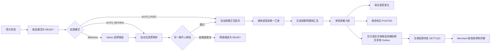

# 收单交易结算管理详细设计

## 1. 文档定位

本文定义 `acquiring-orchestration` 收单交易结算管理功能的目标方案，覆盖交易结算、保证金结算、
结算预审、双人审批、正式结算批次、统一汇率、结算明细、商户余额入账、交易状态投影、
Admin 与 Merchant 权限、数据查看范围、内部服务权限、幂等、补偿和验收要求。

本文属于长期架构设计文档，不表示文中全部能力已经实现。文中使用以下标记区分实施状态：

| 标记 | 含义 |
|---|---|
| `现有` | 当前代码和数据库设计已经具备 |
| `新增` | 本期结算管理迭代需要实现 |
| `调整` | 当前已有能力需要按本文收口 |
| `暂不处理` | 已明确排除在本期范围之外 |

配套清分设计见 [收单交易清分落地设计](transaction-clearing-implementation-design.md)。结算只能消费清分事实，
不能在结算阶段重新选择费用方案、重新计算费用或重新计提保证金。

本文基线日期为 2026-08-27，基于以下现有实现：

- `service-clearing` 已生成交易清分明细、保证金清分明细及结算候选；
- `service-settlement` 已实现候选激活、自动封批、统一汇率、结果聚合、单批净额入账、
  `HOLD/RETURN/RELEASE` 保证金资金化、
  交易状态投影、可靠 Outbox、取消和冲正；
- `service-admin` 已实现结算批次列表、详情、取消，以及独立冲正单的列表、详情、申请、审批和拒绝；查询直接读取
  本地交易逻辑数据源，命令注入可信登录操作人和权限上下文后通过内部接口调用 `service-settlement`；
- `service-merchant` 已实现当前商户资金账户、在途余额、保证金余额和余额流水只读查询；
- Admin 角色数据范围已经支持 `ALL`、`CUSTOM`、`SELF`，Merchant 登录上下文已经绑定 `merchantId`；
- 当前正式结算批次号格式为 `SByyyyMMdd-NNNNNNNN`。

## 2. 核心业务结论

### 2.1 数据源

| 结算对象 | 权威数据源 | 结算阶段允许做的事 | 禁止行为 |
|---|---|---|---|
| 交易本金与费用 | 当前有效修订的 `transaction_clearing_detail` | 锁定候选、按批次汇率换算、聚合和入账 | 重新读取费用模板或商户费用配置 |
| 保证金扣留与返还 | `transaction_reserve_clearing_detail` | 随交易结算资金化并更新保证金台账 | 重新按交易金额和保证金比例计提 |
| 到期保证金释放 | 当前有效 `transaction_reserve_clearing_detail` 中 `reserve_action_type=RELEASE` 的事实和对应 `RESERVE_RELEASE` 候选 | 按释放清分事实生成批次，并以 `merchant_reserve_item` 校验剩余资金责任 | 从 `merchant_reserve_item` 重新推导释放金额，或覆盖原扣留、返还明细 |
| 结算余额 | `settlement_result_item` 的最终财务组件 | 按商户账户和目标币种生成单批净额 | 按交易逐笔更新余额 |

### 2.2 本期边界

1. 结算直接统计清分数据，不重新清分。
2. 结算完成后将交易 `settlement_status` 从 `NOT_SETTLED` 投影为 `SETTLED`。
3. 本期不读取、不校验、不更新 `reconciliation_status`。
4. 交易清分明细与保证金清分明细继续分表保存，结算结果可以在同一批次聚合，但不得混淆来源类型。
5. 支付产生的保证金 `HOLD` 和退款产生的 `RETURN` 跟随对应交易结算原子处理。
6. 独立保证金结算主要处理 `RELEASE` 和受控 `ADJUSTMENT`，不得重复处理已随交易入账的 `HOLD/RETURN`。
7. 商户系统本期只提供结算账单、结算明细、保证金明细和余额流水查询，不允许商户发起审批、取消或冲正。
8. 当前清分快照没有稳定的店铺或网站维度，本期不提供店铺级筛选、授权和结算。

## 3. 现状与目标能力矩阵

| 能力 | 当前状态 | 目标状态 |
|---|---|---|
| 自动候选激活 | 现有 | 保留，服务启动后自动运行 |
| 自动结算批次 | 现有 | 保留，与手动预审通过数据库状态竞争 |
| Admin 批次列表和详情 | 现有 | 增加数据范围、逐笔明细、入账记录和导出 |
| Admin 取消未入账批次 | 现有 | 保留，增加严格数据范围和操作审计 |
| Admin 直接冲正已入账批次 | 现有 | 调整为冲正申请与复核，不建议单人直接冲正 |
| 交易结算候选页面 | 未实现 | 新增，可多选生成预审单 |
| 保证金结算候选页面 | 未实现 | 新增，只选择可释放或可调整保证金 |
| 结算预审单 | 未实现 | 新增，锁定候选、汇率和结果摘要 |
| 结算审批 | 未实现 | 新增，通过或拒绝，强制 Maker-Checker |
| Admin 逐笔结算明细 | 未完整实现 | 新增标准分页和导出 |
| Merchant 结算账单 | 未实现 | 新增，只读当前商户正式批次 |
| Merchant 结算明细 | 未实现 | 新增，只读且隐藏内部字段 |
| Merchant 资金账户和余额流水 | 现有 | 复用，并通过批次号跳转结算账单 |
| 交易状态 `SETTLED` 投影 | 现有 | 保留异步幂等投影和自动补偿 |
| 对账状态参与结算 | 未实现 | 暂不处理，禁止新增为前置条件 |

### 3.1 当前需要先收口的一致性问题

| 问题 | 当前事实 | 目标口径 | 实施优先级 |
|---|---|---|---|
| `FROZEN` 账户是否允许结算 | Admin 和 Merchant 账户响应将 `NORMAL/FROZEN` 都标记为允许结算，但 `service-settlement` 候选激活和入账只接受 `NORMAL` | 本方案以资金服务的安全校验为准，仅 `NORMAL` 允许正式入账；如业务需要冻结账户继续结算，应先增加明确的结算冻结维度，不能只放宽状态判断 | P0 |
| Admin 结算数据范围 | 当前批次接口具备功能权限，但结算查询和命令尚未形成完整的 `ALL/CUSTOM/SELF` 商户范围校验 | 列表、详情、导出和命令全部执行数据范围校验 | P0 |
| 人工结算流水审计 | 当前入账固定写 `operation_mode=AUTO`、`operator_name=service-settlement`，未把人工制单、审批主体和意见写入已有流水审计列 | 自动批次写 `AUTO`；人工审批批次写 `MANUAL`，并把制单人、审批人、原因、意见和提交/审批时间以快照写入余额流水 | P0 |
| 保证金释放交易投影 | 当前释放候选使用 `RRL...` 合成交易号，入账逻辑却按全部候选创建交易投影并要求投影数等于候选数，合成交易号无法命中 `transaction_operation` | 只对真实 `CLEARING_REVISION` 交易候选创建交易投影；释放和纯保证金调整不创建伪交易投影，数量校验改为可投影候选数 | P0 |
| 保证金调整资金化 | 清分已生成 `ADJUSTMENT` 明细和候选，当前自动分组仍可能把它归入 `REGULAR`，但入账只接受 `HOLD/RETURN/RELEASE`，保证金动作约束也不接受 `ADJUSTMENT` | `ADJUSTMENT` 使用独立批次，补齐调整责任字段、方向、不可变动作和相反冲正规则；完成前禁止该类候选自动入账 | P0 |
| 保证金到期发现归属 | 当前由 `service-clearing` 自动扫描 `transaction_reserve_clearing_state` 并生成释放清分明细和候选 | 保持该单一归属；`service-job` 只做平台级监控，或调用未来由领域服务提供的明确幂等恢复接口，不重复生成释放事实 | P1 |
| 结算金额字段符号 | 结算结果、汇总和余额流水按“非负金额 + 方向”保存，但现有两个交易查询投影字段保存候选级有符号净额 | 明确投影字段是兼容例外，API 和页面不得把有符号净额当作非负发生额展示 | P1 |
| 费用审计快照 | 当前结果表可引用 `source_detail_no` 并保存公式，但没有百分比、固定 USD、USD 上下限、费用版本和规则等结构化展示字段 | 清分明细继续作为费用配置事实权威；结算结果补充来源身份和必要结构化展示快照，不能只依赖不可解析公式 | P1 |

## 4. 核心术语

| 术语 | 定义 |
|---|---|
| 结算候选 | 已清分、达到可结算日期、未被其他结算流程占用的清分修订 |
| 交易结算 | 对 `REGULAR` 候选中的本金、费用及关联保证金动作进行统一换汇和净额入账 |
| 保证金结算 | 对到期释放或受控调整生成 `RESERVE_RELEASE` 或 `ADJUSTMENT` 批次 |
| 预览 | 页面临时查询，不持久化、不锁候选，仅用于选择范围和查看源币种汇总 |
| 预审单 | 已持久化并锁定候选、汇率和计算指纹，等待另一操作人审批的单据 |
| 正式批次 | 审批通过或自动模式生成的 `settlement_batch`，是换汇、结果和入账的权威载体 |
| 结算明细 | `settlement_result_item` 中从清分事实生成的不可变 TRACE 和财务结果 |
| 净额入账 | 一个商户账户、一个目标币种、一个批次最多一条可用余额流水 |
| 交易投影 | 资金入账后将交易查询侧 `settlement_status` 异步推进为 `SETTLED` |

## 5. 业务不变量

1. 清分事实不可被结算修改，结算只能引用清分修订号和明细号。
2. 一个有效清分修订同一时刻只能属于一个有效预审单或正式结算批次。
3. 一个预审单最多生成一个正式批次。
4. 一个正式批次只属于一个商户、一个结算账户和一个目标结算币种。
5. 同一正式批次中相同 `sourceCurrency -> targetCurrency` 只能使用一条不可变直接汇率。
6. 同币种换算也必须保存恒等汇率 `1`。
7. 结算明细、汇总和余额流水使用 `BigDecimal` 保存非负发生额，资金方向使用 `CREDIT/DEBIT` 表达；
   `settlement_projection_task.settlement_amount` 和 `transaction_finance_state.settlement_amount` 是现有候选级
   有符号净额兼容字段，不得与非负发生额混用。
8. 不同源币种不能直接相加，必须按源币种分别汇总或先使用同一批次汇率转换为目标币种。
9. 汇率计算过程中不得提前按目标币种舍入，最终财务组件只在输出目标金额时舍入一次。
10. 一个批次最多生成一条非零 `merchant_fund_ledger` 流水；净额为零时保留结算结果，不写零金额余额流水。
11. 保证金台账使用 `merchant_reserve_item/action`，不得与可用余额流水混为同一事实表。
12. 资金入账、保证金资金化、候选完成和“真实交易候选”的投影任务创建必须位于同一个本地事务；没有真实交易
    投影的保证金批次也必须以批次、余额流水和保证金动作在同一事务闭环。
13. MQ、Redis、定时任务和浏览器请求都不能代替数据库唯一约束与状态 CAS。
14. 已入账批次不能删除、覆盖或重新计算，只能通过引用原批次的独立冲正或调整处理。
15. 制单人与审批人必须是不同账号，即使同一账号同时拥有两个权限或是 `SUPER_ADMIN` 也必须拒绝自审。
16. Merchant 请求中的 `merchantId` 不得作为数据范围依据，必须从认证上下文取得。
17. 批次来源必须同质：`REGULAR` 只包含 `CLEARING_REVISION`，`RESERVE_RELEASE` 只包含释放候选，
    `ADJUSTMENT` 只包含保证金调整候选；不得为了复用自动分组把保证金调整混入交易批次。

## 6. 模块职责与调用边界

| 模块 | 职责 | 可以读取 | 可以写入 | 禁止行为 |
|---|---|---|---|---|
| `service-clearing` | 生成交易和保证金清分事实、候选、到期释放事实及清分完成事件 | 交易事实、冻结费用版本、保证金清分状态 | 清分表、候选影子记录、释放清分明细、清分 Outbox | 生成正式结算批次、修改余额 |
| `service-settlement` | 预审锁定、审批命令、自动封批、汇率、结果、入账、保证金资金化、投影 | 清分事实、候选、账户和结算档案 | 预审单、批次、结果、余额流水、保证金动作、投影和 Outbox | 重新选择费用配置、提供浏览器接口 |
| `service-admin` | Admin 页面查询、权限和数据范围校验、可信操作人注入、调用内部命令 | 结算只读表、商户基础信息、RBAC | 操作日志；业务写命令交给 `service-settlement` | 直接更新候选、批次、余额或保证金表 |
| `service-merchant` | 当前商户结算账单、明细、账户和保证金只读查询 | 只读结算表、余额表、保证金表 | 仅查询审计和导出审计 | 接受任意商户号查询、执行结算命令 |
| `service-gateway` | 隔离 Admin、Merchant 和内部服务路由，传递认证上下文 | 路由和认证结果 | 无结算业务写入 | 把 Merchant token 转换成 Admin 权限、暴露内部接口 |
| `service-openapi` | 本期不提供结算账单 OpenAPI | 无 | 无 | 复用 Merchant 内部接口对外暴露结算明细 |
| `service-checkout` | 持卡人收银台支付，不参与结算管理 | 无结算数据 | 无 | 向持卡人展示商户费用、保证金或结算信息 |
| `service-job` | 平台级任务监控；仅在未来有明确幂等恢复接口时编排调用 | 任务元数据和业务服务公开的任务结果 | 任务执行日志 | 直接修改结算/交易表、参与正常结算调度、重复发现或生成释放事实 |
| `service-payment` | 交易事实和查询缓存联动 | 交易表、交易级结算完成/冲正事件 | 推进订单查询缓存 generation | 重复投影结算状态、根据 MQ 消息入账 |
| `service-data` | 通知、安全审计等通用异步处理 | 结算完成事件的非敏感载荷 | 通知和审计数据 | 参与结算金额计算或资金入账 |
| `finance-library` | 金额、保证金和结算纯计算内核 | 调用方传入的不可变模型 | 无数据库写入 | 依赖 Spring、MyBatis、Redis、MQ |

Admin 列表、详情和导出继续采用本地只读查询，符合当前系统查询架构；创建预审单、提交、审批、拒绝、
取消、冲正等改变业务状态的命令必须由 `service-admin` 调用 `service-settlement` 内部接口完成。

### 6.1 各系统查看和操作总览

| 系统或入口 | 可以查看 | 可以操作 | 数据范围 |
|---|---|---|---|
| Admin 管理系统 | 候选、预审、正式批次、汇率、费用、保证金、入账、投影和内部异常 | 按权限制单、审批、拒绝、取消和冲正 | `ALL/CUSTOM/SELF` 与功能权限交集 |
| Merchant 商户系统 | 正式结算账单、自己的交易和保证金明细、应用汇率、余额流水 | 只读查询和独立授权的导出 | 强制为认证上下文中的当前商户 |
| Merchant OpenAPI | 本期无结算账单接口 | 无 | 不适用 |
| Checkout 收银台 | 无结算数据 | 无 | 只处理付款人支付会话 |
| `service-settlement` | 全部结算权威事实 | 结算领域全部状态和资金命令 | 内部服务身份和数据库状态约束 |
| `service-job` | 平台级任务状态和稳定失败码 | 监控或调用未来明确的幂等恢复接口 | 仅内部任务接口，不具备人工审批身份 |
| `service-payment` | 交易级结算投影事件 | 推进订单查询缓存 generation | `operationId` 级事件身份 |
| `service-data` | 脱敏结算完成事件 | 通知和审计 | 不读取结算金额计算内部数据 |

## 7. 整体业务流程



### 7.1 交易结算流程

1. 查询 `sourceType=CLEARING_REVISION` 且状态为 `READY` 的候选。
2. 按商户、结算档案、结算账户和目标币种分组，不允许跨商户或跨账户生成一个预审单。
3. 读取候选当前有效修订对应的交易清分明细和保证金清分明细。
4. 页面按源币种展示本金、费用、保证金和笔数，不直接合计不同源币种。
5. 提交预审时锁定候选、预审汇率矩阵、结果摘要和计算指纹。
6. 审批通过后生成 `REGULAR` 正式批次，继承预审汇率，不再次获取新汇率。
7. 按清分明细生成 `TRACE` 和 `FINANCIAL_COMPONENT` 结算结果。
8. 本金、费用、保证金扣留和返还共同形成批次净额。
9. 资金事务更新商户可用余额并同步生成保证金台账动作。
10. 仅为 `sourceType=CLEARING_REVISION` 的真实交易候选创建投影任务，异步将交易结算状态更新为 `SETTLED`。

### 7.2 保证金结算流程

1. `service-clearing` 的 `ReserveReleaseScheduler` 自动扫描各季度 `transaction_reserve_clearing_state`。
2. 对 `OPEN`、剩余金额大于零且达到 `expected_reserve_release_date` 的状态，以独立事务生成
   `RELEASE` 清分明细和唯一 `RESERVE_RELEASE` 候选。
3. 保证金结算预审从已经生成的释放候选读取清分事实，同时关联 `merchant_reserve_item` 校验资金台账责任。
4. 页面展示原扣留交易、扣留币种、扣留金额、已返还、已释放、本次可释放和剩余金额。
5. 审批通过后生成 `RESERVE_RELEASE` 批次。
6. 使用批次统一汇率将保证金源币种转换为商户结算币种。
7. 资金事务增加商户可用余额，并追加 `merchant_reserve_action.RELEASE`。
8. 原 `merchant_reserve_item` 通过版本 CAS 更新累计释放和剩余金额，不覆盖原扣留事实。
9. `RESERVE_RELEASE` 使用的 `RRL...` 只是释放清分和候选身份，不是支付交易号；不得为其创建
   `settlement_projection_task` 或交易级结算完成事件。

支付或请款产生的 `HOLD`、退款产生的 `RETURN` 已在 `REGULAR` 交易结算中处理，保证金结算页面只能查看，
不能再次选择入账。

### 7.3 保证金调整结算流程

1. 只读取已经完成双人复核的 `transaction_reserve_clearing_detail` 中 `reserve_action_type=ADJUSTMENT` 的清分
   事实，不得在结算阶段重新计算调整金额。
2. `DEBIT` 调整增加标签币种保证金责任并减少本批可用余额净额，`CREDIT` 调整减少保证金责任并增加本批可用
   余额净额；余额侧按批次目标币种统一换算，保证金台账动作始终记录原标签币种，不保存汇率。
3. `merchant_reserve_item` 必须以版本 CAS 更新借方/贷方调整累计和剩余责任，满足：

```text
retainedAmount + debitAdjustmentAmount
    = returnedAmount + releasedAmount + creditAdjustmentAmount + reversedAmount + remainingAmount
```

4. `merchant_reserve_action` 追加 `ADJUSTMENT`，并单独保存 `direction`；冲正追加
   `REVERSAL_ADJUSTMENT` 并引用原动作，不修改原调整事实。撤销 `DEBIT` 调整时回减
   `debitAdjustmentAmount`，撤销 `CREDIT` 调整时回减 `creditAdjustmentAmount`，均要求累计金额充足并使用版本
   CAS；调整冲正不计入仅用于撤销原 `HOLD` 的 `reversedAmount`。
5. 纯保证金调整不创建伪交易投影；以正式批次、余额流水、保证金动作和清分明细形成审计链。
6. 在上述聚合字段、动作约束、资金化和冲正能力全部完成前，`ADJUSTMENT` 候选必须停留在人工处理，不能被
   自动封批或自动入账。

## 8. 可结算条件

### 8.1 交易候选准入

必须同时满足：

- 清分状态为 `CLEARED` 或业务明确允许的 `NOT_REQUIRED`；
- 清分修订仍为当前有效版本；
- 候选状态为 `READY`；
- `shadow_mode=0`；
- `settlement_eligible_date` 不晚于结算业务日；
- 商户结算档案有效，候选冻结的档案身份完整；
- 结算账户状态为 `NORMAL`；
- 候选币种、币种精度和结算档案一致；
- 候选没有被预审单或正式批次占用；
- 交易 `settlement_status=NOT_SETTLED`；
- 来源交易号、精确 `transaction_date_time`、`operation_id` 和清分修订号完整；
- 清分依赖满足，不存在未决源交易或人工复核异常。

以下字段不得参与本期准入：

```text
reconciliation_status
```

### 8.2 保证金释放准入

- `transaction_reserve_clearing_state.reserve_status=OPEN`；
- 已达到 `expected_reserve_release_date`；
- 清分状态中的 `remaining_amount` 大于零且责任等式成立；
- 已生成唯一、有效的 `RESERVE_RELEASE` 清分明细和候选；
- 对应 `merchant_reserve_item` 仍存在足够的资金化剩余责任；
- 原保证金明细和源交易身份完整；
- 不存在其他活动预审单或正式结算批次占用该候选；
- 商户结算档案和账户状态正常；
- 保证金未因风控、争议或人工命令冻结。

### 8.3 授权类交易

授权、预授权等不产生应结本金，但清分中已经存在的授权手续费、风控费、3DS 调用费可以进入结算。
页面不得因为本金为零就隐藏该候选，也不得伪造授权本金。

## 9. 预览、预审和审批

### 9.1 页面预览

预览不持久化、不锁候选，结果仅在当前请求中有效。预览用于：

- 检查候选是否属于同一商户、账户和目标币种；
- 按源币种统计本金、费用和保证金；
- 展示候选数量和异常数量；
- 使用当前参考汇率展示预计目标金额；
- 提示预计金额不是审批和入账依据。

### 9.2 提交预审

提交预审必须在一个主库事务中完成：

1. 校验 `requestKey`、操作人、数据范围和候选上限；
2. 逐条以候选版本 CAS 从 `READY` 更新为 `REVIEW_LOCKED`；
3. 写入预审单和候选关系；
4. 锁定不可变预审汇率矩阵；
5. 生成源币种汇总、目标币种汇总和净额；
6. 保存候选清分指纹、汇率指纹和结果指纹；
7. 将预审单置为 `PENDING_APPROVAL`。

页面临时选择不保存 `DRAFT`，避免长期草稿无意义占用候选。需要保存时即提交为待审批预审单。

### 9.3 审批通过

审批通过必须校验：

- 审批人拥有审批权限且在目标商户数据范围内；
- 审批人账号不同于制单人和提交人账号；
- `expectedVersion` 与数据库版本一致；
- 预审单状态仍为 `PENDING_APPROVAL`；
- 全部候选仍为该预审单独占的 `REVIEW_LOCKED`；
- 清分修订、金额指纹和币种指纹没有变化；
- 汇率矩阵完整且可用于全部源币种；
- 商户结算档案和账户仍允许结算。

通过后创建正式批次，预审汇率原样复制到 `settlement_batch_rate`。正式批次重新计算结果并比对预审结果指纹；
不一致时进入 `MANUAL_REVIEW`，不得入账。

### 9.4 审批拒绝、取消和过期

- 拒绝必须填写原因；
- 只有待审批预审单可以拒绝；
- 制单人可以取消自己尚未审批的预审单；
- 系统可以对超过业务有效期仍未审批的预审单执行过期；
- 拒绝、取消或过期必须释放全部仍归属该单的候选；
- 释放使用候选状态、预审单号和版本 CAS；
- 预审单、汇率和摘要保留审计，不做物理删除。

## 10. 状态机

### 10.1 预审单状态

```text
PENDING_APPROVAL -> APPROVED
PENDING_APPROVAL -> REJECTED
PENDING_APPROVAL -> CANCELLED
PENDING_APPROVAL -> EXPIRED
```

以上均为终态。`APPROVED` 必须关联唯一正式批次号。

### 10.2 候选状态

```text
READY -> REVIEW_LOCKED -> CLAIMED -> POSTED
READY -> CLAIMED -> POSTED
REVIEW_LOCKED -> READY
READY -> SUPERSEDED
READY/REVIEW_LOCKED/CLAIMED -> MANUAL_REVIEW
```

- 第一条用于手动或自动审批结算；
- 第二条用于 `AUTO_POST`；
- `REVIEW_LOCKED -> READY` 只允许预审拒绝、取消或过期；
- `POSTED` 不得回退为 `READY`，冲正通过独立批次表达。

### 10.3 正式批次状态

继续复用当前状态机：

```text
CREATED -> CLAIMING -> CLAIMED -> RATE_LOCKED
RATE_LOCKED -> CALCULATING -> CALCULATED
CALCULATED -> POSTING -> POSTED
```

异常分支：

```text
任一可重试阶段 -> FAILED_RETRYABLE -> 原阶段继续
稳定业务异常 -> MANUAL_REVIEW
入账前状态 -> CANCELLED
POSTED -> REVERSING -> REVERSED
```

`POSTED` 表示资金事实已完成。交易查询投影可能短暂滞后，Admin 应单独显示投影完成数和失败数。

### 10.4 冲正申请状态

```text
PENDING_APPROVAL -> APPROVED
PENDING_APPROVAL -> REJECTED
```

两条流转均为终态。`APPROVED` 必须关联唯一冲正批次，`REJECTED` 不创建冲正批次；申请人与审批人按可信 Admin
账号主键强制不同。数据库通过创建请求键、决策请求键、冲正批次号以及活动原批次生成列的唯一约束兜底幂等，
同一原批次最多存在一个待审批或已批准冲正单。

### 10.5 Merchant 公共状态

Merchant 不直接看到内部状态机，统一映射为：

| 内部状态 | Merchant 状态 | 中文显示 |
|---|---|---|
| `CREATED` 至 `POSTING` | `PROCESSING` | 结算处理中 |
| `POSTED` | `SETTLED` | 已结算 |
| `REVERSING` | `REVERSING` | 冲正处理中 |
| `REVERSED` | `REVERSED` | 已冲正 |
| `FAILED_RETRYABLE`、`MANUAL_REVIEW` | `DELAYED` | 结算延迟 |
| `CANCELLED` | 不默认展示 | 无资金影响 |

内部失败码、失败阶段和异常正文不得直接返回 Merchant。

## 11. 自动结算与手动结算共存

服务启动后结算调度自动运行，不新增 YML 或 Nacos 业务开关。处理模式属于商户结算档案业务数据：

以下三种模式属于本期新增目标，当前代码只有自动封批和自动处理能力。

| 模式 | 行为 | 使用场景 |
|---|---|---|
| `AUTO_POST` | 自动创建正式批次并入账 | 低风险、已稳定运行商户 |
| `AUTO_REVIEW` | 自动选择候选并生成待审批预审单 | 需要人工复核但不需要人工选单 |
| `MANUAL` | Admin 人工选择候选并提交预审 | 特殊商户、异常或临时结算 |

实施时建议现有商户保持 `AUTO_POST`，避免升级后改变既有行为；需要人工审批的商户由结算档案显式切换。
自动任务只能认领 `READY`，人工预审只能锁定 `READY`，并发竞争由数据库 CAS 决定。未竞争成功的候选返回明确提示，
不得由页面重试绕过状态检查。

## 12. 金额、费用和保证金计算

### 12.1 交易净额

```text
交易结算净额
= 本金 CREDIT
- 本金 DEBIT
- 交易手续费
- 风控费
- 3DS 手续费
- 退款手续费
- 拒付手续费
- 其他费用
- 保证金扣留
+ 保证金返还
+/- 调整金额
```

`settlement_result_item`、`settlement_result_summary` 和 `merchant_fund_ledger` 的发生额始终保存非负值，
正负只由方向决定。交易查询投影中的 `settlement_amount` 保存候选级有符号净额，是兼容字段例外；返回接口必须
明确字段语义，不能把负投影金额再叠加 `DEBIT` 方向导致二次取反。

### 12.2 费用组件

费用严格沿用清分冻结口径：

- 百分比部分按标签币种和标签金额计算；
- 百分比数值例如 `2.3`，页面显示为 `2.3%`，不能显示为 `2.3`；
- 固定单笔费用使用 USD；
- 最低金额和最高金额限制使用 USD；
- 结算不得把固定 USD 费用改成标签币种固定费；
- 结算不得读取费用模板当前版本替换历史快照。

对于“标签币种百分比 + 固定 USD + 最低/最高 USD”：

1. `TRACE` 通过 `source_detail_no` 精确引用不可变清分明细，并结构化记录百分比组件、固定 USD 组件和限制快照；
2. 使用批次统一汇率将组件转换到目标结算币种；
3. 使用冻结的 USD 上下限完成最终比较；
4. 生成唯一 `FINANCIAL_COMPONENT` 费用结果参与汇总；
5. 保存 `appliedLimit`、未舍入金额、最终金额和公式快照；
6. 保存费用版本业务号、费用规则 ID、组件类型、百分比、固定 USD、最低 USD 和最高 USD 等必要展示快照。

当前 `settlement_result_item` 已有 `source_detail_no`、金额、币种、汇率、上下限目标值和公式字段，但尚未具备
上述全部结构化费用快照列。实施时以来源清分明细为配置事实权威，结算结果只复制审批、详情和导出必需的展示
快照；不得回查可变的当前费用配置，也不得宣称现有表已经完整保存这些字段。

### 12.3 保证金

- 清分时保证金使用标签币种，不涉及汇率；
- `HOLD` 使用清分已保存的扣留金额和比例，不重新执行 `交易金额 * 当前比例`；
- `RETURN` 使用原支付冻结的保证金口径，不使用退款时当前商户配置；
- `RELEASE` 使用台账剩余责任金额，不重新查询费用方案；
- 保证金比例例如 `10`，页面显示为 `10%`；
- 保证金扣留、返还、释放和调整都追加动作，不覆盖原动作。

### 12.4 统计口径

正式结算统计维度：

```text
merchantId
+ settlementAccountId
+ targetCurrency
+ paymentType
+ paymentMethod
+ transactionType
+ resultItemType
+ feeCategory
+ direction
+ sourceCurrency
```

当前 `transactionCount` 在每个汇总维度内按 `candidate_id` 去重，语义是“动作级结算候选数”，不得使用结算
明细行数，也不等于支付生命周期根交易数。费用组件数和动作候选数需要分开显示；如果产品还需要生命周期交易数，
应新增独立的 `lifecycleTransactionCount`，不能改变现有字段口径。

## 13. 汇率规则

### 13.1 汇率边界

| 阶段 | 是否使用结算汇率 | 说明 |
|---|---|---|
| 清分 | 否 | 只保存各组件原币种和金额 |
| 页面预览 | 是，参考汇率 | 只用于预计展示，不作为资金依据 |
| 预审提交 | 是，冻结汇率 | 审批人看到确定的拟结算金额 |
| 正式批次 | 是，继承预审或自动锁定 | 形成不可变批次汇率矩阵 |
| Merchant 查询 | 只读 | 展示实际应用汇率，不重新换算 |

### 13.2 汇率字段

每条批次汇率至少保存：

- 源币种、目标币种；
- 源币种和目标币种 exponent；
- 直接汇率；
- 汇率类型；
- 汇率来源；
- 报价编号；
- 原报价方向；
- 生效时间；
- 锁定时间和锁定主体。

汇率至少保留 12 位小数存储精度，计算使用 `DECIMAL128` 语义。反向汇率必须先归一为直接汇率，
不能在不同明细中分别做倒数。最终金额按目标币种 exponent 和冻结舍入规则舍入一次。

### 13.3 预审与正式批次一致性

人工审批必须看到最终可复现的金额。因此预审提交时冻结汇率，审批通过后正式批次继承相同汇率。
正式批次重算出的目标金额和净额必须与预审指纹一致；任何差异都进入 `MANUAL_REVIEW`，不得静默使用新汇率。

## 14. 余额入账和保证金资金化

### 14.1 账户锁和流水

入账事务固定执行顺序：

1. `SELECT ... FOR UPDATE` 锁定 `merchant_fund_account`；
2. 校验账户 ID、商户号、结算币种、账户状态和版本；
3. 读取账户内最大 `account_sequence`；
4. 使用结算批次号生成唯一余额幂等键；
5. 追加不可变 `merchant_fund_ledger`；
6. 使用余额值和 `account_version` 双重 CAS 更新账户；
7. 资金化保证金动作；
8. 标记候选和批次已入账；
9. 仅为真实交易候选创建交易投影任务；投影成功后创建交易级结算 Outbox；
10. 提交本地事务。

当前账户只有 `NORMAL` 允许结算。`FROZEN` 或 `CLOSED` 在正式入账时必须拒绝并进入人工处理，
不得仅根据页面预审时的账户状态继续入账。

当前 Admin 和 Merchant 账户摘要把 `FROZEN` 映射为 `settlementAllowed=true`，与上述资金服务校验不一致。
正式功能迭代必须先统一该字段和页面文案；在统一之前不能把 `FROZEN` 候选加入手动预审。

### 14.2 正负余额

当前资金账户允许余额为负，因此净额为 `DEBIT` 时可以将可用余额扣为负数。入账后由现有负余额规则更新
主动逆向交易限制。结算流程不能自行增加透支额度或跳过账户状态控制。

### 14.3 零净额

净额为零时：

- 保留唯一净结算结果；
- 不写零金额 `merchant_fund_ledger`；
- 仍完成保证金动作和候选状态，并只完成符合条件的真实交易投影；
- Admin 和 Merchant 账单显示“净额 0”，并明确“无余额变动”。

### 14.4 余额流水摘要

建议自动生成面向商户的简洁摘要：

```text
交易结算｜批次 SB20260827-00000001｜128笔｜本金 USD 12500.00｜费用 USD 386.20｜保证金扣留 USD 800.00｜净入账 USD 11313.80
```

多源币种时摘要只写目标结算币种净额，详细源币种统计通过批次详情查看。摘要不写内部数据库 ID、幂等键、
审批意见或失败码。

### 14.5 人工结算流水审计

`merchant_fund_ledger` 已具备 `operation_mode`、操作人、复核人、原因、意见以及提交/复核时间等审计列，目标
实现必须按批次来源写入：

| 批次来源 | `operation_mode` | 操作人 | 复核人 | 原因和意见 |
|---|---|---|---|---|
| 自动结算 | `AUTO` | `service-settlement` 系统主体 | 空 | 保存自动策略和业务日期摘要 |
| 人工预审通过 | `MANUAL` | 制单/提交账号快照 | 审批账号快照 | 保存制单原因和审批意见 |
| 人工冲正通过 | `MANUAL` | 冲正申请账号快照 | 冲正复核账号快照 | 保存冲正原因和复核意见 |

人工预审和独立冲正链路必须把预审单或冲正单上的可信服务端审计主体传到入账领域：余额流水保存 `MANUAL`、
制单人、复核人、原因、意见和提交/复核时间。浏览器 DTO 不接受操作人身份字段，通用 `OperationLog` 只作为
管理操作日志，不能替代资金流水快照。

## 15. 交易状态投影

资金批次 `POSTED` 后，只按 `sourceType=CLEARING_REVISION` 的真实交易候选生成投影任务：

```text
transaction_finance_state.settlement_status: NOT_SETTLED -> SETTLED
transaction_operation.settlement_status: NOT_SETTLED -> SETTLED
transaction_order.settlement_status: NOT_SETTLED/旧动作快照 -> SETTLED/最新动作快照
```

同时写入：

- `settlement_currency`；
- `settlement_amount`；
- `settlement_rate`；
- `settlement_date`；
- `settlement_batch_no`。

`transaction_order` 额外写入 `settlement_transaction_id + settlement_transaction_date_time`，使用
`transaction_locator.root_transaction_date_time` 精确定位主单分片，并按“动作交易时间 + 动作交易号”稳定选择最近
真实动作。较旧投影不得覆盖较新主单快照。

上述 `settlement_amount` 保存候选级有符号净额，可能为负；它不是“非负发生额 + 方向”的结算结果或余额流水。

投影必须带 `transaction_id + transaction_date_time + clearing_revision` 精确分片身份，并使用状态和修订 CAS。
`settlement_rate` 只读取不可变 `settlement_batch_rate.direct_rate`，按 `DECIMAL(24,12)` 保存；金额按
`DECIMAL(24,8)` 保存。合法重复执行只能接受批次、金额、币种、汇率、日期和动作身份逐字段一致的既有结果。
冲正只把三层投影的状态改为 `REVERSED` 并替换为冲正批次号，原金额、币种、汇率和结算日期必须保持不变。

`RESERVE_RELEASE` 和纯保证金 `ADJUSTMENT` 的合成业务号不对应 `transaction_operation`，不得创建交易投影任务。
入账时的投影任务数、冲正时的原投影完成数和反向投影任务数都必须按“可投影真实交易候选数”校验，不能再
与 `settlement_batch.candidate_count` 直接比较。保证金批次以批次、资金流水和保证金动作闭环；未来如需发布
保证金批次级通知，应使用独立批次事件，不能伪造 `TRANSACTION_SETTLEMENT_COMPLETED`。

本期明确禁止：

```text
读取 reconciliation_status 作为投影条件
更新 reconciliation_status
因 reconciliation_status 非成功而回滚结算
```

## 16. Admin 信息架构

建议在管理系统统一为“结算管理”目录，避免旧“结算管理”和“交易结算”重复菜单长期并存：

```text
结算管理
├── 交易结算
├── 保证金结算
├── 结算预审单
├── 结算批次
├── 交易结算明细
├── 保证金结算明细
└── 结算入账记录
```

### 16.1 交易结算页面

查询条件：

- 商户号、商户名称；
- 交易号、商户订单号；
- 交易时间和可结算日期；
- 支付类型、支付方式、交易类型；
- 交易币种、目标结算币种；
- 清分修订号；
- 候选状态。

列表默认按 `transaction_date_time DESC, candidate_id DESC`，使用标准分页。页面支持多选，但只允许选择
同一商户、结算档案、账户和目标币种的候选生成一张预审单。

### 16.2 保证金结算页面

查询条件：

- 商户号、商户名称；
- 保证金编号、原交易号；
- 保证金币种；
- 保证金状态；
- 预计释放日期；
- 是否到期；
- 是否冻结；
- 剩余金额范围。

列表默认按 `expected_release_date ASC, id ASC`，优先展示最早到期且可释放的数据。

### 16.3 结算预审单页面

支持：

- 按预审单号、类型、商户、状态、制单人、审批人、创建时间查询；
- 查看候选清单、源币种汇总、目标币种汇总、汇率矩阵、净额和计算指纹；
- 制单人取消待审批单；
- 审批人通过或拒绝；
- 导出审批附件；
- 查看正式批次号和后续状态。

默认按 `create_time DESC, id DESC`。

### 16.4 结算批次页面

继续复用现有批次查询，扩展：

- 预审单号、创建模式和审批信息；
- 逐笔交易结算明细；
- 保证金动作明细；
- 余额入账记录；
- 投影任务和 Outbox 状态；
- 取消和冲正申请入口。

默认按 `business_date DESC, id DESC`，查询日期范围继续限制在 93 天内。

### 16.5 逐笔明细页面

交易结算明细默认按 `source_transaction_date_time DESC, id DESC`，保证金明细默认按业务时间倒序。
必须使用服务端分页，不允许把整个批次所有逐笔明细装入一个详情响应。

## 17. Merchant 信息架构

Merchant 财务管理建议扩展为：

```text
财务管理
├── 当前费率
├── 资金账户
├── 结算账单
└── 保证金明细
```

### 17.1 商户可以查看

- 当前认证商户的正式结算批次；
- 批次业务日期、结算完成时间、结算币种和公共状态；
- 按支付类型、支付方式、交易类型、费用类别和源币种的统计；
- 本金、费用、保证金和净结算金额；
- 实际应用的源币种到目标币种直接汇率；
- 自己的交易结算逐笔明细；
- 自己的保证金扣留、返还、释放、调整和剩余金额；
- 自己的可用余额、在途余额、保证金余额和余额流水；
- 批次和明细导出，前提是拥有独立导出权限。

### 17.2 商户不能查看

- 任何其他商户的数据；
- Admin 预审单和内部审批队列；
- 制单人、审批人的内部账号 ID 和个人信息；
- 审批意见、拒绝原因、内部备注；
- 结算配置数据库 ID、费用版本数据库 ID、候选 ID；
- 原始费用配置 JSON、hash、完整内部公式快照；
- 汇率供应商内部报价编号、内部锁定人和内部调价说明；
- 余额幂等键、账户版本、租约、重试次数；
- 内部失败码、异常堆栈、MQ 和 Outbox 运行信息；
- 卡号、CVV、有效期、完整账单地址等支付敏感信息。

### 17.3 商户不能操作

- 选择结算候选；
- 创建或提交预审单；
- 审批、拒绝或取消结算；
- 修改结算汇率；
- 重新计算清分或结算；
- 冲正结算批次；
- 修改交易结算状态或保证金状态。

若以后允许商户申请提前结算或保证金释放，应新增独立“申请单”，仍由 Admin 审批，不能直接复用内部审批接口。

## 18. 字段查看范围

### 18.1 批次字段

| 字段类别 | Admin | Merchant | 说明 |
|---|---|---|---|
| 正式批次号、业务日期、结算币种 | 可见 | 可见 | 商户只看自己的批次 |
| 商户号、商户名称 | 可见 | 仅自身，可简化展示 | Merchant 不能用作切换条件 |
| 批次内部状态 | 可见 | 仅公共状态 | 内部重试状态不直接暴露 |
| `settlementProfileId`、`settlementAccountId` | 可见 | 不可见 | Merchant 展示账户号而非数据库 ID |
| 预审单号、创建模式 | 可见 | 不可见 | 内部运营信息 |
| 候选数、交易数 | 可见 | 可见 | 两者定义必须分开 |
| 重试次数、失败阶段、失败码 | 可见 | 不可见 | Merchant 只显示统一延迟文案 |
| 创建、汇率锁定、计算、入账时间 | 可见 | 入账及业务时间可见 | 内部处理时间可按需隐藏 |
| `version`、租约字段 | 可见或仅命令使用 | 不可见 | 不作为 Merchant API 字段 |

### 18.2 汇率和费用字段

| 字段 | Admin | Merchant | 说明 |
|---|---|---|---|
| 源币种、目标币种、直接汇率 | 可见 | 可见 | Merchant 对账需要 |
| 汇率生效时间 | 可见 | 可见 | 显示业务时区 |
| 汇率来源 | 完整可见 | 显示“平台结算汇率” | 隐藏供应商实现 |
| `quoteId`、原报价方向、锁定人 | 可见 | 不可见 | 内部审计字段 |
| 费用名称、费用类别 | 可见 | 可见 | 使用国际化名称 |
| 百分比费率 | 可见 | 可见 | 必须带 `%` |
| 固定 USD、最低 USD、最高 USD | 可见 | 可见 | 与商户合同一致 |
| `appliedLimit` | 可见 | 可见 | 说明最终命中最低、最高或未命中 |
| 原金额、目标金额、方向 | 可见 | 可见 | 金额和币种成对展示 |
| 未舍入金额 | 可见 | 默认不展示 | Merchant 导出可按产品需要提供 |
| 原始公式和配置快照 | 可见 | 不可见 | Merchant 使用友好公式描述 |
| 费用版本号 | 可见 | 可显示业务版本号 | 数据库主键不展示 |

### 18.3 保证金和余额字段

| 字段 | Admin | Merchant | 说明 |
|---|---|---|---|
| 保证金编号、原交易号 | 可见 | 可见 | Merchant 仅自身 |
| 动作类型 `HOLD/RETURN/RELEASE/ADJUSTMENT` | 可见 | 可见 | 使用国际化文案 |
| 保证金比例 | 可见 | 可见 | 按 `%` 显示 |
| 扣留、返还、释放、剩余金额 | 可见 | 可见 | 金额必须带币种 |
| 预计释放日期 | 可见 | 可见 | 不等于承诺到账日期 |
| 冻结原因和内部备注 | 可见 | 仅通用状态 | 不暴露内部风控策略 |
| 余额前、余额后、账户序号 | 可见 | 可见 | 用于商户核对连续余额 |
| 余额幂等键、账户版本 | 可见 | 不可见 | 内部一致性字段 |
| Admin 操作人和复核人 | 可见 | 显示“平台处理” | 不暴露内部员工信息 |

## 19. Admin 权限模型

### 19.1 建议角色

以下为权限组合建议，可复用当前 RBAC 的自定义角色能力，不要求把业务角色写死在代码中：

| 建议角色 | 职责 | 默认数据范围 | 禁止组合或限制 |
|---|---|---|---|
| 结算查看员 | 查看候选、预审、批次、明细和入账记录 | `ALL` 或 `CUSTOM` | 无资金命令 |
| 结算制单员 | 查看并创建交易结算预审单 | `CUSTOM` 优先 | 不能审批自己的单据 |
| 结算复核员 | 审批或拒绝交易结算预审单 | `CUSTOM` 或 `ALL` | 不建议同时拥有制单权限 |
| 保证金制单员 | 创建保证金释放或调整预审单 | `CUSTOM` 优先 | 不能审批自己的单据 |
| 保证金复核员 | 审批保证金释放或调整 | `CUSTOM` 或 `ALL` | 不能审批自己的单据 |
| 结算冲正制单员 | 对已入账批次提交冲正申请 | `CUSTOM` 优先 | 不能完成冲正复核 |
| 结算冲正复核员 | 复核冲正并触发独立冲正批次 | `ALL` 或 `CUSTOM` | 必须与申请人不同 |
| `SUPER_ADMIN` | 应急处置 | `ALL` | 仍禁止同账号自审，不用于日常结算 |

当前 `ADMIN_OPERATOR` 不应继续自动获得新增资金写权限。新增权限迁移只能默认授予查询权限；制单、审批、
取消和冲正必须显式分配给专门角色。

当前落库的结算权限只有 `settlement:batch:list/detail/cancel/reverse` 四项，且默认仅授予 `SUPER_ADMIN`。
本期新增查询权限可以按最小权限原则授权给专门查看角色；任何制单、审批、取消和冲正权限都不得在迁移中默认
授予 `ADMIN_OPERATOR`。现有 `SUPER_ADMIN` 授权事实也不表示可以绕过数据范围审计或 Maker-Checker。

### 19.2 Admin 权限码

| 菜单或操作 | 建议权限码 | 接口方法和路径 | 权限性质 |
|---|---|---|---|
| 交易结算候选查询 | `settlement:transaction-candidate:list` | `POST /admin/settlement/transaction-candidates/search` | 查询 |
| 交易候选详情 | `settlement:transaction-candidate:detail` | `GET /admin/settlement/transaction-candidates/{candidateNo}` | 查询 |
| 保证金候选查询 | `settlement:reserve-candidate:list` | `POST /admin/settlement/reserve-candidates/search` | 查询 |
| 保证金候选详情 | `settlement:reserve-candidate:detail` | `GET /admin/settlement/reserve-candidates/{candidateNo}` | 查询 |
| 预审单查询 | `settlement:review-order:list` | `POST /admin/settlement/review-orders/search` | 查询 |
| 预审单详情 | `settlement:review-order:detail` | `GET /admin/settlement/review-orders/{reviewOrderNo}` | 查询 |
| 创建并提交交易预审 | `settlement:transaction-review:create` | `POST /admin/settlement/transaction-review-orders` | 资金前置命令 |
| 创建并提交保证金预审 | `settlement:reserve-review:create` | `POST /admin/settlement/reserve-review-orders` | 资金前置命令 |
| 审批通过预审 | `settlement:review-order:approve` | `POST /admin/settlement/review-orders/{reviewOrderNo}/approve` | 高风险命令 |
| 审批拒绝预审 | `settlement:review-order:reject` | `POST /admin/settlement/review-orders/{reviewOrderNo}/reject` | 审批命令 |
| 取消待审批预审 | `settlement:review-order:cancel` | `POST /admin/settlement/review-orders/{reviewOrderNo}/cancel` | 状态命令 |
| 预审单导出 | `settlement:review-order:export` | `POST /admin/settlement/review-orders/export` | 敏感导出 |
| 正式批次查询 | `settlement:batch:list` | `POST /admin/settlement/batches/search` | 现有查询 |
| 正式批次详情 | `settlement:batch:detail` | `GET /admin/settlement/batches/{settlementBatchNo}` | 现有查询 |
| 取消未入账批次 | `settlement:batch:cancel` | `POST /admin/settlement/batches/{settlementBatchNo}/cancel` | 现有高风险命令 |
| 结算结果明细 | `settlement:result-item:list` | `POST /admin/settlement/result-items/search` | 查询 |
| 结算明细导出 | `settlement:result-item:export` | `POST /admin/settlement/result-items/export` | 敏感导出 |
| 入账记录查询 | `settlement:posting:list` | `POST /admin/settlement/postings/search` | 查询 |
| 入账记录导出 | `settlement:posting:export` | `POST /admin/settlement/postings/export` | 敏感导出 |
| 冲正单查询 | `settlement:reversal-order:list` | `POST /admin/settlement/reversal-orders/search` | 查询 |
| 冲正单详情 | `settlement:reversal-order:detail` | `GET /admin/settlement/reversal-orders/{reversalOrderNo}` | 查询 |
| 创建冲正申请 | `settlement:reversal-order:create` | `POST /admin/settlement/reversal-orders` | 最高风险命令 |
| 冲正复核 | `settlement:reversal-order:approve` | `POST /admin/settlement/reversal-orders/{reversalOrderNo}/approve` | 最高风险命令 |
| 冲正拒绝 | `settlement:reversal-order:reject` | `POST /admin/settlement/reversal-orders/{reversalOrderNo}/reject` | 审批命令 |

现有 `settlement:batch:reverse` 单步骤权限和菜单必须软删除，不再授权任何浏览器角色，由“冲正申请 + 冲正复核”
替代。新增高风险冲正命令默认只授予 `SUPER_ADMIN`，不得默认授予 `ADMIN_OPERATOR`。

### 19.3 Maker-Checker

系统必须按账号主键判断，而不是按姓名判断：

- `created_by_account_id != approved_by_account_id`；
- `submitted_by_account_id != approved_by_account_id`；
- 冲正申请人不能是冲正复核人；
- 权限叠加、角色叠加和 `SUPER_ADMIN` 不能绕过；
- 自动生成的 `AUTO_REVIEW` 预审单制单主体为系统，任一有审批权限的人可以复核；
- 审批操作必须记录账号 ID、账号名称快照、角色快照、IP、User-Agent、时间和意见。

## 20. Admin 数据范围

### 20.1 数据范围规则

| `data_scope` | 结算查询范围 | 命令范围 |
|---|---|---|
| `ALL` | 全部商户 | 在功能权限允许时可操作全部商户 |
| `CUSTOM` | `sys_role_data_scope` 中 `scope_type=MERCHANT` 的商户集合 | 只能操作相同集合中的商户 |
| `SELF` | 平台账号没有绑定商户时返回空集合 | 默认不能操作任何商户结算 |

多个角色的数据范围取并集，但功能权限和数据范围必须同时满足。`SUPER_ADMIN` 的通配权限不取消 Maker-Checker。

### 20.2 强制校验点

数据范围必须应用于：

- 候选列表和候选详情；
- 预审单列表、详情、创建、审批、拒绝、取消和导出；
- 正式批次列表、详情、取消和冲正；
- 逐笔结算明细和保证金明细；
- 入账记录和余额流水；
- 所有 Excel 导出。

详情和命令不能因为路径中只有批次号就跳过数据范围。服务必须先查询批次或预审单所属 `merchantId`，
再校验当前账号允许的商户集合，然后才能返回详情或调用内部命令。

当前 `service-admin` 结算批次查询和命令主要使用功能权限，目标迭代必须补齐上述数据范围，不能只在前端隐藏菜单。

## 21. Merchant 权限模型

### 21.1 商户角色

| 角色 | 默认结算权限 | 导出 | 说明 |
|---|---|---|---|
| `MERCHANT_ADMIN_{merchantId}` | 查看账户、余额流水、结算账单、交易和保证金明细 | 允许 | 保持当前商户财务管理员口径 |
| 建议新增商户财务角色 | 查看完整商户财务只读数据 | 允许 | 专供财务人员，仍无结算操作权 |
| `MERCHANT_OPERATOR_{merchantId}` | 默认不授予财务结算权限 | 不允许 | 避免业务操作员默认看到敏感财务数据 |
| `MERCHANT_VIEWER_{merchantId}` | 默认不授予财务结算权限 | 不允许 | 可由商户管理员按需创建只读自定义角色 |
| 商户自定义角色 | 按独立权限码授权 | 单独授权 | 查看和导出必须分开授权 |

当前费用和资金账户权限只默认授予商户管理员。结算账单新增权限应延续该最小授权原则，
不能通过 `merchant:settlement:%` 自动授予全部商户角色。

### 21.2 Merchant 权限码

| 菜单或操作 | 建议权限码 | 接口方法和路径 |
|---|---|---|
| 结算账单查询 | `merchant:settlement:batch:list` | `POST /merchant/settlements/search` |
| 结算账单详情 | `merchant:settlement:batch:detail` | `GET /merchant/settlements/{settlementBatchNo}` |
| 交易结算明细 | `merchant:settlement:transaction-item:list` | `POST /merchant/settlements/transaction-items/search` |
| 保证金结算明细 | `merchant:settlement:reserve-item:list` | `POST /merchant/settlements/reserve-items/search` |
| 结算账单导出 | `merchant:settlement:batch:export` | `POST /merchant/settlements/export` |
| 交易明细导出 | `merchant:settlement:transaction-item:export` | `POST /merchant/settlements/transaction-items/export` |
| 保证金明细导出 | `merchant:settlement:reserve-item:export` | `POST /merchant/settlements/reserve-items/export` |
| 保证金台账查询 | `merchant:reserve:item:list` | `POST /merchant/reserves/search` |
| 资金账户查询 | `merchant:fund:account:view` | `GET /merchant/fund-account`，现有 |
| 余额流水查询 | `merchant:fund:ledger:view` | `POST /merchant/fund-account/ledgers/search`，现有 |
| 余额流水导出 | `merchant:fund:ledger:export` | `POST /merchant/fund-account/ledgers/export`，现有 |

Merchant 不新增任何 `create`、`approve`、`reject`、`cancel`、`reverse` 或 `recalculate` 权限。

### 21.3 Merchant 数据隔离

所有 Merchant ApplicationService 必须从 `InternalAuthContextHolder` 读取当前 `merchantId`：

1. 请求 DTO 不提供可生效的 `merchantId`；
2. SQL 同时限定 `merchant_id` 和账户归属；
3. 按批次号查询时必须附加 `merchant_id=:currentMerchantId`；
4. 按交易号查询时必须附加当前商户和精确交易分片时间；
5. 导出分页的每一页都重复使用同一个认证商户号；
6. 缓存键必须包含商户号，且缓存内容不得跨商户复用；
7. 认证上下文缺失时直接返回未授权，禁止降级为全量查询。

Merchant 角色的 `data_scope=SELF` 只用于权限中心表达，最终数据隔离仍以认证上下文中的 `merchantId` 为准。

## 22. 内部服务权限

| 调用方 | 可调用能力 | 不允许调用 |
|---|---|---|
| `service-admin` | 预审创建、审批、拒绝、取消、正式批次取消、冲正申请和复核 | 自动任务接口、绕过操作人注入 |
| `service-job` | 平台级监控；未来可调用有明确所有权和幂等契约的恢复接口 | 正常候选处理、预审过期、释放事实发现、直接修改结算表、人工审批和人工冲正复核 |
| `service-settlement` 自身调度 | 自动候选激活、自动封批、批次处理、投影、Outbox，以及未来预审过期处理 | 浏览器会话权限判断 |
| `service-clearing` 自身调度 | 清分补偿、保证金到期扫描、生成 `RELEASE` 清分事实和候选 | 结算资金命令、重复资金化保证金 |
| `service-merchant` | 无结算写接口调用 | 全部内部资金命令 |
| `service-payment` | 消费结算完成事件并失效查询缓存 | 结算批次和余额写入 |

所有 `/internal/settlement/**` 必须经过现有内部服务鉴权。请求至少包含可信调用方身份、时间戳、请求 ID 和签名或
内部 token。浏览器不能直接访问内部接口，浏览器提交的 `operator` 字段必须忽略，操作人由 `service-admin`
从登录上下文生成。

## 23. API 契约原则

### 23.1 Admin 查询

- 使用 `CommonResult<PageResult<...>>`；
- 标准分页从 1 开始，单页建议最大 200；
- 批次业务日期查询最大 93 天；
- 明细必须服务端分页；
- 默认稳定排序必须包含唯一主键；
- Admin 查询 DTO 可以包含 `merchantId`，但服务端必须与数据范围取交集；
- 返回 VO 不得直接暴露 DO。

### 23.2 Admin 命令

每个命令必须包含：

```text
requestKey
expectedVersion
reason
```

操作人、账号 ID、IP 和角色由服务端补齐。`requestKey` 重复时只能返回原命令结果，不能重复生成单据或入账。

### 23.3 Merchant 查询

- 请求中不接受有效商户号；
- 时间范围和分页必须有上限；
- 日期时间页面统一显示到秒，数据库和 Java 保留毫秒；
- 金额统一返回十进制字符串或 `BigDecimal` JSON，不使用浮点数；
- 每个金额同时返回币种和必要时返回 exponent；
- 百分比字段明确约定 `10` 表示 `10%`，前端统一追加 `%`；
- Merchant 错误响应使用公共业务文案，不返回内部 SQL、MQ、汇率供应商或异常信息。

## 24. 数据结构方案

### 24.1 新增预审单主表

建议新增 `settlement_review_order`：

| 字段 | 说明 |
|---|---|
| `id` | 数据库主键 |
| `review_order_no` | `SOyyyyMMdd-NNNNNNNN`，唯一预审单号 |
| `create_request_key` | 创建命令幂等键，全局唯一 |
| `review_type` | `REGULAR`、`RESERVE_RELEASE`、`ADJUSTMENT` |
| `create_mode` | `MANUAL`、`AUTO_REVIEW` |
| `merchant_id` | 商户号 |
| `settlement_profile_id` | 冻结结算档案 ID |
| `settlement_account_id` | 冻结结算账户 ID |
| `target_currency` | 目标结算币种 |
| `target_currency_exponent` | 目标币种精度 |
| `business_date` | 业务日期 |
| `cutoff_begin_time/cutoff_end_time` | 候选窗口 |
| `candidate_count` | 锁定候选数 |
| `source_fingerprint` | 候选和清分事实指纹 |
| `rate_fingerprint` | 预审汇率矩阵指纹 |
| `result_fingerprint` | 目标结果和净额指纹 |
| `net_direction/net_amount` | 审批看到的目标币种净额 |
| `review_status` | 预审状态 |
| `created/submitted_by_*` | 制单和提交人快照 |
| `approved/rejected_by_*` | 审批人快照 |
| `review_comment` | 审批意见，拒绝必填 |
| `settlement_batch_no` | 审批通过后唯一正式批次号 |
| `version` | 状态 CAS 版本 |
| 时间字段 | 使用 `DATETIME(3)`，业务日期使用 `DATE` |

### 24.2 新增预审候选关系表

建议新增 `settlement_review_candidate`：

- 预审单号、候选 ID、候选号；
- 来源类型、来源业务 ID、来源修订号；
- 源交易号和精确交易时间；
- 候选锁定版本；
- 清分事实指纹；
- 关系状态 `LOCKED/CONSUMED/RELEASED`；
- 锁定、消费和释放时间。

唯一约束：

```text
UNIQUE(review_order_no, candidate_id)
```

候选表中的 `REVIEW_LOCKED + review_order_no + version` 继续作为活动独占的最终保护。

### 24.3 新增预审汇率和汇总

建议新增：

- `settlement_review_rate`：与正式批次汇率字段一致，不可更新；
- `settlement_review_summary`：按支付类型、方式、交易类型、费用类别、方向和币种保存审批汇总；
- `settlement_review_result`：保存预审逐候选最终结果或至少保存可复算指纹和分页审计结果。

如果审批页面要求逐笔核对最终目标金额，应保存 `settlement_review_result`，不能在每次查询时使用最新汇率重新计算。

### 24.4 调整现有表

| 表 | 调整建议 |
|---|---|
| `settlement_candidate` | 增加 `REVIEW_LOCKED`、`review_order_no`、`review_locked_time` |
| `settlement_batch` | 增加 `review_order_no`、`create_mode`、审批主体快照和冻结的 `projectable_candidate_count`；`review_order_no` 唯一 |
| `settlement_batch_rate` | 人工批次保存继承的预审汇率身份 |
| `settlement_result_item` | 继续作为正式逐笔结果；保留 `source_detail_no` 权威引用，并增加费用版本业务号、费用规则 ID、组件类型、百分比、固定 USD、最低 USD、最高 USD 等必要展示快照，不新增重复正式明细表 |
| `settlement_result_summary` | 继续作为正式聚合结果 |
| `merchant_fund_ledger` | 继续保存可用余额净额流水，不存保证金生命周期；人工批次完整写入 `MANUAL`、制单/复核主体、原因、意见和时间快照 |
| `merchant_reserve_item` | 增加或等价表达 `debit_adjustment_amount`、`credit_adjustment_amount`，以版本 CAS 维护剩余责任守恒 |
| `merchant_reserve_action` | 增加 `direction`，动作约束支持 `ADJUSTMENT` 和 `REVERSAL_ADJUSTMENT`，并保存被冲正动作引用 |
| `settlement_projection_task` | 只为真实 `CLEARING_REVISION` 候选生成；现有有符号 `settlement_amount` 语义保持不变 |
| `transaction_finance_state` | 写入结算状态、币种、金额、锁定直汇率、日期和批次；金额 `DECIMAL(24,8)`、汇率 `DECIMAL(24,12)` |
| `transaction_operation` | 与 finance state 同步完整动作结算快照；模板表和季度物理表字段一致 |
| `transaction_order` | 保存最近真实动作结算快照及 `settlement_transaction_id + settlement_transaction_date_time` 稳定排序身份 |
| `settlement_reversal_order` | 保存原批次资金冻结身份、创建/决策幂等键、Maker-Checker 审计和唯一冲正批次 |

`settlement_result_item` 建议增加的费用审计快照字段如下，非费用行全部为空：

| 字段 | 语义 |
|---|---|
| `fee_plan_version_no` | 冻结费用版本业务号，不使用可变的当前版本 |
| `fee_rule_id` | 来源费用规则身份，用于关联审计 |
| `component_type` | `PERCENTAGE/FIXED/LIMIT_ADJUSTMENT` 等原组件类型 |
| `percentage_rate` | 合同百分比原值，例如 `2.3` 表示 `2.3%` |
| `percentage_base_amount/currency` | 百分比计算使用的标签金额和标签币种 |
| `fixed_amount_usd` | 固定单笔 USD 金额 |
| `minimum_amount_usd` | 最低费用 USD 金额 |
| `maximum_amount_usd` | 最高费用 USD 金额 |

这些字段只服务于历史展示和审计复现，金额计算仍以 `source_detail_no` 指向的不可变清分事实为准。字段使用
`DECIMAL/BigDecimal`，不得使用 `double/float`，百分比页面统一附加 `%`。

### 24.5 批次号

正式批次继续使用：

```text
SB20260827-00000001
```

数据库和内部接口保存上述稳定业务号；Admin 与 Merchant 页面可格式化展示为：

```text
2026-08-27 00000001
```

展示格式不能反向参与幂等、关联或查询，复制批次号时应复制数据库保存值。

批次类型通过 `batch_type` 区分 `REGULAR`、`RESERVE_RELEASE`、`REVERSAL` 和 `ADJUSTMENT`，
不再为保证金另造与当前校验不兼容的正式批次前缀。

预审单建议使用：

```text
SO20260827-00000001
```

正式批次和预审单分别使用数据库日序列表在主库事务中分配序号，并由唯一键最终兜底。序号分配不依赖
Redis 或 JVM 本地号段，避免主从切换、缓存丢失或多实例竞争造成重复和不可解释跳号。

## 25. 幂等和唯一约束

| 风险 | 幂等维度或唯一约束 |
|---|---|
| 重复创建预审单 | `UNIQUE(create_request_key)` |
| 同候选重复加入同单 | `UNIQUE(review_order_no, candidate_id)` |
| 同候选同时属于多个活动单 | 候选状态、`review_order_no` 和 `version` CAS |
| 预审重复审批 | `review_status + version` CAS |
| 一个预审生成多个批次 | `UNIQUE(settlement_batch.review_order_no)` |
| 重复创建正式批次 | `UNIQUE(create_request_key)` 和批次号唯一键 |
| 候选重复认领 | 候选 `READY/REVIEW_LOCKED -> CLAIMED` CAS |
| 结果明细重复 | `UNIQUE(batch_no, candidate_id, result_line_no)` |
| 重复余额入账 | `UNIQUE(ledger_idempotency_key)`，值由批次号稳定生成 |
| 重复保证金动作 | `UNIQUE(settlement_batch_no, source_reserve_detail_no)` |
| 重复交易投影 | 仅可投影真实交易候选使用 `UNIQUE(settlement_batch_no, candidate_id)` 和交易状态 CAS |
| 重复 MQ 事件 | 交易级 Outbox 事件号和 `batch_no + candidate_id + tag` 唯一；纯保证金批次不生成交易级事件 |
| 重复冲正 | 原批次只能关联一个活动或已完成冲正批次 |

Redis 锁只能减少并发冲突，不得作为以上任何资金幂等的最终依据。

## 26. 查询、缓存和性能

### 26.1 查询原则

- Admin 和 Merchant 列表使用数据库权威数据，不使用 Redis 保存可审批候选集合；
- 批次详情的汇率和汇总是有界集合，可以随详情返回；
- 逐笔结果、候选、保证金和入账记录必须独立分页；
- 导出采用分页游标或主键稳定分页，不一次加载全部数据；
- 列表排序包含业务时间和主键，防止翻页重复或遗漏；
- Merchant 查询必须在索引前缀中包含 `merchant_id`。

### 26.2 建议索引

```text
settlement_review_order(merchant_id, review_status, create_time, id)
settlement_review_order(review_status, create_time, id)
settlement_review_candidate(review_order_no, relation_status, id)
settlement_candidate(merchant_id, candidate_status, settlement_eligible_date, id)
settlement_batch(merchant_id, business_date, id)
settlement_result_item(merchant_id, source_transaction_date_time, id)
settlement_result_item(settlement_batch_no, candidate_id, id)
merchant_reserve_item(merchant_id, reserve_status, expected_release_date, id)
merchant_fund_ledger(merchant_id, posted_time, id)
```

索引最终以查询执行计划和现有分片路由验证为准，不能仅为文档中的筛选字段盲目增加全部组合索引。

### 26.3 缓存联动

- 交易查询继续使用 3 天基础 TTL 加 0 至 24 小时随机秒；
- 交易投影完成后通过可靠事件推进订单查询 cache generation；
- Merchant 结算账单首期优先直接读数据库，不缓存审批中或处理中状态；
- 对 `POSTED/REVERSED` 不可变批次详情可以按 `merchantId + batchNo` 缓存；
- 缓存只保存 Merchant 脱敏响应，不能复用 Admin 内部详情对象；
- 余额和可释放保证金不得以 Redis 作为事实源。

## 27. MQ、Outbox 和补偿

### 27.1 MQ 使用

- 资金事务只写本地 Outbox，不在事务提交前直接发送 MQ；
- 交易级结算完成和冲正事件通过本地 Outbox 写入 `PAYMENT_TRANSACTION_FIFO`，以 `operationId` 为
  `messageGroup` 使用 RocketMQ 顺序消息；当前发送实现为 `sendSerializedOrderly(...)`；
- 只有未来新增的批次级运营通知才可以根据消费者语义使用普通可靠消息，不能把现有交易状态事件改为普通消息；
- 投影或通知重试到期可以使用延时消息，但数据库任务表仍保留最终补偿身份；
- 消费者按至少一次投递设计，重复消息必须幂等成功。

### 27.2 自动补偿

各业务服务启动后由自身固定调度自动处理，不依赖 YML/Nacos 业务开关：

- 未激活影子候选；
- 到期但未生成批次的 `READY` 候选；
- 超时 `REVIEW_LOCKED` 预审单由未来 `service-settlement` 过期任务释放；
- `FAILED_RETRYABLE` 正式批次；
- `INIT/FAILED` 交易投影任务；
- `INIT/FAILED` 结算 Outbox；
- `service-clearing` 自身补偿到期扫描失败、尚未生成释放候选的保证金清分状态；
- 资金已入账但交易投影未完成的差异。

补偿任务不得重新生成费用、重新计提保证金或根据对账状态决定是否执行。
`service-settlement` 拥有结算核心处理、投影和 Outbox 恢复，`service-clearing` 拥有释放事实发现和生成；
`service-job` 不参与正常处理，也不直接扫描或修改上述业务表，只能做平台级监控，或在未来调用由领域服务提供的
明确幂等恢复接口。禁止两个服务同时拥有同一种补偿扫描，避免重复认领和状态竞争。

## 28. 安全和审计

### 28.1 操作审计

以下操作必须写 `OperationLog` 和业务审批快照：

- 候选查询和敏感详情查询；
- 预审单创建、审批、拒绝、取消；
- 正式批次取消；
- 冲正申请、复核和拒绝；
- 全部结算、保证金和入账导出；
- 人工恢复、跳过或重新投影。

日志包含 `traceId`、`requestId`、操作账号、商户号、预审单号、批次号、权限码、结果和稳定失败码。
日志不得包含卡号、CVV、完整账单地址、密钥、JWT、内部 token 或原始敏感请求正文。

正式批次取消的业务快照写入只追加的 `settlement_batch_cancellation_audit`：批次号和 `requestKey` 分别唯一，
冻结取消前状态、页面期望版本、商户号、释放候选数、服务端可信操作主体、角色、IP、User-Agent、原因和操作时间。
取消状态 CAS、候选释放及该审计快照必须在同一本地事务中提交；同一 `requestKey` 重放返回首次取消结果，跨批次
复用同一请求键必须拒绝。

### 28.2 导出控制

- 查看和导出使用独立权限；
- 导出必须应用与列表完全一致的数据范围；
- 导出记录筛选条件、导出人、导出时间、行数和文件摘要；
- 单次导出设置时间范围和最大行数；
- 超大导出转异步任务并设置短期下载有效期；
- Merchant 导出不包含内部字段。

### 28.3 高风险操作

审批通过、正式批次取消和冲正必须：

- 二次确认；
- 原因必填；
- 使用 `requestKey` 和 `expectedVersion`；
- 服务端重新校验状态和数据范围；
- 禁止前端仅凭按钮状态决定可操作性；
- 失败时不得部分释放候选或部分更新余额。

## 29. 异常处理和页面提示

| 场景 | 系统处理 | Admin 提示 | Merchant 提示 |
|---|---|---|---|
| 候选已被自动批次认领 | 当前预审提交失败或剔除冲突候选 | 显示冲突候选数并要求刷新 | 不展示 |
| 汇率缺失 | 预审不提交或正式批次进 `MANUAL_REVIEW` | 显示缺失币种对和估值时间 | 结算延迟 |
| 账户冻结或关闭 | 禁止正式入账 | 显示账户状态异常 | 结算延迟 |
| 审批时清分指纹变化 | 拒绝生成正式批次 | 数据已变化，请重新生成预审单 | 不展示 |
| 重复审批 | 返回原审批结果或状态冲突 | 显示最新状态 | 不展示 |
| 余额入账后投影失败 | 自动重试，不重复入账 | 已入账，交易状态同步中 | 批次已结算，交易状态可能短暂延迟 |
| MQ 不可用 | Outbox 保留并重试 | 显示通知积压，不影响资金事实 | 不展示内部 MQ 异常 |
| 净额为零 | 完成批次但不写余额流水 | 显示无余额变动 | 显示净额 0 |
| 保证金调整资金化尚未就绪 | 禁止自动封批和入账，保留待人工处理状态 | 显示调整资金化能力未就绪 | 不展示内部实现状态 |

## 30. 页面国际化和展示规则

- Admin 和 Merchant 菜单、字段、状态、费用类别、交易类型和保证金动作全部提供 `zh-CN/en-US`；
- 百分比统一使用 `%`；
- 金额显示为 `币种 + 金额`，不得只显示裸数字；
- 不按 viewport 宽度缩放字体；
- 日期时间显示 `yyyy-MM-dd HH:mm:ss`，不显示毫秒；
- 业务日期只显示 `yyyy-MM-dd`；
- 交易结算列表默认按交易时间倒序；
- 结算批次默认按业务日期和 ID 倒序；
- 长批次号、交易号和余额流水号支持复制；
- 商户看到的费用名称使用国际化业务名称，不直接显示内部英文枚举；
- 状态、方向和交易类型必须使用字典或国际化映射，不能原样展示内部代码。

## 31. 验收用例

### 31.1 权限和数据范围

1. 无列表权限不能进入菜单，也不能直接调用列表接口。
2. 有列表无详情权限不能调用详情接口。
3. 有查看无导出权限不能导出。
4. `CUSTOM` Admin 只能看到授权商户，路径猜测批次号仍返回无权访问。
5. `SELF` 平台账号无商户绑定时返回空集合，不能回退为 `ALL`。
6. 制单人不能审批自己的预审单。
7. 同一账号同时拥有制单和审批权限时仍不能自审。
8. Merchant A 不能通过批次号、交易号、分页参数或导出接口访问 Merchant B。
9. Merchant 请求伪造 `merchantId` 不生效。
10. Merchant 操作员和查看员默认看不到财务结算菜单。

### 31.2 幂等和状态机

1. 同一 `requestKey` 重复创建预审只生成一张单。
2. 同一候选并发加入两张预审，只有一张成功。
3. 自动封批与人工预审并发，只有一个流程获得候选。
4. 重复审批只生成一个正式批次。
5. 审批拒绝重复请求不重复释放候选。
6. 重复入账只生成一条余额流水。
7. MQ 重复投递不重复更新交易或余额。
8. 已 `POSTED` 批次不能取消或重新计算。
9. 冲正必须引用原批次且只能执行一次。
10. `RESERVE_RELEASE` 和纯保证金 `ADJUSTMENT` 批次不创建交易投影任务，批次仍可正确完成。
11. 投影任务数按真实 `CLEARING_REVISION` 候选数校验；混合或冲正场景不按批次总候选数误判。
12. `ADJUSTMENT` 能力未完整迁移前，自动调度不能认领并入账该类候选。

### 31.3 金额、币种和汇率

1. 同币种结算使用恒等汇率 `1`。
2. 同一批次同一币种对所有明细使用同一汇率。
3. JPY、KWD 等不同 exponent 币种舍入正确。
4. 百分比费用按标签币种计算，固定费和上下限继续使用 USD。
5. 百分比页面显示 `%`。
6. 授权本金为零但授权手续费可以结算。
7. 退款本金、退款费和保证金返还方向正确。
8. 保证金释放不重新计算保证金比例。
9. 多源币种预审不直接合计源金额。
10. 预审和正式批次汇率、目标金额及净额指纹一致。
11. 净额为零不写零金额余额流水。
12. 净额为负时余额和方向正确，允许按现有规则形成负余额。
13. 保证金借方调整增加责任，贷方调整减少责任，责任守恒且动作保持原标签币种。
14. `ADJUSTMENT` 冲正追加 `REVERSAL_ADJUSTMENT`，不覆盖原动作或原清分明细。

### 31.4 资金和投影

1. 账户非 `NORMAL` 时禁止入账。
2. 余额流水、余额前后值和账户序号连续。
3. 保证金动作和可用余额在同一事务成功或回滚。
4. 资金已入账、投影失败时自动补偿且不重复入账。
5. 投影只修改 `settlement_status` 和结算字段，不修改 `reconciliation_status`。
6. 交易查询缓存 generation 在投影完成事件后推进。
7. 人工预审入账流水写 `MANUAL`、制单人、审批人、原因、意见及提交/审批时间快照。
8. 自动批次继续写 `AUTO` 和系统主体，不伪造人工操作人。
9. 纯保证金释放批次不查询合成 `RRL...` 对应的 `transaction_operation`，不会形成永久失败投影。

### 31.5 页面和导出

1. 所有列表使用标准分页和稳定排序。
2. 交易结算明细按交易时间倒序。
3. Admin 和 Merchant 中英文切换完整。
4. Merchant 导出不包含内部 ID、幂等键、失败码和审批信息。
5. Admin 导出应用同一数据范围且留下操作日志。

## 32. 实施阶段

### 第一阶段：预审和权限底座

- 先收口 `FROZEN` 账户、投影候选口径、人工流水审计和保证金调整资金化四项 P0 一致性问题；
- 新增预审单、候选关系、预审汇率和汇总表；
- 新增 `REVIEW_LOCKED` 候选状态；
- 完成 Admin 数据范围解析和 Maker-Checker；
- 完成交易和保证金预审内部命令；
- 调整现有直接冲正为申请和复核方案。

### 第二阶段：Admin 页面

- 交易结算候选；
- 保证金结算候选；
- 结算预审单和审批；
- 正式批次逐笔明细；
- 保证金明细和入账记录；
- 权限、菜单、国际化和导出。

### 第三阶段：Merchant 页面

- 商户结算账单；
- 交易结算明细；
- 保证金台账和结算明细；
- 与现有资金账户、余额流水联动；
- 商户角色、权限、数据隔离和导出。

### 第四阶段：自动模式与全局验收

- `AUTO_POST/AUTO_REVIEW/MANUAL` 档案模式；
- 自动预审、过期释放和异常补偿；
- MQ、缓存、投影和监控联动；
- 全量权限、金额、状态机、真实交易和并发验收。

## 33. 本期明确不处理

- 对账文件、对账差异和 `reconciliation_status`；
- 店铺、网站或子商户级结算；
- 商户自行发起结算、提前结算或冲正；
- 银行出款、银行结算回单和外部付款状态；
- 重新设计费用模板、商户费用配置和费用查询；
- 在结算阶段重新清分或重新计提保证金；
- 使用 Redis 作为余额、候选、汇率或结算状态事实源；
- 通过 YML 或 Nacos 开关控制结算业务是否运行。

## 34. 最终落地标准

功能只有同时满足以下条件才可以认定完成：

1. 交易和保证金都可以生成独立预审单并完成双人审批；
2. 审批人看到的汇率和金额与正式批次完全一致；
3. 正式结算只统计清分事实，不读取当前费用配置；
4. 余额单批净额入账，保证金台账独立且资金动作原子；
5. 交易结算状态最终投影为 `SETTLED`，不处理对账状态；
6. Admin 功能权限、商户数据范围和 Maker-Checker 同时生效；
7. Merchant 只能查看自己的正式结算数据，不能执行任何结算命令；
8. 重复点击、重复 MQ、任务重试和服务重启均不重复入账；
9. 金额、币种、汇率、百分比、固定 USD 和 USD 上下限展示与计算一致；
10. Admin、Merchant、SQL、菜单、权限、国际化、导出、操作日志和验收用例全部交付。
11. 人工结算和人工冲正的资金流水可还原制单人、复核人、原因、意见和时间，自动结算主体与人工主体不混淆。
12. 只有真实交易候选生成交易投影；保证金释放和调整以批次、余额流水和保证金动作闭环。
13. 保证金 `ADJUSTMENT/REVERSAL_ADJUSTMENT` 的方向、剩余责任、幂等和冲正规则全部落地后才允许自动处理。
