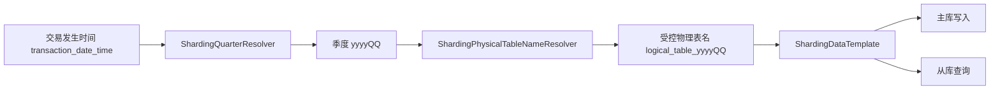
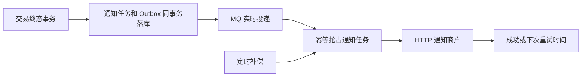
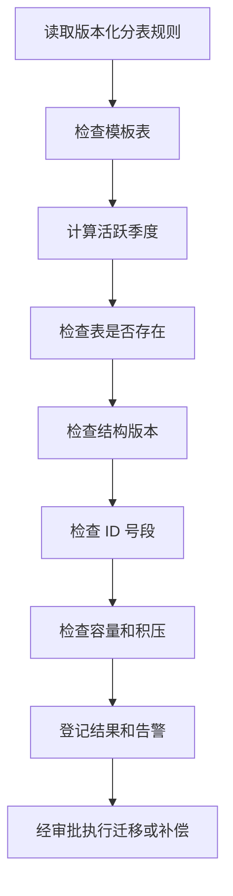
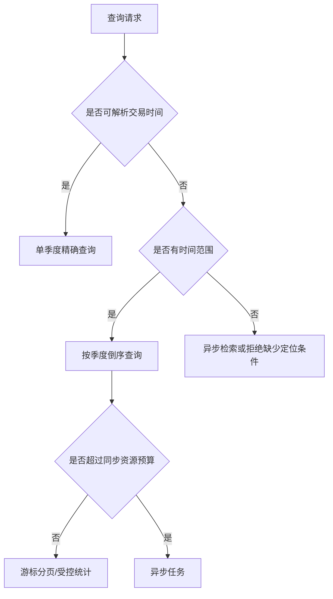

# 交易季度分表专项扫描与整改方案

> 扫描日期：2026-08-01
>
> 后端仓库：`acquiring-orchestration`
>
> 前端仓库：`acquiring-frontend`
>
> 扫描分支：`feature_scott_payment`
>
> 报告性质：代码、配置和 dev 数据库联合扫描报告，不是生产变更脚本
>
> 数据安全：本文不记录数据库密码、Nacos 敏感配置值、密钥或其他认证信息

后续目标架构和全量迁移步骤见：[ShardingSphere 交易季度分表全量升级方案](../../architecture/shardingsphere-full-migration-plan.md)。

## 1. 文档目的

本文用于完整记录当前交易季度分表方案的实现状态、已验证能力、已发现问题和建议整改路径，覆盖以下范围：

1. 分表规则、路由算法、物理表命名、季度 ID 号段和表结构检查；
2. 管理系统中的分表规则、物理表、建表任务、执行日志和 ID 规则功能；
3. 管理系统、商户系统的跨表查询、统计、分页、详情和导出；
4. 支付链路中的交易时间生成、物理表路由、交易事实入库、回调、MQ、商户通知和幂等；
5. Nacos dev 分表配置、定时任务配置和 dev 数据库中的真实表、索引、治理记录及业务数据；
6. 分表生命周期，包括预建表、缺表补偿、模板升级、归档、配置续期和灾备恢复。

本文只提出整改方案，不直接执行 DDL、DML、Nacos 修改或业务代码修改。每个整改项实施前仍需单独评审影响范围、回滚方案和回归范围。

## 2. 扫描结论

### 2.1 总体判断

当前方案不是 ShardingSphere，而是基于 `transaction_date_time` 的自研季度分表方案。核心路由链路已经形成，受控物理表名解析也避免了直接拼接任意表名的 SQL 注入风险。dev 数据库中当前季度和下一季度的 23 张交易表均已创建，现有样本数据没有发现跨季度错表。

但是，该方案尚未形成生产可持续运行的治理闭环。主要风险集中在：

- 交易和分表治理 SQL 已从仓库删除，且没有独立 DBA 仓库作为权威恢复来源；
- 调用方传入的历史或未来交易时间没有被核心服务拒绝；
- 部分物理表季度 ID 号段没有生效，但结构检查仍误报为 `MATCHED`；
- 商户通知的 MQ 和定时补偿均未形成可工作的实际链路；
- 渠道主动查询推进终态后，幂等快照可能永久停留在 `PROCESSING`；
- 跨季度查询使用逐表 `COUNT + OFFSET`，取消查询跨度限制后需要独立的资源保护；
- 缺表、模板升级、历史补偿、归档、2035 年后续期均没有自动治理机制；
- 商户订单号和渠道流水号缺少未知时间条件下的全局定位能力。

### 2.2 风险统计

| 等级 | 数量 | 定义 |
|---|---:|---|
| P0 | 5 | 会导致环境无法重建、数据路由不可信、通知失效或幂等状态不一致，应在生产准入前处理 |
| P1 | 12 | 当前数据量下可能暂不显现，但会随季度数量、数据量和并发增长而放大 |
| P2 | 5 | 治理准确性、前端展示、时间精度、权限或工程门禁问题 |

### 2.3 已修正或排除的旧结论

| 项目 | 最终口径 | 处理结论 |
|---|---|---|
| 查询最多六季度 | 取消该业务限制 | 不再要求 `beginTime` 与 `endTime` 最多相差 18 个月 |
| 生产 JVM 可能运行 UTC | 用户已确认交易服务器统一为中国 `+08:00` | 不再作为当前代码缺陷，但应作为部署硬约束 |
| 交易相关表的时区字段 | 当前交易相关表已增加时区字段，用于表达不同国家商户的交易时间语义 | 这是当前实现现状，不推导为其他表不需要时区字段 |
| 非交易表是否增加时区字段 | 用户未作结论 | 应根据具体字段的业务含义、数据来源和跨时区展示要求单独评估 |
| `DATETIME(0)` | 与是否保存时区无关 | 仍需按项目规范评估迁移为 `DATETIME(3)` |

## 3. 扫描范围与证据等级

### 3.1 仓库范围

| 范围 | 重点内容 |
|---|---|
| `component-library/component-db` | 分表配置、季度解析、受控表名、DDL、表结构检查、ID 号段 |
| `service-payment` | 交易创建、入库、状态推进、幂等、回调、通知、Outbox |
| `service-openapi` | 交易时间生成、支付内部请求组装 |
| `service-admin` | 管理端交易查询、分页、统计、详情、分表治理接口 |
| `service-merchant` | 商户隔离后的跨季度查询、分页和统计 |
| `service-job` | 物理表预建、渠道补单、商户通知重试 |
| `acquiring-frontend/apps/admin-system` | 分表治理页面、交易查询页面、导出和大整数类型 |
| Nacos dev 配置 | 分表规则、数据源、MQ 和任务相关配置 |
| dev 数据库 `payment_acquiring` | 真实表、索引、号段、治理状态、通知、幂等和 Outbox 数据 |

### 3.2 证据等级

| 标识 | 证据来源 | 可信度说明 |
|---|---|---|
| A | dev 数据库只读扫描结果 | 已由真实表结构或数据验证 |
| B | 当前分支代码 | 已定位到具体类、方法或 SQL |
| C | Nacos dev 或仓库中的配置样例 | 反映当前运行配置或配置漂移 |
| D | 用户确认的生产约束 | 作为设计和整改边界 |

### 3.3 扫描限制

1. 本次没有连接生产数据库，不代表生产数据与 dev 完全一致；
2. 本次没有执行 DDL、DML、Nacos 发布或任务触发；
3. dev 数据量较小，查询性能结论主要来自 SQL、执行路径和索引结构分析；
4. 当前分支存在独立编译阻塞项，因此没有以全仓构建结果替代静态和数据库证据；
5. dev 数据库临时账号具备写权限，本次仅通过客户端纪律执行只读查询，不等同于数据库层强制只读。

## 4. 已确认的业务与部署约束

| 约束 | 确认结果 | 对设计的影响 |
|---|---|---|
| 交易服务器时区 | 统一为中国 `+08:00` | `LocalDateTime` 和季度路由按 `Asia/Shanghai` 解释 |
| 交易相关表的时区字段 | 已增加 | 用于保存不同国家商户交易的原始时区语义，并支持统一 UTC 时刻核对 |
| 非交易表的时区字段策略 | 尚未确认 | 本报告不作“不增加”的结论，后续按字段用途单独评估 |
| 查询最大跨度 | 不限制六季度或 18 个月 | 查询服务必须使用资源治理替代固定业务跨度限制 |
| 历史交易补录 | 不允许 | 核心服务必须拒绝历史交易发生时间 |
| 未来交易时间 | 不允许 | 核心服务必须拒绝未来交易发生时间 |
| 交易时间含义 | 必须为实际发生时间 | 不能把请求到达时间、数据库时间或渠道回调时间混作交易发生时间 |
| 全局交易索引 | 暂无建设计划 | 必须明确哪些编号自带时间，哪些查询强制要求时间范围 |
| 商户订单全局索引 | 暂无建设计划 | 未知时间的商户订单精确查询无法保证低成本定位 |
| 渠道流水全局索引 | 暂无建设计划 | 回调和人工检索必须携带可验证的分表定位信息 |
| 历史归档 | 暂无机制 | 表数量和历史查询成本会持续增长 |
| 模板升级 | 暂无机制 | 模板变更不会自动升级已存在物理表 |
| 跨季度补偿 | 暂无机制 | 季度切换后旧季度待处理任务可能被遗漏 |
| 2035 配置续期 | 暂无机制 | 到达配置结束季度后路由和预建会停止 |
| DBA SQL 仓库 | 不存在 | 当前数据库成为唯一事实来源，恢复能力不足 |

## 5. 当前分表真实方案

### 5.1 核心路由



关键实现：

- `PaymentOrderShardingAlgorithm`：根据交易时间计算季度；
- `ShardingQuarterResolver`：解析季度、配置起止范围和数据库时区；
- `ShardingPhysicalTableNameResolver`：生成并校验物理表标识符；
- `ShardingTableRangeResolver`：按时间范围倒序生成季度物理表列表；
- `ShardingDataTemplate`：将逻辑表上下文转换为受控物理表名；
- Mapper 中的 `${physicalTableName}` 只接收上述受控解析结果，而不是直接接收外部表名。

这一点是当前方案的正确基础，应保留，后续整改不建议替换为分散的字符串拼表逻辑。

### 5.2 分表命名和范围

当前规则采用：

```text
逻辑表：transaction_order
季度：2026-Q3
物理表：transaction_order_202603
```

运行配置中的 23 条交易规则有效范围为 `2026-Q3` 至 `2035-Q4`。仓库中的 `docs/deployment/nacos/sharding-dev.yaml` 仍以 `2026-Q1` 为起点，存在配置样例与实际 Nacos 配置不一致的问题。

### 5.3 交易表族

当前 23 张交易逻辑表包括：

| 分类 | 逻辑表 |
|---|---|
| 主交易 | `transaction_order`、`transaction_operation` |
| 交易快照 | `transaction_merchant_snapshot`、`transaction_payment_method_info`、`transaction_payer_info`、`transaction_billing_info`、`transaction_additional_info`、`transaction_authentication_info`、`transaction_product_item` |
| 渠道链路 | `transaction_channel_request`、`transaction_channel_interaction_log`、`transaction_channel_callback`、`transaction_channel_callback_log` |
| 状态与金额 | `transaction_flow_event`、`transaction_status_history`、`transaction_amount_change_log`、`transaction_finance_state`、`transaction_currency_conversion` |
| 商户通知 | `transaction_merchant_notification`、`transaction_merchant_notification_log`、`transaction_merchant_api_interaction_log` |
| 可靠事件与异常 | `transaction_event_outbox`、`transaction_abnormal_event` |

Nacos dev 中另有 4 条启用的 `test_*` 规则，不属于正式交易表族。

### 5.4 季度 ID 方案

当前配置使用 MySQL 自增主键和季度前缀：

```text
格式：yyyyQQ + 12 位序号
2026-Q3 起始值：202603000000000001
2026-Q3 最大值：202603999999999999
```

该方案要求每张新物理表创建后正确设置 `AUTO_INCREMENT` 起始值，并要求结构检查同时验证：

1. `id` 是 `BIGINT AUTO_INCREMENT PRIMARY KEY`；
2. 当前 `AUTO_INCREMENT` 不低于本季度起始值；
3. 当前值没有超过本季度最大值；
4. 物理表中的已有 ID 均属于当前季度号段。

当前实现只完整覆盖第 1 项，没有可靠覆盖第 2 至第 4 项。

### 5.5 物理表治理

`service-job` 当前负责检查或预建当前季度和下一季度物理表。管理系统提供：

- 分表规则列表与详情；
- 物理表列表与详情；
- 刷新物理表状态；
- 结构检查；
- Dry Run；
- 执行建表；
- 建表执行日志；
- ID 规则展示。

商户系统没有分表治理菜单，这是合理的权限边界。商户只能查询属于当前商户的数据，不应拥有建表、结构检查或规则查看权限。

## 6. 已验证正常的能力

### 6.1 数据库结构

dev 数据库扫描结果：

| 检查项 | 结果 |
|---|---|
| MySQL 版本 | `8.4.9` |
| schema | `payment_acquiring` |
| 交易模板表 | 23 张 |
| `2026-Q3` 物理表 | 23 张 |
| `2026-Q4` 物理表 | 23 张 |
| 模板与物理表字段差异 | 未发现 |
| 模板与物理表索引差异 | 未发现 |

### 6.2 数据路由一致性

扫描 46 张季度交易表，共计 11,964 行数据：

- 没有发现 `transaction_date_time` 落在物理表季度之外的数据；
- 没有发现未来交易时间数据；
- 操作时间的本地时间与 UTC 时间差稳定为 28,800 秒；
- 当前 dev 样本没有出现季度错表。

这说明现有数据在当前统一 `+08:00` 部署约束下是自洽的，但不能替代对调用方时间参数的强制校验。

### 6.3 数据库唯一约束

已确认的正向约束包括：

| 表 | 唯一约束 | 作用 |
|---|---|---|
| `transaction_idempotency` | `(idempotency_scope, idempotency_key)` | 防止同一业务幂等键重复占位 |
| `transaction_channel_callback_*` | `(channel_code, idempotency_key)` | 防止同一分表内重复处理渠道回调 |
| `transaction_merchant_notification_*` | 商户、交易、通知类型和事件组合键 | 防止同一分表内重复生成通知任务 |
| `transaction_merchant_notification_log_*` | `(notify_id, attempt_no)` | 防止同一通知重试次数重复记录 |
| `transaction_event_outbox_*` | `event_no`、`message_key` | 防止同一分表内重复事件 |

### 6.4 Outbox 数据

dev 数据库共有 853 条 Outbox 记录，状态均为 `SENT`，重试次数均为 0。当前样本没有发现积压，但仍需要生产级积压、失败和超时监控。

## 7. 问题总表

| 编号 | 等级 | 问题 | 当前影响 | 证据 |
|---|---|---|---|---|
| P0-01 | P0 | 交易和分表治理 SQL 无权威恢复源 | 新环境、灾备和回滚不可重复 | A/B/D |
| P0-02 | P0 | 未拒绝历史或未来交易时间 | 可路由到错误季度并污染号段 | B/D |
| P0-03 | P0 | 季度 ID 号段失效且检查误报 | 跨表 ID 可能重复，治理状态不可信 | A/B |
| P0-04 | P0 | 商户通知实际未执行 | 支付终态无法可靠通知商户 | A/B/C |
| P0-05 | P0 | 幂等快照停留在 `PROCESSING` | 重试响应和真实终态不一致 | A/B |
| P1-01 | P1 | 不限跨度后的同步查询缺少资源治理 | 大跨度查询可能拖慢从库 | B/D |
| P1-02 | P1 | 跨表分页重复计数并使用深 offset | 页码越深成本越高 | B |
| P1-03 | P1 | 统计和分页重复扫描 | 同一请求对各季度重复聚合 | B |
| P1-04 | P1 | 导出同步执行且缺少总量治理 | 大导出可能超时或占用大量内存 | B |
| P1-05 | P1 | 缺少物理表会使范围查询整体失败 | 一个季度缺表影响整个查询 | B |
| P1-06 | P1 | 未知时间的订单和渠道流水无法定位 | 只能扫描季度或要求额外时间 | B/D |
| P1-07 | P1 | 从库延迟语义未定义 | 支付成功后立即查询可能读到旧数据 | B |
| P1-08 | P1 | 时间查询索引和排序不匹配 | 全表扫描或 filesort | A/B |
| P1-09 | P1 | 4 条 `test_*` 规则污染治理任务 | 每次多检查 8 张测试表 | A/C |
| P1-10 | P1 | 缺表记录可能显示 `MATCHED` | 管理页面健康状态互相矛盾 | A/B |
| P1-11 | P1 | 没有跨季度补偿扫描 | 季度切换后旧任务可能滞留 | B/D |
| P1-12 | P1 | 没有模板升级、归档和 2035 续期 | 长期运行缺少生命周期闭环 | B/C/D |
| P2-01 | P2 | 前端用 `number` 承载 18 位 ID | 展示和回传可能丢失精度 | B |
| P2-02 | P2 | 页面可能把部分失败显示为成功 | 运维人员可能忽略失败表 | B |
| P2-03 | P2 | Nacos 样例与实际运行范围不一致 | 新环境可能按错误起点部署 | B/C |
| P2-04 | P2 | 16 个具体时刻字段仍为 `DATETIME(0)` | 不符合毫秒精度规范 | A |
| P2-05 | P2 | 临时数据库账号权限过大 | 扫描客户端不是强制只读 | A |

## 8. P0 问题与修复方案

### 8.1 P0-01：交易和分表治理 SQL 无权威恢复源

#### 现象与证据

提交 `da2de2c` 删除了以下 6 个 SQL 文件，共 2,734 行：

- `docs/sql/transaction-core-schema.sql`；
- `docs/sql/checkout-session-ddl-dev.sql`；
- 分表治理表迁移 SQL；
- 分表治理证据 SQL；
- 分表治理回滚 SQL；
- 持久化对齐迁移 SQL。

用户已确认这些 SQL 没有迁移到独立 DBA 仓库。

#### 风险

1. 无法从版本化脚本重建新的 dev、test、uat 或灾备环境；
2. 无法证明线上表结构对应哪个代码版本；
3. 模板表、物理表、治理表和任务表的创建顺序不可重复；
4. 出现错误 DDL 后没有经过评审的回滚脚本；
5. 当前数据库成为唯一事实来源，误删或损坏后恢复困难。

#### 推荐修复

1. 从受控数据库导出仅包含结构的基线，不导出业务数据、账号或密码；
2. 对照删除提交前的 SQL、当前实体、Mapper 和真实 `SHOW CREATE TABLE` 做三方核对；
3. 将 SQL 分为基线建表、增量迁移、回滚和校验四类；
4. 优先建设独立 DBA 仓库；在 DBA 仓库建立前，可临时恢复到 `docs/sql/`，但必须标明仅为草案；
5. 每个迁移脚本记录适用版本、前置检查、执行顺序、回滚限制和验收 SQL；
6. 禁止应用启动时自动修改正式交易表结构。

#### 验收标准

- 空 schema 可以通过版本化 SQL 创建完整模板表、治理表和任务表；
- 对比当前 dev 数据库，字段、类型、默认值、索引、唯一约束和注释一致；
- 所有 SQL 不包含账号、密码、测试密钥或业务数据；
- 回滚脚本经过人工评审，明确不可逆步骤。

### 8.2 P0-02：未拒绝历史或未来交易时间

#### 现象与证据

`PaymentTransactionServiceImpl.validateCreateCommand` 和后续动作校验只在 `transactionDateTime == null` 时使用当前时间，没有拒绝调用方提供的历史或未来值。

`service-openapi` 当前会写入 `LocalDateTime.now()`，但内部接口、测试入口或未来调用方仍可能传入任意时间。核心服务不能只依赖上游自律。

#### 风险

1. 历史时间会把新交易写入旧季度表；
2. 未来时间会提前写入下一季度表；
3. 交易号、操作号和物理表季度语义不一致；
4. 商户通知、回调、对账和详情查询会使用错误分表定位；
5. 错误时间可能绕过当前季度容量和监控口径。

#### 推荐修复

1. 首次交易由 `service-payment` 生成权威交易发生时间，不接受普通调用方覆盖；
2. 如果确有渠道权威发生时间，使用独立字段保存，不直接作为平台首次入库路由时间；
3. 后续动作必须继承原交易生命周期的分表定位时间，不使用当前请求自行指定的时间；
4. 在应用服务入口校验时间不早于允许时钟偏差、不晚于当前时间加允许偏差；
5. 允许的时钟偏差应是秒级配置，用于网络和多节点时钟误差，不应扩展为历史补录能力；
6. 记录拒绝原因、请求 ID、商户 ID 和时间差，但不记录敏感请求明文。

#### 建议测试

- 当前时间创建成功；
- 早于允许偏差的时间被拒绝；
- 晚于允许偏差的未来时间被拒绝；
- Q3 最后一秒和 Q4 第一秒分别进入正确季度；
- 后续请款、退款和撤销继承原交易定位时间；
- JVM、容器和数据库会话均为 `+08:00` 时边界结果一致。

### 8.3 P0-03：季度 ID 号段失效且检查误报

#### 现象与证据

dev 数据库中：

```text
transaction_merchant_api_interaction_log_202603
期望起始值：202603000000000001
实际已有 ID：1 至 689
下一 AUTO_INCREMENT：690

transaction_merchant_api_interaction_log_202604
下一 AUTO_INCREMENT：1
```

`ShardingTableSchemaInspector.normalizeCreateTable` 在比较 DDL 时删除 `AUTO_INCREMENT=n`，因此物理表即使没有季度起始值也可能显示 `MATCHED`。

#### 风险

1. 不同季度物理表可能产生相同的 `id`；
2. 依赖全局唯一 ID 的详情、日志关联或外部引用可能指向错误记录；
3. 管理系统显示健康，但真实号段不符合配置；
4. 后续修正起始值时可能与已有小 ID 混合，形成不可解释的数据区间；
5. JavaScript 前端无法安全承载 18 位整数。

#### 推荐修复

1. 表结构等价比较可以继续忽略动态 `AUTO_INCREMENT`，但号段校验必须独立执行；
2. 增加 `expectedStart <= autoIncrementCurrent <= expectedMax + 1` 检查；
3. 增加已有数据 `MIN(id)`、`MAX(id)` 是否属于季度号段的检查；
4. 物理表状态增加独立的 `id_range_check_status`，不要复用 `schema_check_status`；
5. 对已有小 ID 数据制定迁移策略，不能直接修改主键而忽略外键、日志和关联字段；
6. 后端把 18 位 ID 以字符串返回前端，前端类型改为 `string`；
7. 建表流程必须在登记 `CREATED` 前确认号段设置成功。

#### 回滚与兼容

- 只增加检查逻辑时可以直接回滚应用版本；
- 修改已有 ID 属于高风险数据迁移，必须独立脚本、停写窗口、映射表和回滚备份；
- 在历史数据完成迁移前，查询层需要兼容小 ID 和季度前缀 ID；
- 不建议在同一变更中同时修改 ID 生成方案和所有业务关联字段。

### 8.4 P0-04：商户通知实际未执行

#### 现象与证据

dev 数据库扫描结果：

| 项目 | 数量 |
|---|---:|
| 商户通知任务 | 646 |
| 已到期且仍为 `INIT` | 645 |
| 商户通知日志 | 0 |

同时：

- `service-payment-dev.yaml` 中 MQ 消费默认关闭；
- 调度中心不存在 `MERCHANT_NOTIFICATION_RETRY` 任务；
- 没有该任务的运行历史；
- `MerchantNotificationRetryJob` 代码存在，但运行配置没有启用它。

#### 风险

1. 支付成功或失败终态无法通知商户；
2. 商户只能主动轮询，可能重复发起后续动作；
3. 通知任务持续积压，跨季度后更难补偿；
4. 没有通知日志，无法证明是否发起、验签、响应或重试；
5. 商户与平台交易状态长期不一致。

#### 推荐架构

推荐采用“MQ 主投递 + 定时补偿”，而不是只依赖一种机制：



具体要求：

1. 交易终态、通知任务和 Outbox 在本地事务中一致落库；
2. MQ 消费按 `notify_id` 幂等抢占，只允许 `INIT/FAILED -> PROCESSING`；
3. 成功只能 `PROCESSING -> SUCCESS`；
4. 失败根据次数进入 `FAILED` 或最终失败状态；
5. 定时任务扫描所有仍可能有待处理数据的季度，而不是只扫当前时间所在季度；
6. `PROCESSING` 超时必须有回收机制；
7. 通知地址、签名配置和载荷使用交易时快照；
8. 记录脱敏请求、响应、耗时、HTTP 状态和失败分类。

#### 验收标准

- 支付终态后实时生成一条通知任务；
- MQ 正常时在 SLA 内完成首次通知；
- MQ 关闭时定时补偿能够送达；
- 重复 MQ、重复任务扫描和重复 HTTP 回调不产生重复成功记录；
- 季度切换后上一季度未完成通知仍会被扫描；
- 通知成功后立即停止重试；
- 监控能够展示积压数、最老积压年龄、成功率和最终失败数。

### 8.5 P0-05：幂等快照停留在 `PROCESSING`

#### 现象与证据

dev 数据库存在 62 条 `transaction_idempotency` 记录仍为 `PROCESSING`，对应交易操作单均已为 `FAILED`：

| 交易类型 | 数量 |
|---|---:|
| `PAYMENT` | 30 |
| `AUTHORIZATION` | 26 |
| `PRE_AUTHORIZATION` | 6 |

`DefaultTransactionChannelMatchResultTransactionService.completeByQuery` 会推进交易终态并保存 Outbox，但没有同步更新幂等快照。`expire_time` 目前只在创建时写入，没有被查询、抢占、超时恢复或清理逻辑使用。

#### 风险

1. 同一幂等键重试时可能持续收到处理中结果；
2. 幂等表和交易事实表对同一请求给出不同状态；
3. 运营人员无法判断是否可以重试；
4. 永久 `PROCESSING` 会积累，最终影响容量和查询；
5. 如果未来错误地按过期时间删除记录，可能重新放开同一资金操作。

#### 推荐修复

1. 把交易终态推进、状态历史、Outbox 和幂等快照更新放在明确的一致性边界内；
2. 渠道回调、主动查询、冲正和人工补单等所有终态入口统一调用幂等完成服务；
3. 更新幂等状态时带当前状态条件，使用 CAS 防止终态被旧结果覆盖；
4. 明确 `expire_time` 只用于请求快照保留策略，不能自动解除资金类唯一约束；
5. 建立异常扫描：交易已终态但幂等仍 `PROCESSING`；
6. 对现有 62 条记录生成只读核对清单，再通过审批后的修复脚本回填，禁止直接批量无条件更新。

#### 建议状态规则

```text
不存在 -> PROCESSING
PROCESSING -> SUCCESS
PROCESSING -> FAILED
SUCCESS/FAILED -> 不允许被旧请求覆盖
```

如果业务允许可重试失败，需要使用新的业务幂等键或明确的重试版本，不能把已终态记录重新改回 `PROCESSING`。

## 9. P1 问题与修复方案

### 9.1 P1-01 至 P1-04：查询、分页、统计和导出成本

#### 当前实现

Admin 和 Merchant 查询按季度倒序遍历物理表：

1. 对每张物理表执行 `COUNT(*)`；
2. 根据全局页码逐表消耗 offset；
3. 命中目标季度后执行 `ORDER BY ... LIMIT offset, limit`；
4. 统计接口再对各季度执行聚合；
5. 导出通过同步接口生成 Excel。

主要代码：

- `JdbcAdminTransactionQueryService.pageOrders`；
- `JdbcAdminTransactionQueryService.pageOperationsNormalized`；
- `JdbcMerchantTransactionQueryService.pageOrders`；
- `JdbcMerchantTransactionQueryService.pageOperations`。

#### 取消六季度限制后的影响

取消业务跨度限制是可行的，但不能等同于允许一个同步 HTTP 请求无成本扫描任意数量季度。建议将“业务查询范围”和“单次同步资源预算”分开：

- 业务上允许查询全部历史；
- 技术上限制单次同步请求的执行时间、扫描表数、导出行数和并发数；
- 超过同步预算时转异步任务，而不是返回“跨度超过六季度”。

#### 推荐方案

| 场景 | 推荐策略 |
|---|---|
| 第一页和浅分页 | 保留按季度倒序查询，但减少重复 `COUNT` |
| 深分页 | 改为基于 `(transaction_date_time, id)` 的游标分页 |
| 精确交易号 | 从编号解析分表时间，直接定位单表 |
| 商户订单号 | 强制商户 ID 和时间范围；未来再评估轻量定位索引 |
| 渠道流水号 | 强制渠道编码和时间范围，回调链路携带平台定位信息 |
| 统计 | 使用季度汇总表、离线聚合或缓存，不与每次分页重复全量计算 |
| 大导出 | 创建异步导出任务，分批读取并流式写文件 |
| 超长历史查询 | 后台任务执行，完成后提供受控下载 |

#### 验收指标

- 普通查询 P95/P99 响应时间；
- 单请求最多访问的物理表数量；
- 单请求 SQL 数量；
- 从库扫描行数和临时表/filesort 次数；
- 导出峰值内存、文件大小、最大行数和并发数；
- 取消固定跨度后仍不会通过单请求耗尽数据库连接池。

### 9.2 P1-05：缺表导致整个范围查询失败

`ShardingTableRangeResolver` 根据配置生成物理表名，不检查该表是否真实存在。除少数可选日志查询吞掉异常外，大部分分页和统计在任何一张表缺失时都会整体失败。

#### 推荐修复

1. 生产查询默认把缺表视为治理异常，不应静默返回不完整数据；
2. 查询前通过短期缓存的物理表注册表判断缺表；
3. 返回统一的“数据分区不可用”错误和缺失季度，不暴露原始 SQL；
4. 同时触发告警和治理补偿任务；
5. 只有明确允许不完整结果的运营报表，才可返回 `partial=true` 和缺失分区列表；
6. 支付写入遇到缺表必须失败并告警，不能自动写入其他季度或逻辑模板表。

### 9.3 P1-06：缺少未知时间条件下的全局定位

当前交易号可通过编码时间定位，但以下键没有可靠的跨季度定位能力：

- `merchant_id + merchant_order_no`；
- `channel_code + channel_order_no`；
- 渠道流水号或渠道回调幂等键；
- 未携带原交易时间的人工补单条件。

用户已确认暂不建设全局索引，因此需要明确替代契约：

1. 商户订单查询必须携带商户 ID 和时间范围；
2. 渠道回调必须通过平台交易号、签名上下文或已保存映射获得原交易时间；
3. 后续动作必须携带可解析的源交易 ID，不能只传渠道流水号；
4. 运营查询如果没有时间范围，应转为异步跨表检索；
5. 每个接口文档必须说明缺少分表定位信息时的行为。

如果未来要求未知时间下毫秒级精确查询，则必须重新评估全局定位表或搜索索引，单靠季度表无法同时满足低成本和强一致。

### 9.4 P1-07：从库延迟语义未定义

Admin 和 Merchant 交易查询均显式使用 `DataSourceName.SLAVE`。当前没有明确：

- 从库延迟 SLA；
- 支付成功后是否要求立即可查；
- 查询不到时是否回源主库；
- 详情页是否允许展示旧状态；
- 商户轮询接口的缓存和重试语义。

#### 推荐修复

1. 定义普通查询的最大可接受延迟；
2. 支付创建响应使用本次事务结果，不依赖随后查询从库；
3. 对“刚完成支付后立即查询”的强一致场景，根据交易 ID 和短时间窗口选择性回源主库；
4. 回源必须限流，不能把所有查询改为主库；
5. 暴露主从延迟指标并建立告警；
6. 页面和 OpenAPI 不应把短暂未同步误报成永久订单不存在。

### 9.5 P1-08：查询索引和排序不匹配

扫描发现：

- Admin 仅按时间查询订单或操作单时，容易全表扫描并 filesort；
- Merchant 查询可使用 `merchant_id` 索引前缀，但时间倒序仍可能 filesort；
- `ORDER BY transaction_date_time DESC, id DESC` 需要与常用过滤条件组合设计索引；
- 不能只根据单条 SQL 添加索引，必须结合写入成本和真实慢查询验证。

#### 候选索引方向

```text
Admin 时间查询：
(transaction_date_time, id)

Merchant 时间查询：
(merchant_id, transaction_date_time, id)

Merchant 订单查询：
(merchant_id, merchant_order_no, transaction_date_time)

渠道流水查询：
(channel_code, channel_order_no, transaction_date_time)
```

以上只是候选顺序，不应直接执行。实施前必须：

1. 采集生产真实过滤组合和排序；
2. 对代表性季度表执行 `EXPLAIN ANALYZE`；
3. 检查现有索引能否复用，避免重复索引；
4. 评估每张季度表增加索引后的写放大和存储成本；
5. 先修改模板，再通过受控迁移升级所有已存在物理表。

### 9.6 P1-09 与 P1-10：测试规则污染和治理状态误报

Nacos dev 当前启用 27 条规则，其中 23 条正式交易规则和 4 条 `test_*` 规则。预建任务检查当前和下一季度，因此每次计划 54 张表。4 条缺失测试表的治理记录出现：

```text
table_status = MISSING
schema_check_status = MATCHED
```

#### 推荐修复

1. 将 `test_*` 规则从正式 dev 交易规则中移除，放到独立测试配置或默认关闭；
2. 建立清晰状态机：`UNKNOWN -> MISSING/EXISTS/CREATED/FAILED`；
3. 表不存在时，结构状态应为 `NOT_CHECKED`，不能是 `MATCHED`；
4. 结构相同但 ID 号段错误时，应同时展示 `schema=MATCHED`、`idRange=MISMATCHED`；
5. 页面总状态必须由表存在、结构、号段和最近检查时间共同决定；
6. 配置删除后要有治理记录退役策略，避免永久残留。

### 9.7 P1-11：没有跨季度补偿扫描

商户通知重试和渠道主动查询任务默认使用 `LocalDateTime.now()` 定位当前季度。季度切换后，上一季度仍处于 `INIT`、`FAILED`、`PROCESSING` 或待匹配状态的数据可能不再进入默认扫描范围。

#### 推荐修复

1. 建立“活跃补偿季度”概念，而不是只扫描当前季度；
2. 至少覆盖当前季度、上一季度以及治理表标记仍有积压的季度；
3. 每个季度维护待处理数量和最老待处理时间；
4. 当上一季度所有任务终态且超过保留窗口后，再退出活跃扫描；
5. 任务参数允许人工指定季度，但人工参数不能替代自动补偿；
6. 跨季度扫描必须限批次、可续跑、幂等和可观测。

### 9.8 P1-12：缺少完整生命周期治理

#### 当前缺口

| 生命周期阶段 | 当前状态 |
|---|---|
| 当前季度预建 | 已有 |
| 下一季度预建 | 已有 |
| 历史缺表修复 | 无自动机制 |
| 已存在表结构升级 | 只检测，不自动升级 |
| ID 号段修复 | 检测不完整，无修复机制 |
| 冷数据归档 | 无 |
| 跨季度补偿 | 无 |
| 配置到期续期 | 2035 年后无机制 |
| 灾备重建 | 缺少权威 SQL |

#### 推荐治理流程



自动任务可以检查和告警，但不建议第一阶段自动 `ALTER` 已存在交易表。结构升级应由版本化 SQL 和 DBA 审批执行。

## 10. P2 问题与修复方案

### 10.1 P2-01：前端大整数精度

`apps/admin-system/src/api/monitor/sharding.ts` 将以下字段定义为 `number`：

- `autoIncrementStart`；
- `autoIncrementCurrent`；
- `autoIncrementMax`；
- `currentQuarterStartValue`；
- `currentQuarterMaxValue`。

18 位季度 ID 超过 JavaScript 安全整数 `Number.MAX_SAFE_INTEGER`。

#### 推荐修复

- 后端 DTO 使用字符串序列化这些展示型数值；
- 前端全部改为 `string`；
- 页面只做展示和复制，不做浮点运算；
- 如需比较，使用字符串长度和字典序，或明确使用 `BigInt`，但不要把 `BigInt` 直接传入 JSON。

### 10.2 P2-02：部分失败仍提示成功

物理表刷新和检查页面在接口正常返回后直接显示成功消息，没有先判断 `failedCount`、`schemaMismatchCount` 和逐表失败结果。

#### 推荐修复

| 结果 | 页面行为 |
|---|---|
| 全部成功 | 成功提示 |
| 部分失败 | 警告提示，并自动展开失败列表 |
| 全部失败 | 错误提示 |
| 结构不一致 | 独立风险提示，不与创建成功混合 |

后端批次状态也应明确区分 `SUCCESS`、`PARTIAL_SUCCESS`、`FAILED` 和 `DRY_RUN`。

### 10.3 P2-03：本地 Nacos 样例与运行配置漂移

仓库中的 `sharding-dev.yaml` 从 `2026-Q1` 开始，而实际 Nacos 交易规则从 `2026-Q3` 开始。配置样例如果用于新环境部署，会生成不同的治理范围。

#### 推荐修复

1. 明确 Nacos 是运行源，Git 中保留经过脱敏的版本化基线；
2. 发布配置时记录版本号、校验和和审批人；
3. CI 对 Git 基线和待发布 Nacos 配置执行结构差异检查；
4. 禁止配置文件包含数据库真实密码或默认生产凭据；
5. dev、uat、prod 使用不同 Data ID 或 namespace，不通过手工复制维持一致。

### 10.4 P2-04：具体时刻字段仍为 `DATETIME(0)`

dev 数据库中有 16 个治理或任务相关具体时刻字段仍为 `DATETIME(0)`。本项扫描确认的是毫秒精度不符合项目规范；这些字段是否还需要单独保存时区信息，应根据各字段的业务来源和展示要求另行评估。

#### 推荐修复

1. 只生成 `docs/sql/datetime3-migration.sql` 草案，不直接执行；
2. 对每个字段核对默认值、`ON UPDATE`、索引和 Java 映射；
3. 将具体时刻改为 `DATETIME(3)`、`CURRENT_TIMESTAMP(3)`；
4. 业务日期继续保留 `DATE`，不要机械修改；
5. Admin 页面仍展示到秒，不代表数据库需要丢弃毫秒。

### 10.5 P2-05：临时数据库账号权限过大

扫描使用的临时账号实际为可远程访问的高权限账号，数据库 `read_only=0`，具备 DML 和 DDL 权限。本次通过查询纪律保持只读，但这不是可靠安全控制。

#### 推荐修复

- 立即轮换或撤销临时凭据；
- 创建限定来源 IP、限定 schema 的专用只读账号；
- 只授予 `SELECT`、必要的 `SHOW VIEW` 和 `information_schema` 查询能力；
- 禁止使用 `root@%` 进行日常扫描；
- Nacos 数据源配置禁止带可用的默认密码回退值。

## 11. 管理系统功能评估

### 11.1 已具备能力

| 功能 | 结论 |
|---|---|
| 分表规则列表 | 已实现 |
| 规则详情 | 已实现 |
| 物理表列表和筛选 | 已实现 |
| 物理表详情 | 已实现 |
| 当前/下一季度 Dry Run | 已实现 |
| 执行创建 | 已实现 |
| 结构检查 | 已实现，但号段和缺表状态不完整 |
| 创建日志 | 已实现 |
| ID 规则展示 | 已实现，但前端有大整数精度问题 |

### 11.2 建议补充能力

1. 独立展示表存在状态、结构状态、ID 号段状态和容量状态；
2. 展示配置版本、模板结构版本和最近成功检查时间；
3. 展示失败季度、失败原因和建议动作；
4. 提供“仅检查”与“执行创建”明确分离的确认流程；
5. 创建属于高风险操作，应记录操作人、请求 ID、批次号、目标表和结果；
6. 不提供自动 `ALTER` 入口，结构迁移通过 DBA 流程；
7. 增加活跃季度积压视图，用于通知和渠道补单；
8. 所有操作按钮和后端接口权限码逐项对齐，不能只依赖页面隐藏。

## 12. 商户系统功能评估

### 12.1 正确边界

商户系统不应暴露分表规则、物理表名、建表或结构治理菜单。当前没有商户分表治理菜单是正确的。

### 12.2 查询要求

1. 所有查询必须从认证上下文获取 `merchant_id`，不能信任前端传入；
2. 查询 SQL 必须包含商户隔离条件；
3. 商户订单号查询建议同时要求时间范围；
4. 精确交易号查询可解析交易时间后直接定位；
5. 从库延迟不能被解释为永久订单不存在；
6. 大跨度历史下载应异步执行；
7. 统计结果必须明确币种，不能跨币种直接求和；
8. 页面不展示物理表名、内部 ID 号段或数据库异常。

## 13. 目标分表治理方案

### 13.1 设计原则

1. `transaction_date_time` 是分表路由唯一事实；
2. 首次交易时间由核心服务控制，后续动作继承原交易定位；
3. 所有同生命周期表使用同一季度；
4. 物理表名只能由受控解析器生成；
5. 模板定义、迁移 SQL和运行配置必须版本化；
6. 自动任务负责检查和预警，结构变更由审批流程执行；
7. 查询跨度不设固定业务上限，但必须有同步资源预算；
8. 资金幂等和终态一致性不能只靠分表内唯一索引；
9. 治理状态必须可验证，不能用单一 `MATCHED` 掩盖多个维度；
10. 任何缺表、错表、号段错误或跨季度积压都必须可告警和追踪。

### 13.2 推荐治理状态模型

| 维度 | 状态建议 |
|---|---|
| 表存在 | `UNKNOWN`、`MISSING`、`EXISTS`、`CREATE_FAILED` |
| 结构 | `NOT_CHECKED`、`MATCHED`、`MISMATCHED`、`CHECK_FAILED` |
| ID 号段 | `NOT_CHECKED`、`MATCHED`、`MISMATCHED`、`EXHAUSTING` |
| 数据季度 | `NOT_CHECKED`、`MATCHED`、`OUT_OF_RANGE` |
| 容量 | `NORMAL`、`WARNING`、`CRITICAL` |
| 综合状态 | `HEALTHY`、`WARNING`、`UNAVAILABLE` |

### 13.3 推荐查询分层



## 14. 分阶段整改计划

### 14.1 第一阶段：生产准入风险收口

| 顺序 | 整改项 | 主要模块 | 产物 |
|---:|---|---|---|
| 1 | 恢复权威 SQL 基线 | DBA 仓库、`docs/sql` | 基线、迁移、回滚、校验 SQL |
| 2 | 强制交易时间规则 | `service-payment`、`service-openapi` | 时间校验与边界测试 |
| 3 | 修复 ID 号段检查 | `component-db`、`service-job`、Admin 前端 | 独立号段状态和大整数兼容 |
| 4 | 恢复商户通知链路 | `service-payment`、`service-job`、MQ 配置 | 实时投递、补偿和监控 |
| 5 | 修复幂等终态同步 | `service-payment` | 统一终态更新和存量修复方案 |

### 14.2 第二阶段：查询和跨季度治理

| 顺序 | 整改项 | 主要模块 | 产物 |
|---:|---|---|---|
| 1 | 定义从库 SLA 和回源规则 | Admin、Merchant、部署配置 | 一致性契约和指标 |
| 2 | 优化分页与统计 | Admin、Merchant | 游标分页、汇总策略 |
| 3 | 异步导出 | Admin、Job、对象存储 | 导出任务、进度和下载 |
| 4 | 缺表处理 | `component-db`、Admin、Job | 分区可用性检查和告警 |
| 5 | 跨季度补偿 | `service-job`、`service-payment` | 活跃季度扫描机制 |
| 6 | 索引治理 | DBA SQL、模板表、物理表 | `EXPLAIN ANALYZE` 证据和迁移 |

### 14.3 第三阶段：长期生命周期治理

1. 模板结构版本和物理表版本登记；
2. 归档策略、保留周期、合规冻结和恢复演练；
3. 2035 配置续期提前告警；
4. 分表容量预测和号段耗尽预测；
5. 配置基线与 Nacos 发布一致性检查；
6. 定期灾备重建演练。

## 15. 测试与验收矩阵

### 15.1 分表路由

| 测试场景 | 预期结果 |
|---|---|
| Q3 最后一毫秒创建交易 | 写入 `202603` |
| Q4 第一毫秒创建交易 | 写入 `202604` |
| 历史交易时间 | 被核心服务拒绝 |
| 未来交易时间 | 被核心服务拒绝 |
| 后续动作发生在下一季度 | 继承原生命周期定位规则，业务表关联正确 |
| 缺少交易时间 | 首次交易由核心服务生成；需要原交易定位的动作不得猜测 |
| 配置范围之外 | 明确拒绝并告警，不写模板表 |

### 15.2 物理表治理

| 测试场景 | 预期结果 |
|---|---|
| 表不存在 | `table=MISSING`、`schema=NOT_CHECKED` |
| 表结构一致 | `schema=MATCHED` |
| 缺少索引 | `schema=MISMATCHED` |
| AUTO_INCREMENT 起始值错误 | `idRange=MISMATCHED` |
| 表已存在且 Dry Run | 不执行 DDL |
| 一批表部分创建失败 | 批次为 `PARTIAL_SUCCESS`，页面警告 |
| 重复执行预建 | 幂等跳过已存在且健康的表 |

### 15.3 查询、分页和统计

| 测试场景 | 预期结果 |
|---|---|
| 单季度第一页 | 数据倒序且无重复 |
| 跨季度边界页 | 不重不漏，排序连续 |
| 深分页 | 使用游标或受控方案，成本不随页码失控 |
| 不限历史跨度 | 业务允许；超过同步预算时转异步 |
| 某季度缺表 | 返回分区不可用或明确部分结果，不返回静默错误数据 |
| 商户查询 | 只能看到本商户数据 |
| 多币种统计 | 按币种分组，不直接跨币种求和 |
| 从库延迟 | 符合定义的回源或稍后重试语义 |

### 15.4 商户通知

| 测试场景 | 预期结果 |
|---|---|
| MQ 正常 | 首次通知在 SLA 内完成 |
| MQ 重复消息 | 不重复成功通知 |
| MQ 关闭 | 定时补偿能够处理 |
| HTTP 超时 | 记录失败并安排下一次重试 |
| 商户返回非成功码 | 按策略重试并保留脱敏日志 |
| 季度切换 | 上季度积压继续处理 |
| `PROCESSING` 节点宕机 | 超时后可安全回收 |
| 达到最大重试次数 | 进入最终失败并告警 |

### 15.5 幂等和状态机

| 测试场景 | 预期结果 |
|---|---|
| 相同幂等键并发创建 | 只有一笔真实交易 |
| 首次请求处理中重试 | 返回同一处理结果或可识别状态 |
| 渠道回调推进成功 | 幂等快照同步终态 |
| 主动查询推进失败 | 幂等快照同步 `FAILED` |
| 终态后旧回调到达 | 不覆盖终态 |
| `expire_time` 到期 | 不解除资金类唯一约束 |
| 修复存量 62 条记录 | 与交易事实逐条核对后更新 |

### 15.6 前端

| 测试场景 | 预期结果 |
|---|---|
| 展示 18 位起始值 | 数字完全一致，不出现科学计数法或末位变化 |
| 部分建表失败 | 显示警告并列出失败表 |
| 结构不一致 | 显示独立风险状态 |
| 无执行权限 | 按钮不可用且后端拒绝请求 |
| 日期时间展示 | 页面显示 `yyyy-MM-dd HH:mm:ss`，数据库保留毫秒 |

## 16. 监控与告警建议

### 16.1 分表治理指标

- 当前和下一季度缺表数量；
- 结构不一致表数量；
- ID 号段不一致表数量；
- 号段剩余比例；
- 最近成功预建时间；
- 配置结束季度剩余天数；
- 物理表数据量和容量增长率；
- 跨季度数据错误数量。

### 16.2 查询指标

- 每个接口访问物理表数量；
- SQL 数量、扫描行数、P95/P99；
- 从库延迟；
- 主库回源次数；
- 异步导出排队数量、失败率和最大文件大小；
- 缺分区查询次数。

### 16.3 支付补偿指标

- 商户通知各状态数量；
- 最老到期通知年龄；
- 通知成功率和最终失败数；
- `PROCESSING` 超时数量；
- 交易终态与幂等状态不一致数量；
- 渠道待匹配任务按季度分布；
- Outbox 积压和最老未发送事件年龄。

## 17. 仍需确认的业务决策

| 决策 | 为什么必须确认 | 推荐方向 |
|---|---|---|
| 支付成功后是否必须立即可查 | 决定从库查询和主库回源策略 | 创建响应强一致，短窗口精确查询可受控回源 |
| 从库延迟 SLA | 决定页面和 OpenAPI 对旧数据的容忍度 | 建立明确秒级指标和告警 |
| 商户通知架构 | 决定 MQ、任务和补偿职责 | MQ 主投递 + 定时补偿 |
| 同步查询资源预算 | 取消跨度限制后仍需保护数据库 | 按耗时、表数、行数和并发控制，不使用六季度业务限制 |
| 未知时间精确查询契约 | 暂无全局索引 | 强制时间范围或转异步检索 |
| 历史数据归档周期 | 决定长期容量和查询路径 | 根据监管、争议和对账期限制定 |
| SQL 权威仓库归属 | 决定新环境和灾备恢复 | 独立 DBA 仓库 |

## 18. 代码证据索引

| 主题 | 文件与位置 |
|---|---|
| 季度路由 | `component-library/component-db/.../PaymentOrderShardingAlgorithm.java` |
| 季度范围解析 | `component-library/component-db/.../ShardingTableRangeResolver.java` |
| 表结构比较 | `component-library/component-db/.../ShardingTableSchemaInspector.java:90`、`:261` |
| 物理表预建 | `service-job/.../ShardingTablePreCreateServiceImpl.java:279` |
| 交易时间默认值 | `service-payment/.../PaymentTransactionServiceImpl.java:1383` |
| OpenAPI 交易时间 | `service-openapi/.../PaymentServiceImpl.java:576` |
| 幂等快照 | `service-payment/.../DefaultTransactionIdempotencyService.java:118`、`:231` |
| 主动查询终态推进 | `service-payment/.../DefaultTransactionChannelMatchResultTransactionService.java:75` |
| 通知到期扫描 SQL | `service-payment/.../TransactionMerchantNotificationMapper.java:178` |
| 通知重试任务 | `service-job/.../MerchantNotificationRetryJob.java:186` |
| Admin 跨表查询 | `service-admin/.../JdbcAdminTransactionQueryService.java:258`、`:1563` |
| Merchant 跨表查询 | `service-merchant/.../JdbcMerchantTransactionQueryService.java:142`、`:1130` |
| 前端大整数类型 | `acquiring-frontend/apps/admin-system/src/api/monitor/sharding.ts:106` |
| 页面部分成功处理 | `acquiring-frontend/apps/admin-system/src/views/monitor/sharding/physical-tables/index.vue:251` |

## 19. 独立工程阻塞项

当前分支存在与分表方案无直接关系的编译阻塞：

```text
ImmediateCacheEvictionService
  -> import com.scott.payment.component.core.cache.CacheEvictionExecutor
  -> 当前仓库缺少 CacheEvictionExecutor
```

该问题不会改变本报告中的数据库和代码扫描结论，但会阻止通过完整 Maven 构建证明当前分支可发布。正式执行分表修复前，应先确认该接口是遗漏提交、错误删除还是未完成重构，避免把无关的大范围修复混入分表整改。

## 20. 最终建议

当前季度分表路由和现有物理表结构具备继续演进的基础，不建议立即替换整个方案。整改重点应是补齐可验证的生产闭环：

1. 先恢复版本化 SQL 和交易时间硬约束；
2. 修复季度 ID 号段检查及现有异常数据；
3. 恢复商户通知并统一幂等终态；
4. 在不重新引入六季度业务限制的前提下，治理同步查询资源；
5. 补齐缺表、跨季度补偿、模板升级、归档和配置续期；
6. 将数据库、Nacos、代码和管理页面的治理状态统一为可验证事实。

在上述 P0 完成并通过边界测试、重复请求测试、季度切换测试和真实数据库校验前，不建议把当前分表治理能力视为完整的生产方案。
